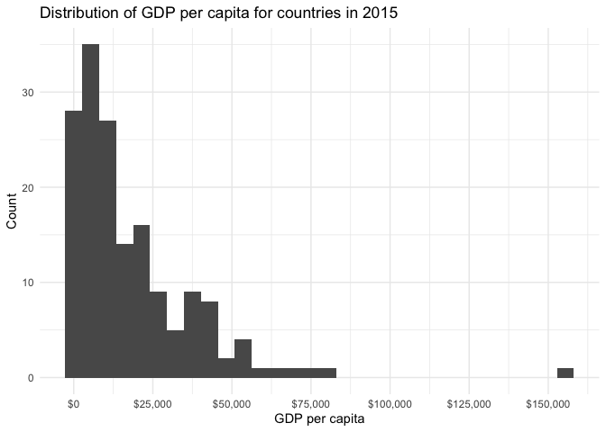
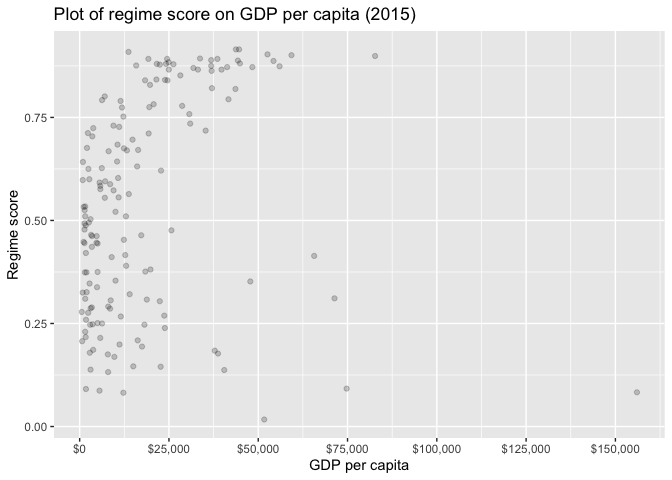
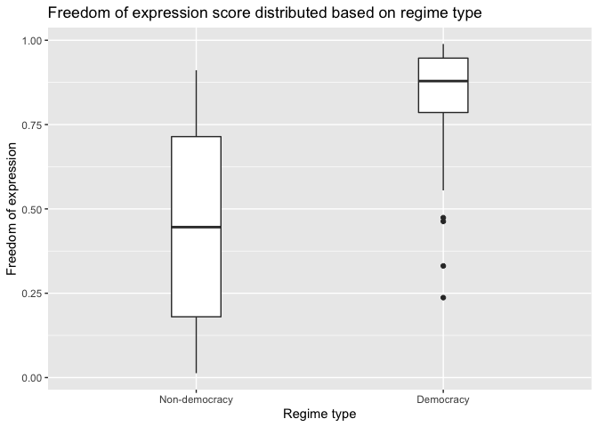

Mini Data Analysis Milestone 1 Salihin
================
Mohamed Salihin Subhan
07/10/2021

Load packages

``` r
library(tidyverse)
```

    ## ── Attaching packages ─────────────────────────────────────── tidyverse 1.3.1 ──

    ## ✓ ggplot2 3.3.5     ✓ purrr   0.3.4
    ## ✓ tibble  3.1.5     ✓ dplyr   1.0.7
    ## ✓ tidyr   1.1.4     ✓ stringr 1.4.0
    ## ✓ readr   2.0.2     ✓ forcats 0.5.1

    ## ── Conflicts ────────────────────────────────────────── tidyverse_conflicts() ──
    ## x dplyr::filter() masks stats::filter()
    ## x dplyr::lag()    masks stats::lag()

``` r
library(datateachr)
library(dplyr)
```

# Task 1: Choose your favourite data set

## 1.1: The four data sets that I chose

1.  V-Dem

-   The Varieties of Democracy Project (V-Dem) produces indicators of
    democracy for over 200 countries since 1900.
-   V-Dem measures hundreds of different attributes of democracy based
    on five high-level principles of democracy: electoral, liberal,
    participatory, deliberative, and egalitarian, and collects data to
    measure these principles.
-   For more information, please refer to <https://www.v-dem.net/en/>

2.  apt\_buildings
3.  building\_permits
4.  steam\_games

## 1.2: Explore data sets

Load and explore V-Dem (full)

``` r
library(vdemdata)

# Let's see the dataset
head(vdem)
```

    ##   country_name country_text_id country_id year historical_date project
    ## 1       Mexico             MEX          3 1789      1789-12-31       1
    ## 2       Mexico             MEX          3 1790      1790-12-31       1
    ## 3       Mexico             MEX          3 1791      1791-12-31       1
    ## 4       Mexico             MEX          3 1792      1792-12-31       1
    ## 5       Mexico             MEX          3 1793      1793-12-31       1
    ## 6       Mexico             MEX          3 1794      1794-12-31       1
    ##   historical                 histname codingstart codingend codingstart_contemp
    ## 1          1 Viceroyalty of New Spain        1789      2020                1900
    ## 2          1 Viceroyalty of New Spain        1789      2020                1900
    ## 3          1 Viceroyalty of New Spain        1789      2020                1900
    ## 4          1 Viceroyalty of New Spain        1789      2020                1900
    ## 5          1 Viceroyalty of New Spain        1789      2020                1900
    ## 6          1 Viceroyalty of New Spain        1789      2020                1900
    ##   codingend_contemp codingstart_hist codingend_hist gapstart1 gapstart2
    ## 1              2020             1789           1920        NA        NA
    ## 2              2020             1789           1920        NA        NA
    ## 3              2020             1789           1920        NA        NA
    ## 4              2020             1789           1920        NA        NA
    ## 5              2020             1789           1920        NA        NA
    ## 6              2020             1789           1920        NA        NA
    ##   gapstart3 gapend1 gapend2 gapend3 gap_index COWcode v2x_polyarchy
    ## 1        NA      NA      NA      NA         1      70         0.026
    ## 2        NA      NA      NA      NA         1      70         0.026
    ## 3        NA      NA      NA      NA         1      70         0.026
    ## 4        NA      NA      NA      NA         1      70         0.026
    ## 5        NA      NA      NA      NA         1      70         0.026
    ## 6        NA      NA      NA      NA         1      70         0.026
    ##   v2x_polyarchy_codelow v2x_polyarchy_codehigh v2x_polyarchy_sd v2x_libdem
    ## 1                 0.016                  0.036             0.01      0.041
    ## 2                 0.016                  0.036             0.01      0.041
    ## 3                 0.016                  0.036             0.01      0.041
    ## 4                 0.016                  0.036             0.01      0.041
    ## 5                 0.016                  0.036             0.01      0.041
    ## 6                 0.016                  0.036             0.01      0.041
    ##   v2x_libdem_codelow v2x_libdem_codehigh v2x_libdem_sd v2x_partipdem
    ## 1              0.025               0.053         0.014         0.007
    ## 2              0.025               0.053         0.014         0.007
    ## 3              0.025               0.053         0.014         0.007
    ## 4              0.025               0.053         0.014         0.007
    ## 5              0.025               0.053         0.014         0.007
    ## 6              0.025               0.053         0.014         0.007
    ##   v2x_partipdem_codelow v2x_partipdem_codehigh v2x_partipdem_sd v2x_delibdem
    ## 1                 0.001                  0.011            0.007           NA
    ## 2                 0.001                  0.011            0.007           NA
    ## 3                 0.001                  0.011            0.007           NA
    ## 4                 0.001                  0.011            0.007           NA
    ## 5                 0.001                  0.011            0.007           NA
    ## 6                 0.001                  0.011            0.007           NA
    ##   v2x_delibdem_codelow v2x_delibdem_codehigh v2x_delibdem_sd v2x_egaldem
    ## 1                   NA                    NA              NA          NA
    ## 2                   NA                    NA              NA          NA
    ## 3                   NA                    NA              NA          NA
    ## 4                   NA                    NA              NA          NA
    ## 5                   NA                    NA              NA          NA
    ## 6                   NA                    NA              NA          NA
    ##   v2x_egaldem_codelow v2x_egaldem_codehigh v2x_egaldem_sd v2x_api
    ## 1                  NA                   NA             NA   0.053
    ## 2                  NA                   NA             NA   0.053
    ## 3                  NA                   NA             NA   0.053
    ## 4                  NA                   NA             NA   0.053
    ## 5                  NA                   NA             NA   0.053
    ## 6                  NA                   NA             NA   0.053
    ##   v2x_api_codelow v2x_api_codehigh v2x_api_sd v2x_mpi v2x_mpi_codelow
    ## 1           0.033            0.071      0.021       0               0
    ## 2           0.033            0.071      0.021       0               0
    ## 3           0.033            0.071      0.021       0               0
    ## 4           0.033            0.071      0.021       0               0
    ## 5           0.033            0.071      0.021       0               0
    ## 6           0.033            0.071      0.021       0               0
    ##   v2x_mpi_codehigh v2x_mpi_sd v2x_freexp_altinf v2x_freexp_altinf_codelow
    ## 1                0          0             0.161                     0.093
    ## 2                0          0             0.161                     0.093
    ## 3                0          0             0.161                     0.093
    ## 4                0          0             0.161                     0.093
    ## 5                0          0             0.161                     0.093
    ## 6                0          0             0.161                     0.093
    ##   v2x_freexp_altinf_codehigh v2x_freexp_altinf_sd v2x_frassoc_thick
    ## 1                       0.24                0.621              0.04
    ## 2                       0.24                0.621              0.04
    ## 3                       0.24                0.621              0.04
    ## 4                       0.24                0.621              0.04
    ## 5                       0.24                0.621              0.04
    ## 6                       0.24                0.621              0.04
    ##   v2x_frassoc_thick_codelow v2x_frassoc_thick_codehigh v2x_frassoc_thick_sd
    ## 1                     0.019                      0.077                0.628
    ## 2                     0.019                      0.077                0.628
    ## 3                     0.019                      0.077                0.628
    ## 4                     0.019                      0.077                0.628
    ## 5                     0.019                      0.077                0.628
    ## 6                     0.019                      0.077                0.628
    ##   v2x_suffr v2xel_frefair v2xel_frefair_codelow v2xel_frefair_codehigh
    ## 1         0             0                     0                      0
    ## 2         0             0                     0                      0
    ## 3         0             0                     0                      0
    ## 4         0             0                     0                      0
    ## 5         0             0                     0                      0
    ## 6         0             0                     0                      0
    ##   v2xel_frefair_sd v2x_elecoff v2x_liberal v2x_liberal_codelow
    ## 1                0           0       0.159               0.096
    ## 2                0           0       0.159               0.096
    ## 3                0           0       0.159               0.096
    ## 4                0           0       0.159               0.096
    ## 5                0           0       0.159               0.096
    ## 6                0           0       0.159               0.096
    ##   v2x_liberal_codehigh v2x_liberal_sd v2xcl_rol v2xcl_rol_codelow
    ## 1                0.208          0.057     0.189             0.127
    ## 2                0.208          0.057     0.189             0.127
    ## 3                0.208          0.057     0.189             0.127
    ## 4                0.208          0.057     0.189             0.127
    ## 5                0.208          0.057     0.189             0.127
    ## 6                0.208          0.057     0.189             0.127
    ##   v2xcl_rol_codehigh v2xcl_rol_sd v2x_jucon v2x_jucon_codelow
    ## 1              0.294         0.62      0.27             0.145
    ## 2              0.294         0.62      0.27             0.145
    ## 3              0.294         0.62      0.27             0.145
    ## 4              0.294         0.62      0.27             0.145
    ## 5              0.294         0.62      0.27             0.145
    ## 6              0.294         0.62      0.27             0.145
    ##   v2x_jucon_codehigh v2x_jucon_sd v2xlg_legcon v2xlg_legcon_codelow
    ## 1              0.451         0.68        0.054                0.015
    ## 2              0.451         0.68        0.054                0.015
    ## 3              0.451         0.68        0.054                0.015
    ## 4              0.451         0.68        0.054                0.015
    ## 5              0.451         0.68        0.054                0.015
    ## 6              0.451         0.68        0.054                0.015
    ##   v2xlg_legcon_codehigh v2xlg_legcon_sd v2x_partip v2x_partip_codelow
    ## 1                 0.178           0.735      0.024              0.001
    ## 2                 0.178           0.735      0.024              0.001
    ## 3                 0.178           0.735      0.024              0.001
    ## 4                 0.178           0.735      0.024              0.001
    ## 5                 0.178           0.735      0.024              0.001
    ## 6                 0.178           0.735      0.024              0.001
    ##   v2x_partip_codehigh v2x_partip_sd v2x_cspart v2x_cspart_codelow
    ## 1               0.037         0.027      0.039               0.01
    ## 2               0.037         0.027      0.039               0.01
    ## 3               0.037         0.027      0.039               0.01
    ## 4               0.037         0.027      0.039               0.01
    ## 5               0.037         0.027      0.039               0.01
    ## 6               0.037         0.027      0.039               0.01
    ##   v2x_cspart_codehigh v2x_cspart_sd v2xdd_dd v2xel_locelec
    ## 1               0.113         0.716       NA             0
    ## 2               0.113         0.716       NA             0
    ## 3               0.113         0.716       NA             0
    ## 4               0.113         0.716       NA             0
    ## 5               0.113         0.716       NA             0
    ## 6               0.113         0.716       NA             0
    ##   v2xel_locelec_codelow v2xel_locelec_codehigh v2xel_locelec_sd v2xel_regelec
    ## 1                     0                      0                0         0.013
    ## 2                     0                      0                0         0.013
    ## 3                     0                      0                0         0.013
    ## 4                     0                      0                0         0.013
    ## 5                     0                      0                0         0.013
    ## 6                     0                      0                0         0.013
    ##   v2xel_regelec_codelow v2xel_regelec_codehigh v2xel_regelec_sd v2xdl_delib
    ## 1                     0                  0.028            0.046          NA
    ## 2                     0                  0.028            0.046          NA
    ## 3                     0                  0.028            0.046          NA
    ## 4                     0                  0.028            0.046          NA
    ## 5                     0                  0.028            0.046          NA
    ## 6                     0                  0.028            0.046          NA
    ##   v2xdl_delib_codelow v2xdl_delib_codehigh v2xdl_delib_sd v2x_egal
    ## 1                  NA                   NA             NA       NA
    ## 2                  NA                   NA             NA       NA
    ## 3                  NA                   NA             NA       NA
    ## 4                  NA                   NA             NA       NA
    ## 5                  NA                   NA             NA       NA
    ## 6                  NA                   NA             NA       NA
    ##   v2x_egal_codelow v2x_egal_codehigh v2x_egal_sd v2xeg_eqprotec
    ## 1               NA                NA          NA          0.154
    ## 2               NA                NA          NA          0.154
    ## 3               NA                NA          NA          0.154
    ## 4               NA                NA          NA          0.154
    ## 5               NA                NA          NA          0.154
    ## 6               NA                NA          NA          0.154
    ##   v2xeg_eqprotec_codelow v2xeg_eqprotec_codehigh v2xeg_eqprotec_sd
    ## 1                  0.048                   0.386             0.756
    ## 2                  0.048                   0.386             0.756
    ## 3                  0.048                   0.386             0.756
    ## 4                  0.048                   0.386             0.756
    ## 5                  0.048                   0.386             0.756
    ## 6                  0.048                   0.386             0.756
    ##   v2xeg_eqaccess v2xeg_eqaccess_codelow v2xeg_eqaccess_codehigh
    ## 1          0.100                  0.029                   0.253
    ## 2          0.100                  0.029                   0.253
    ## 3          0.122                  0.042                   0.292
    ## 4          0.122                  0.042                   0.292
    ## 5          0.122                  0.042                   0.292
    ## 6          0.090                  0.027                   0.253
    ##   v2xeg_eqaccess_sd v2xeg_eqdr v2xeg_eqdr_codelow v2xeg_eqdr_codehigh
    ## 1             0.731         NA                 NA                  NA
    ## 2             0.731         NA                 NA                  NA
    ## 3             0.727         NA                 NA                  NA
    ## 4             0.727         NA                 NA                  NA
    ## 5             0.727         NA                 NA                  NA
    ## 6             0.738         NA                 NA                  NA
    ##   v2xeg_eqdr_sd v2eltype_0 v2eltype_1 v2eltype_2 v2eltype_3 v2eltype_4
    ## 1            NA         NA         NA         NA         NA         NA
    ## 2            NA         NA         NA         NA         NA         NA
    ## 3            NA         NA         NA         NA         NA         NA
    ## 4            NA         NA         NA         NA         NA         NA
    ## 5            NA         NA         NA         NA         NA         NA
    ## 6            NA         NA         NA         NA         NA         NA
    ##   v2eltype_5 v2eltype_6 v2eltype_7 v2eltype_8 v2eltype_9 v2asuffrage v2elage
    ## 1         NA         NA         NA         NA         NA          NA      NA
    ## 2         NA         NA         NA         NA         NA          NA      NA
    ## 3         NA         NA         NA         NA         NA          NA      NA
    ## 4         NA         NA         NA         NA         NA          NA      NA
    ## 5         NA         NA         NA         NA         NA          NA      NA
    ## 6         NA         NA         NA         NA         NA          NA      NA
    ##   v2elcomvot v2elfemrst v2elgvsuflvl v2elsuffrage v2elwestmon v2fsuffrage
    ## 1         NA         NA           NA            0          NA          NA
    ## 2         NA         NA           NA            0          NA          NA
    ## 3         NA         NA           NA            0          NA          NA
    ## 4         NA         NA           NA            0          NA          NA
    ## 5         NA         NA           NA            0          NA          NA
    ## 6         NA         NA           NA            0          NA          NA
    ##   v2msuffrage v2eldonate v2eldonate_codelow v2eldonate_codehigh v2eldonate_sd
    ## 1          NA     -1.605             -2.157              -1.089         0.547
    ## 2          NA     -1.605             -2.157              -1.089         0.547
    ## 3          NA     -1.605             -2.157              -1.089         0.547
    ## 4          NA     -1.605             -2.157              -1.089         0.547
    ## 5          NA     -1.605             -2.157              -1.089         0.547
    ## 6          NA     -1.605             -2.157              -1.089         0.547
    ##   v2eldonate_osp v2eldonate_osp_codelow v2eldonate_osp_codehigh
    ## 1          0.313                   0.06                   0.481
    ## 2          0.313                   0.06                   0.481
    ## 3          0.313                   0.06                   0.481
    ## 4          0.313                   0.06                   0.481
    ## 5          0.313                   0.06                   0.481
    ## 6          0.313                   0.06                   0.481
    ##   v2eldonate_osp_sd v2eldonate_ord v2eldonate_ord_codelow
    ## 1             0.241              0                      0
    ## 2             0.241              0                      0
    ## 3             0.241              0                      0
    ## 4             0.241              0                      0
    ## 5             0.241              0                      0
    ## 6             0.241              0                      0
    ##   v2eldonate_ord_codehigh v2eldonate_mean v2eldonate_nr v2elpubfin
    ## 1                       0               0             2     -2.115
    ## 2                       0               0             2     -2.115
    ## 3                       0               0             2     -2.115
    ## 4                       0               0             2     -2.115
    ## 5                       0               0             2     -2.115
    ## 6                       0               0             2     -2.115
    ##   v2elpubfin_codelow v2elpubfin_codehigh v2elpubfin_sd v2elpubfin_osp
    ## 1             -2.762              -1.286         0.749          0.099
    ## 2             -2.762              -1.286         0.749          0.099
    ## 3             -2.762              -1.286         0.749          0.099
    ## 4             -2.762              -1.286         0.749          0.099
    ## 5             -2.762              -1.286         0.749          0.099
    ## 6             -2.762              -1.286         0.749          0.099
    ##   v2elpubfin_osp_codelow v2elpubfin_osp_codehigh v2elpubfin_osp_sd
    ## 1                      0                   0.182             0.181
    ## 2                      0                   0.182             0.181
    ## 3                      0                   0.182             0.181
    ## 4                      0                   0.182             0.181
    ## 5                      0                   0.182             0.181
    ## 6                      0                   0.182             0.181
    ##   v2elpubfin_ord v2elpubfin_ord_codelow v2elpubfin_ord_codehigh v2elpubfin_mean
    ## 1              0                      0                       0               0
    ## 2              0                      0                       0               0
    ## 3              0                      0                       0               0
    ## 4              0                      0                       0               0
    ## 5              0                      0                       0               0
    ## 6              0                      0                       0               0
    ##   v2elpubfin_nr v2elembaut v2elembaut_codelow v2elembaut_codehigh v2elembaut_sd
    ## 1             1     -1.168             -1.618              -0.656         0.511
    ## 2             2     -1.168             -1.618              -0.656         0.511
    ## 3             2     -1.168             -1.618              -0.656         0.511
    ## 4             2     -1.168             -1.618              -0.656         0.511
    ## 5             2     -1.168             -1.618              -0.656         0.511
    ## 6             2     -1.168             -1.618              -0.656         0.511
    ##   v2elembaut_osp v2elembaut_osp_codelow v2elembaut_osp_codehigh
    ## 1          0.506                  0.182                   0.762
    ## 2          0.506                  0.182                   0.762
    ## 3          0.506                  0.182                   0.762
    ## 4          0.506                  0.182                   0.762
    ## 5          0.506                  0.182                   0.762
    ## 6          0.506                  0.182                   0.762
    ##   v2elembaut_osp_sd v2elembaut_ord v2elembaut_ord_codelow
    ## 1             0.296              0                      0
    ## 2             0.296              0                      0
    ## 3             0.296              0                      0
    ## 4             0.296              0                      0
    ## 5             0.296              0                      0
    ## 6             0.296              0                      0
    ##   v2elembaut_ord_codehigh v2elembaut_mean v2elembaut_nr v2elembcap
    ## 1                       0             1.5             2     -1.467
    ## 2                       0             1.5             2     -1.467
    ## 3                       0             1.5             2     -1.467
    ## 4                       0             1.5             2     -1.467
    ## 5                       0             1.5             2     -1.467
    ## 6                       0             1.5             2     -1.467
    ##   v2elembcap_codelow v2elembcap_codehigh v2elembcap_sd v2elembcap_osp
    ## 1             -1.956              -0.845          0.56          0.672
    ## 2             -1.956              -0.845          0.56          0.672
    ## 3             -1.956              -0.845          0.56          0.672
    ## 4             -1.956              -0.845          0.56          0.672
    ## 5             -1.956              -0.845          0.56          0.672
    ## 6             -1.956              -0.845          0.56          0.672
    ##   v2elembcap_osp_codelow v2elembcap_osp_codehigh v2elembcap_osp_sd
    ## 1                  0.167                   0.937             0.393
    ## 2                  0.167                   0.937             0.393
    ## 3                  0.167                   0.937             0.393
    ## 4                  0.167                   0.937             0.393
    ## 5                  0.167                   0.937             0.393
    ## 6                  0.167                   0.937             0.393
    ##   v2elembcap_ord v2elembcap_ord_codelow v2elembcap_ord_codehigh v2elembcap_mean
    ## 1              0                      0                       1             2.5
    ## 2              0                      0                       1             2.5
    ## 3              0                      0                       1             2.5
    ## 4              0                      0                       1             2.5
    ## 5              0                      0                       1             2.5
    ## 6              0                      0                       1             2.5
    ##   v2elembcap_nr v2elmulpar v2elmulpar_codelow v2elmulpar_codehigh v2elmulpar_sd
    ## 1             2         NA                 NA                  NA            NA
    ## 2             2         NA                 NA                  NA            NA
    ## 3             2         NA                 NA                  NA            NA
    ## 4             2         NA                 NA                  NA            NA
    ## 5             2         NA                 NA                  NA            NA
    ## 6             2         NA                 NA                  NA            NA
    ##   v2elmulpar_osp v2elmulpar_osp_codelow v2elmulpar_osp_codehigh
    ## 1             NA                     NA                      NA
    ## 2             NA                     NA                      NA
    ## 3             NA                     NA                      NA
    ## 4             NA                     NA                      NA
    ## 5             NA                     NA                      NA
    ## 6             NA                     NA                      NA
    ##   v2elmulpar_osp_sd v2elmulpar_ord v2elmulpar_ord_codelow
    ## 1                NA             NA                     NA
    ## 2                NA             NA                     NA
    ## 3                NA             NA                     NA
    ## 4                NA             NA                     NA
    ## 5                NA             NA                     NA
    ## 6                NA             NA                     NA
    ##   v2elmulpar_ord_codehigh v2elmulpar_mean v2elmulpar_nr v2elrgstry
    ## 1                      NA              NA            NA         NA
    ## 2                      NA              NA            NA         NA
    ## 3                      NA              NA            NA         NA
    ## 4                      NA              NA            NA         NA
    ## 5                      NA              NA            NA         NA
    ## 6                      NA              NA            NA         NA
    ##   v2elrgstry_codelow v2elrgstry_codehigh v2elrgstry_sd v2elrgstry_osp
    ## 1                 NA                  NA            NA             NA
    ## 2                 NA                  NA            NA             NA
    ## 3                 NA                  NA            NA             NA
    ## 4                 NA                  NA            NA             NA
    ## 5                 NA                  NA            NA             NA
    ## 6                 NA                  NA            NA             NA
    ##   v2elrgstry_osp_codelow v2elrgstry_osp_codehigh v2elrgstry_osp_sd
    ## 1                     NA                      NA                NA
    ## 2                     NA                      NA                NA
    ## 3                     NA                      NA                NA
    ## 4                     NA                      NA                NA
    ## 5                     NA                      NA                NA
    ## 6                     NA                      NA                NA
    ##   v2elrgstry_ord v2elrgstry_ord_codelow v2elrgstry_ord_codehigh v2elrgstry_mean
    ## 1             NA                     NA                      NA              NA
    ## 2             NA                     NA                      NA              NA
    ## 3             NA                     NA                      NA              NA
    ## 4             NA                     NA                      NA              NA
    ## 5             NA                     NA                      NA              NA
    ## 6             NA                     NA                      NA              NA
    ##   v2elrgstry_nr v2elvotbuy v2elvotbuy_codelow v2elvotbuy_codehigh v2elvotbuy_sd
    ## 1            NA         NA                 NA                  NA            NA
    ## 2            NA         NA                 NA                  NA            NA
    ## 3            NA         NA                 NA                  NA            NA
    ## 4            NA         NA                 NA                  NA            NA
    ## 5            NA         NA                 NA                  NA            NA
    ## 6            NA         NA                 NA                  NA            NA
    ##   v2elvotbuy_osp v2elvotbuy_osp_codelow v2elvotbuy_osp_codehigh
    ## 1             NA                     NA                      NA
    ## 2             NA                     NA                      NA
    ## 3             NA                     NA                      NA
    ## 4             NA                     NA                      NA
    ## 5             NA                     NA                      NA
    ## 6             NA                     NA                      NA
    ##   v2elvotbuy_osp_sd v2elvotbuy_ord v2elvotbuy_ord_codelow
    ## 1                NA             NA                     NA
    ## 2                NA             NA                     NA
    ## 3                NA             NA                     NA
    ## 4                NA             NA                     NA
    ## 5                NA             NA                     NA
    ## 6                NA             NA                     NA
    ##   v2elvotbuy_ord_codehigh v2elvotbuy_mean v2elvotbuy_nr v2elirreg
    ## 1                      NA              NA            NA        NA
    ## 2                      NA              NA            NA        NA
    ## 3                      NA              NA            NA        NA
    ## 4                      NA              NA            NA        NA
    ## 5                      NA              NA            NA        NA
    ## 6                      NA              NA            NA        NA
    ##   v2elirreg_codelow v2elirreg_codehigh v2elirreg_sd v2elirreg_osp
    ## 1                NA                 NA           NA            NA
    ## 2                NA                 NA           NA            NA
    ## 3                NA                 NA           NA            NA
    ## 4                NA                 NA           NA            NA
    ## 5                NA                 NA           NA            NA
    ## 6                NA                 NA           NA            NA
    ##   v2elirreg_osp_codelow v2elirreg_osp_codehigh v2elirreg_osp_sd v2elirreg_ord
    ## 1                    NA                     NA               NA            NA
    ## 2                    NA                     NA               NA            NA
    ## 3                    NA                     NA               NA            NA
    ## 4                    NA                     NA               NA            NA
    ## 5                    NA                     NA               NA            NA
    ## 6                    NA                     NA               NA            NA
    ##   v2elirreg_ord_codelow v2elirreg_ord_codehigh v2elirreg_mean v2elirreg_nr
    ## 1                    NA                     NA             NA           NA
    ## 2                    NA                     NA             NA           NA
    ## 3                    NA                     NA             NA           NA
    ## 4                    NA                     NA             NA           NA
    ## 5                    NA                     NA             NA           NA
    ## 6                    NA                     NA             NA           NA
    ##   v2elintim v2elintim_codelow v2elintim_codehigh v2elintim_sd v2elintim_osp
    ## 1        NA                NA                 NA           NA            NA
    ## 2        NA                NA                 NA           NA            NA
    ## 3        NA                NA                 NA           NA            NA
    ## 4        NA                NA                 NA           NA            NA
    ## 5        NA                NA                 NA           NA            NA
    ## 6        NA                NA                 NA           NA            NA
    ##   v2elintim_osp_codelow v2elintim_osp_codehigh v2elintim_osp_sd v2elintim_ord
    ## 1                    NA                     NA               NA            NA
    ## 2                    NA                     NA               NA            NA
    ## 3                    NA                     NA               NA            NA
    ## 4                    NA                     NA               NA            NA
    ## 5                    NA                     NA               NA            NA
    ## 6                    NA                     NA               NA            NA
    ##   v2elintim_ord_codelow v2elintim_ord_codehigh v2elintim_mean v2elintim_nr
    ## 1                    NA                     NA             NA           NA
    ## 2                    NA                     NA             NA           NA
    ## 3                    NA                     NA             NA           NA
    ## 4                    NA                     NA             NA           NA
    ## 5                    NA                     NA             NA           NA
    ## 6                    NA                     NA             NA           NA
    ##   v2elpeace v2elpeace_codelow v2elpeace_codehigh v2elpeace_sd v2elpeace_osp
    ## 1        NA                NA                 NA           NA            NA
    ## 2        NA                NA                 NA           NA            NA
    ## 3        NA                NA                 NA           NA            NA
    ## 4        NA                NA                 NA           NA            NA
    ## 5        NA                NA                 NA           NA            NA
    ## 6        NA                NA                 NA           NA            NA
    ##   v2elpeace_osp_codelow v2elpeace_osp_codehigh v2elpeace_osp_sd v2elpeace_ord
    ## 1                    NA                     NA               NA            NA
    ## 2                    NA                     NA               NA            NA
    ## 3                    NA                     NA               NA            NA
    ## 4                    NA                     NA               NA            NA
    ## 5                    NA                     NA               NA            NA
    ## 6                    NA                     NA               NA            NA
    ##   v2elpeace_ord_codelow v2elpeace_ord_codehigh v2elpeace_mean v2elpeace_nr
    ## 1                    NA                     NA             NA           NA
    ## 2                    NA                     NA             NA           NA
    ## 3                    NA                     NA             NA           NA
    ## 4                    NA                     NA             NA           NA
    ## 5                    NA                     NA             NA           NA
    ## 6                    NA                     NA             NA           NA
    ##   v2elboycot v2elboycot_codelow v2elboycot_codehigh v2elboycot_sd
    ## 1         NA                 NA                  NA            NA
    ## 2         NA                 NA                  NA            NA
    ## 3         NA                 NA                  NA            NA
    ## 4         NA                 NA                  NA            NA
    ## 5         NA                 NA                  NA            NA
    ## 6         NA                 NA                  NA            NA
    ##   v2elboycot_osp v2elboycot_osp_codelow v2elboycot_osp_codehigh
    ## 1             NA                     NA                      NA
    ## 2             NA                     NA                      NA
    ## 3             NA                     NA                      NA
    ## 4             NA                     NA                      NA
    ## 5             NA                     NA                      NA
    ## 6             NA                     NA                      NA
    ##   v2elboycot_osp_sd v2elboycot_ord v2elboycot_ord_codelow
    ## 1                NA             NA                     NA
    ## 2                NA             NA                     NA
    ## 3                NA             NA                     NA
    ## 4                NA             NA                     NA
    ## 5                NA             NA                     NA
    ## 6                NA             NA                     NA
    ##   v2elboycot_ord_codehigh v2elboycot_mean v2elboycot_nr v2elfrcamp
    ## 1                      NA              NA            NA         NA
    ## 2                      NA              NA            NA         NA
    ## 3                      NA              NA            NA         NA
    ## 4                      NA              NA            NA         NA
    ## 5                      NA              NA            NA         NA
    ## 6                      NA              NA            NA         NA
    ##   v2elfrcamp_codelow v2elfrcamp_codehigh v2elfrcamp_sd v2elfrcamp_osp
    ## 1                 NA                  NA            NA             NA
    ## 2                 NA                  NA            NA             NA
    ## 3                 NA                  NA            NA             NA
    ## 4                 NA                  NA            NA             NA
    ## 5                 NA                  NA            NA             NA
    ## 6                 NA                  NA            NA             NA
    ##   v2elfrcamp_osp_codelow v2elfrcamp_osp_codehigh v2elfrcamp_osp_sd
    ## 1                     NA                      NA                NA
    ## 2                     NA                      NA                NA
    ## 3                     NA                      NA                NA
    ## 4                     NA                      NA                NA
    ## 5                     NA                      NA                NA
    ## 6                     NA                      NA                NA
    ##   v2elfrcamp_ord v2elfrcamp_ord_codelow v2elfrcamp_ord_codehigh v2elfrcamp_mean
    ## 1             NA                     NA                      NA              NA
    ## 2             NA                     NA                      NA              NA
    ## 3             NA                     NA                      NA              NA
    ## 4             NA                     NA                      NA              NA
    ## 5             NA                     NA                      NA              NA
    ## 6             NA                     NA                      NA              NA
    ##   v2elfrcamp_nr v2elpdcamp v2elpdcamp_codelow v2elpdcamp_codehigh v2elpdcamp_sd
    ## 1            NA         NA                 NA                  NA            NA
    ## 2            NA         NA                 NA                  NA            NA
    ## 3            NA         NA                 NA                  NA            NA
    ## 4            NA         NA                 NA                  NA            NA
    ## 5            NA         NA                 NA                  NA            NA
    ## 6            NA         NA                 NA                  NA            NA
    ##   v2elpdcamp_osp v2elpdcamp_osp_codelow v2elpdcamp_osp_codehigh
    ## 1             NA                     NA                      NA
    ## 2             NA                     NA                      NA
    ## 3             NA                     NA                      NA
    ## 4             NA                     NA                      NA
    ## 5             NA                     NA                      NA
    ## 6             NA                     NA                      NA
    ##   v2elpdcamp_osp_sd v2elpdcamp_ord v2elpdcamp_ord_codelow
    ## 1                NA             NA                     NA
    ## 2                NA             NA                     NA
    ## 3                NA             NA                     NA
    ## 4                NA             NA                     NA
    ## 5                NA             NA                     NA
    ## 6                NA             NA                     NA
    ##   v2elpdcamp_ord_codehigh v2elpdcamp_mean v2elpdcamp_nr v2elpaidig
    ## 1                      NA              NA            NA         NA
    ## 2                      NA              NA            NA         NA
    ## 3                      NA              NA            NA         NA
    ## 4                      NA              NA            NA         NA
    ## 5                      NA              NA            NA         NA
    ## 6                      NA              NA            NA         NA
    ##   v2elpaidig_codelow v2elpaidig_codehigh v2elpaidig_sd v2elpaidig_osp
    ## 1                 NA                  NA            NA             NA
    ## 2                 NA                  NA            NA             NA
    ## 3                 NA                  NA            NA             NA
    ## 4                 NA                  NA            NA             NA
    ## 5                 NA                  NA            NA             NA
    ## 6                 NA                  NA            NA             NA
    ##   v2elpaidig_osp_codelow v2elpaidig_osp_codehigh v2elpaidig_osp_sd
    ## 1                     NA                      NA                NA
    ## 2                     NA                      NA                NA
    ## 3                     NA                      NA                NA
    ## 4                     NA                      NA                NA
    ## 5                     NA                      NA                NA
    ## 6                     NA                      NA                NA
    ##   v2elpaidig_ord v2elpaidig_ord_codelow v2elpaidig_ord_codehigh v2elpaidig_mean
    ## 1             NA                     NA                      NA              NA
    ## 2             NA                     NA                      NA              NA
    ## 3             NA                     NA                      NA              NA
    ## 4             NA                     NA                      NA              NA
    ## 5             NA                     NA                      NA              NA
    ## 6             NA                     NA                      NA              NA
    ##   v2elpaidig_nr v2elfrfair v2elfrfair_codelow v2elfrfair_codehigh v2elfrfair_sd
    ## 1            NA         NA                 NA                  NA            NA
    ## 2            NA         NA                 NA                  NA            NA
    ## 3            NA         NA                 NA                  NA            NA
    ## 4            NA         NA                 NA                  NA            NA
    ## 5            NA         NA                 NA                  NA            NA
    ## 6            NA         NA                 NA                  NA            NA
    ##   v2elfrfair_osp v2elfrfair_osp_codelow v2elfrfair_osp_codehigh
    ## 1             NA                     NA                      NA
    ## 2             NA                     NA                      NA
    ## 3             NA                     NA                      NA
    ## 4             NA                     NA                      NA
    ## 5             NA                     NA                      NA
    ## 6             NA                     NA                      NA
    ##   v2elfrfair_osp_sd v2elfrfair_ord v2elfrfair_ord_codelow
    ## 1                NA             NA                     NA
    ## 2                NA             NA                     NA
    ## 3                NA             NA                     NA
    ## 4                NA             NA                     NA
    ## 5                NA             NA                     NA
    ## 6                NA             NA                     NA
    ##   v2elfrfair_ord_codehigh v2elfrfair_mean v2elfrfair_nr v2eldommon v2elintmon
    ## 1                      NA              NA            NA         NA         NA
    ## 2                      NA              NA            NA         NA         NA
    ## 3                      NA              NA            NA         NA         NA
    ## 4                      NA              NA            NA         NA         NA
    ## 5                      NA              NA            NA         NA         NA
    ## 6                      NA              NA            NA         NA         NA
    ##   v2elmonden v2elmonref v2elrstrct v2elaccept v2elaccept_codelow
    ## 1         NA         NA         NA         NA                 NA
    ## 2         NA         NA         NA         NA                 NA
    ## 3         NA         NA         NA         NA                 NA
    ## 4         NA         NA         NA         NA                 NA
    ## 5         NA         NA         NA         NA                 NA
    ## 6         NA         NA         NA         NA                 NA
    ##   v2elaccept_codehigh v2elaccept_sd v2elaccept_osp v2elaccept_osp_codelow
    ## 1                  NA            NA             NA                     NA
    ## 2                  NA            NA             NA                     NA
    ## 3                  NA            NA             NA                     NA
    ## 4                  NA            NA             NA                     NA
    ## 5                  NA            NA             NA                     NA
    ## 6                  NA            NA             NA                     NA
    ##   v2elaccept_osp_codehigh v2elaccept_osp_sd v2elaccept_ord
    ## 1                      NA                NA             NA
    ## 2                      NA                NA             NA
    ## 3                      NA                NA             NA
    ## 4                      NA                NA             NA
    ## 5                      NA                NA             NA
    ## 6                      NA                NA             NA
    ##   v2elaccept_ord_codelow v2elaccept_ord_codehigh v2elaccept_mean v2elaccept_nr
    ## 1                     NA                      NA              NA            NA
    ## 2                     NA                      NA              NA            NA
    ## 3                     NA                      NA              NA            NA
    ## 4                     NA                      NA              NA            NA
    ## 5                     NA                      NA              NA            NA
    ## 6                     NA                      NA              NA            NA
    ##   v2elasmoff v2elasmoff_codelow v2elasmoff_codehigh v2elasmoff_sd
    ## 1         NA                 NA                  NA            NA
    ## 2         NA                 NA                  NA            NA
    ## 3         NA                 NA                  NA            NA
    ## 4         NA                 NA                  NA            NA
    ## 5         NA                 NA                  NA            NA
    ## 6         NA                 NA                  NA            NA
    ##   v2elasmoff_osp v2elasmoff_osp_codelow v2elasmoff_osp_codehigh
    ## 1             NA                     NA                      NA
    ## 2             NA                     NA                      NA
    ## 3             NA                     NA                      NA
    ## 4             NA                     NA                      NA
    ## 5             NA                     NA                      NA
    ## 6             NA                     NA                      NA
    ##   v2elasmoff_osp_sd v2elasmoff_ord v2elasmoff_ord_codelow
    ## 1                NA             NA                     NA
    ## 2                NA             NA                     NA
    ## 3                NA             NA                     NA
    ## 4                NA             NA                     NA
    ## 5                NA             NA                     NA
    ## 6                NA             NA                     NA
    ##   v2elasmoff_ord_codehigh v2elasmoff_mean v2elasmoff_nr v2eltrnout v2elvaptrn
    ## 1                      NA              NA            NA         NA         NA
    ## 2                      NA              NA            NA         NA         NA
    ## 3                      NA              NA            NA         NA         NA
    ## 4                      NA              NA            NA         NA         NA
    ## 5                      NA              NA            NA         NA         NA
    ## 6                      NA              NA            NA         NA         NA
    ##   v2lpname v2slpname v2tlpname v2elprescons v2elprescumul v2elrsthog v2elrsthos
    ## 1     <NA>      <NA>      <NA>           NA            NA         NA         NA
    ## 2     <NA>      <NA>      <NA>           NA            NA         NA         NA
    ## 3     <NA>      <NA>      <NA>           NA            NA         NA         NA
    ## 4     <NA>      <NA>      <NA>           NA            NA         NA         NA
    ## 5     <NA>      <NA>      <NA>           NA            NA         NA         NA
    ## 6     <NA>      <NA>      <NA>           NA            NA         NA         NA
    ##   v2elturnhog v2elturnhos v2eltvrexo v2elvotlrg v2elvotsml v2ellocons
    ## 1          NA          NA         NA         NA         NA         NA
    ## 2          NA          NA         NA         NA         NA         NA
    ## 3          NA          NA         NA         NA         NA         NA
    ## 4          NA          NA         NA         NA         NA         NA
    ## 5          NA          NA         NA         NA         NA         NA
    ## 6          NA          NA         NA         NA         NA         NA
    ##   v2ellocumul v2elloeldm v2elloelsy v2elloseat v2ellostlg v2ellostsl v2ellostsm
    ## 1          NA         NA         NA         NA         NA         NA         NA
    ## 2          NA         NA         NA         NA         NA         NA         NA
    ## 3          NA         NA         NA         NA         NA         NA         NA
    ## 4          NA         NA         NA         NA         NA         NA         NA
    ## 5          NA         NA         NA         NA         NA         NA         NA
    ## 6          NA         NA         NA         NA         NA         NA         NA
    ##   v2ellostss v2ellosttm v2ellostts v2ellovtlg v2ellovtsm v2ellovttm v2elparlel
    ## 1         NA         NA         NA         NA         NA         NA         NA
    ## 2         NA         NA         NA         NA         NA         NA         NA
    ## 3         NA         NA         NA         NA         NA         NA         NA
    ## 4         NA         NA         NA         NA         NA         NA         NA
    ## 5         NA         NA         NA         NA         NA         NA         NA
    ## 6         NA         NA         NA         NA         NA         NA         NA
    ##   v2elthresh v2eltvrig v2elreggov                                   v2elregnam
    ## 1         NA        NA          1 Provinces of New Spain (Provincias Internas)
    ## 2         NA        NA          1 Provinces of New Spain (Provincias Internas)
    ## 3         NA        NA          1 Provinces of New Spain (Provincias Internas)
    ## 4         NA        NA          1 Provinces of New Spain (Provincias Internas)
    ## 5         NA        NA          1 Provinces of New Spain (Provincias Internas)
    ## 6         NA        NA          1 Provinces of New Spain (Provincias Internas)
    ##   v2elsrgel v2elrgpwr v2elrgpwr_codelow v2elrgpwr_codehigh v2elrgpwr_sd
    ## 1         0    -1.935            -2.826             -1.141        0.839
    ## 2         0    -1.935            -2.826             -1.141        0.839
    ## 3         0    -1.935            -2.826             -1.141        0.839
    ## 4         0    -1.935            -2.826             -1.141        0.839
    ## 5         0    -1.935            -2.826             -1.141        0.839
    ## 6         0    -1.935            -2.826             -1.141        0.839
    ##   v2elrgpwr_osp v2elrgpwr_osp_codelow v2elrgpwr_osp_codehigh v2elrgpwr_osp_sd
    ## 1         0.214                     0                   0.39            0.376
    ## 2         0.214                     0                   0.39            0.376
    ## 3         0.214                     0                   0.39            0.376
    ## 4         0.214                     0                   0.39            0.376
    ## 5         0.214                     0                   0.39            0.376
    ## 6         0.214                     0                   0.39            0.376
    ##   v2elrgpwr_ord v2elrgpwr_ord_codelow v2elrgpwr_ord_codehigh v2elrgpwr_mean
    ## 1             0                     0                      0              0
    ## 2             0                     0                      0              0
    ## 3             0                     0                      0              0
    ## 4             0                     0                      0              0
    ## 5             0                     0                      0              0
    ## 6             0                     0                      0              0
    ##   v2elrgpwr_nr v2ellocgov v2ellocnam v2ellocelc v2ellocpwr v2ellocpwr_codelow
    ## 1            1          0       <NA>         NA         NA                 NA
    ## 2            1          0       <NA>         NA         NA                 NA
    ## 3            1          0       <NA>         NA         NA                 NA
    ## 4            1          0       <NA>         NA         NA                 NA
    ## 5            1          0       <NA>         NA         NA                 NA
    ## 6            1          0       <NA>         NA         NA                 NA
    ##   v2ellocpwr_codehigh v2ellocpwr_sd v2ellocpwr_osp v2ellocpwr_osp_codelow
    ## 1                  NA            NA             NA                     NA
    ## 2                  NA            NA             NA                     NA
    ## 3                  NA            NA             NA                     NA
    ## 4                  NA            NA             NA                     NA
    ## 5                  NA            NA             NA                     NA
    ## 6                  NA            NA             NA                     NA
    ##   v2ellocpwr_osp_codehigh v2ellocpwr_osp_sd v2ellocpwr_ord
    ## 1                      NA                NA             NA
    ## 2                      NA                NA             NA
    ## 3                      NA                NA             NA
    ## 4                      NA                NA             NA
    ## 5                      NA                NA             NA
    ## 6                      NA                NA             NA
    ##   v2ellocpwr_ord_codelow v2ellocpwr_ord_codehigh v2ellocpwr_mean v2ellocpwr_nr
    ## 1                     NA                      NA              NA            NA
    ## 2                     NA                      NA              NA            NA
    ## 3                     NA                      NA              NA            NA
    ## 4                     NA                      NA              NA            NA
    ## 5                     NA                      NA              NA            NA
    ## 6                     NA                      NA              NA            NA
    ##   v2elffelr v2elffelr_codelow v2elffelr_codehigh v2elffelr_sd v2elffelr_osp
    ## 1    -0.803            -1.863              0.099        0.986         1.463
    ## 2    -0.803            -1.863              0.099        0.986         1.463
    ## 3    -0.803            -1.863              0.099        0.986         1.463
    ## 4    -0.803            -1.863              0.099        0.986         1.463
    ## 5    -0.803            -1.863              0.099        0.986         1.463
    ## 6    -0.803            -1.863              0.099        0.986         1.463
    ##   v2elffelr_osp_codelow v2elffelr_osp_codehigh v2elffelr_osp_sd v2elffelr_ord
    ## 1                 0.607                  2.282            0.794             1
    ## 2                 0.607                  2.282            0.794             1
    ## 3                 0.607                  2.282            0.794             1
    ## 4                 0.607                  2.282            0.794             1
    ## 5                 0.607                  2.282            0.794             1
    ## 6                 0.607                  2.282            0.794             1
    ##   v2elffelr_ord_codelow v2elffelr_ord_codehigh v2elffelr_mean v2elffelr_nr
    ## 1                     1                      2              3            1
    ## 2                     1                      2              3            1
    ## 3                     1                      2              3            1
    ## 4                     1                      2              3            1
    ## 5                     1                      2              3            1
    ## 6                     1                      2              3            1
    ##   v2elffelrbin v2elffelrbin_codelow v2elffelrbin_codehigh v2elffelrbin_sd
    ## 1        1.138                0.135                 2.027           0.951
    ## 2        1.138                0.135                 2.027           0.951
    ## 3        1.138                0.135                 2.027           0.951
    ## 4        1.138                0.135                 2.027           0.951
    ## 5        1.138                0.135                 2.027           0.951
    ## 6        1.138                0.135                 2.027           0.951
    ##   v2elffelrbin_osp v2elffelrbin_osp_codelow v2elffelrbin_osp_codehigh
    ## 1            0.995                    0.982                         1
    ## 2            0.995                    0.982                         1
    ## 3            0.995                    0.982                         1
    ## 4            0.995                    0.982                         1
    ## 5            0.995                    0.982                         1
    ## 6            0.995                    0.982                         1
    ##   v2elffelrbin_osp_sd v2elffelrbin_ord v2elffelrbin_ord_codelow
    ## 1               0.061                1                        1
    ## 2               0.061                1                        1
    ## 3               0.061                1                        1
    ## 4               0.061                1                        1
    ## 5               0.061                1                        1
    ## 6               0.061                1                        1
    ##   v2elffelrbin_ord_codehigh v2elffelrbin_mean v2elffelrbin_nr v2elsnlsff
    ## 1                         1                 1               1      -0.07
    ## 2                         1                 1               1      -0.07
    ## 3                         1                 1               1      -0.07
    ## 4                         1                 1               1      -0.07
    ## 5                         1                 1               1      -0.07
    ## 6                         1                 1               1      -0.07
    ##   v2elsnlsff_codelow v2elsnlsff_codehigh v2elsnlsff_sd v2elsnlsff_osp
    ## 1             -0.839               0.679         0.781            1.4
    ## 2             -0.839               0.679         0.781            1.4
    ## 3             -0.839               0.679         0.781            1.4
    ## 4             -0.839               0.679         0.781            1.4
    ## 5             -0.839               0.679         0.781            1.4
    ## 6             -0.839               0.679         0.781            1.4
    ##   v2elsnlsff_osp_codelow v2elsnlsff_osp_codehigh v2elsnlsff_osp_sd
    ## 1                  1.122                   1.872             0.373
    ## 2                  1.122                   1.872             0.373
    ## 3                  1.122                   1.872             0.373
    ## 4                  1.122                   1.872             0.373
    ## 5                  1.122                   1.872             0.373
    ## 6                  1.122                   1.872             0.373
    ##   v2elsnlsff_ord v2elsnlsff_ord_codelow v2elsnlsff_ord_codehigh v2elsnlsff_mean
    ## 1              1                      1                       2               1
    ## 2              1                      1                       2               1
    ## 3              1                      1                       2               1
    ## 4              1                      1                       2               1
    ## 5              1                      1                       2               1
    ## 6              1                      1                       2               1
    ##   v2elsnlsff_nr v2elsnlfc_0 v2elsnlfc_1 v2elsnlfc_2 v2elsnlfc_3 v2elsnlfc_4
    ## 1             1          NA          NA          NA          NA          NA
    ## 2             1          NA          NA          NA          NA          NA
    ## 3             1          NA          NA          NA          NA          NA
    ## 4             1          NA          NA          NA          NA          NA
    ## 5             1          NA          NA          NA          NA          NA
    ## 6             1          NA          NA          NA          NA          NA
    ##   v2elsnlfc_5 v2elsnlfc_6 v2elsnlfc_7 v2elsnlfc_8 v2elsnlfc_9 v2elsnlfc_10
    ## 1          NA          NA          NA          NA          NA           NA
    ## 2          NA          NA          NA          NA          NA           NA
    ## 3          NA          NA          NA          NA          NA           NA
    ## 4          NA          NA          NA          NA          NA           NA
    ## 5          NA          NA          NA          NA          NA           NA
    ## 6          NA          NA          NA          NA          NA           NA
    ##   v2elsnlfc_11 v2elsnlfc_12 v2elsnlfc_13 v2elsnlfc_14 v2elsnlfc_15 v2elsnlfc_16
    ## 1           NA           NA           NA           NA           NA           NA
    ## 2           NA           NA           NA           NA           NA           NA
    ## 3           NA           NA           NA           NA           NA           NA
    ## 4           NA           NA           NA           NA           NA           NA
    ## 5           NA           NA           NA           NA           NA           NA
    ## 6           NA           NA           NA           NA           NA           NA
    ##   v2elsnlfc_17 v2elsnlfc_18 v2elsnlfc_19 v2elsnlfc_20 v2elsnlfc_21 v2elsnlfc_nr
    ## 1           NA           NA           NA           NA           NA           NA
    ## 2           NA           NA           NA           NA           NA           NA
    ## 3           NA           NA           NA           NA           NA           NA
    ## 4           NA           NA           NA           NA           NA           NA
    ## 5           NA           NA           NA           NA           NA           NA
    ## 6           NA           NA           NA           NA           NA           NA
    ##   v2elsnmrfc_0 v2elsnmrfc_1 v2elsnmrfc_2 v2elsnmrfc_3 v2elsnmrfc_4 v2elsnmrfc_5
    ## 1           NA           NA           NA           NA           NA           NA
    ## 2           NA           NA           NA           NA           NA           NA
    ## 3           NA           NA           NA           NA           NA           NA
    ## 4           NA           NA           NA           NA           NA           NA
    ## 5           NA           NA           NA           NA           NA           NA
    ## 6           NA           NA           NA           NA           NA           NA
    ##   v2elsnmrfc_6 v2elsnmrfc_7 v2elsnmrfc_8 v2elsnmrfc_9 v2elsnmrfc_10
    ## 1           NA           NA           NA           NA            NA
    ## 2           NA           NA           NA           NA            NA
    ## 3           NA           NA           NA           NA            NA
    ## 4           NA           NA           NA           NA            NA
    ## 5           NA           NA           NA           NA            NA
    ## 6           NA           NA           NA           NA            NA
    ##   v2elsnmrfc_11 v2elsnmrfc_12 v2elsnmrfc_13 v2elsnmrfc_14 v2elsnmrfc_15
    ## 1            NA            NA            NA            NA            NA
    ## 2            NA            NA            NA            NA            NA
    ## 3            NA            NA            NA            NA            NA
    ## 4            NA            NA            NA            NA            NA
    ## 5            NA            NA            NA            NA            NA
    ## 6            NA            NA            NA            NA            NA
    ##   v2elsnmrfc_16 v2elsnmrfc_17 v2elsnmrfc_18 v2elsnmrfc_19 v2elsnmrfc_20
    ## 1            NA            NA            NA            NA            NA
    ## 2            NA            NA            NA            NA            NA
    ## 3            NA            NA            NA            NA            NA
    ## 4            NA            NA            NA            NA            NA
    ## 5            NA            NA            NA            NA            NA
    ## 6            NA            NA            NA            NA            NA
    ##   v2elsnmrfc_21 v2elsnmrfc_nr v2psbars v2psbars_codelow v2psbars_codehigh
    ## 1            NA            NA    -2.54           -3.421            -1.714
    ## 2            NA            NA    -2.54           -3.421            -1.714
    ## 3            NA            NA    -2.54           -3.421            -1.714
    ## 4            NA            NA    -2.54           -3.421            -1.714
    ## 5            NA            NA    -2.54           -3.421            -1.714
    ## 6            NA            NA    -2.54           -3.421            -1.714
    ##   v2psbars_sd v2psbars_osp v2psbars_osp_codelow v2psbars_osp_codehigh
    ## 1       0.859        0.339                    0                 0.551
    ## 2       0.859        0.339                    0                 0.551
    ## 3       0.859        0.339                    0                 0.551
    ## 4       0.859        0.339                    0                 0.551
    ## 5       0.859        0.339                    0                 0.551
    ## 6       0.859        0.339                    0                 0.551
    ##   v2psbars_osp_sd v2psbars_ord v2psbars_ord_codelow v2psbars_ord_codehigh
    ## 1           0.411            0                    0                     0
    ## 2           0.411            0                    0                     0
    ## 3           0.411            0                    0                     0
    ## 4           0.411            0                    0                     0
    ## 5           0.411            0                    0                     0
    ## 6           0.411            0                    0                     0
    ##   v2psbars_mean v2psbars_nr v2psparban v2psparban_codelow v2psparban_codehigh
    ## 1             0           1     -1.172             -1.803              -0.434
    ## 2             0           1     -1.172             -1.803              -0.434
    ## 3             0           1     -1.172             -1.803              -0.434
    ## 4             0           1     -1.172             -1.803              -0.434
    ## 5             0           1     -1.172             -1.803              -0.434
    ## 6             0           1     -1.172             -1.803              -0.434
    ##   v2psparban_sd v2psparban_osp v2psparban_osp_codelow v2psparban_osp_codehigh
    ## 1         0.732          1.677                  0.945                   2.499
    ## 2         0.732          1.677                  0.945                   2.499
    ## 3         0.732          1.677                  0.945                   2.499
    ## 4         0.732          1.677                  0.945                   2.499
    ## 5         0.732          1.677                  0.945                   2.499
    ## 6         0.732          1.677                  0.945                   2.499
    ##   v2psparban_osp_sd v2psparban_ord v2psparban_ord_codelow
    ## 1             0.749              2                      0
    ## 2             0.749              2                      0
    ## 3             0.749              2                      0
    ## 4             0.749              2                      0
    ## 5             0.749              2                      0
    ## 6             0.749              2                      0
    ##   v2psparban_ord_codehigh v2psparban_mean v2psparban_nr v2psoppaut
    ## 1                       2               0             1         NA
    ## 2                       2               0             1         NA
    ## 3                       2               0             1         NA
    ## 4                       2               0             1         NA
    ## 5                       2               0             1         NA
    ## 6                       2               0             1         NA
    ##   v2psoppaut_codelow v2psoppaut_codehigh v2psoppaut_sd v2psoppaut_osp
    ## 1                 NA                  NA            NA             NA
    ## 2                 NA                  NA            NA             NA
    ## 3                 NA                  NA            NA             NA
    ## 4                 NA                  NA            NA             NA
    ## 5                 NA                  NA            NA             NA
    ## 6                 NA                  NA            NA             NA
    ##   v2psoppaut_osp_codelow v2psoppaut_osp_codehigh v2psoppaut_osp_sd
    ## 1                     NA                      NA                NA
    ## 2                     NA                      NA                NA
    ## 3                     NA                      NA                NA
    ## 4                     NA                      NA                NA
    ## 5                     NA                      NA                NA
    ## 6                     NA                      NA                NA
    ##   v2psoppaut_ord v2psoppaut_ord_codelow v2psoppaut_ord_codehigh v2psoppaut_mean
    ## 1             NA                     NA                      NA              NA
    ## 2             NA                     NA                      NA              NA
    ## 3             NA                     NA                      NA              NA
    ## 4             NA                     NA                      NA              NA
    ## 5             NA                     NA                      NA              NA
    ## 6             NA                     NA                      NA              NA
    ##   v2psoppaut_nr v2psorgs v2psorgs_codelow v2psorgs_codehigh v2psorgs_sd
    ## 1            NA   -0.326           -0.632            -0.026       0.319
    ## 2            NA   -0.326           -0.632            -0.026       0.319
    ## 3            NA   -0.326           -0.632            -0.026       0.319
    ## 4            NA   -0.326           -0.632            -0.026       0.319
    ## 5            NA   -0.326           -0.632            -0.026       0.319
    ## 6            NA   -0.326           -0.632            -0.026       0.319
    ##   v2psorgs_osp v2psorgs_osp_codelow v2psorgs_osp_codehigh v2psorgs_osp_sd
    ## 1        1.366                1.105                 1.633           0.273
    ## 2        1.366                1.105                 1.633           0.273
    ## 3        1.366                1.105                 1.633           0.273
    ## 4        1.366                1.105                 1.633           0.273
    ## 5        1.366                1.105                 1.633           0.273
    ## 6        1.366                1.105                 1.633           0.273
    ##   v2psorgs_ord v2psorgs_ord_codelow v2psorgs_ord_codehigh v2psorgs_mean
    ## 1            1                    1                     1             0
    ## 2            1                    1                     1             0
    ## 3            1                    1                     1             0
    ## 4            1                    1                     1             0
    ## 5            1                    1                     1             0
    ## 6            1                    1                     1             0
    ##   v2psorgs_nr v2psprbrch v2psprbrch_codelow v2psprbrch_codehigh v2psprbrch_sd
    ## 1           1     -1.245             -1.974              -0.531         0.743
    ## 2           1     -1.245             -1.974              -0.531         0.743
    ## 3           1     -1.245             -1.974              -0.531         0.743
    ## 4           1     -1.245             -1.974              -0.531         0.743
    ## 5           1     -1.245             -1.974              -0.531         0.743
    ## 6           1     -1.245             -1.974              -0.531         0.743
    ##   v2psprbrch_osp v2psprbrch_osp_codelow v2psprbrch_osp_codehigh
    ## 1          0.617                  0.146                   0.884
    ## 2          0.617                  0.146                   0.884
    ## 3          0.617                  0.146                   0.884
    ## 4          0.617                  0.146                   0.884
    ## 5          0.617                  0.146                   0.884
    ## 6          0.617                  0.146                   0.884
    ##   v2psprbrch_osp_sd v2psprbrch_ord v2psprbrch_ord_codelow
    ## 1             0.393              1                      0
    ## 2             0.393              1                      0
    ## 3             0.393              1                      0
    ## 4             0.393              1                      0
    ## 5             0.393              1                      0
    ## 6             0.393              1                      0
    ##   v2psprbrch_ord_codehigh v2psprbrch_mean v2psprbrch_nr v2psprlnks
    ## 1                       1               0             1     -1.272
    ## 2                       1               0             1     -1.272
    ## 3                       1               0             1     -1.272
    ## 4                       1               0             1     -1.272
    ## 5                       1               0             1     -1.272
    ## 6                       1               0             1     -1.272
    ##   v2psprlnks_codelow v2psprlnks_codehigh v2psprlnks_sd v2psprlnks_osp
    ## 1             -1.696              -0.715         0.505          0.797
    ## 2             -1.696              -0.715         0.505          0.797
    ## 3             -1.696              -0.715         0.505          0.797
    ## 4             -1.696              -0.715         0.505          0.797
    ## 5             -1.696              -0.715         0.505          0.797
    ## 6             -1.696              -0.715         0.505          0.797
    ##   v2psprlnks_osp_codelow v2psprlnks_osp_codehigh v2psprlnks_osp_sd
    ## 1                  0.406                   1.088             0.349
    ## 2                  0.406                   1.088             0.349
    ## 3                  0.406                   1.088             0.349
    ## 4                  0.406                   1.088             0.349
    ## 5                  0.406                   1.088             0.349
    ## 6                  0.406                   1.088             0.349
    ##   v2psprlnks_ord v2psprlnks_ord_codelow v2psprlnks_ord_codehigh v2psprlnks_mean
    ## 1              1                      1                       1               0
    ## 2              1                      1                       1               0
    ## 3              1                      1                       1               0
    ## 4              1                      1                       1               0
    ## 5              1                      1                       1               0
    ## 6              1                      1                       1               0
    ##   v2psprlnks_nr v2psplats v2psplats_codelow v2psplats_codehigh v2psplats_sd
    ## 1             1     0.334            -0.133              0.799        0.509
    ## 2             1     0.334            -0.133              0.799        0.509
    ## 3             1     0.334            -0.133              0.799        0.509
    ## 4             1     0.334            -0.133              0.799        0.509
    ## 5             1     0.334            -0.133              0.799        0.509
    ## 6             1     0.334            -0.133              0.799        0.509
    ##   v2psplats_osp v2psplats_osp_codelow v2psplats_osp_codehigh v2psplats_osp_sd
    ## 1         1.839                 1.342                  2.361            0.524
    ## 2         1.839                 1.342                  2.361            0.524
    ## 3         1.839                 1.342                  2.361            0.524
    ## 4         1.839                 1.342                  2.361            0.524
    ## 5         1.839                 1.342                  2.361            0.524
    ## 6         1.839                 1.342                  2.361            0.524
    ##   v2psplats_ord v2psplats_ord_codelow v2psplats_ord_codehigh v2psplats_mean
    ## 1             2                     1                      2              0
    ## 2             2                     1                      2              0
    ## 3             2                     1                      2              0
    ## 4             2                     1                      2              0
    ## 5             2                     1                      2              0
    ## 6             2                     1                      2              0
    ##   v2psplats_nr v2pscnslnl v2pscnslnl_codelow v2pscnslnl_codehigh v2pscnslnl_sd
    ## 1            1     -2.019             -2.971              -1.148         0.931
    ## 2            1     -2.019             -2.971              -1.148         0.931
    ## 3            1     -2.019             -2.971              -1.148         0.931
    ## 4            1     -2.019             -2.971              -1.148         0.931
    ## 5            1     -2.019             -2.971              -1.148         0.931
    ## 6            1     -2.019             -2.971              -1.148         0.931
    ##   v2pscnslnl_osp v2pscnslnl_osp_codelow v2pscnslnl_osp_codehigh
    ## 1          0.177                      0                   0.326
    ## 2          0.177                      0                   0.326
    ## 3          0.177                      0                   0.326
    ## 4          0.177                      0                   0.326
    ## 5          0.177                      0                   0.326
    ## 6          0.177                      0                   0.326
    ##   v2pscnslnl_osp_sd v2pscnslnl_ord v2pscnslnl_ord_codelow
    ## 1             0.322              0                      0
    ## 2             0.322              0                      0
    ## 3             0.322              0                      0
    ## 4             0.322              0                      0
    ## 5             0.322              0                      0
    ## 6             0.322              0                      0
    ##   v2pscnslnl_ord_codehigh v2pscnslnl_mean v2pscnslnl_nr v2pscohesv
    ## 1                       0               0             1         NA
    ## 2                       0               0             1         NA
    ## 3                       0               0             1         NA
    ## 4                       0               0             1         NA
    ## 5                       0               0             1         NA
    ## 6                       0               0             1         NA
    ##   v2pscohesv_codelow v2pscohesv_codehigh v2pscohesv_sd v2pscohesv_osp
    ## 1                 NA                  NA            NA             NA
    ## 2                 NA                  NA            NA             NA
    ## 3                 NA                  NA            NA             NA
    ## 4                 NA                  NA            NA             NA
    ## 5                 NA                  NA            NA             NA
    ## 6                 NA                  NA            NA             NA
    ##   v2pscohesv_osp_codelow v2pscohesv_osp_codehigh v2pscohesv_osp_sd
    ## 1                     NA                      NA                NA
    ## 2                     NA                      NA                NA
    ## 3                     NA                      NA                NA
    ## 4                     NA                      NA                NA
    ## 5                     NA                      NA                NA
    ## 6                     NA                      NA                NA
    ##   v2pscohesv_ord v2pscohesv_ord_codelow v2pscohesv_ord_codehigh v2pscohesv_mean
    ## 1             NA                     NA                      NA              NA
    ## 2             NA                     NA                      NA              NA
    ## 3             NA                     NA                      NA              NA
    ## 4             NA                     NA                      NA              NA
    ## 5             NA                     NA                      NA              NA
    ## 6             NA                     NA                      NA              NA
    ##   v2pscohesv_nr v2pscomprg v2pscomprg_codelow v2pscomprg_codehigh v2pscomprg_sd
    ## 1            NA         NA                 NA                  NA            NA
    ## 2            NA         NA                 NA                  NA            NA
    ## 3            NA         NA                 NA                  NA            NA
    ## 4            NA         NA                 NA                  NA            NA
    ## 5            NA         NA                 NA                  NA            NA
    ## 6            NA         NA                 NA                  NA            NA
    ##   v2pscomprg_osp v2pscomprg_osp_codelow v2pscomprg_osp_codehigh
    ## 1             NA                     NA                      NA
    ## 2             NA                     NA                      NA
    ## 3             NA                     NA                      NA
    ## 4             NA                     NA                      NA
    ## 5             NA                     NA                      NA
    ## 6             NA                     NA                      NA
    ##   v2pscomprg_osp_sd v2pscomprg_ord v2pscomprg_ord_codelow
    ## 1                NA             NA                     NA
    ## 2                NA             NA                     NA
    ## 3                NA             NA                     NA
    ## 4                NA             NA                     NA
    ## 5                NA             NA                     NA
    ## 6                NA             NA                     NA
    ##   v2pscomprg_ord_codehigh v2pscomprg_mean v2pscomprg_nr v2psnatpar
    ## 1                      NA              NA            NA         NA
    ## 2                      NA              NA            NA         NA
    ## 3                      NA              NA            NA         NA
    ## 4                      NA              NA            NA         NA
    ## 5                      NA              NA            NA         NA
    ## 6                      NA              NA            NA         NA
    ##   v2psnatpar_codelow v2psnatpar_codehigh v2psnatpar_sd v2psnatpar_osp
    ## 1                 NA                  NA            NA             NA
    ## 2                 NA                  NA            NA             NA
    ## 3                 NA                  NA            NA             NA
    ## 4                 NA                  NA            NA             NA
    ## 5                 NA                  NA            NA             NA
    ## 6                 NA                  NA            NA             NA
    ##   v2psnatpar_osp_codelow v2psnatpar_osp_codehigh v2psnatpar_osp_sd
    ## 1                     NA                      NA                NA
    ## 2                     NA                      NA                NA
    ## 3                     NA                      NA                NA
    ## 4                     NA                      NA                NA
    ## 5                     NA                      NA                NA
    ## 6                     NA                      NA                NA
    ##   v2psnatpar_ord v2psnatpar_ord_codelow v2psnatpar_ord_codehigh v2psnatpar_mean
    ## 1             NA                     NA                      NA              NA
    ## 2             NA                     NA                      NA              NA
    ## 3             NA                     NA                      NA              NA
    ## 4             NA                     NA                      NA              NA
    ## 5             NA                     NA                      NA              NA
    ## 6             NA                     NA                      NA              NA
    ##   v2psnatpar_nr v2pssunpar v2pssunpar_codelow v2pssunpar_codehigh v2pssunpar_sd
    ## 1            NA         NA                 NA                  NA            NA
    ## 2            NA         NA                 NA                  NA            NA
    ## 3            NA         NA                 NA                  NA            NA
    ## 4            NA         NA                 NA                  NA            NA
    ## 5            NA         NA                 NA                  NA            NA
    ## 6            NA         NA                 NA                  NA            NA
    ##   v2pssunpar_osp v2pssunpar_osp_codelow v2pssunpar_osp_codehigh
    ## 1             NA                     NA                      NA
    ## 2             NA                     NA                      NA
    ## 3             NA                     NA                      NA
    ## 4             NA                     NA                      NA
    ## 5             NA                     NA                      NA
    ## 6             NA                     NA                      NA
    ##   v2pssunpar_osp_sd v2pssunpar_ord v2pssunpar_ord_codelow
    ## 1                NA             NA                     NA
    ## 2                NA             NA                     NA
    ## 3                NA             NA                     NA
    ## 4                NA             NA                     NA
    ## 5                NA             NA                     NA
    ## 6                NA             NA                     NA
    ##   v2pssunpar_ord_codehigh v2pssunpar_mean v2pssunpar_nr v2psbantar_0
    ## 1                      NA              NA            NA           NA
    ## 2                      NA              NA            NA           NA
    ## 3                      NA              NA            NA           NA
    ## 4                      NA              NA            NA           NA
    ## 5                      NA              NA            NA           NA
    ## 6                      NA              NA            NA           NA
    ##   v2psbantar_1 v2psbantar_2 v2psbantar_3 v2psbantar_4 v2psbantar_5
    ## 1           NA           NA           NA           NA           NA
    ## 2           NA           NA           NA           NA           NA
    ## 3           NA           NA           NA           NA           NA
    ## 4           NA           NA           NA           NA           NA
    ## 5           NA           NA           NA           NA           NA
    ## 6           NA           NA           NA           NA           NA
    ##   v2psbantar_nr v2ddlexci v2ddsignci v2ddsigpci v2ddsigdci v2ddsiglci
    ## 1            NA        NA         NA         NA         NA         NA
    ## 2            NA        NA         NA         NA         NA         NA
    ## 3            NA        NA         NA         NA         NA         NA
    ## 4            NA        NA         NA         NA         NA         NA
    ## 5            NA        NA         NA         NA         NA         NA
    ## 6            NA        NA         NA         NA         NA         NA
    ##   v2ddpartci v2ddapprci v2ddadmci v2ddspmci v2ddthreci v2ddlexrf v2ddsignrf
    ## 1         NA         NA        NA        NA         NA        NA         NA
    ## 2         NA         NA        NA        NA         NA        NA         NA
    ## 3         NA         NA        NA        NA         NA        NA         NA
    ## 4         NA         NA        NA        NA         NA        NA         NA
    ## 5         NA         NA        NA        NA         NA        NA         NA
    ## 6         NA         NA        NA        NA         NA        NA         NA
    ##   v2ddsigprf v2ddsigdrf v2ddsiglrf v2ddpartrf v2ddapprrf v2ddadmrf v2ddspmrf
    ## 1         NA         NA         NA         NA         NA        NA        NA
    ## 2         NA         NA         NA         NA         NA        NA        NA
    ## 3         NA         NA         NA         NA         NA        NA        NA
    ## 4         NA         NA         NA         NA         NA        NA        NA
    ## 5         NA         NA         NA         NA         NA        NA        NA
    ## 6         NA         NA         NA         NA         NA        NA        NA
    ##   v2ddthrerf v2ddlexor v2ddpartor v2ddappor v2ddadmor v2ddspmor v2ddthreor
    ## 1         NA        NA         NA        NA        NA        NA         NA
    ## 2         NA        NA         NA        NA        NA        NA         NA
    ## 3         NA        NA         NA        NA        NA        NA         NA
    ## 4         NA        NA         NA        NA        NA        NA         NA
    ## 5         NA        NA         NA        NA        NA        NA         NA
    ## 6         NA        NA         NA        NA        NA        NA         NA
    ##   v2ddlexpl v2ddpartpl v2ddapprpl v2ddadmpl v2ddspmpl v2ddthrepl v2ddyrci
    ## 1        NA         NA         NA        NA        NA         NA       NA
    ## 2        NA         NA         NA        NA        NA         NA       NA
    ## 3        NA         NA         NA        NA        NA         NA       NA
    ## 4        NA         NA         NA        NA        NA         NA       NA
    ## 5        NA         NA         NA        NA        NA         NA       NA
    ## 6        NA         NA         NA        NA        NA         NA       NA
    ##   v2ddyrrf v2ddyror v2ddyrpl v2ddyrall v2ddcredal
    ## 1       NA       NA       NA        NA         NA
    ## 2       NA       NA       NA        NA         NA
    ## 3       NA       NA       NA        NA         NA
    ## 4       NA       NA       NA        NA         NA
    ## 5       NA       NA       NA        NA         NA
    ## 6       NA       NA       NA        NA         NA
    ##                                               v2exnamhos      v2extithos
    ## 1 Juan Vicente de Guemes-Pacheco de Padilla y Horcasitas Spanish Viceroy
    ## 2 Juan Vicente de Guemes-Pacheco de Padilla y Horcasitas Spanish Viceroy
    ## 3 Juan Vicente de Guemes-Pacheco de Padilla y Horcasitas Spanish Viceroy
    ## 4 Juan Vicente de Guemes-Pacheco de Padilla y Horcasitas Spanish Viceroy
    ## 5 Juan Vicente de Guemes-Pacheco de Padilla y Horcasitas Spanish Viceroy
    ## 6              Miguel de la Grua Talamanca y Branciforte Spanish Viceroy
    ##   v2exremhsp v2exremhsp_codelow v2exremhsp_codehigh v2exremhsp_sd
    ## 1     -1.664             -2.566              -0.854          0.85
    ## 2     -1.664             -2.566              -0.854          0.85
    ## 3     -1.664             -2.566              -0.854          0.85
    ## 4     -1.664             -2.566              -0.854          0.85
    ## 5     -1.664             -2.566              -0.854          0.85
    ## 6     -1.664             -2.566              -0.854          0.85
    ##   v2exremhsp_osp v2exremhsp_osp_codelow v2exremhsp_osp_codehigh
    ## 1          0.087                      0                   0.175
    ## 2          0.087                      0                   0.175
    ## 3          0.087                      0                   0.175
    ## 4          0.087                      0                   0.175
    ## 5          0.087                      0                   0.175
    ## 6          0.087                      0                   0.175
    ##   v2exremhsp_osp_sd v2exremhsp_ord v2exremhsp_ord_codelow
    ## 1               0.2              0                      0
    ## 2               0.2              0                      0
    ## 3               0.2              0                      0
    ## 4               0.2              0                      0
    ## 5               0.2              0                      0
    ## 6               0.2              0                      0
    ##   v2exremhsp_ord_codehigh v2exremhsp_mean v2exremhsp_nr v2exdfdshs
    ## 1                       0               0             2     -0.871
    ## 2                       0               0             2     -0.871
    ## 3                       0               0             2     -0.871
    ## 4                       0               0             2     -0.871
    ## 5                       0               0             2     -0.871
    ## 6                       0               0             2     -0.871
    ##   v2exdfdshs_codelow v2exdfdshs_codehigh v2exdfdshs_sd v2exdfdshs_osp
    ## 1              -1.66               0.117         0.918          0.784
    ## 2              -1.66               0.117         0.918          0.784
    ## 3              -1.66               0.117         0.918          0.784
    ## 4              -1.66               0.117         0.918          0.784
    ## 5              -1.66               0.117         0.918          0.784
    ## 6              -1.66               0.117         0.918          0.784
    ##   v2exdfdshs_osp_codelow v2exdfdshs_osp_codehigh v2exdfdshs_osp_sd
    ## 1                  0.131                   1.223               0.6
    ## 2                  0.131                   1.223               0.6
    ## 3                  0.131                   1.223               0.6
    ## 4                  0.131                   1.223               0.6
    ## 5                  0.131                   1.223               0.6
    ## 6                  0.131                   1.223               0.6
    ##   v2exdfdshs_ord v2exdfdshs_ord_codelow v2exdfdshs_ord_codehigh v2exdfdshs_mean
    ## 1              1                      0                       1               0
    ## 2              1                      0                       1               0
    ## 3              1                      0                       1               0
    ## 4              1                      0                       1               0
    ## 5              1                      0                       1               0
    ## 6              1                      0                       1               0
    ##   v2exdfdshs_nr v2exdfcbhs v2exdfcbhs_codelow v2exdfcbhs_codehigh v2exdfcbhs_sd
    ## 1             1      1.576              0.761               2.424         0.844
    ## 2             1      1.576              0.761               2.424         0.844
    ## 3             1      1.576              0.761               2.424         0.844
    ## 4             1      1.576              0.761               2.424         0.844
    ## 5             1      1.576              0.761               2.424         0.844
    ## 6             1      1.576              0.761               2.424         0.844
    ##   v2exdfcbhs_osp v2exdfcbhs_osp_codelow v2exdfcbhs_osp_codehigh
    ## 1           3.72                  3.505                       4
    ## 2           3.72                  3.505                       4
    ## 3           3.72                  3.505                       4
    ## 4           3.72                  3.505                       4
    ## 5           3.72                  3.505                       4
    ## 6           3.72                  3.505                       4
    ##   v2exdfcbhs_osp_sd v2exdfcbhs_ord v2exdfcbhs_ord_codelow
    ## 1             0.411              4                      4
    ## 2             0.411              4                      4
    ## 3             0.411              4                      4
    ## 4             0.411              4                      4
    ## 5             0.411              4                      4
    ## 6             0.411              4                      4
    ##   v2exdfcbhs_ord_codehigh v2exdfcbhs_mean v2exdfcbhs_nr v2exdfvths
    ## 1                       4               4             1      1.983
    ## 2                       4               4             1      1.983
    ## 3                       4               4             1      1.983
    ## 4                       4               4             1      1.983
    ## 5                       4               4             1      1.983
    ## 6                       4               4             1      1.983
    ##   v2exdfvths_codelow v2exdfvths_codehigh v2exdfvths_sd v2exdfvths_osp
    ## 1              1.073               2.871         0.901            3.9
    ## 2              1.073               2.871         0.901            3.9
    ## 3              1.073               2.871         0.901            3.9
    ## 4              1.073               2.871         0.901            3.9
    ## 5              1.073               2.871         0.901            3.9
    ## 6              1.073               2.871         0.901            3.9
    ##   v2exdfvths_osp_codelow v2exdfvths_osp_codehigh v2exdfvths_osp_sd
    ## 1                  3.789                       4             0.308
    ## 2                  3.789                       4             0.308
    ## 3                  3.789                       4             0.308
    ## 4                  3.789                       4             0.308
    ## 5                  3.789                       4             0.308
    ## 6                  3.789                       4             0.308
    ##   v2exdfvths_ord v2exdfvths_ord_codelow v2exdfvths_ord_codehigh v2exdfvths_mean
    ## 1              4                      4                       4               4
    ## 2              4                      4                       4               4
    ## 3              4                      4                       4               4
    ## 4              4                      4                       4               4
    ## 5              4                      4                       4               4
    ## 6              4                      4                       4               4
    ##   v2exdfvths_nr v2exdfdmhs v2exdfdmhs_codelow v2exdfdmhs_codehigh v2exdfdmhs_sd
    ## 1             1       1.42              0.561               2.199         0.833
    ## 2             1       1.42              0.561               2.199         0.833
    ## 3             1       1.42              0.561               2.199         0.833
    ## 4             1       1.42              0.561               2.199         0.833
    ## 5             1       1.42              0.561               2.199         0.833
    ## 6             1       1.42              0.561               2.199         0.833
    ##   v2exdfdmhs_osp v2exdfdmhs_osp_codelow v2exdfdmhs_osp_codehigh
    ## 1          2.855                  2.712                       3
    ## 2          2.855                  2.712                       3
    ## 3          2.855                  2.712                       3
    ## 4          2.855                  2.712                       3
    ## 5          2.855                  2.712                       3
    ## 6          2.855                  2.712                       3
    ##   v2exdfdmhs_osp_sd v2exdfdmhs_ord v2exdfdmhs_ord_codelow
    ## 1             0.268              3                      3
    ## 2             0.268              3                      3
    ## 3             0.268              3                      3
    ## 4             0.268              3                      3
    ## 5             0.268              3                      3
    ## 6             0.268              3                      3
    ##   v2exdfdmhs_ord_codehigh v2exdfdmhs_mean v2exdfdmhs_nr v2exdfpphs
    ## 1                       3               3             1     -1.945
    ## 2                       3               3             1     -1.945
    ## 3                       3               3             1     -1.945
    ## 4                       3               3             1     -1.945
    ## 5                       3               3             1     -1.945
    ## 6                       3               3             1     -1.945
    ##   v2exdfpphs_codelow v2exdfpphs_codehigh v2exdfpphs_sd v2exdfpphs_osp
    ## 1             -2.713              -1.022         0.863           0.08
    ## 2             -2.713              -1.022         0.863           0.08
    ## 3             -2.713              -1.022         0.863           0.08
    ## 4             -2.713              -1.022         0.863           0.08
    ## 5             -2.713              -1.022         0.863           0.08
    ## 6             -2.713              -1.022         0.863           0.08
    ##   v2exdfpphs_osp_codelow v2exdfpphs_osp_codehigh v2exdfpphs_osp_sd
    ## 1                      0                   0.161             0.172
    ## 2                      0                   0.161             0.172
    ## 3                      0                   0.161             0.172
    ## 4                      0                   0.161             0.172
    ## 5                      0                   0.161             0.172
    ## 6                      0                   0.161             0.172
    ##   v2exdfpphs_ord v2exdfpphs_ord_codelow v2exdfpphs_ord_codehigh v2exdfpphs_mean
    ## 1              0                      0                       0               0
    ## 2              0                      0                       0               0
    ## 3              0                      0                       0               0
    ## 4              0                      0                       0               0
    ## 5              0                      0                       0               0
    ## 6              0                      0                       0               0
    ##   v2exdfpphs_nr v2exhoshog v2exagehos v2exaphos v2ex_elechos v2exfemhos
    ## 1             1          1       1740         0            0          0
    ## 2             1          1       1740         0            0          0
    ## 3             1          1       1740         0            0          0
    ## 4             1          1       1740         0            0          0
    ## 5             1          1       1740         0            0          0
    ## 6             1          1       1755         0            0          0
    ##   v2exfxtmhs v2expathhs v2exctlhs_0 v2exctlhs_1 v2exctlhs_2 v2exctlhs_3
    ## 1         NA          1           1           0           0           0
    ## 2         NA          1           1           0           0           0
    ## 3         NA          1           1           0           0           0
    ## 4         NA          1           1           0           0           0
    ## 5         NA          1           1           0           0           0
    ## 6         NA          1           1           0           0           0
    ##   v2exctlhs_4 v2exctlhs_5 v2exctlhs_6 v2exctlhs_7 v2exctlhs_nr v2exdeathos
    ## 1           0           0           0           0            1        1799
    ## 2           0           0           0           0            1        1799
    ## 3           0           0           0           0            1        1799
    ## 4           0           0           0           0            1        1799
    ## 5           0           0           0           0            1        1799
    ## 6           0           0           0           0            1        1812
    ##   v2exdfcbhs_rec v2exdfcbhs_rec_codelow v2exdfcbhs_rec_codehigh
    ## 1          1.419                  0.505                   2.232
    ## 2          1.419                  0.505                   2.232
    ## 3          1.419                  0.505                   2.232
    ## 4          1.419                  0.505                   2.232
    ## 5          1.419                  0.505                   2.232
    ## 6          1.419                  0.505                   2.232
    ##   v2exdfcbhs_rec_sd v2exdfcbhs_rec_osp v2exdfcbhs_rec_osp_codelow
    ## 1             0.869              1.894                      1.799
    ## 2             0.869              1.894                      1.799
    ## 3             0.869              1.894                      1.799
    ## 4             0.869              1.894                      1.799
    ## 5             0.869              1.894                      1.799
    ## 6             0.869              1.894                      1.799
    ##   v2exdfcbhs_rec_osp_codehigh v2exdfcbhs_rec_osp_sd v2exdfcbhs_rec_ord
    ## 1                           2                 0.191                  2
    ## 2                           2                 0.191                  2
    ## 3                           2                 0.191                  2
    ## 4                           2                 0.191                  2
    ## 5                           2                 0.191                  2
    ## 6                           2                 0.191                  2
    ##   v2exdfcbhs_rec_ord_codelow v2exdfcbhs_rec_ord_codehigh v2exdfcbhs_rec_mean
    ## 1                          2                           2                   2
    ## 2                          2                           2                   2
    ## 3                          2                           2                   2
    ## 4                          2                           2                   2
    ## 5                          2                           2                   2
    ## 6                          2                           2                   2
    ##   v2exdfcbhs_rec_nr v2exparhos v2exrmhsol_0 v2exrmhsol_1 v2exrmhsol_2
    ## 1                 1       <NA>            0          1.0            0
    ## 2                 1       <NA>            0          0.5            0
    ## 3                 1       <NA>            0          0.5            0
    ## 4                 1       <NA>            0          0.5            0
    ## 5                 1       <NA>            0          0.5            0
    ## 6                 1       <NA>            0          0.5            0
    ##   v2exrmhsol_3 v2exrmhsol_4 v2exrmhsol_5 v2exrmhsol_6 v2exrmhsol_7
    ## 1            0          0.0            0            0          0.0
    ## 2            0          0.5            0            0          0.5
    ## 3            0          0.5            0            0          0.5
    ## 4            0          0.5            0            0          0.5
    ## 5            0          0.5            0            0          0.5
    ## 6            0          0.5            0            0          0.5
    ##   v2exrmhsol_nr v2exnamhog v2extithog v2exremhog v2exremhog_codelow
    ## 1             1       <NA>       <NA>         NA                 NA
    ## 2             2       <NA>       <NA>         NA                 NA
    ## 3             2       <NA>       <NA>         NA                 NA
    ## 4             2       <NA>       <NA>         NA                 NA
    ## 5             2       <NA>       <NA>         NA                 NA
    ## 6             2       <NA>       <NA>         NA                 NA
    ##   v2exremhog_codehigh v2exremhog_sd v2exremhog_osp v2exremhog_osp_codelow
    ## 1                  NA            NA             NA                     NA
    ## 2                  NA            NA             NA                     NA
    ## 3                  NA            NA             NA                     NA
    ## 4                  NA            NA             NA                     NA
    ## 5                  NA            NA             NA                     NA
    ## 6                  NA            NA             NA                     NA
    ##   v2exremhog_osp_codehigh v2exremhog_osp_sd v2exremhog_ord
    ## 1                      NA                NA             NA
    ## 2                      NA                NA             NA
    ## 3                      NA                NA             NA
    ## 4                      NA                NA             NA
    ## 5                      NA                NA             NA
    ## 6                      NA                NA             NA
    ##   v2exremhog_ord_codelow v2exremhog_ord_codehigh v2exremhog_mean v2exremhog_nr
    ## 1                     NA                      NA              NA            NA
    ## 2                     NA                      NA              NA            NA
    ## 3                     NA                      NA              NA            NA
    ## 4                     NA                      NA              NA            NA
    ## 5                     NA                      NA              NA            NA
    ## 6                     NA                      NA              NA            NA
    ##   v2exdjdshg v2exdjdshg_codelow v2exdjdshg_codehigh v2exdjdshg_sd
    ## 1         NA                 NA                  NA            NA
    ## 2         NA                 NA                  NA            NA
    ## 3         NA                 NA                  NA            NA
    ## 4         NA                 NA                  NA            NA
    ## 5         NA                 NA                  NA            NA
    ## 6         NA                 NA                  NA            NA
    ##   v2exdjdshg_osp v2exdjdshg_osp_codelow v2exdjdshg_osp_codehigh
    ## 1             NA                     NA                      NA
    ## 2             NA                     NA                      NA
    ## 3             NA                     NA                      NA
    ## 4             NA                     NA                      NA
    ## 5             NA                     NA                      NA
    ## 6             NA                     NA                      NA
    ##   v2exdjdshg_osp_sd v2exdjdshg_ord v2exdjdshg_ord_codelow
    ## 1                NA             NA                     NA
    ## 2                NA             NA                     NA
    ## 3                NA             NA                     NA
    ## 4                NA             NA                     NA
    ## 5                NA             NA                     NA
    ## 6                NA             NA                     NA
    ##   v2exdjdshg_ord_codehigh v2exdjdshg_mean v2exdjdshg_nr v2exdjcbhg
    ## 1                      NA              NA            NA         NA
    ## 2                      NA              NA            NA         NA
    ## 3                      NA              NA            NA         NA
    ## 4                      NA              NA            NA         NA
    ## 5                      NA              NA            NA         NA
    ## 6                      NA              NA            NA         NA
    ##   v2exdjcbhg_codelow v2exdjcbhg_codehigh v2exdjcbhg_sd v2exdjcbhg_osp
    ## 1                 NA                  NA            NA             NA
    ## 2                 NA                  NA            NA             NA
    ## 3                 NA                  NA            NA             NA
    ## 4                 NA                  NA            NA             NA
    ## 5                 NA                  NA            NA             NA
    ## 6                 NA                  NA            NA             NA
    ##   v2exdjcbhg_osp_codelow v2exdjcbhg_osp_codehigh v2exdjcbhg_osp_sd
    ## 1                     NA                      NA                NA
    ## 2                     NA                      NA                NA
    ## 3                     NA                      NA                NA
    ## 4                     NA                      NA                NA
    ## 5                     NA                      NA                NA
    ## 6                     NA                      NA                NA
    ##   v2exdjcbhg_ord v2exdjcbhg_ord_codelow v2exdjcbhg_ord_codehigh v2exdjcbhg_mean
    ## 1             NA                     NA                      NA              NA
    ## 2             NA                     NA                      NA              NA
    ## 3             NA                     NA                      NA              NA
    ## 4             NA                     NA                      NA              NA
    ## 5             NA                     NA                      NA              NA
    ## 6             NA                     NA                      NA              NA
    ##   v2exdjcbhg_nr v2exdfdshg v2exdfdshg_codelow v2exdfdshg_codehigh v2exdfdshg_sd
    ## 1            NA         NA                 NA                  NA            NA
    ## 2            NA         NA                 NA                  NA            NA
    ## 3            NA         NA                 NA                  NA            NA
    ## 4            NA         NA                 NA                  NA            NA
    ## 5            NA         NA                 NA                  NA            NA
    ## 6            NA         NA                 NA                  NA            NA
    ##   v2exdfdshg_osp v2exdfdshg_osp_codelow v2exdfdshg_osp_codehigh
    ## 1             NA                     NA                      NA
    ## 2             NA                     NA                      NA
    ## 3             NA                     NA                      NA
    ## 4             NA                     NA                      NA
    ## 5             NA                     NA                      NA
    ## 6             NA                     NA                      NA
    ##   v2exdfdshg_osp_sd v2exdfdshg_ord v2exdfdshg_ord_codelow
    ## 1                NA             NA                     NA
    ## 2                NA             NA                     NA
    ## 3                NA             NA                     NA
    ## 4                NA             NA                     NA
    ## 5                NA             NA                     NA
    ## 6                NA             NA                     NA
    ##   v2exdfdshg_ord_codehigh v2exdfdshg_mean v2exdfdshg_nr v2exdfvthg
    ## 1                      NA              NA            NA         NA
    ## 2                      NA              NA            NA         NA
    ## 3                      NA              NA            NA         NA
    ## 4                      NA              NA            NA         NA
    ## 5                      NA              NA            NA         NA
    ## 6                      NA              NA            NA         NA
    ##   v2exdfvthg_codelow v2exdfvthg_codehigh v2exdfvthg_sd v2exdfvthg_osp
    ## 1                 NA                  NA            NA             NA
    ## 2                 NA                  NA            NA             NA
    ## 3                 NA                  NA            NA             NA
    ## 4                 NA                  NA            NA             NA
    ## 5                 NA                  NA            NA             NA
    ## 6                 NA                  NA            NA             NA
    ##   v2exdfvthg_osp_codelow v2exdfvthg_osp_codehigh v2exdfvthg_osp_sd
    ## 1                     NA                      NA                NA
    ## 2                     NA                      NA                NA
    ## 3                     NA                      NA                NA
    ## 4                     NA                      NA                NA
    ## 5                     NA                      NA                NA
    ## 6                     NA                      NA                NA
    ##   v2exdfvthg_ord v2exdfvthg_ord_codelow v2exdfvthg_ord_codehigh v2exdfvthg_mean
    ## 1             NA                     NA                      NA              NA
    ## 2             NA                     NA                      NA              NA
    ## 3             NA                     NA                      NA              NA
    ## 4             NA                     NA                      NA              NA
    ## 5             NA                     NA                      NA              NA
    ## 6             NA                     NA                      NA              NA
    ##   v2exdfvthg_nr v2exdfpphg v2exdfpphg_codelow v2exdfpphg_codehigh v2exdfpphg_sd
    ## 1            NA         NA                 NA                  NA            NA
    ## 2            NA         NA                 NA                  NA            NA
    ## 3            NA         NA                 NA                  NA            NA
    ## 4            NA         NA                 NA                  NA            NA
    ## 5            NA         NA                 NA                  NA            NA
    ## 6            NA         NA                 NA                  NA            NA
    ##   v2exdfpphg_osp v2exdfpphg_osp_codelow v2exdfpphg_osp_codehigh
    ## 1             NA                     NA                      NA
    ## 2             NA                     NA                      NA
    ## 3             NA                     NA                      NA
    ## 4             NA                     NA                      NA
    ## 5             NA                     NA                      NA
    ## 6             NA                     NA                      NA
    ##   v2exdfpphg_osp_sd v2exdfpphg_ord v2exdfpphg_ord_codelow
    ## 1                NA             NA                     NA
    ## 2                NA             NA                     NA
    ## 3                NA             NA                     NA
    ## 4                NA             NA                     NA
    ## 5                NA             NA                     NA
    ## 6                NA             NA                     NA
    ##   v2exdfpphg_ord_codehigh v2exdfpphg_mean v2exdfpphg_nr v2exagehog v2exaphogp
    ## 1                      NA              NA            NA         NA         NA
    ## 2                      NA              NA            NA         NA         NA
    ## 3                      NA              NA            NA         NA         NA
    ## 4                      NA              NA            NA         NA         NA
    ## 5                      NA              NA            NA         NA         NA
    ## 6                      NA              NA            NA         NA         NA
    ##   v2ex_elechog v2exfemhog v2exfxtmhg v2ex_hogw v2ex_hosconhog v2expathhg
    ## 1           NA         NA         NA         0             NA         NA
    ## 2           NA         NA         NA         0             NA         NA
    ## 3           NA         NA         NA         0             NA         NA
    ## 4           NA         NA         NA         0             NA         NA
    ## 5           NA         NA         NA         0             NA         NA
    ## 6           NA         NA         NA         0             NA         NA
    ##   v2exctlhg_0 v2exctlhg_1 v2exctlhg_2 v2exctlhg_3 v2exctlhg_4 v2exctlhg_5
    ## 1          NA          NA          NA          NA          NA          NA
    ## 2          NA          NA          NA          NA          NA          NA
    ## 3          NA          NA          NA          NA          NA          NA
    ## 4          NA          NA          NA          NA          NA          NA
    ## 5          NA          NA          NA          NA          NA          NA
    ## 6          NA          NA          NA          NA          NA          NA
    ##   v2exctlhg_6 v2exctlhg_7 v2exctlhg_8 v2exctlhg_nr v2exdeathog v2expothog
    ## 1          NA          NA          NA           NA          NA       <NA>
    ## 2          NA          NA          NA           NA          NA       <NA>
    ## 3          NA          NA          NA           NA          NA       <NA>
    ## 4          NA          NA          NA           NA          NA       <NA>
    ## 5          NA          NA          NA           NA          NA       <NA>
    ## 6          NA          NA          NA           NA          NA       <NA>
    ##   v2exrmhgnp_0 v2exrmhgnp_1 v2exrmhgnp_2 v2exrmhgnp_3 v2exrmhgnp_4 v2exrmhgnp_5
    ## 1           NA           NA           NA           NA           NA           NA
    ## 2           NA           NA           NA           NA           NA           NA
    ## 3           NA           NA           NA           NA           NA           NA
    ## 4           NA           NA           NA           NA           NA           NA
    ## 5           NA           NA           NA           NA           NA           NA
    ## 6           NA           NA           NA           NA           NA           NA
    ##   v2exrmhgnp_6 v2exrmhgnp_7 v2exrmhgnp_8 v2exrmhgnp_nr v2exrescon
    ## 1           NA           NA           NA            NA     -0.592
    ## 2           NA           NA           NA            NA     -0.592
    ## 3           NA           NA           NA            NA     -0.592
    ## 4           NA           NA           NA            NA     -0.592
    ## 5           NA           NA           NA            NA     -0.592
    ## 6           NA           NA           NA            NA     -0.592
    ##   v2exrescon_codelow v2exrescon_codehigh v2exrescon_sd v2exrescon_osp
    ## 1             -1.374               0.059         0.738          1.374
    ## 2             -1.374               0.059         0.738          1.374
    ## 3             -1.374               0.059         0.738          1.374
    ## 4             -1.374               0.059         0.738          1.374
    ## 5             -1.374               0.059         0.738          1.374
    ## 6             -1.374               0.059         0.738          1.374
    ##   v2exrescon_osp_codelow v2exrescon_osp_codehigh v2exrescon_osp_sd
    ## 1                  0.758                   1.921             0.566
    ## 2                  0.758                   1.921             0.566
    ## 3                  0.758                   1.921             0.566
    ## 4                  0.758                   1.921             0.566
    ## 5                  0.758                   1.921             0.566
    ## 6                  0.758                   1.921             0.566
    ##   v2exrescon_ord v2exrescon_ord_codelow v2exrescon_ord_codehigh v2exrescon_mean
    ## 1              1                      1                       2               1
    ## 2              1                      1                       2               1
    ## 3              1                      1                       2               1
    ## 4              1                      1                       2               1
    ## 5              1                      1                       2               1
    ## 6              1                      1                       2               1
    ##   v2exrescon_nr v2exbribe v2exbribe_codelow v2exbribe_codehigh v2exbribe_sd
    ## 1             1     0.544            -0.109              1.145        0.649
    ## 2             1     0.544            -0.109              1.145        0.649
    ## 3             1     0.544            -0.109              1.145        0.649
    ## 4             1     0.544            -0.109              1.145        0.649
    ## 5             1     0.544            -0.109              1.145        0.649
    ## 6             1     0.544            -0.109              1.145        0.649
    ##   v2exbribe_osp v2exbribe_osp_codelow v2exbribe_osp_codehigh v2exbribe_osp_sd
    ## 1         2.397                 1.921                  2.879            0.486
    ## 2         2.397                 1.921                  2.879            0.486
    ## 3         2.397                 1.921                  2.879            0.486
    ## 4         2.397                 1.921                  2.879            0.486
    ## 5         2.397                 1.921                  2.879            0.486
    ## 6         2.397                 1.921                  2.879            0.486
    ##   v2exbribe_ord v2exbribe_ord_codelow v2exbribe_ord_codehigh v2exbribe_mean
    ## 1             3                     2                      3              2
    ## 2             3                     2                      3              2
    ## 3             3                     2                      3              2
    ## 4             3                     2                      3              2
    ## 5             3                     2                      3              2
    ## 6             3                     2                      3              2
    ##   v2exbribe_nr v2exembez v2exembez_codelow v2exembez_codehigh v2exembez_sd
    ## 1            1    -2.409            -3.262             -1.533        0.856
    ## 2            1    -2.409            -3.262             -1.533        0.856
    ## 3            1    -2.409            -3.262             -1.533        0.856
    ## 4            1    -2.409            -3.262             -1.533        0.856
    ## 5            1    -2.409            -3.262             -1.533        0.856
    ## 6            1    -2.409            -3.262             -1.533        0.856
    ##   v2exembez_osp v2exembez_osp_codelow v2exembez_osp_codehigh v2exembez_osp_sd
    ## 1         0.272                     0                  0.476            0.372
    ## 2         0.272                     0                  0.476            0.372
    ## 3         0.272                     0                  0.476            0.372
    ## 4         0.272                     0                  0.476            0.372
    ## 5         0.272                     0                  0.476            0.372
    ## 6         0.272                     0                  0.476            0.372
    ##   v2exembez_ord v2exembez_ord_codelow v2exembez_ord_codehigh v2exembez_mean
    ## 1             0                     0                      0              0
    ## 2             0                     0                      0              0
    ## 3             0                     0                      0              0
    ## 4             0                     0                      0              0
    ## 5             0                     0                      0              0
    ## 6             0                     0                      0              0
    ##   v2exembez_nr v2excrptps v2excrptps_codelow v2excrptps_codehigh v2excrptps_sd
    ## 1            1     -0.173              -0.71               0.509         0.631
    ## 2            1     -0.173              -0.71               0.509         0.631
    ## 3            1     -0.173              -0.71               0.509         0.631
    ## 4            1     -0.173              -0.71               0.509         0.631
    ## 5            1     -0.173              -0.71               0.509         0.631
    ## 6            1     -0.173              -0.71               0.509         0.631
    ##   v2excrptps_osp v2excrptps_osp_codelow v2excrptps_osp_codehigh
    ## 1          1.827                    1.4                   2.344
    ## 2          1.827                    1.4                   2.344
    ## 3          1.827                    1.4                   2.344
    ## 4          1.827                    1.4                   2.344
    ## 5          1.827                    1.4                   2.344
    ## 6          1.827                    1.4                   2.344
    ##   v2excrptps_osp_sd v2excrptps_ord v2excrptps_ord_codelow
    ## 1             0.471              2                      1
    ## 2             0.471              2                      1
    ## 3             0.471              2                      1
    ## 4             0.471              2                      1
    ## 5             0.471              2                      1
    ## 6             0.471              2                      1
    ##   v2excrptps_ord_codehigh v2excrptps_mean v2excrptps_nr v2exthftps
    ## 1                       2               2             2     -1.155
    ## 2                       2               2             2     -1.155
    ## 3                       2               2             2     -1.155
    ## 4                       2               2             2     -1.155
    ## 5                       2               2             2     -1.155
    ## 6                       2               2             2     -1.155
    ##   v2exthftps_codelow v2exthftps_codehigh v2exthftps_sd v2exthftps_osp
    ## 1             -2.111               -0.19         0.966          1.303
    ## 2             -2.111               -0.19         0.966          1.303
    ## 3             -2.111               -0.19         0.966          1.303
    ## 4             -2.111               -0.19         0.966          1.303
    ## 5             -2.111               -0.19         0.966          1.303
    ## 6             -2.111               -0.19         0.966          1.303
    ##   v2exthftps_osp_codelow v2exthftps_osp_codehigh v2exthftps_osp_sd
    ## 1                  0.506                   1.981             0.706
    ## 2                  0.506                   1.981             0.706
    ## 3                  0.506                   1.981             0.706
    ## 4                  0.506                   1.981             0.706
    ## 5                  0.506                   1.981             0.706
    ## 6                  0.506                   1.981             0.706
    ##   v2exthftps_ord v2exthftps_ord_codelow v2exthftps_ord_codehigh v2exthftps_mean
    ## 1              1                      1                       2             2.5
    ## 2              1                      1                       2             2.5
    ## 3              1                      1                       2             2.5
    ## 4              1                      1                       2             2.5
    ## 5              1                      1                       2             2.5
    ## 6              1                      1                       2             2.5
    ##   v2exthftps_nr v2exapup v2exapupap
    ## 1             2       NA         NA
    ## 2             2       NA         NA
    ## 3             2       NA         NA
    ## 4             2       NA         NA
    ## 5             2       NA         NA
    ## 6             2       NA         NA
    ##                                                                 v2reginfo
    ## 1 General Commandancy of the Internal Provinces (02/01/1784 - 15/09/1808)
    ## 2 General Commandancy of the Internal Provinces (02/01/1784 - 15/09/1808)
    ## 3 General Commandancy of the Internal Provinces (02/01/1784 - 15/09/1808)
    ## 4 General Commandancy of the Internal Provinces (02/01/1784 - 15/09/1808)
    ## 5 General Commandancy of the Internal Provinces (02/01/1784 - 15/09/1808)
    ## 6 General Commandancy of the Internal Provinces (02/01/1784 - 15/09/1808)
    ##   v2regendtype v2regint v2regimpgroup v2regimpgroup_nr v2regsupgroupssize
    ## 1            1        1             0                1             -2.483
    ## 2            1        1             0                1             -2.483
    ## 3            1        1             0                1             -2.483
    ## 4            1        1             0                1             -2.483
    ## 5            1        1             0                1             -2.483
    ## 6            1        1             0                1             -2.483
    ##   v2regsupgroupssize_codelow v2regsupgroupssize_codehigh v2regsupgroupssize_sd
    ## 1                     -3.333                      -1.441                 0.958
    ## 2                     -3.333                      -1.441                 0.958
    ## 3                     -3.333                      -1.441                 0.958
    ## 4                     -3.333                      -1.441                 0.958
    ## 5                     -3.333                      -1.441                 0.958
    ## 6                     -3.333                      -1.441                 0.958
    ##   v2regsupgroupssize_osp v2regsupgroupssize_osp_codelow
    ## 1                  0.378                              0
    ## 2                  0.378                              0
    ## 3                  0.378                              0
    ## 4                  0.378                              0
    ## 5                  0.378                              0
    ## 6                  0.378                              0
    ##   v2regsupgroupssize_osp_codehigh v2regsupgroupssize_osp_sd
    ## 1                            0.63                     0.509
    ## 2                            0.63                     0.509
    ## 3                            0.63                     0.509
    ## 4                            0.63                     0.509
    ## 5                            0.63                     0.509
    ## 6                            0.63                     0.509
    ##   v2regsupgroupssize_ord v2regsupgroupssize_ord_codelow
    ## 1                      0                              0
    ## 2                      0                              0
    ## 3                      0                              0
    ## 4                      0                              0
    ## 5                      0                              0
    ## 6                      0                              0
    ##   v2regsupgroupssize_ord_codehigh v2regsupgroupssize_mean v2regsupgroupssize_nr
    ## 1                               0                       2                     1
    ## 2                               0                       2                     1
    ## 3                               0                       2                     1
    ## 4                               0                       2                     1
    ## 5                               0                       2                     1
    ## 6                               0                       2                     1
    ##   v2regsuploc v2regsuploc_nr v2regimpoppgroup v2regimpoppgroup_nr
    ## 1           1              1               NA                  NA
    ## 2           1              1               NA                  NA
    ## 3           1              1               NA                  NA
    ## 4           1              1               NA                  NA
    ## 5           1              1               NA                  NA
    ## 6           1              1               NA                  NA
    ##   v2regoppgroupssize v2regoppgroupssize_codelow v2regoppgroupssize_codehigh
    ## 1                 NA                         NA                          NA
    ## 2                 NA                         NA                          NA
    ## 3                 NA                         NA                          NA
    ## 4                 NA                         NA                          NA
    ## 5                 NA                         NA                          NA
    ## 6                 NA                         NA                          NA
    ##   v2regoppgroupssize_sd v2regoppgroupssize_osp v2regoppgroupssize_osp_codelow
    ## 1                    NA                     NA                             NA
    ## 2                    NA                     NA                             NA
    ## 3                    NA                     NA                             NA
    ## 4                    NA                     NA                             NA
    ## 5                    NA                     NA                             NA
    ## 6                    NA                     NA                             NA
    ##   v2regoppgroupssize_osp_codehigh v2regoppgroupssize_osp_sd
    ## 1                              NA                        NA
    ## 2                              NA                        NA
    ## 3                              NA                        NA
    ## 4                              NA                        NA
    ## 5                              NA                        NA
    ## 6                              NA                        NA
    ##   v2regoppgroupssize_ord v2regoppgroupssize_ord_codelow
    ## 1                     NA                             NA
    ## 2                     NA                             NA
    ## 3                     NA                             NA
    ## 4                     NA                             NA
    ## 5                     NA                             NA
    ## 6                     NA                             NA
    ##   v2regoppgroupssize_ord_codehigh v2regoppgroupssize_mean v2regoppgroupssize_nr
    ## 1                              NA                      NA                    NA
    ## 2                              NA                      NA                    NA
    ## 3                              NA                      NA                    NA
    ## 4                              NA                      NA                    NA
    ## 5                              NA                      NA                    NA
    ## 6                              NA                      NA                    NA
    ##   v2regopploc v2regopploc_nr v2regproreg v2regproreg_nr v2regantireg
    ## 1          NA             NA          NA             NA           NA
    ## 2          NA             NA          NA             NA           NA
    ## 3          NA             NA          NA             NA           NA
    ## 4          NA             NA          NA             NA           NA
    ## 5          NA             NA          NA             NA           NA
    ## 6          NA             NA          NA             NA           NA
    ##   v2regantireg_nr v2regpower v2regpower_nr v2regendtypems_0 v2regendtypems_1
    ## 1              NA         NA            NA                0                1
    ## 2              NA         NA            NA                0                1
    ## 3              NA         NA            NA                0                1
    ## 4              NA         NA            NA                0                1
    ## 5              NA         NA            NA                0                1
    ## 6              NA         NA            NA                0                1
    ##   v2regendtypems_2 v2regendtypems_3 v2regendtypems_4 v2regendtypems_5
    ## 1                0                0                0                0
    ## 2                0                0                0                0
    ## 3                0                0                0                0
    ## 4                0                0                0                0
    ## 5                0                0                0                0
    ## 6                0                0                0                0
    ##   v2regendtypems_6 v2regendtypems_7 v2regendtypems_8 v2regendtypems_9
    ## 1                0                0                0                0
    ## 2                0                0                0                0
    ## 3                0                0                0                0
    ## 4                0                0                0                0
    ## 5                0                0                0                0
    ## 6                0                0                0                0
    ##   v2regendtypems_10 v2regendtypems_11 v2regendtypems_12 v2regendtypems_13
    ## 1                 0                 0                 0                 0
    ## 2                 0                 0                 0                 0
    ## 3                 0                 0                 0                 0
    ## 4                 0                 0                 0                 0
    ## 5                 0                 0                 0                 0
    ## 6                 0                 0                 0                 0
    ##   v2regoppgroups_0 v2regoppgroups_1 v2regoppgroups_2 v2regoppgroups_3
    ## 1               NA               NA               NA               NA
    ## 2               NA               NA               NA               NA
    ## 3               NA               NA               NA               NA
    ## 4               NA               NA               NA               NA
    ## 5               NA               NA               NA               NA
    ## 6               NA               NA               NA               NA
    ##   v2regoppgroups_4 v2regoppgroups_5 v2regoppgroups_6 v2regoppgroups_7
    ## 1               NA               NA               NA               NA
    ## 2               NA               NA               NA               NA
    ## 3               NA               NA               NA               NA
    ## 4               NA               NA               NA               NA
    ## 5               NA               NA               NA               NA
    ## 6               NA               NA               NA               NA
    ##   v2regoppgroups_8 v2regoppgroups_9 v2regoppgroups_10 v2regoppgroups_11
    ## 1               NA               NA                NA                NA
    ## 2               NA               NA                NA                NA
    ## 3               NA               NA                NA                NA
    ## 4               NA               NA                NA                NA
    ## 5               NA               NA                NA                NA
    ## 6               NA               NA                NA                NA
    ##   v2regoppgroups_12 v2regoppgroups_13 v2regoppgroups_nr v2regoppgroupsact_0
    ## 1                NA                NA                NA                  NA
    ## 2                NA                NA                NA                  NA
    ## 3                NA                NA                NA                  NA
    ## 4                NA                NA                NA                  NA
    ## 5                NA                NA                NA                  NA
    ## 6                NA                NA                NA                  NA
    ##   v2regoppgroupsact_1 v2regoppgroupsact_2 v2regoppgroupsact_3
    ## 1                  NA                  NA                  NA
    ## 2                  NA                  NA                  NA
    ## 3                  NA                  NA                  NA
    ## 4                  NA                  NA                  NA
    ## 5                  NA                  NA                  NA
    ## 6                  NA                  NA                  NA
    ##   v2regoppgroupsact_4 v2regoppgroupsact_5 v2regoppgroupsact_6
    ## 1                  NA                  NA                  NA
    ## 2                  NA                  NA                  NA
    ## 3                  NA                  NA                  NA
    ## 4                  NA                  NA                  NA
    ## 5                  NA                  NA                  NA
    ## 6                  NA                  NA                  NA
    ##   v2regoppgroupsact_7 v2regoppgroupsact_8 v2regoppgroupsact_9
    ## 1                  NA                  NA                  NA
    ## 2                  NA                  NA                  NA
    ## 3                  NA                  NA                  NA
    ## 4                  NA                  NA                  NA
    ## 5                  NA                  NA                  NA
    ## 6                  NA                  NA                  NA
    ##   v2regoppgroupsact_10 v2regoppgroupsact_11 v2regoppgroupsact_12
    ## 1                   NA                   NA                   NA
    ## 2                   NA                   NA                   NA
    ## 3                   NA                   NA                   NA
    ## 4                   NA                   NA                   NA
    ## 5                   NA                   NA                   NA
    ## 6                   NA                   NA                   NA
    ##   v2regoppgroupsact_13 v2regoppgroupsact_nr v2regsupgroups_0 v2regsupgroups_1
    ## 1                   NA                   NA                1                1
    ## 2                   NA                   NA                1                1
    ## 3                   NA                   NA                1                1
    ## 4                   NA                   NA                1                1
    ## 5                   NA                   NA                1                1
    ## 6                   NA                   NA                1                1
    ##   v2regsupgroups_2 v2regsupgroups_3 v2regsupgroups_4 v2regsupgroups_5
    ## 1                0                1                1                1
    ## 2                0                1                1                1
    ## 3                0                1                1                1
    ## 4                0                1                1                1
    ## 5                0                1                1                1
    ## 6                0                1                1                1
    ##   v2regsupgroups_6 v2regsupgroups_7 v2regsupgroups_8 v2regsupgroups_9
    ## 1                1                0                1                0
    ## 2                1                0                1                0
    ## 3                1                0                1                0
    ## 4                1                0                1                0
    ## 5                1                0                1                0
    ## 6                1                0                1                0
    ##   v2regsupgroups_10 v2regsupgroups_11 v2regsupgroups_12 v2regsupgroups_13
    ## 1                 0                 0                 0                 0
    ## 2                 0                 0                 0                 0
    ## 3                 0                 0                 0                 0
    ## 4                 0                 0                 0                 0
    ## 5                 0                 0                 0                 0
    ## 6                 0                 0                 0                 0
    ##   v2regsupgroups_nr v2lgbicam v2lgdomchm v2lgdomchm_codelow v2lgdomchm_codehigh
    ## 1                 1         0         NA                 NA                  NA
    ## 2                 1         0         NA                 NA                  NA
    ## 3                 1         0         NA                 NA                  NA
    ## 4                 1         0         NA                 NA                  NA
    ## 5                 1         0         NA                 NA                  NA
    ## 6                 1         0         NA                 NA                  NA
    ##   v2lgdomchm_sd v2lgdomchm_osp v2lgdomchm_osp_codelow v2lgdomchm_osp_codehigh
    ## 1            NA             NA                     NA                      NA
    ## 2            NA             NA                     NA                      NA
    ## 3            NA             NA                     NA                      NA
    ## 4            NA             NA                     NA                      NA
    ## 5            NA             NA                     NA                      NA
    ## 6            NA             NA                     NA                      NA
    ##   v2lgdomchm_osp_sd v2lgdomchm_ord v2lgdomchm_ord_codelow
    ## 1                NA             NA                     NA
    ## 2                NA             NA                     NA
    ## 3                NA             NA                     NA
    ## 4                NA             NA                     NA
    ## 5                NA             NA                     NA
    ## 6                NA             NA                     NA
    ##   v2lgdomchm_ord_codehigh v2lgdomchm_mean v2lgdomchm_nr v2lgqstexp
    ## 1                      NA              NA            NA         NA
    ## 2                      NA              NA            NA         NA
    ## 3                      NA              NA            NA         NA
    ## 4                      NA              NA            NA         NA
    ## 5                      NA              NA            NA         NA
    ## 6                      NA              NA            NA         NA
    ##   v2lgqstexp_codelow v2lgqstexp_codehigh v2lgqstexp_sd v2lgqstexp_osp
    ## 1                 NA                  NA            NA             NA
    ## 2                 NA                  NA            NA             NA
    ## 3                 NA                  NA            NA             NA
    ## 4                 NA                  NA            NA             NA
    ## 5                 NA                  NA            NA             NA
    ## 6                 NA                  NA            NA             NA
    ##   v2lgqstexp_osp_codelow v2lgqstexp_osp_codehigh v2lgqstexp_osp_sd
    ## 1                     NA                      NA                NA
    ## 2                     NA                      NA                NA
    ## 3                     NA                      NA                NA
    ## 4                     NA                      NA                NA
    ## 5                     NA                      NA                NA
    ## 6                     NA                      NA                NA
    ##   v2lgqstexp_ord v2lgqstexp_ord_codelow v2lgqstexp_ord_codehigh v2lgqstexp_mean
    ## 1             NA                     NA                      NA              NA
    ## 2             NA                     NA                      NA              NA
    ## 3             NA                     NA                      NA              NA
    ## 4             NA                     NA                      NA              NA
    ## 5             NA                     NA                      NA              NA
    ## 6             NA                     NA                      NA              NA
    ##   v2lgqstexp_nr v2lginvstp v2lginvstp_codelow v2lginvstp_codehigh v2lginvstp_sd
    ## 1            NA      -2.05             -2.869              -1.211         0.842
    ## 2            NA      -2.05             -2.869              -1.211         0.842
    ## 3            NA      -2.05             -2.869              -1.211         0.842
    ## 4            NA      -2.05             -2.869              -1.211         0.842
    ## 5            NA      -2.05             -2.869              -1.211         0.842
    ## 6            NA      -2.05             -2.869              -1.211         0.842
    ##   v2lginvstp_osp v2lginvstp_osp_codelow v2lginvstp_osp_codehigh
    ## 1          0.198                      0                   0.338
    ## 2          0.198                      0                   0.338
    ## 3          0.198                      0                   0.338
    ## 4          0.198                      0                   0.338
    ## 5          0.198                      0                   0.338
    ## 6          0.198                      0                   0.338
    ##   v2lginvstp_osp_sd v2lginvstp_ord v2lginvstp_ord_codelow
    ## 1             0.302              0                      0
    ## 2             0.302              0                      0
    ## 3             0.302              0                      0
    ## 4             0.302              0                      0
    ## 5             0.302              0                      0
    ## 6             0.302              0                      0
    ##   v2lginvstp_ord_codehigh v2lginvstp_mean v2lginvstp_nr v2lgotovst
    ## 1                       0               0             1       -2.1
    ## 2                       0               0             1       -2.1
    ## 3                       0               0             1       -2.1
    ## 4                       0               0             1       -2.1
    ## 5                       0               0             1       -2.1
    ## 6                       0               0             1       -2.1
    ##   v2lgotovst_codelow v2lgotovst_codehigh v2lgotovst_sd v2lgotovst_osp
    ## 1             -2.913              -1.153         0.882          0.158
    ## 2             -2.913              -1.153         0.882          0.158
    ## 3             -2.913              -1.153         0.882          0.158
    ## 4             -2.913              -1.153         0.882          0.158
    ## 5             -2.913              -1.153         0.882          0.158
    ## 6             -2.913              -1.153         0.882          0.158
    ##   v2lgotovst_osp_codelow v2lgotovst_osp_codehigh v2lgotovst_osp_sd
    ## 1                      0                   0.301             0.286
    ## 2                      0                   0.301             0.286
    ## 3                      0                   0.301             0.286
    ## 4                      0                   0.301             0.286
    ## 5                      0                   0.301             0.286
    ## 6                      0                   0.301             0.286
    ##   v2lgotovst_ord v2lgotovst_ord_codelow v2lgotovst_ord_codehigh v2lgotovst_mean
    ## 1              0                      0                       0               0
    ## 2              0                      0                       0               0
    ## 3              0                      0                       0               0
    ## 4              0                      0                       0               0
    ## 5              0                      0                       0               0
    ## 6              0                      0                       0               0
    ##   v2lgotovst_nr v2lgcrrpt v2lgcrrpt_codelow v2lgcrrpt_codehigh v2lgcrrpt_sd
    ## 1             1        NA                NA                 NA           NA
    ## 2             1        NA                NA                 NA           NA
    ## 3             1        NA                NA                 NA           NA
    ## 4             1        NA                NA                 NA           NA
    ## 5             1        NA                NA                 NA           NA
    ## 6             1        NA                NA                 NA           NA
    ##   v2lgcrrpt_osp v2lgcrrpt_osp_codelow v2lgcrrpt_osp_codehigh v2lgcrrpt_osp_sd
    ## 1            NA                    NA                     NA               NA
    ## 2            NA                    NA                     NA               NA
    ## 3            NA                    NA                     NA               NA
    ## 4            NA                    NA                     NA               NA
    ## 5            NA                    NA                     NA               NA
    ## 6            NA                    NA                     NA               NA
    ##   v2lgcrrpt_ord v2lgcrrpt_ord_codelow v2lgcrrpt_ord_codehigh v2lgcrrpt_mean
    ## 1            NA                    NA                     NA             NA
    ## 2            NA                    NA                     NA             NA
    ## 3            NA                    NA                     NA             NA
    ## 4            NA                    NA                     NA             NA
    ## 5            NA                    NA                     NA             NA
    ## 6            NA                    NA                     NA             NA
    ##   v2lgcrrpt_nr v2lgoppart v2lgoppart_codelow v2lgoppart_codehigh v2lgoppart_sd
    ## 1           NA         NA                 NA                  NA            NA
    ## 2           NA         NA                 NA                  NA            NA
    ## 3           NA         NA                 NA                  NA            NA
    ## 4           NA         NA                 NA                  NA            NA
    ## 5           NA         NA                 NA                  NA            NA
    ## 6           NA         NA                 NA                  NA            NA
    ##   v2lgoppart_osp v2lgoppart_osp_codelow v2lgoppart_osp_codehigh
    ## 1             NA                     NA                      NA
    ## 2             NA                     NA                      NA
    ## 3             NA                     NA                      NA
    ## 4             NA                     NA                      NA
    ## 5             NA                     NA                      NA
    ## 6             NA                     NA                      NA
    ##   v2lgoppart_osp_sd v2lgoppart_ord v2lgoppart_ord_codelow
    ## 1                NA             NA                     NA
    ## 2                NA             NA                     NA
    ## 3                NA             NA                     NA
    ## 4                NA             NA                     NA
    ## 5                NA             NA                     NA
    ## 6                NA             NA                     NA
    ##   v2lgoppart_ord_codehigh v2lgoppart_mean v2lgoppart_nr v2lgfunds
    ## 1                      NA              NA            NA        NA
    ## 2                      NA              NA            NA        NA
    ## 3                      NA              NA            NA        NA
    ## 4                      NA              NA            NA        NA
    ## 5                      NA              NA            NA        NA
    ## 6                      NA              NA            NA        NA
    ##   v2lgfunds_codelow v2lgfunds_codehigh v2lgfunds_sd v2lgfunds_osp
    ## 1                NA                 NA           NA            NA
    ## 2                NA                 NA           NA            NA
    ## 3                NA                 NA           NA            NA
    ## 4                NA                 NA           NA            NA
    ## 5                NA                 NA           NA            NA
    ## 6                NA                 NA           NA            NA
    ##   v2lgfunds_osp_codelow v2lgfunds_osp_codehigh v2lgfunds_osp_sd v2lgfunds_ord
    ## 1                    NA                     NA               NA            NA
    ## 2                    NA                     NA               NA            NA
    ## 3                    NA                     NA               NA            NA
    ## 4                    NA                     NA               NA            NA
    ## 5                    NA                     NA               NA            NA
    ## 6                    NA                     NA               NA            NA
    ##   v2lgfunds_ord_codelow v2lgfunds_ord_codehigh v2lgfunds_mean v2lgfunds_nr
    ## 1                    NA                     NA             NA           NA
    ## 2                    NA                     NA             NA           NA
    ## 3                    NA                     NA             NA           NA
    ## 4                    NA                     NA             NA           NA
    ## 5                    NA                     NA             NA           NA
    ## 6                    NA                     NA             NA           NA
    ##   v2lgdsadlo v2lgdsadlo_codelow v2lgdsadlo_codehigh v2lgdsadlo_sd
    ## 1         NA                 NA                  NA            NA
    ## 2         NA                 NA                  NA            NA
    ## 3         NA                 NA                  NA            NA
    ## 4         NA                 NA                  NA            NA
    ## 5         NA                 NA                  NA            NA
    ## 6         NA                 NA                  NA            NA
    ##   v2lgdsadlo_osp v2lgdsadlo_osp_codelow v2lgdsadlo_osp_codehigh
    ## 1             NA                     NA                      NA
    ## 2             NA                     NA                      NA
    ## 3             NA                     NA                      NA
    ## 4             NA                     NA                      NA
    ## 5             NA                     NA                      NA
    ## 6             NA                     NA                      NA
    ##   v2lgdsadlo_osp_sd v2lgdsadlo_ord v2lgdsadlo_ord_codelow
    ## 1                NA             NA                     NA
    ## 2                NA             NA                     NA
    ## 3                NA             NA                     NA
    ## 4                NA             NA                     NA
    ## 5                NA             NA                     NA
    ## 6                NA             NA                     NA
    ##   v2lgdsadlo_ord_codehigh v2lgdsadlo_mean v2lgdsadlo_nr v2lgdsadlobin
    ## 1                      NA              NA            NA            NA
    ## 2                      NA              NA            NA            NA
    ## 3                      NA              NA            NA            NA
    ## 4                      NA              NA            NA            NA
    ## 5                      NA              NA            NA            NA
    ## 6                      NA              NA            NA            NA
    ##   v2lgdsadlobin_codelow v2lgdsadlobin_codehigh v2lgdsadlobin_sd
    ## 1                    NA                     NA               NA
    ## 2                    NA                     NA               NA
    ## 3                    NA                     NA               NA
    ## 4                    NA                     NA               NA
    ## 5                    NA                     NA               NA
    ## 6                    NA                     NA               NA
    ##   v2lgdsadlobin_osp v2lgdsadlobin_osp_codelow v2lgdsadlobin_osp_codehigh
    ## 1                NA                        NA                         NA
    ## 2                NA                        NA                         NA
    ## 3                NA                        NA                         NA
    ## 4                NA                        NA                         NA
    ## 5                NA                        NA                         NA
    ## 6                NA                        NA                         NA
    ##   v2lgdsadlobin_osp_sd v2lgdsadlobin_ord v2lgdsadlobin_ord_codelow
    ## 1                   NA                NA                        NA
    ## 2                   NA                NA                        NA
    ## 3                   NA                NA                        NA
    ## 4                   NA                NA                        NA
    ## 5                   NA                NA                        NA
    ## 6                   NA                NA                        NA
    ##   v2lgdsadlobin_ord_codehigh v2lgdsadlobin_mean v2lgdsadlobin_nr v2ex_hosw
    ## 1                         NA                 NA               NA         1
    ## 2                         NA                 NA               NA         1
    ## 3                         NA                 NA               NA         1
    ## 4                         NA                 NA               NA         1
    ## 5                         NA                 NA               NA         1
    ## 6                         NA                 NA               NA         1
    ##   v2ex_legconhog v2ex_legconhos v2lgtreaty v2lgwarlaw v2lgnameup v2lglegpup
    ## 1              0              0         NA         NA       <NA>         NA
    ## 2              0              0         NA         NA       <NA>         NA
    ## 3              0              0         NA         NA       <NA>         NA
    ## 4              0              0         NA         NA       <NA>         NA
    ## 5              0              0         NA         NA       <NA>         NA
    ## 6              0              0         NA         NA       <NA>         NA
    ##   v2lglegpup_codelow v2lglegpup_codehigh v2lglegpup_sd v2lglegpup_osp
    ## 1                 NA                  NA            NA             NA
    ## 2                 NA                  NA            NA             NA
    ## 3                 NA                  NA            NA             NA
    ## 4                 NA                  NA            NA             NA
    ## 5                 NA                  NA            NA             NA
    ## 6                 NA                  NA            NA             NA
    ##   v2lglegpup_osp_codelow v2lglegpup_osp_codehigh v2lglegpup_osp_sd
    ## 1                     NA                      NA                NA
    ## 2                     NA                      NA                NA
    ## 3                     NA                      NA                NA
    ## 4                     NA                      NA                NA
    ## 5                     NA                      NA                NA
    ## 6                     NA                      NA                NA
    ##   v2lglegpup_ord v2lglegpup_ord_codelow v2lglegpup_ord_codehigh v2lglegpup_mean
    ## 1             NA                     NA                      NA              NA
    ## 2             NA                     NA                      NA              NA
    ## 3             NA                     NA                      NA              NA
    ## 4             NA                     NA                      NA              NA
    ## 5             NA                     NA                      NA              NA
    ## 6             NA                     NA                      NA              NA
    ##   v2lglegpup_nr v2lgelecup v2lginelup v2lgintbup v2lgnamelo v2lglegplo
    ## 1            NA         NA         NA         NA       <NA>         NA
    ## 2            NA         NA         NA         NA       <NA>         NA
    ## 3            NA         NA         NA         NA       <NA>         NA
    ## 4            NA         NA         NA         NA       <NA>         NA
    ## 5            NA         NA         NA         NA       <NA>         NA
    ## 6            NA         NA         NA         NA       <NA>         NA
    ##   v2lglegplo_codelow v2lglegplo_codehigh v2lglegplo_sd v2lglegplo_osp
    ## 1                 NA                  NA            NA             NA
    ## 2                 NA                  NA            NA             NA
    ## 3                 NA                  NA            NA             NA
    ## 4                 NA                  NA            NA             NA
    ## 5                 NA                  NA            NA             NA
    ## 6                 NA                  NA            NA             NA
    ##   v2lglegplo_osp_codelow v2lglegplo_osp_codehigh v2lglegplo_osp_sd
    ## 1                     NA                      NA                NA
    ## 2                     NA                      NA                NA
    ## 3                     NA                      NA                NA
    ## 4                     NA                      NA                NA
    ## 5                     NA                      NA                NA
    ## 6                     NA                      NA                NA
    ##   v2lglegplo_ord v2lglegplo_ord_codelow v2lglegplo_ord_codehigh v2lglegplo_mean
    ## 1             NA                     NA                      NA              NA
    ## 2             NA                     NA                      NA              NA
    ## 3             NA                     NA                      NA              NA
    ## 4             NA                     NA                      NA              NA
    ## 5             NA                     NA                      NA              NA
    ## 6             NA                     NA                      NA              NA
    ##   v2lglegplo_nr v2lgcomslo v2lgcomslo_codelow v2lgcomslo_codehigh v2lgcomslo_sd
    ## 1            NA         NA                 NA                  NA            NA
    ## 2            NA         NA                 NA                  NA            NA
    ## 3            NA         NA                 NA                  NA            NA
    ## 4            NA         NA                 NA                  NA            NA
    ## 5            NA         NA                 NA                  NA            NA
    ## 6            NA         NA                 NA                  NA            NA
    ##   v2lgcomslo_osp v2lgcomslo_osp_codelow v2lgcomslo_osp_codehigh
    ## 1             NA                     NA                      NA
    ## 2             NA                     NA                      NA
    ## 3             NA                     NA                      NA
    ## 4             NA                     NA                      NA
    ## 5             NA                     NA                      NA
    ## 6             NA                     NA                      NA
    ##   v2lgcomslo_osp_sd v2lgcomslo_ord v2lgcomslo_ord_codelow
    ## 1                NA             NA                     NA
    ## 2                NA             NA                     NA
    ## 3                NA             NA                     NA
    ## 4                NA             NA                     NA
    ## 5                NA             NA                     NA
    ## 6                NA             NA                     NA
    ##   v2lgcomslo_ord_codehigh v2lgcomslo_mean v2lgcomslo_nr v2lgsrvlo
    ## 1                      NA              NA            NA        NA
    ## 2                      NA              NA            NA        NA
    ## 3                      NA              NA            NA        NA
    ## 4                      NA              NA            NA        NA
    ## 5                      NA              NA            NA        NA
    ## 6                      NA              NA            NA        NA
    ##   v2lgsrvlo_codelow v2lgsrvlo_codehigh v2lgsrvlo_sd v2lgsrvlo_osp
    ## 1                NA                 NA           NA            NA
    ## 2                NA                 NA           NA            NA
    ## 3                NA                 NA           NA            NA
    ## 4                NA                 NA           NA            NA
    ## 5                NA                 NA           NA            NA
    ## 6                NA                 NA           NA            NA
    ##   v2lgsrvlo_osp_codelow v2lgsrvlo_osp_codehigh v2lgsrvlo_osp_sd v2lgsrvlo_ord
    ## 1                    NA                     NA               NA            NA
    ## 2                    NA                     NA               NA            NA
    ## 3                    NA                     NA               NA            NA
    ## 4                    NA                     NA               NA            NA
    ## 5                    NA                     NA               NA            NA
    ## 6                    NA                     NA               NA            NA
    ##   v2lgsrvlo_ord_codelow v2lgsrvlo_ord_codehigh v2lgsrvlo_mean v2lgsrvlo_nr
    ## 1                    NA                     NA             NA           NA
    ## 2                    NA                     NA             NA           NA
    ## 3                    NA                     NA             NA           NA
    ## 4                    NA                     NA             NA           NA
    ## 5                    NA                     NA             NA           NA
    ## 6                    NA                     NA             NA           NA
    ##   v2lgstafflo v2lgstafflo_codelow v2lgstafflo_codehigh v2lgstafflo_sd
    ## 1          NA                  NA                   NA             NA
    ## 2          NA                  NA                   NA             NA
    ## 3          NA                  NA                   NA             NA
    ## 4          NA                  NA                   NA             NA
    ## 5          NA                  NA                   NA             NA
    ## 6          NA                  NA                   NA             NA
    ##   v2lgstafflo_osp v2lgstafflo_osp_codelow v2lgstafflo_osp_codehigh
    ## 1              NA                      NA                       NA
    ## 2              NA                      NA                       NA
    ## 3              NA                      NA                       NA
    ## 4              NA                      NA                       NA
    ## 5              NA                      NA                       NA
    ## 6              NA                      NA                       NA
    ##   v2lgstafflo_osp_sd v2lgstafflo_ord v2lgstafflo_ord_codelow
    ## 1                 NA              NA                      NA
    ## 2                 NA              NA                      NA
    ## 3                 NA              NA                      NA
    ## 4                 NA              NA                      NA
    ## 5                 NA              NA                      NA
    ## 6                 NA              NA                      NA
    ##   v2lgstafflo_ord_codehigh v2lgstafflo_mean v2lgstafflo_nr v2lgello v2lgfemleg
    ## 1                       NA               NA             NA       NA         NA
    ## 2                       NA               NA             NA       NA         NA
    ## 3                       NA               NA             NA       NA         NA
    ## 4                       NA               NA             NA       NA         NA
    ## 5                       NA               NA             NA       NA         NA
    ## 6                       NA               NA             NA       NA         NA
    ##   v2lginello v2lgintblo v2lgqugen v2lgqugens v2lgqugent v2dlreason
    ## 1         NA         NA        NA         NA         NA         NA
    ## 2         NA         NA        NA         NA         NA         NA
    ## 3         NA         NA        NA         NA         NA         NA
    ## 4         NA         NA        NA         NA         NA         NA
    ## 5         NA         NA        NA         NA         NA         NA
    ## 6         NA         NA        NA         NA         NA         NA
    ##   v2dlreason_codelow v2dlreason_codehigh v2dlreason_sd v2dlreason_osp
    ## 1                 NA                  NA            NA             NA
    ## 2                 NA                  NA            NA             NA
    ## 3                 NA                  NA            NA             NA
    ## 4                 NA                  NA            NA             NA
    ## 5                 NA                  NA            NA             NA
    ## 6                 NA                  NA            NA             NA
    ##   v2dlreason_osp_codelow v2dlreason_osp_codehigh v2dlreason_osp_sd
    ## 1                     NA                      NA                NA
    ## 2                     NA                      NA                NA
    ## 3                     NA                      NA                NA
    ## 4                     NA                      NA                NA
    ## 5                     NA                      NA                NA
    ## 6                     NA                      NA                NA
    ##   v2dlreason_ord v2dlreason_ord_codelow v2dlreason_ord_codehigh v2dlreason_mean
    ## 1             NA                     NA                      NA              NA
    ## 2             NA                     NA                      NA              NA
    ## 3             NA                     NA                      NA              NA
    ## 4             NA                     NA                      NA              NA
    ## 5             NA                     NA                      NA              NA
    ## 6             NA                     NA                      NA              NA
    ##   v2dlreason_nr v2dlcommon v2dlcommon_codelow v2dlcommon_codehigh v2dlcommon_sd
    ## 1            NA         NA                 NA                  NA            NA
    ## 2            NA         NA                 NA                  NA            NA
    ## 3            NA         NA                 NA                  NA            NA
    ## 4            NA         NA                 NA                  NA            NA
    ## 5            NA         NA                 NA                  NA            NA
    ## 6            NA         NA                 NA                  NA            NA
    ##   v2dlcommon_osp v2dlcommon_osp_codelow v2dlcommon_osp_codehigh
    ## 1             NA                     NA                      NA
    ## 2             NA                     NA                      NA
    ## 3             NA                     NA                      NA
    ## 4             NA                     NA                      NA
    ## 5             NA                     NA                      NA
    ## 6             NA                     NA                      NA
    ##   v2dlcommon_osp_sd v2dlcommon_ord v2dlcommon_ord_codelow
    ## 1                NA             NA                     NA
    ## 2                NA             NA                     NA
    ## 3                NA             NA                     NA
    ## 4                NA             NA                     NA
    ## 5                NA             NA                     NA
    ## 6                NA             NA                     NA
    ##   v2dlcommon_ord_codehigh v2dlcommon_mean v2dlcommon_nr v2dlcountr
    ## 1                      NA              NA            NA         NA
    ## 2                      NA              NA            NA         NA
    ## 3                      NA              NA            NA         NA
    ## 4                      NA              NA            NA         NA
    ## 5                      NA              NA            NA         NA
    ## 6                      NA              NA            NA         NA
    ##   v2dlcountr_codelow v2dlcountr_codehigh v2dlcountr_sd v2dlcountr_osp
    ## 1                 NA                  NA            NA             NA
    ## 2                 NA                  NA            NA             NA
    ## 3                 NA                  NA            NA             NA
    ## 4                 NA                  NA            NA             NA
    ## 5                 NA                  NA            NA             NA
    ## 6                 NA                  NA            NA             NA
    ##   v2dlcountr_osp_codelow v2dlcountr_osp_codehigh v2dlcountr_osp_sd
    ## 1                     NA                      NA                NA
    ## 2                     NA                      NA                NA
    ## 3                     NA                      NA                NA
    ## 4                     NA                      NA                NA
    ## 5                     NA                      NA                NA
    ## 6                     NA                      NA                NA
    ##   v2dlcountr_ord v2dlcountr_ord_codelow v2dlcountr_ord_codehigh v2dlcountr_mean
    ## 1             NA                     NA                      NA              NA
    ## 2             NA                     NA                      NA              NA
    ## 3             NA                     NA                      NA              NA
    ## 4             NA                     NA                      NA              NA
    ## 5             NA                     NA                      NA              NA
    ## 6             NA                     NA                      NA              NA
    ##   v2dlcountr_nr v2dlconslt v2dlconslt_codelow v2dlconslt_codehigh v2dlconslt_sd
    ## 1            NA     -2.269             -3.038              -1.357         0.852
    ## 2            NA     -2.269             -3.038              -1.357         0.852
    ## 3            NA     -2.269             -3.038              -1.357         0.852
    ## 4            NA     -2.269             -3.038              -1.357         0.852
    ## 5            NA     -2.269             -3.038              -1.357         0.852
    ## 6            NA     -2.269             -3.038              -1.357         0.852
    ##   v2dlconslt_osp v2dlconslt_osp_codelow v2dlconslt_osp_codehigh
    ## 1          0.226                      0                   0.374
    ## 2          0.226                      0                   0.374
    ## 3          0.226                      0                   0.374
    ## 4          0.226                      0                   0.374
    ## 5          0.226                      0                   0.374
    ## 6          0.226                      0                   0.374
    ##   v2dlconslt_osp_sd v2dlconslt_ord v2dlconslt_ord_codelow
    ## 1             0.303              0                      0
    ## 2             0.303              0                      0
    ## 3             0.303              0                      0
    ## 4             0.303              0                      0
    ## 5             0.303              0                      0
    ## 6             0.303              0                      0
    ##   v2dlconslt_ord_codehigh v2dlconslt_mean v2dlconslt_nr v2dlengage
    ## 1                       0               0             1     -2.127
    ## 2                       0               0             1     -2.127
    ## 3                       0               0             1     -2.127
    ## 4                       0               0             1     -2.127
    ## 5                       0               0             1     -2.127
    ## 6                       0               0             1     -2.127
    ##   v2dlengage_codelow v2dlengage_codehigh v2dlengage_sd v2dlengage_osp
    ## 1             -2.865              -1.244         0.833          0.272
    ## 2             -2.865              -1.244         0.833          0.272
    ## 3             -2.865              -1.244         0.833          0.272
    ## 4             -2.865              -1.244         0.833          0.272
    ## 5             -2.865              -1.244         0.833          0.272
    ## 6             -2.865              -1.244         0.833          0.272
    ##   v2dlengage_osp_codelow v2dlengage_osp_codehigh v2dlengage_osp_sd
    ## 1                      0                   0.449             0.342
    ## 2                      0                   0.449             0.342
    ## 3                      0                   0.449             0.342
    ## 4                      0                   0.449             0.342
    ## 5                      0                   0.449             0.342
    ## 6                      0                   0.449             0.342
    ##   v2dlengage_ord v2dlengage_ord_codelow v2dlengage_ord_codehigh v2dlengage_mean
    ## 1              0                      0                       0               0
    ## 2              0                      0                       0               0
    ## 3              0                      0                       0               0
    ## 4              0                      0                       0               0
    ## 5              0                      0                       0               0
    ## 6              0                      0                       0               0
    ##   v2dlengage_nr v2dlencmps v2dlencmps_codelow v2dlencmps_codehigh v2dlencmps_sd
    ## 1             1     -1.727              -2.61              -0.845         0.898
    ## 2             1     -1.727              -2.61              -0.845         0.898
    ## 3             1     -1.727              -2.61              -0.845         0.898
    ## 4             1     -1.727              -2.61              -0.845         0.898
    ## 5             1     -1.727              -2.61              -0.845         0.898
    ## 6             1     -1.727              -2.61              -0.845         0.898
    ##   v2dlencmps_osp v2dlencmps_osp_codelow v2dlencmps_osp_codehigh
    ## 1          0.462                  0.001                   0.721
    ## 2          0.462                  0.001                   0.721
    ## 3          0.462                  0.001                   0.721
    ## 4          0.462                  0.001                   0.721
    ## 5          0.462                  0.001                   0.721
    ## 6          0.462                  0.001                   0.721
    ##   v2dlencmps_osp_sd v2dlencmps_ord v2dlencmps_ord_codelow
    ## 1             0.508              0                      0
    ## 2             0.508              0                      0
    ## 3             0.508              0                      0
    ## 4             0.508              0                      0
    ## 5             0.508              0                      0
    ## 6             0.508              0                      0
    ##   v2dlencmps_ord_codehigh v2dlencmps_mean v2dlencmps_nr v2dlunivl
    ## 1                       1               2             2        NA
    ## 2                       1               2             2        NA
    ## 3                       1               2             2        NA
    ## 4                       1               2             2        NA
    ## 5                       1               2             2        NA
    ## 6                       1               2             2        NA
    ##   v2dlunivl_codelow v2dlunivl_codehigh v2dlunivl_sd v2dlunivl_osp
    ## 1                NA                 NA           NA            NA
    ## 2                NA                 NA           NA            NA
    ## 3                NA                 NA           NA            NA
    ## 4                NA                 NA           NA            NA
    ## 5                NA                 NA           NA            NA
    ## 6                NA                 NA           NA            NA
    ##   v2dlunivl_osp_codelow v2dlunivl_osp_codehigh v2dlunivl_osp_sd v2dlunivl_ord
    ## 1                    NA                     NA               NA            NA
    ## 2                    NA                     NA               NA            NA
    ## 3                    NA                     NA               NA            NA
    ## 4                    NA                     NA               NA            NA
    ## 5                    NA                     NA               NA            NA
    ## 6                    NA                     NA               NA            NA
    ##   v2dlunivl_ord_codelow v2dlunivl_ord_codehigh v2dlunivl_mean v2dlunivl_nr
    ## 1                    NA                     NA             NA           NA
    ## 2                    NA                     NA             NA           NA
    ## 3                    NA                     NA             NA           NA
    ## 4                    NA                     NA             NA           NA
    ## 5                    NA                     NA             NA           NA
    ## 6                    NA                     NA             NA           NA
    ##   v2jureform v2jureform_codelow v2jureform_codehigh v2jureform_sd
    ## 1         NA                 NA                  NA            NA
    ## 2         NA                 NA                  NA            NA
    ## 3         NA                 NA                  NA            NA
    ## 4         NA                 NA                  NA            NA
    ## 5         NA                 NA                  NA            NA
    ## 6         NA                 NA                  NA            NA
    ##   v2jureform_osp v2jureform_osp_codelow v2jureform_osp_codehigh
    ## 1             NA                     NA                      NA
    ## 2             NA                     NA                      NA
    ## 3             NA                     NA                      NA
    ## 4             NA                     NA                      NA
    ## 5             NA                     NA                      NA
    ## 6             NA                     NA                      NA
    ##   v2jureform_osp_sd v2jureform_ord v2jureform_ord_codelow
    ## 1                NA             NA                     NA
    ## 2                NA             NA                     NA
    ## 3                NA             NA                     NA
    ## 4                NA             NA                     NA
    ## 5                NA             NA                     NA
    ## 6                NA             NA                     NA
    ##   v2jureform_ord_codehigh v2jureform_mean v2jureform_nr v2jupurge
    ## 1                      NA              NA            NA        NA
    ## 2                      NA              NA            NA        NA
    ## 3                      NA              NA            NA        NA
    ## 4                      NA              NA            NA        NA
    ## 5                      NA              NA            NA        NA
    ## 6                      NA              NA            NA        NA
    ##   v2jupurge_codelow v2jupurge_codehigh v2jupurge_sd v2jupurge_osp
    ## 1                NA                 NA           NA            NA
    ## 2                NA                 NA           NA            NA
    ## 3                NA                 NA           NA            NA
    ## 4                NA                 NA           NA            NA
    ## 5                NA                 NA           NA            NA
    ## 6                NA                 NA           NA            NA
    ##   v2jupurge_osp_codelow v2jupurge_osp_codehigh v2jupurge_osp_sd v2jupurge_ord
    ## 1                    NA                     NA               NA            NA
    ## 2                    NA                     NA               NA            NA
    ## 3                    NA                     NA               NA            NA
    ## 4                    NA                     NA               NA            NA
    ## 5                    NA                     NA               NA            NA
    ## 6                    NA                     NA               NA            NA
    ##   v2jupurge_ord_codelow v2jupurge_ord_codehigh v2jupurge_mean v2jupurge_nr
    ## 1                    NA                     NA             NA           NA
    ## 2                    NA                     NA             NA           NA
    ## 3                    NA                     NA             NA           NA
    ## 4                    NA                     NA             NA           NA
    ## 5                    NA                     NA             NA           NA
    ## 6                    NA                     NA             NA           NA
    ##   v2jupoatck v2jupoatck_codelow v2jupoatck_codehigh v2jupoatck_sd
    ## 1         NA                 NA                  NA            NA
    ## 2         NA                 NA                  NA            NA
    ## 3         NA                 NA                  NA            NA
    ## 4         NA                 NA                  NA            NA
    ## 5         NA                 NA                  NA            NA
    ## 6         NA                 NA                  NA            NA
    ##   v2jupoatck_osp v2jupoatck_osp_codelow v2jupoatck_osp_codehigh
    ## 1             NA                     NA                      NA
    ## 2             NA                     NA                      NA
    ## 3             NA                     NA                      NA
    ## 4             NA                     NA                      NA
    ## 5             NA                     NA                      NA
    ## 6             NA                     NA                      NA
    ##   v2jupoatck_osp_sd v2jupoatck_ord v2jupoatck_ord_codelow
    ## 1                NA             NA                     NA
    ## 2                NA             NA                     NA
    ## 3                NA             NA                     NA
    ## 4                NA             NA                     NA
    ## 5                NA             NA                     NA
    ## 6                NA             NA                     NA
    ##   v2jupoatck_ord_codehigh v2jupoatck_mean v2jupoatck_nr v2jupack
    ## 1                      NA              NA            NA       NA
    ## 2                      NA              NA            NA       NA
    ## 3                      NA              NA            NA       NA
    ## 4                      NA              NA            NA       NA
    ## 5                      NA              NA            NA       NA
    ## 6                      NA              NA            NA       NA
    ##   v2jupack_codelow v2jupack_codehigh v2jupack_sd v2jupack_osp
    ## 1               NA                NA          NA           NA
    ## 2               NA                NA          NA           NA
    ## 3               NA                NA          NA           NA
    ## 4               NA                NA          NA           NA
    ## 5               NA                NA          NA           NA
    ## 6               NA                NA          NA           NA
    ##   v2jupack_osp_codelow v2jupack_osp_codehigh v2jupack_osp_sd v2jupack_ord
    ## 1                   NA                    NA              NA           NA
    ## 2                   NA                    NA              NA           NA
    ## 3                   NA                    NA              NA           NA
    ## 4                   NA                    NA              NA           NA
    ## 5                   NA                    NA              NA           NA
    ## 6                   NA                    NA              NA           NA
    ##   v2jupack_ord_codelow v2jupack_ord_codehigh v2jupack_mean v2jupack_nr
    ## 1                   NA                    NA            NA          NA
    ## 2                   NA                    NA            NA          NA
    ## 3                   NA                    NA            NA          NA
    ## 4                   NA                    NA            NA          NA
    ## 5                   NA                    NA            NA          NA
    ## 6                   NA                    NA            NA          NA
    ##   v2juaccnt v2juaccnt_codelow v2juaccnt_codehigh v2juaccnt_sd v2juaccnt_osp
    ## 1     0.515             0.185              0.788        0.308         1.912
    ## 2     0.515             0.185              0.788        0.308         1.912
    ## 3     0.515             0.185              0.788        0.308         1.912
    ## 4     0.515             0.185              0.788        0.308         1.912
    ## 5     0.515             0.185              0.788        0.308         1.912
    ## 6     0.515             0.185              0.788        0.308         1.912
    ##   v2juaccnt_osp_codelow v2juaccnt_osp_codehigh v2juaccnt_osp_sd v2juaccnt_ord
    ## 1                 1.634                  2.135            0.255             2
    ## 2                 1.634                  2.135            0.255             2
    ## 3                 1.634                  2.135            0.255             2
    ## 4                 1.634                  2.135            0.255             2
    ## 5                 1.634                  2.135            0.255             2
    ## 6                 1.634                  2.135            0.255             2
    ##   v2juaccnt_ord_codelow v2juaccnt_ord_codehigh v2juaccnt_mean v2juaccnt_nr
    ## 1                     1                      2            1.5            2
    ## 2                     1                      2            1.5            2
    ## 3                     1                      2            1.5            2
    ## 4                     1                      2            1.5            2
    ## 5                     1                      2            1.5            2
    ## 6                     1                      2            1.5            2
    ##   v2jucorrdc v2jucorrdc_codelow v2jucorrdc_codehigh v2jucorrdc_sd
    ## 1     -0.955             -1.564              -0.269         0.671
    ## 2     -0.955             -1.564              -0.269         0.671
    ## 3     -0.955             -1.564              -0.269         0.671
    ## 4     -0.955             -1.564              -0.269         0.671
    ## 5     -0.955             -1.564              -0.269         0.671
    ## 6     -0.955             -1.564              -0.269         0.671
    ##   v2jucorrdc_osp v2jucorrdc_osp_codelow v2jucorrdc_osp_codehigh
    ## 1          1.562                  1.071                   1.955
    ## 2          1.562                  1.071                   1.955
    ## 3          1.562                  1.071                   1.955
    ## 4          1.562                  1.071                   1.955
    ## 5          1.562                  1.071                   1.955
    ## 6          1.562                  1.071                   1.955
    ##   v2jucorrdc_osp_sd v2jucorrdc_ord v2jucorrdc_ord_codelow
    ## 1             0.442              1                      1
    ## 2             0.442              1                      1
    ## 3             0.442              1                      1
    ## 4             0.442              1                      1
    ## 5             0.442              1                      1
    ## 6             0.442              1                      1
    ##   v2jucorrdc_ord_codehigh v2jucorrdc_mean v2jucorrdc_nr
    ## 1                       2             1.5             2
    ## 2                       2             1.5             2
    ## 3                       2             1.5             2
    ## 4                       2             1.5             2
    ## 5                       2             1.5             2
    ## 6                       2             1.5             2
    ##                                             v2juhcname v2juhcind
    ## 1 Royal Audiencia of Mexico (Real Audiencia de Mexico)     1.421
    ## 2 Royal Audiencia of Mexico (Real Audiencia de Mexico)     1.421
    ## 3 Royal Audiencia of Mexico (Real Audiencia de Mexico)     1.421
    ## 4 Royal Audiencia of Mexico (Real Audiencia de Mexico)     1.421
    ## 5 Royal Audiencia of Mexico (Real Audiencia de Mexico)     1.421
    ## 6 Royal Audiencia of Mexico (Real Audiencia de Mexico)     1.421
    ##   v2juhcind_codelow v2juhcind_codehigh v2juhcind_sd v2juhcind_osp
    ## 1             0.708              2.175        0.757          2.95
    ## 2             0.708              2.175        0.757          2.95
    ## 3             0.708              2.175        0.757          2.95
    ## 4             0.708              2.175        0.757          2.95
    ## 5             0.708              2.175        0.757          2.95
    ## 6             0.708              2.175        0.757          2.95
    ##   v2juhcind_osp_codelow v2juhcind_osp_codehigh v2juhcind_osp_sd v2juhcind_ord
    ## 1                 2.533                   3.54             0.52             3
    ## 2                 2.533                   3.54             0.52             3
    ## 3                 2.533                   3.54             0.52             3
    ## 4                 2.533                   3.54             0.52             3
    ## 5                 2.533                   3.54             0.52             3
    ## 6                 2.533                   3.54             0.52             3
    ##   v2juhcind_ord_codelow v2juhcind_ord_codehigh v2juhcind_mean v2juhcind_nr
    ## 1                     3                      3              3            1
    ## 2                     3                      3              3            1
    ## 3                     3                      3              3            1
    ## 4                     3                      3              3            1
    ## 5                     3                      3              3            1
    ## 6                     3                      3              3            1
    ##   v2juncind v2juncind_codelow v2juncind_codehigh v2juncind_sd v2juncind_osp
    ## 1    -1.173            -1.794             -0.522        0.673         0.847
    ## 2    -1.173            -1.794             -0.522        0.673         0.847
    ## 3    -1.173            -1.794             -0.522        0.673         0.847
    ## 4    -1.173            -1.794             -0.522        0.673         0.847
    ## 5    -1.173            -1.794             -0.522        0.673         0.847
    ## 6    -1.173            -1.794             -0.522        0.673         0.847
    ##   v2juncind_osp_codelow v2juncind_osp_codehigh v2juncind_osp_sd v2juncind_ord
    ## 1                 0.407                  1.216            0.414             1
    ## 2                 0.407                  1.216            0.414             1
    ## 3                 0.407                  1.216            0.414             1
    ## 4                 0.407                  1.216            0.414             1
    ## 5                 0.407                  1.216            0.414             1
    ## 6                 0.407                  1.216            0.414             1
    ##   v2juncind_ord_codelow v2juncind_ord_codehigh v2juncind_mean v2juncind_nr
    ## 1                     1                      1              3            1
    ## 2                     1                      1              3            1
    ## 3                     1                      1              3            1
    ## 4                     1                      1              3            1
    ## 5                     1                      1              3            1
    ## 6                     1                      1              3            1
    ##   v2juhccomp v2juhccomp_codelow v2juhccomp_codehigh v2juhccomp_sd
    ## 1     -1.787             -2.597              -1.046         0.794
    ## 2     -1.787             -2.597              -1.046         0.794
    ## 3     -1.787             -2.597              -1.046         0.794
    ## 4     -1.787             -2.597              -1.046         0.794
    ## 5     -1.787             -2.597              -1.046         0.794
    ## 6     -1.787             -2.597              -1.046         0.794
    ##   v2juhccomp_osp v2juhccomp_osp_codelow v2juhccomp_osp_codehigh
    ## 1          0.722                  0.106                   1.028
    ## 2          0.722                  0.106                   1.028
    ## 3          0.722                  0.106                   1.028
    ## 4          0.722                  0.106                   1.028
    ## 5          0.722                  0.106                   1.028
    ## 6          0.722                  0.106                   1.028
    ##   v2juhccomp_osp_sd v2juhccomp_ord v2juhccomp_ord_codelow
    ## 1             0.498              1                      0
    ## 2             0.498              1                      0
    ## 3             0.498              1                      0
    ## 4             0.498              1                      0
    ## 5             0.498              1                      0
    ## 6             0.498              1                      0
    ##   v2juhccomp_ord_codehigh v2juhccomp_mean v2juhccomp_nr v2jucomp
    ## 1                       1               0             1   -0.819
    ## 2                       1               0             1   -0.819
    ## 3                       1               0             1   -0.819
    ## 4                       1               0             1   -0.819
    ## 5                       1               0             1   -0.819
    ## 6                       1               0             1   -0.819
    ##   v2jucomp_codelow v2jucomp_codehigh v2jucomp_sd v2jucomp_osp
    ## 1           -1.674             0.082       0.904        1.424
    ## 2           -1.674             0.082       0.904        1.424
    ## 3           -1.674             0.082       0.904        1.424
    ## 4           -1.674             0.082       0.904        1.424
    ## 5           -1.674             0.082       0.904        1.424
    ## 6           -1.674             0.082       0.904        1.424
    ##   v2jucomp_osp_codelow v2jucomp_osp_codehigh v2jucomp_osp_sd v2jucomp_ord
    ## 1                0.695                 2.116           0.678            1
    ## 2                0.695                 2.116           0.678            1
    ## 3                0.695                 2.116           0.678            1
    ## 4                0.695                 2.116           0.678            1
    ## 5                0.695                 2.116           0.678            1
    ## 6                0.695                 2.116           0.678            1
    ##   v2jucomp_ord_codelow v2jucomp_ord_codehigh v2jucomp_mean v2jucomp_nr
    ## 1                    1                     2             2           1
    ## 2                    1                     2             2           1
    ## 3                    1                     2             2           1
    ## 4                    1                     2             2           1
    ## 5                    1                     2             2           1
    ## 6                    1                     2             2           1
    ##   v2jureview v2jureview_codelow v2jureview_codehigh v2jureview_sd
    ## 1     -0.277             -0.977               0.336         0.722
    ## 2     -0.277             -0.977               0.336         0.722
    ## 3     -0.277             -0.977               0.336         0.722
    ## 4     -0.277             -0.977               0.336         0.722
    ## 5     -0.277             -0.977               0.336         0.722
    ## 6     -0.277             -0.977               0.336         0.722
    ##   v2jureview_osp v2jureview_osp_codelow v2jureview_osp_codehigh
    ## 1          0.584                  0.353                   0.833
    ## 2          0.584                  0.353                   0.833
    ## 3          0.584                  0.353                   0.833
    ## 4          0.584                  0.353                   0.833
    ## 5          0.584                  0.353                   0.833
    ## 6          0.584                  0.353                   0.833
    ##   v2jureview_osp_sd v2jureview_ord v2jureview_ord_codelow
    ## 1             0.226              1                      0
    ## 2             0.226              1                      0
    ## 3             0.226              1                      0
    ## 4             0.226              1                      0
    ## 5             0.226              1                      0
    ## 6             0.226              1                      0
    ##   v2jureview_ord_codehigh v2jureview_mean v2jureview_nr v2jucodable v2juflow
    ## 1                       1             0.5             2          NA       NA
    ## 2                       1             0.5             2          NA       NA
    ## 3                       1             0.5             2          NA       NA
    ## 4                       1             0.5             2          NA       NA
    ## 5                       1             0.5             2          NA       NA
    ## 6                       1             0.5             2          NA       NA
    ##   v2julanguage v2juteamtr v2cltort v2cltort_codelow v2cltort_codehigh
    ## 1           NA         NA   -1.671           -2.552            -0.845
    ## 2           NA         NA   -1.671           -2.552            -0.845
    ## 3           NA         NA   -1.671           -2.552            -0.845
    ## 4           NA         NA   -1.671           -2.552            -0.845
    ## 5           NA         NA   -1.671           -2.552            -0.845
    ## 6           NA         NA   -1.671           -2.552            -0.845
    ##   v2cltort_sd v2cltort_osp v2cltort_osp_codelow v2cltort_osp_codehigh
    ## 1       0.865        0.482                    0                  0.74
    ## 2       0.865        0.482                    0                  0.74
    ## 3       0.865        0.482                    0                  0.74
    ## 4       0.865        0.482                    0                  0.74
    ## 5       0.865        0.482                    0                  0.74
    ## 6       0.865        0.482                    0                  0.74
    ##   v2cltort_osp_sd v2cltort_ord v2cltort_ord_codelow v2cltort_ord_codehigh
    ## 1           0.486            0                    0                     1
    ## 2           0.486            0                    0                     1
    ## 3           0.486            0                    0                     1
    ## 4           0.486            0                    0                     1
    ## 5           0.486            0                    0                     1
    ## 6           0.486            0                    0                     1
    ##   v2cltort_mean v2cltort_nr v2clkill v2clkill_codelow v2clkill_codehigh
    ## 1           1.5           2    0.292           -0.302             0.806
    ## 2           1.5           2    0.292           -0.302             0.806
    ## 3           1.5           2    0.292           -0.302             0.806
    ## 4           1.5           2    0.292           -0.302             0.806
    ## 5           1.5           2    0.292           -0.302             0.806
    ## 6           1.5           2    0.292           -0.302             0.806
    ##   v2clkill_sd v2clkill_osp v2clkill_osp_codelow v2clkill_osp_codehigh
    ## 1       0.578         2.29                1.762                 2.799
    ## 2       0.578         2.29                1.762                 2.799
    ## 3       0.578         2.29                1.762                 2.799
    ## 4       0.578         2.29                1.762                 2.799
    ## 5       0.578         2.29                1.762                 2.799
    ## 6       0.578         2.29                1.762                 2.799
    ##   v2clkill_osp_sd v2clkill_ord v2clkill_ord_codelow v2clkill_ord_codehigh
    ## 1           0.523            2                    2                     3
    ## 2           0.523            2                    2                     3
    ## 3           0.523            2                    2                     3
    ## 4           0.523            2                    2                     3
    ## 5           0.523            2                    2                     3
    ## 6           0.523            2                    2                     3
    ##   v2clkill_mean v2clkill_nr v2clslavem v2clslavem_codelow v2clslavem_codehigh
    ## 1             3           2     -1.579             -2.297              -0.914
    ## 2             3           2     -1.579             -2.297              -0.914
    ## 3             3           2     -1.579             -2.297              -0.914
    ## 4             3           2     -1.579             -2.297              -0.914
    ## 5             3           2     -1.579             -2.297              -0.914
    ## 6             3           2     -1.579             -2.297              -0.914
    ##   v2clslavem_sd v2clslavem_osp v2clslavem_osp_codelow v2clslavem_osp_codehigh
    ## 1          0.73          1.035                  0.457                   1.547
    ## 2          0.73          1.035                  0.457                   1.547
    ## 3          0.73          1.035                  0.457                   1.547
    ## 4          0.73          1.035                  0.457                   1.547
    ## 5          0.73          1.035                  0.457                   1.547
    ## 6          0.73          1.035                  0.457                   1.547
    ##   v2clslavem_osp_sd v2clslavem_ord v2clslavem_ord_codelow
    ## 1             0.555              1                      0
    ## 2             0.555              1                      0
    ## 3             0.555              1                      0
    ## 4             0.555              1                      0
    ## 5             0.555              1                      0
    ## 6             0.555              1                      0
    ##   v2clslavem_ord_codehigh v2clslavem_mean v2clslavem_nr v2clslavef
    ## 1                       1             1.5             2     -2.141
    ## 2                       1             1.5             2     -2.141
    ## 3                       1             1.5             2     -2.141
    ## 4                       1             1.5             2     -2.141
    ## 5                       1             1.5             2     -2.141
    ## 6                       1             1.5             2     -2.141
    ##   v2clslavef_codelow v2clslavef_codehigh v2clslavef_sd v2clslavef_osp
    ## 1             -2.908              -1.324         0.793          0.568
    ## 2             -2.908              -1.324         0.793          0.568
    ## 3             -2.908              -1.324         0.793          0.568
    ## 4             -2.908              -1.324         0.793          0.568
    ## 5             -2.908              -1.324         0.793          0.568
    ## 6             -2.908              -1.324         0.793          0.568
    ##   v2clslavef_osp_codelow v2clslavef_osp_codehigh v2clslavef_osp_sd
    ## 1                  0.015                   0.816             0.465
    ## 2                  0.015                   0.816             0.465
    ## 3                  0.015                   0.816             0.465
    ## 4                  0.015                   0.816             0.465
    ## 5                  0.015                   0.816             0.465
    ## 6                  0.015                   0.816             0.465
    ##   v2clslavef_ord v2clslavef_ord_codelow v2clslavef_ord_codehigh v2clslavef_mean
    ## 1              0                      0                       1               1
    ## 2              0                      0                       1               1
    ## 3              0                      0                       1               1
    ## 4              0                      0                       1               1
    ## 5              0                      0                       1               1
    ## 6              0                      0                       1               1
    ##   v2clslavef_nr v2cltrnslw v2cltrnslw_codelow v2cltrnslw_codehigh v2cltrnslw_sd
    ## 1             2     -0.988             -1.293              -0.641         0.347
    ## 2             2     -0.988             -1.293              -0.641         0.347
    ## 3             2     -0.988             -1.293              -0.641         0.347
    ## 4             2     -0.988             -1.293              -0.641         0.347
    ## 5             2     -0.988             -1.293              -0.641         0.347
    ## 6             2     -0.988             -1.293              -0.641         0.347
    ##   v2cltrnslw_osp v2cltrnslw_osp_codelow v2cltrnslw_osp_codehigh
    ## 1          1.168                  0.936                   1.426
    ## 2          1.168                  0.936                   1.426
    ## 3          1.168                  0.936                   1.426
    ## 4          1.168                  0.936                   1.426
    ## 5          1.168                  0.936                   1.426
    ## 6          1.168                  0.936                   1.426
    ##   v2cltrnslw_osp_sd v2cltrnslw_ord v2cltrnslw_ord_codelow
    ## 1             0.251              1                      1
    ## 2             0.251              1                      1
    ## 3             0.251              1                      1
    ## 4             0.251              1                      1
    ## 5             0.251              1                      1
    ## 6             0.251              1                      1
    ##   v2cltrnslw_ord_codehigh v2cltrnslw_mean v2cltrnslw_nr v2clrspct
    ## 1                       1               2             2     0.118
    ## 2                       1               2             2     0.118
    ## 3                       1               2             2     0.118
    ## 4                       1               2             2     0.118
    ## 5                       1               2             2     0.118
    ## 6                       1               2             2     0.118
    ##   v2clrspct_codelow v2clrspct_codehigh v2clrspct_sd v2clrspct_osp
    ## 1            -0.631              0.921        0.792         2.057
    ## 2            -0.631              0.921        0.792         2.057
    ## 3            -0.631              0.921        0.792         2.057
    ## 4            -0.631              0.921        0.792         2.057
    ## 5            -0.631              0.921        0.792         2.057
    ## 6            -0.631              0.921        0.792         2.057
    ##   v2clrspct_osp_codelow v2clrspct_osp_codehigh v2clrspct_osp_sd v2clrspct_ord
    ## 1                 1.504                  2.683            0.587             2
    ## 2                 1.504                  2.683            0.587             2
    ## 3                 1.504                  2.683            0.587             2
    ## 4                 1.504                  2.683            0.587             2
    ## 5                 1.504                  2.683            0.587             2
    ## 6                 1.504                  2.683            0.587             2
    ##   v2clrspct_ord_codelow v2clrspct_ord_codehigh v2clrspct_mean v2clrspct_nr
    ## 1                     1                      2            2.5            2
    ## 2                     1                      2            2.5            2
    ## 3                     1                      2            2.5            2
    ## 4                     1                      2            2.5            2
    ## 5                     1                      2            2.5            2
    ## 6                     1                      2            2.5            2
    ##   v2clacjstm v2clacjstm_codelow v2clacjstm_codehigh v2clacjstm_sd
    ## 1     -1.122             -1.809              -0.362         0.748
    ## 2     -1.122             -1.809              -0.362         0.748
    ## 3     -1.122             -1.809              -0.362         0.748
    ## 4     -1.122             -1.809              -0.362         0.748
    ## 5     -1.122             -1.809              -0.362         0.748
    ## 6     -1.122             -1.809              -0.362         0.748
    ##   v2clacjstm_osp v2clacjstm_osp_codelow v2clacjstm_osp_codehigh
    ## 1          1.242                  0.731                   1.706
    ## 2          1.242                  0.731                   1.706
    ## 3          1.242                  0.731                   1.706
    ## 4          1.242                  0.731                   1.706
    ## 5          1.242                  0.731                   1.706
    ## 6          1.242                  0.731                   1.706
    ##   v2clacjstm_osp_sd v2clacjstm_ord v2clacjstm_ord_codelow
    ## 1             0.493              1                      0
    ## 2             0.493              1                      0
    ## 3             0.493              1                      0
    ## 4             0.493              1                      0
    ## 5             0.493              1                      0
    ## 6             0.493              1                      0
    ##   v2clacjstm_ord_codehigh v2clacjstm_mean v2clacjstm_nr v2clacjstw
    ## 1                       1               2             2     -1.128
    ## 2                       1               2             2     -1.128
    ## 3                       1               2             2     -1.128
    ## 4                       1               2             2     -1.128
    ## 5                       1               2             2     -1.128
    ## 6                       1               2             2     -1.128
    ##   v2clacjstw_codelow v2clacjstw_codehigh v2clacjstw_sd v2clacjstw_osp
    ## 1             -1.852              -0.225         0.835          1.072
    ## 2             -1.852              -0.225         0.835          1.072
    ## 3             -1.852              -0.225         0.835          1.072
    ## 4             -1.852              -0.225         0.835          1.072
    ## 5             -1.852              -0.225         0.835          1.072
    ## 6             -1.852              -0.225         0.835          1.072
    ##   v2clacjstw_osp_codelow v2clacjstw_osp_codehigh v2clacjstw_osp_sd
    ## 1                  0.499                   1.569             0.531
    ## 2                  0.499                   1.569             0.531
    ## 3                  0.499                   1.569             0.531
    ## 4                  0.499                   1.569             0.531
    ## 5                  0.499                   1.569             0.531
    ## 6                  0.499                   1.569             0.531
    ##   v2clacjstw_ord v2clacjstw_ord_codelow v2clacjstw_ord_codehigh v2clacjstw_mean
    ## 1              1                      0                       1               2
    ## 2              1                      0                       1               2
    ## 3              1                      0                       1               2
    ## 4              1                      0                       1               2
    ## 5              1                      0                       1               2
    ## 6              1                      0                       1               2
    ##   v2clacjstw_nr v2clacjust v2clacjust_codelow v2clacjust_codehigh v2clacjust_sd
    ## 1             2     -0.915             -1.838              -0.027         0.913
    ## 2             2     -0.915             -1.838              -0.027         0.913
    ## 3             2     -0.915             -1.838              -0.027         0.913
    ## 4             2     -0.915             -1.838              -0.027         0.913
    ## 5             2     -0.915             -1.838              -0.027         0.913
    ## 6             2     -0.915             -1.838              -0.027         0.913
    ##   v2clacjust_osp v2clacjust_osp_codelow v2clacjust_osp_codehigh
    ## 1          0.685                  0.008                   1.031
    ## 2          0.685                  0.008                   1.031
    ## 3          0.685                  0.008                   1.031
    ## 4          0.685                  0.008                   1.031
    ## 5          0.685                  0.008                   1.031
    ## 6          0.685                  0.008                   1.031
    ##   v2clacjust_osp_sd v2clacjust_ord v2clacjust_ord_codelow
    ## 1             0.622              1                      0
    ## 2             0.622              1                      0
    ## 3             0.622              1                      0
    ## 4             0.622              1                      0
    ## 5             0.622              1                      0
    ## 6             0.622              1                      0
    ##   v2clacjust_ord_codehigh v2clacjust_mean v2clacjust_nr v2clsocgrp
    ## 1                       1             1.5             2     -1.218
    ## 2                       1             1.5             2     -1.218
    ## 3                       1             1.5             2     -1.218
    ## 4                       1             1.5             2     -1.218
    ## 5                       1             1.5             2     -1.218
    ## 6                       1             1.5             2     -1.218
    ##   v2clsocgrp_codelow v2clsocgrp_codehigh v2clsocgrp_sd v2clsocgrp_osp
    ## 1              -1.91              -0.396         0.763          0.787
    ## 2              -1.91              -0.396         0.763          0.787
    ## 3              -1.91              -0.396         0.763          0.787
    ## 4              -1.91              -0.396         0.763          0.787
    ## 5              -1.91              -0.396         0.763          0.787
    ## 6              -1.91              -0.396         0.763          0.787
    ##   v2clsocgrp_osp_codelow v2clsocgrp_osp_codehigh v2clsocgrp_osp_sd
    ## 1                  0.125                   1.152             0.554
    ## 2                  0.125                   1.152             0.554
    ## 3                  0.125                   1.152             0.554
    ## 4                  0.125                   1.152             0.554
    ## 5                  0.125                   1.152             0.554
    ## 6                  0.125                   1.152             0.554
    ##   v2clsocgrp_ord v2clsocgrp_ord_codelow v2clsocgrp_ord_codehigh v2clsocgrp_mean
    ## 1              1                      0                       1               2
    ## 2              1                      0                       1               2
    ## 3              1                      0                       1               2
    ## 4              1                      0                       1               2
    ## 5              1                      0                       1               2
    ## 6              1                      0                       1               2
    ##   v2clsocgrp_nr v2clrgunev v2clrgunev_codelow v2clrgunev_codehigh v2clrgunev_sd
    ## 1             2      -0.52             -1.394               0.221         0.841
    ## 2             2      -0.52             -1.394               0.221         0.841
    ## 3             2      -0.52             -1.394               0.221         0.841
    ## 4             2      -0.52             -1.394               0.221         0.841
    ## 5             2      -0.52             -1.394               0.221         0.841
    ## 6             2      -0.52             -1.394               0.221         0.841
    ##   v2clrgunev_osp v2clrgunev_osp_codelow v2clrgunev_osp_codehigh
    ## 1          0.732                  0.305                   1.139
    ## 2          0.732                  0.305                   1.139
    ## 3          0.732                  0.305                   1.139
    ## 4          0.732                  0.305                   1.139
    ## 5          0.732                  0.305                   1.139
    ## 6          0.732                  0.305                   1.139
    ##   v2clrgunev_osp_sd v2clrgunev_ord v2clrgunev_ord_codelow
    ## 1             0.412              1                      0
    ## 2             0.412              1                      0
    ## 3             0.412              1                      0
    ## 4             0.412              1                      0
    ## 5             0.412              1                      0
    ## 6             0.412              1                      0
    ##   v2clrgunev_ord_codehigh v2clrgunev_mean v2clrgunev_nr v2clsnlpct
    ## 1                       1               1             2         NA
    ## 2                       1               1             2         NA
    ## 3                       1               1             2         NA
    ## 4                       1               1             2         NA
    ## 5                       1               1             2         NA
    ## 6                       1               1             2         NA
    ##   v2clsnlpct_codelow v2clsnlpct_codehigh v2clsnlpct_sd v2clsnlpct_mean
    ## 1                 NA                  NA            NA              NA
    ## 2                 NA                  NA            NA              NA
    ## 3                 NA                  NA            NA              NA
    ## 4                 NA                  NA            NA              NA
    ## 5                 NA                  NA            NA              NA
    ## 6                 NA                  NA            NA              NA
    ##   v2clsnlpct_nr v2clrgstch_0 v2clrgstch_1 v2clrgstch_2 v2clrgstch_3
    ## 1            NA           NA           NA           NA           NA
    ## 2            NA           NA           NA           NA           NA
    ## 3            NA           NA           NA           NA           NA
    ## 4            NA           NA           NA           NA           NA
    ## 5            NA           NA           NA           NA           NA
    ## 6            NA           NA           NA           NA           NA
    ##   v2clrgstch_4 v2clrgstch_5 v2clrgstch_6 v2clrgstch_7 v2clrgstch_8 v2clrgstch_9
    ## 1           NA           NA           NA           NA           NA           NA
    ## 2           NA           NA           NA           NA           NA           NA
    ## 3           NA           NA           NA           NA           NA           NA
    ## 4           NA           NA           NA           NA           NA           NA
    ## 5           NA           NA           NA           NA           NA           NA
    ## 6           NA           NA           NA           NA           NA           NA
    ##   v2clrgstch_10 v2clrgstch_11 v2clrgstch_12 v2clrgstch_13 v2clrgstch_14
    ## 1            NA            NA            NA            NA            NA
    ## 2            NA            NA            NA            NA            NA
    ## 3            NA            NA            NA            NA            NA
    ## 4            NA            NA            NA            NA            NA
    ## 5            NA            NA            NA            NA            NA
    ## 6            NA            NA            NA            NA            NA
    ##   v2clrgstch_15 v2clrgstch_16 v2clrgstch_17 v2clrgstch_18 v2clrgstch_19
    ## 1            NA            NA            NA            NA            NA
    ## 2            NA            NA            NA            NA            NA
    ## 3            NA            NA            NA            NA            NA
    ## 4            NA            NA            NA            NA            NA
    ## 5            NA            NA            NA            NA            NA
    ## 6            NA            NA            NA            NA            NA
    ##   v2clrgstch_20 v2clrgstch_21 v2clrgstch_nr v2clrgwkch_0 v2clrgwkch_1
    ## 1            NA            NA            NA           NA           NA
    ## 2            NA            NA            NA           NA           NA
    ## 3            NA            NA            NA           NA           NA
    ## 4            NA            NA            NA           NA           NA
    ## 5            NA            NA            NA           NA           NA
    ## 6            NA            NA            NA           NA           NA
    ##   v2clrgwkch_2 v2clrgwkch_3 v2clrgwkch_4 v2clrgwkch_5 v2clrgwkch_6 v2clrgwkch_7
    ## 1           NA           NA           NA           NA           NA           NA
    ## 2           NA           NA           NA           NA           NA           NA
    ## 3           NA           NA           NA           NA           NA           NA
    ## 4           NA           NA           NA           NA           NA           NA
    ## 5           NA           NA           NA           NA           NA           NA
    ## 6           NA           NA           NA           NA           NA           NA
    ##   v2clrgwkch_8 v2clrgwkch_9 v2clrgwkch_10 v2clrgwkch_11 v2clrgwkch_12
    ## 1           NA           NA            NA            NA            NA
    ## 2           NA           NA            NA            NA            NA
    ## 3           NA           NA            NA            NA            NA
    ## 4           NA           NA            NA            NA            NA
    ## 5           NA           NA            NA            NA            NA
    ## 6           NA           NA            NA            NA            NA
    ##   v2clrgwkch_13 v2clrgwkch_14 v2clrgwkch_15 v2clrgwkch_16 v2clrgwkch_17
    ## 1            NA            NA            NA            NA            NA
    ## 2            NA            NA            NA            NA            NA
    ## 3            NA            NA            NA            NA            NA
    ## 4            NA            NA            NA            NA            NA
    ## 5            NA            NA            NA            NA            NA
    ## 6            NA            NA            NA            NA            NA
    ##   v2clrgwkch_18 v2clrgwkch_19 v2clrgwkch_20 v2clrgwkch_21 v2clrgwkch_nr
    ## 1            NA            NA            NA            NA            NA
    ## 2            NA            NA            NA            NA            NA
    ## 3            NA            NA            NA            NA            NA
    ## 4            NA            NA            NA            NA            NA
    ## 5            NA            NA            NA            NA            NA
    ## 6            NA            NA            NA            NA            NA
    ##   v2cldiscm v2cldiscm_codelow v2cldiscm_codehigh v2cldiscm_sd v2cldiscm_osp
    ## 1    -1.644            -2.331             -1.038        0.666         0.756
    ## 2    -1.644            -2.331             -1.038        0.666         0.756
    ## 3    -1.644            -2.331             -1.038        0.666         0.756
    ## 4    -1.644            -2.331             -1.038        0.666         0.756
    ## 5    -1.644            -2.331             -1.038        0.666         0.756
    ## 6    -1.644            -2.331             -1.038        0.666         0.756
    ##   v2cldiscm_osp_codelow v2cldiscm_osp_codehigh v2cldiscm_osp_sd v2cldiscm_ord
    ## 1                 0.289                  1.135            0.427             1
    ## 2                 0.289                  1.135            0.427             1
    ## 3                 0.289                  1.135            0.427             1
    ## 4                 0.289                  1.135            0.427             1
    ## 5                 0.289                  1.135            0.427             1
    ## 6                 0.289                  1.135            0.427             1
    ##   v2cldiscm_ord_codelow v2cldiscm_ord_codehigh v2cldiscm_mean v2cldiscm_nr
    ## 1                     0                      1            1.5            2
    ## 2                     0                      1            1.5            2
    ## 3                     0                      1            1.5            2
    ## 4                     0                      1            1.5            2
    ## 5                     0                      1            1.5            2
    ## 6                     0                      1            1.5            2
    ##   v2cldiscw v2cldiscw_codelow v2cldiscw_codehigh v2cldiscw_sd v2cldiscw_osp
    ## 1     -1.72            -2.423             -1.045         0.71         0.705
    ## 2     -1.72            -2.423             -1.045         0.71         0.705
    ## 3     -1.72            -2.423             -1.045         0.71         0.705
    ## 4     -1.72            -2.423             -1.045         0.71         0.705
    ## 5     -1.72            -2.423             -1.045         0.71         0.705
    ## 6     -1.72            -2.423             -1.045         0.71         0.705
    ##   v2cldiscw_osp_codelow v2cldiscw_osp_codehigh v2cldiscw_osp_sd v2cldiscw_ord
    ## 1                 0.165                  1.037            0.444             1
    ## 2                 0.165                  1.037            0.444             1
    ## 3                 0.165                  1.037            0.444             1
    ## 4                 0.165                  1.037            0.444             1
    ## 5                 0.165                  1.037            0.444             1
    ## 6                 0.165                  1.037            0.444             1
    ##   v2cldiscw_ord_codelow v2cldiscw_ord_codehigh v2cldiscw_mean v2cldiscw_nr
    ## 1                     0                      1            1.5            2
    ## 2                     0                      1            1.5            2
    ## 3                     0                      1            1.5            2
    ## 4                     0                      1            1.5            2
    ## 5                     0                      1            1.5            2
    ## 6                     0                      1            1.5            2
    ##   v2clacfree v2clacfree_codelow v2clacfree_codehigh v2clacfree_sd
    ## 1     -1.452             -2.167              -0.605         0.802
    ## 2     -1.452             -2.167              -0.605         0.802
    ## 3     -1.452             -2.167              -0.605         0.802
    ## 4     -1.452             -2.167              -0.605         0.802
    ## 5     -1.452             -2.167              -0.605         0.802
    ## 6     -1.452             -2.167              -0.605         0.802
    ##   v2clacfree_osp v2clacfree_osp_codelow v2clacfree_osp_codehigh
    ## 1           0.69                   0.01                   0.964
    ## 2           0.69                   0.01                   0.964
    ## 3           0.69                   0.01                   0.964
    ## 4           0.69                   0.01                   0.964
    ## 5           0.69                   0.01                   0.964
    ## 6           0.69                   0.01                   0.964
    ##   v2clacfree_osp_sd v2clacfree_ord v2clacfree_ord_codelow
    ## 1             0.506              1                      0
    ## 2             0.506              1                      0
    ## 3             0.506              1                      0
    ## 4             0.506              1                      0
    ## 5             0.506              1                      0
    ## 6             0.506              1                      0
    ##   v2clacfree_ord_codehigh v2clacfree_mean v2clacfree_nr v2clrelig
    ## 1                       1             1.5             2      -3.3
    ## 2                       1             1.5             2      -3.3
    ## 3                       1             1.5             2      -3.3
    ## 4                       1             1.5             2      -3.3
    ## 5                       1             1.5             2      -3.3
    ## 6                       1             1.5             2      -3.3
    ##   v2clrelig_codelow v2clrelig_codehigh v2clrelig_sd v2clrelig_osp
    ## 1             -4.18             -2.449        0.863         0.173
    ## 2             -4.18             -2.449        0.863         0.173
    ## 3             -4.18             -2.449        0.863         0.173
    ## 4             -4.18             -2.449        0.863         0.173
    ## 5             -4.18             -2.449        0.863         0.173
    ## 6             -4.18             -2.449        0.863         0.173
    ##   v2clrelig_osp_codelow v2clrelig_osp_codehigh v2clrelig_osp_sd v2clrelig_ord
    ## 1                     0                  0.325            0.299             0
    ## 2                     0                  0.325            0.299             0
    ## 3                     0                  0.325            0.299             0
    ## 4                     0                  0.325            0.299             0
    ## 5                     0                  0.325            0.299             0
    ## 6                     0                  0.325            0.299             0
    ##   v2clrelig_ord_codelow v2clrelig_ord_codehigh v2clrelig_mean v2clrelig_nr
    ## 1                     0                      0              0            2
    ## 2                     0                      0              0            2
    ## 3                     0                      0              0            2
    ## 4                     0                      0              0            2
    ## 5                     0                      0              0            2
    ## 6                     0                      0              0            2
    ##   v2clfmove v2clfmove_codelow v2clfmove_codehigh v2clfmove_sd v2clfmove_osp
    ## 1     0.526            -0.468              1.355        0.933         2.958
    ## 2     0.526            -0.468              1.355        0.933         2.958
    ## 3     0.526            -0.468              1.355        0.933         2.958
    ## 4     0.526            -0.468              1.355        0.933         2.958
    ## 5     0.526            -0.468              1.355        0.933         2.958
    ## 6     0.526            -0.468              1.355        0.933         2.958
    ##   v2clfmove_osp_codelow v2clfmove_osp_codehigh v2clfmove_osp_sd v2clfmove_ord
    ## 1                 2.454                  3.873             0.69             3
    ## 2                 2.454                  3.873             0.69             3
    ## 3                 2.454                  3.873             0.69             3
    ## 4                 2.454                  3.873             0.69             3
    ## 5                 2.454                  3.873             0.69             3
    ## 6                 2.454                  3.873             0.69             3
    ##   v2clfmove_ord_codelow v2clfmove_ord_codehigh v2clfmove_mean v2clfmove_nr
    ## 1                     3                      4            2.5            2
    ## 2                     3                      4            2.5            2
    ## 3                     3                      4            2.5            2
    ## 4                     3                      4            2.5            2
    ## 5                     3                      4            2.5            2
    ## 6                     3                      4            2.5            2
    ##   v2cldmovem v2cldmovem_codelow v2cldmovem_codehigh v2cldmovem_sd
    ## 1     -0.316             -1.007               0.486         0.786
    ## 2     -0.316             -1.007               0.486         0.786
    ## 3     -0.316             -1.007               0.486         0.786
    ## 4     -0.316             -1.007               0.486         0.786
    ## 5     -0.316             -1.007               0.486         0.786
    ## 6     -0.316             -1.007               0.486         0.786
    ##   v2cldmovem_osp v2cldmovem_osp_codelow v2cldmovem_osp_codehigh
    ## 1          2.727                  2.124                   3.359
    ## 2          2.727                  2.124                   3.359
    ## 3          2.727                  2.124                   3.359
    ## 4          2.727                  2.124                   3.359
    ## 5          2.727                  2.124                   3.359
    ## 6          2.727                  2.124                   3.359
    ##   v2cldmovem_osp_sd v2cldmovem_ord v2cldmovem_ord_codelow
    ## 1             0.605              3                      2
    ## 2             0.605              3                      2
    ## 3             0.605              3                      2
    ## 4             0.605              3                      2
    ## 5             0.605              3                      2
    ## 6             0.605              3                      2
    ##   v2cldmovem_ord_codehigh v2cldmovem_mean v2cldmovem_nr v2cldmovew
    ## 1                       3             2.5             2      -0.14
    ## 2                       3             2.5             2      -0.14
    ## 3                       3             2.5             2      -0.14
    ## 4                       3             2.5             2      -0.14
    ## 5                       3             2.5             2      -0.14
    ## 6                       3             2.5             2      -0.14
    ##   v2cldmovew_codelow v2cldmovew_codehigh v2cldmovew_sd v2cldmovew_osp
    ## 1             -0.786               0.521         0.701          2.664
    ## 2             -0.786               0.521         0.701          2.664
    ## 3             -0.786               0.521         0.701          2.664
    ## 4             -0.786               0.521         0.701          2.664
    ## 5             -0.786               0.521         0.701          2.664
    ## 6             -0.786               0.521         0.701          2.664
    ##   v2cldmovew_osp_codelow v2cldmovew_osp_codehigh v2cldmovew_osp_sd
    ## 1                  2.179                   3.253             0.546
    ## 2                  2.179                   3.253             0.546
    ## 3                  2.179                   3.253             0.546
    ## 4                  2.179                   3.253             0.546
    ## 5                  2.179                   3.253             0.546
    ## 6                  2.179                   3.253             0.546
    ##   v2cldmovew_ord v2cldmovew_ord_codelow v2cldmovew_ord_codehigh v2cldmovew_mean
    ## 1              3                      2                       3             2.5
    ## 2              3                      2                       3             2.5
    ## 3              3                      2                       3             2.5
    ## 4              3                      2                       3             2.5
    ## 5              3                      2                       3             2.5
    ## 6              3                      2                       3             2.5
    ##   v2cldmovew_nr v2clstown v2clstown_codelow v2clstown_codehigh v2clstown_sd
    ## 1             2    -0.064            -0.611              0.532        0.592
    ## 2             2    -0.064            -0.611              0.532        0.592
    ## 3             2    -0.064            -0.611              0.532        0.592
    ## 4             2    -0.064            -0.611              0.532        0.592
    ## 5             2    -0.064            -0.611              0.532        0.592
    ## 6             2    -0.064            -0.611              0.532        0.592
    ##   v2clstown_osp v2clstown_osp_codelow v2clstown_osp_codehigh v2clstown_osp_sd
    ## 1         2.255                  1.88                   2.67            0.401
    ## 2         2.255                  1.88                   2.67            0.401
    ## 3         2.255                  1.88                   2.67            0.401
    ## 4         2.255                  1.88                   2.67            0.401
    ## 5         2.255                  1.88                   2.67            0.401
    ## 6         2.255                  1.88                   2.67            0.401
    ##   v2clstown_ord v2clstown_ord_codelow v2clstown_ord_codehigh v2clstown_mean
    ## 1             2                     2                      3            2.5
    ## 2             2                     2                      3            2.5
    ## 3             2                     2                      3            2.5
    ## 4             2                     2                      3            2.5
    ## 5             2                     2                      3            2.5
    ## 6             2                     2                      3            2.5
    ##   v2clstown_nr v2clprptym v2clprptym_codelow v2clprptym_codehigh v2clprptym_sd
    ## 1            2     -0.032             -0.712               0.577         0.687
    ## 2            2     -0.032             -0.712               0.577         0.687
    ## 3            2     -0.032             -0.712               0.577         0.687
    ## 4            2     -0.032             -0.712               0.577         0.687
    ## 5            2     -0.032             -0.712               0.577         0.687
    ## 6            2     -0.032             -0.712               0.577         0.687
    ##   v2clprptym_osp v2clprptym_osp_codelow v2clprptym_osp_codehigh
    ## 1          3.374                  2.535                   4.063
    ## 2          3.374                  2.535                   4.063
    ## 3          3.374                  2.535                   4.063
    ## 4          3.374                  2.535                   4.063
    ## 5          3.374                  2.535                   4.063
    ## 6          3.374                  2.535                   4.063
    ##   v2clprptym_osp_sd v2clprptym_ord v2clprptym_ord_codelow
    ## 1             0.738              4                      3
    ## 2             0.738              4                      3
    ## 3             0.738              4                      3
    ## 4             0.738              4                      3
    ## 5             0.738              4                      3
    ## 6             0.738              4                      3
    ##   v2clprptym_ord_codehigh v2clprptym_mean v2clprptym_nr v2clprptyw
    ## 1                       4             3.5             2     -1.161
    ## 2                       4             3.5             2     -1.161
    ## 3                       4             3.5             2     -1.161
    ## 4                       4             3.5             2     -1.161
    ## 5                       4             3.5             2     -1.161
    ## 6                       4             3.5             2     -1.161
    ##   v2clprptyw_codelow v2clprptyw_codehigh v2clprptyw_sd v2clprptyw_osp
    ## 1             -1.692              -0.567         0.595          1.307
    ## 2             -1.692              -0.567         0.595          1.307
    ## 3             -1.692              -0.567         0.595          1.307
    ## 4             -1.692              -0.567         0.595          1.307
    ## 5             -1.692              -0.567         0.595          1.307
    ## 6             -1.692              -0.567         0.595          1.307
    ##   v2clprptyw_osp_codelow v2clprptyw_osp_codehigh v2clprptyw_osp_sd
    ## 1                  0.785                   1.824              0.52
    ## 2                  0.785                   1.824              0.52
    ## 3                  0.785                   1.824              0.52
    ## 4                  0.785                   1.824              0.52
    ## 5                  0.785                   1.824              0.52
    ## 6                  0.785                   1.824              0.52
    ##   v2clprptyw_ord v2clprptyw_ord_codelow v2clprptyw_ord_codehigh v2clprptyw_mean
    ## 1              1                      1                       1               2
    ## 2              1                      1                       1               2
    ## 3              1                      1                       1               2
    ## 4              1                      1                       1               2
    ## 5              1                      1                       1               2
    ## 6              1                      1                       1               2
    ##   v2clprptyw_nr v2svdomaut v2svdomaut_codelow v2svdomaut_codehigh v2svdomaut_sd
    ## 1             2      0.413             -0.199               1.001         0.635
    ## 2             2      0.413             -0.199               1.001         0.635
    ## 3             2      0.413             -0.199               1.001         0.635
    ## 4             2      0.413             -0.199               1.001         0.635
    ## 5             2      0.413             -0.199               1.001         0.635
    ## 6             2      0.413             -0.199               1.001         0.635
    ##   v2svdomaut_osp v2svdomaut_osp_codelow v2svdomaut_osp_codehigh
    ## 1          1.606                  1.395                   1.891
    ## 2          1.606                  1.395                   1.891
    ## 3          1.606                  1.395                   1.891
    ## 4          1.606                  1.395                   1.891
    ## 5          1.606                  1.395                   1.891
    ## 6          1.606                  1.395                   1.891
    ##   v2svdomaut_osp_sd v2svdomaut_ord v2svdomaut_ord_codelow
    ## 1             0.251              2                      2
    ## 2             0.251              2                      2
    ## 3             0.251              2                      2
    ## 4             0.251              2                      2
    ## 5             0.251              2                      2
    ## 6             0.251              2                      2
    ##   v2svdomaut_ord_codehigh v2svdomaut_mean v2svdomaut_nr v2svinlaut
    ## 1                       2             1.5             2      0.268
    ## 2                       2             1.5             2      0.268
    ## 3                       2             1.5             2      0.268
    ## 4                       2             1.5             2      0.268
    ## 5                       2             1.5             2      0.268
    ## 6                       2             1.5             2      0.268
    ##   v2svinlaut_codelow v2svinlaut_codehigh v2svinlaut_sd v2svinlaut_osp
    ## 1             -0.364               0.811         0.632          1.467
    ## 2             -0.364               0.811         0.632          1.467
    ## 3             -0.364               0.811         0.632          1.467
    ## 4             -0.364               0.811         0.632          1.467
    ## 5             -0.364               0.811         0.632          1.467
    ## 6             -0.364               0.811         0.632          1.467
    ##   v2svinlaut_osp_codelow v2svinlaut_osp_codehigh v2svinlaut_osp_sd
    ## 1                  1.245                   1.821             0.287
    ## 2                  1.245                   1.821             0.287
    ## 3                  1.245                   1.821             0.287
    ## 4                  1.245                   1.821             0.287
    ## 5                  1.245                   1.821             0.287
    ## 6                  1.245                   1.821             0.287
    ##   v2svinlaut_ord v2svinlaut_ord_codelow v2svinlaut_ord_codehigh v2svinlaut_mean
    ## 1              2                      1                       2             1.5
    ## 2              2                      1                       2             1.5
    ## 3              2                      1                       2             1.5
    ## 4              2                      1                       2             1.5
    ## 5              2                      1                       2             1.5
    ## 6              2                      1                       2             1.5
    ##   v2svinlaut_nr v2svstterr v2svstterr_codelow v2svstterr_codehigh v2svstterr_sd
    ## 1             2         NA                 NA                  NA            NA
    ## 2             2         NA                 NA                  NA            NA
    ## 3             2         NA                 NA                  NA            NA
    ## 4             2         NA                 NA                  NA            NA
    ## 5             2         NA                 NA                  NA            NA
    ## 6             2         NA                 NA                  NA            NA
    ##   v2svstterr_mean v2svstterr_nr v2stfisccap v2stfisccap_codelow
    ## 1            92.5             2      -0.378              -1.023
    ## 2            92.5             2      -0.378              -1.023
    ## 3            92.5             2      -0.378              -1.023
    ## 4            92.5             2      -0.378              -1.023
    ## 5            92.5             2      -0.378              -1.023
    ## 6            92.5             2      -0.378              -1.023
    ##   v2stfisccap_codehigh v2stfisccap_sd v2stfisccap_osp v2stfisccap_osp_codelow
    ## 1                0.397          0.741           1.811                   1.252
    ## 2                0.397          0.741           1.811                   1.252
    ## 3                0.397          0.741           1.811                   1.252
    ## 4                0.397          0.741           1.811                   1.252
    ## 5                0.397          0.741           1.811                   1.252
    ## 6                0.397          0.741           1.811                   1.252
    ##   v2stfisccap_osp_codehigh v2stfisccap_osp_sd v2stfisccap_ord
    ## 1                     2.39              0.577               2
    ## 2                     2.39              0.577               2
    ## 3                     2.39              0.577               2
    ## 4                     2.39              0.577               2
    ## 5                     2.39              0.577               2
    ## 6                     2.39              0.577               2
    ##   v2stfisccap_ord_codelow v2stfisccap_ord_codehigh v2stfisccap_mean
    ## 1                       1                        2                2
    ## 2                       1                        2                2
    ## 3                       1                        2                2
    ## 4                       1                        2                2
    ## 5                       1                        2                2
    ## 6                       1                        2                2
    ##   v2stfisccap_nr v2strenadm v2strenadm_codelow v2strenadm_codehigh
    ## 1              2      0.303             -0.385               0.873
    ## 2              2      0.303             -0.385               0.873
    ## 3              2      0.303             -0.385               0.873
    ## 4              2      0.303             -0.385               0.873
    ## 5              2      0.303             -0.385               0.873
    ## 6              2      0.303             -0.385               0.873
    ##   v2strenadm_sd v2strenadm_osp v2strenadm_osp_codelow v2strenadm_osp_codehigh
    ## 1         0.668          3.293                  2.924                   3.777
    ## 2         0.668          3.293                  2.924                   3.777
    ## 3         0.668          3.293                  2.924                   3.777
    ## 4         0.668          3.293                  2.924                   3.777
    ## 5         0.668          3.293                  2.924                   3.777
    ## 6         0.668          3.293                  2.924                   3.777
    ##   v2strenadm_osp_sd v2strenadm_ord v2strenadm_ord_codelow
    ## 1             0.434              3                      3
    ## 2             0.434              3                      3
    ## 3             0.434              3                      3
    ## 4             0.434              3                      3
    ## 5             0.434              3                      3
    ## 6             0.434              3                      3
    ##   v2strenadm_ord_codehigh v2strenadm_mean v2strenadm_nr v2stcritrecadm
    ## 1                       4             3.5             2         -0.656
    ## 2                       4             3.5             2         -0.656
    ## 3                       4             3.5             2         -0.656
    ## 4                       4             3.5             2         -0.656
    ## 5                       4             3.5             2         -0.656
    ## 6                       4             3.5             2         -0.656
    ##   v2stcritrecadm_codelow v2stcritrecadm_codehigh v2stcritrecadm_sd
    ## 1                 -1.206                  -0.084             0.576
    ## 2                 -1.206                  -0.084             0.576
    ## 3                 -1.206                  -0.084             0.576
    ## 4                 -1.206                  -0.084             0.576
    ## 5                 -1.206                  -0.084             0.576
    ## 6                 -1.206                  -0.084             0.576
    ##   v2stcritrecadm_osp v2stcritrecadm_osp_codelow v2stcritrecadm_osp_codehigh
    ## 1              1.219                      0.862                       1.532
    ## 2              1.219                      0.862                       1.532
    ## 3              1.219                      0.862                       1.532
    ## 4              1.219                      0.862                       1.532
    ## 5              1.219                      0.862                       1.532
    ## 6              1.219                      0.862                       1.532
    ##   v2stcritrecadm_osp_sd v2stcritrecadm_ord v2stcritrecadm_ord_codelow
    ## 1                 0.343                  1                          1
    ## 2                 0.343                  1                          1
    ## 3                 0.343                  1                          1
    ## 4                 0.343                  1                          1
    ## 5                 0.343                  1                          1
    ## 6                 0.343                  1                          1
    ##   v2stcritrecadm_ord_codehigh v2stcritrecadm_mean v2stcritrecadm_nr
    ## 1                           1                 1.5                 2
    ## 2                           1                 1.5                 2
    ## 3                           1                 1.5                 2
    ## 4                           1                 1.5                 2
    ## 5                           1                 1.5                 2
    ## 6                           1                 1.5                 2
    ##   v2stcritapparm v2stcritapparm_codelow v2stcritapparm_codehigh
    ## 1         -0.555                 -1.281                   0.156
    ## 2         -0.555                 -1.281                   0.156
    ## 3         -0.555                 -1.281                   0.156
    ## 4         -0.555                 -1.281                   0.156
    ## 5         -0.555                 -1.281                   0.156
    ## 6         -0.555                 -1.281                   0.156
    ##   v2stcritapparm_sd v2stcritapparm_osp v2stcritapparm_osp_codelow
    ## 1             0.733              1.757                      1.212
    ## 2             0.733              1.757                      1.212
    ## 3             0.733              1.757                      1.212
    ## 4             0.733              1.757                      1.212
    ## 5             0.733              1.757                      1.212
    ## 6             0.733              1.757                      1.212
    ##   v2stcritapparm_osp_codehigh v2stcritapparm_osp_sd v2stcritapparm_ord
    ## 1                       2.285                  0.52                  2
    ## 2                       2.285                  0.52                  2
    ## 3                       2.285                  0.52                  2
    ## 4                       2.285                  0.52                  2
    ## 5                       2.285                  0.52                  2
    ## 6                       2.285                  0.52                  2
    ##   v2stcritapparm_ord_codelow v2stcritapparm_ord_codehigh v2stcritapparm_mean
    ## 1                          1                           2                 2.5
    ## 2                          1                           2                 2.5
    ## 3                          1                           2                 2.5
    ## 4                          1                           2                 2.5
    ## 5                          1                           2                 2.5
    ## 6                          1                           2                 2.5
    ##   v2stcritapparm_nr v2strenarm v2strenarm_codelow v2strenarm_codehigh
    ## 1                 2     -0.146             -0.737                0.42
    ## 2                 2     -0.146             -0.737                0.42
    ## 3                 2     -0.146             -0.737                0.42
    ## 4                 2     -0.146             -0.737                0.42
    ## 5                 2     -0.146             -0.737                0.42
    ## 6                 2     -0.146             -0.737                0.42
    ##   v2strenarm_sd v2strenarm_osp v2strenarm_osp_codelow v2strenarm_osp_codehigh
    ## 1         0.607          3.484                  3.242                   3.891
    ## 2         0.607          3.484                  3.242                   3.891
    ## 3         0.607          3.484                  3.242                   3.891
    ## 4         0.607          3.484                  3.242                   3.891
    ## 5         0.607          3.484                  3.242                   3.891
    ## 6         0.607          3.484                  3.242                   3.891
    ##   v2strenarm_osp_sd v2strenarm_ord v2strenarm_ord_codelow
    ## 1             0.366              4                      4
    ## 2             0.366              4                      4
    ## 3             0.366              4                      4
    ## 4             0.366              4                      4
    ## 5             0.366              4                      4
    ## 6             0.366              4                      4
    ##   v2strenarm_ord_codehigh v2strenarm_mean v2strenarm_nr v2svindep v2cseeorgs
    ## 1                       4               3             2         0     -2.268
    ## 2                       4               3             2         0     -2.268
    ## 3                       4               3             2         0     -2.268
    ## 4                       4               3             2         0     -2.268
    ## 5                       4               3             2         0     -2.268
    ## 6                       4               3             2         0     -2.268
    ##   v2cseeorgs_codelow v2cseeorgs_codehigh v2cseeorgs_sd v2cseeorgs_osp
    ## 1             -3.117              -1.397         0.883          0.203
    ## 2             -3.117              -1.397         0.883          0.203
    ## 3             -3.117              -1.397         0.883          0.203
    ## 4             -3.117              -1.397         0.883          0.203
    ## 5             -3.117              -1.397         0.883          0.203
    ## 6             -3.117              -1.397         0.883          0.203
    ##   v2cseeorgs_osp_codelow v2cseeorgs_osp_codehigh v2cseeorgs_osp_sd
    ## 1                      0                   0.347             0.316
    ## 2                      0                   0.347             0.316
    ## 3                      0                   0.347             0.316
    ## 4                      0                   0.347             0.316
    ## 5                      0                   0.347             0.316
    ## 6                      0                   0.347             0.316
    ##   v2cseeorgs_ord v2cseeorgs_ord_codelow v2cseeorgs_ord_codehigh v2cseeorgs_mean
    ## 1              0                      0                       0               0
    ## 2              0                      0                       0               0
    ## 3              0                      0                       0               0
    ## 4              0                      0                       0               0
    ## 5              0                      0                       0               0
    ## 6              0                      0                       0               0
    ##   v2cseeorgs_nr v2csreprss v2csreprss_codelow v2csreprss_codehigh v2csreprss_sd
    ## 1             1     -1.514               -2.3              -0.767         0.784
    ## 2             1     -1.514               -2.3              -0.767         0.784
    ## 3             1     -1.514               -2.3              -0.767         0.784
    ## 4             1     -1.514               -2.3              -0.767         0.784
    ## 5             1     -1.514               -2.3              -0.767         0.784
    ## 6             1     -1.514               -2.3              -0.767         0.784
    ##   v2csreprss_osp v2csreprss_osp_codelow v2csreprss_osp_codehigh
    ## 1          0.888                  0.258                   1.311
    ## 2          0.888                  0.258                   1.311
    ## 3          0.888                  0.258                   1.311
    ## 4          0.888                  0.258                   1.311
    ## 5          0.888                  0.258                   1.311
    ## 6          0.888                  0.258                   1.311
    ##   v2csreprss_osp_sd v2csreprss_ord v2csreprss_ord_codelow
    ## 1              0.54              1                      0
    ## 2              0.54              1                      0
    ## 3              0.54              1                      0
    ## 4              0.54              1                      0
    ## 5              0.54              1                      0
    ## 6              0.54              1                      0
    ##   v2csreprss_ord_codehigh v2csreprss_mean v2csreprss_nr v2cscnsult
    ## 1                       1               1             1     -1.214
    ## 2                       1               1             1     -1.214
    ## 3                       1               1             1     -1.214
    ## 4                       1               1             1     -1.214
    ## 5                       1               1             1     -1.214
    ## 6                       1               1             1     -1.214
    ##   v2cscnsult_codelow v2cscnsult_codehigh v2cscnsult_sd v2cscnsult_osp
    ## 1             -1.946              -0.379         0.796          0.159
    ## 2             -1.946              -0.379         0.796          0.159
    ## 3             -1.946              -0.379         0.796          0.159
    ## 4             -1.946              -0.379         0.796          0.159
    ## 5             -1.946              -0.379         0.796          0.159
    ## 6             -1.946              -0.379         0.796          0.159
    ##   v2cscnsult_osp_codelow v2cscnsult_osp_codehigh v2cscnsult_osp_sd
    ## 1                      0                   0.271             0.192
    ## 2                      0                   0.271             0.192
    ## 3                      0                   0.271             0.192
    ## 4                      0                   0.271             0.192
    ## 5                      0                   0.271             0.192
    ## 6                      0                   0.271             0.192
    ##   v2cscnsult_ord v2cscnsult_ord_codelow v2cscnsult_ord_codehigh v2cscnsult_mean
    ## 1              0                      0                       0               0
    ## 2              0                      0                       0               0
    ## 3              0                      0                       0               0
    ## 4              0                      0                       0               0
    ## 5              0                      0                       0               0
    ## 6              0                      0                       0               0
    ##   v2cscnsult_nr v2csprtcpt v2csprtcpt_codelow v2csprtcpt_codehigh v2csprtcpt_sd
    ## 1             1     -2.346             -3.139              -1.393         0.874
    ## 2             1     -2.346             -3.139              -1.393         0.874
    ## 3             1     -2.346             -3.139              -1.393         0.874
    ## 4             1     -2.346             -3.139              -1.393         0.874
    ## 5             1     -2.346             -3.139              -1.393         0.874
    ## 6             1     -2.346             -3.139              -1.393         0.874
    ##   v2csprtcpt_osp v2csprtcpt_osp_codelow v2csprtcpt_osp_codehigh
    ## 1          0.142                      0                   0.267
    ## 2          0.142                      0                   0.267
    ## 3          0.142                      0                   0.267
    ## 4          0.142                      0                   0.267
    ## 5          0.142                      0                   0.267
    ## 6          0.142                      0                   0.267
    ##   v2csprtcpt_osp_sd v2csprtcpt_ord v2csprtcpt_ord_codelow
    ## 1             0.262              0                      0
    ## 2             0.262              0                      0
    ## 3             0.262              0                      0
    ## 4             0.262              0                      0
    ## 5             0.262              0                      0
    ## 6             0.262              0                      0
    ##   v2csprtcpt_ord_codehigh v2csprtcpt_mean v2csprtcpt_nr v2csgender
    ## 1                       0               0             1     -2.929
    ## 2                       0               0             1     -2.929
    ## 3                       0               0             1     -2.929
    ## 4                       0               0             1     -2.929
    ## 5                       0               0             1     -2.929
    ## 6                       0               0             1     -2.929
    ##   v2csgender_codelow v2csgender_codehigh v2csgender_sd v2csgender_osp
    ## 1             -3.929              -2.091         0.913          0.159
    ## 2             -3.929              -2.091         0.913          0.159
    ## 3             -3.929              -2.091         0.913          0.159
    ## 4             -3.929              -2.091         0.913          0.159
    ## 5             -3.929              -2.091         0.913          0.159
    ## 6             -3.929              -2.091         0.913          0.159
    ##   v2csgender_osp_codelow v2csgender_osp_codehigh v2csgender_osp_sd
    ## 1                      0                   0.302             0.334
    ## 2                      0                   0.302             0.334
    ## 3                      0                   0.302             0.334
    ## 4                      0                   0.302             0.334
    ## 5                      0                   0.302             0.334
    ## 6                      0                   0.302             0.334
    ##   v2csgender_ord v2csgender_ord_codelow v2csgender_ord_codehigh v2csgender_mean
    ## 1              0                      0                       0               0
    ## 2              0                      0                       0               0
    ## 3              0                      0                       0               0
    ## 4              0                      0                       0               0
    ## 5              0                      0                       0               0
    ## 6              0                      0                       0               0
    ##   v2csgender_nr v2csantimv v2csantimv_codelow v2csantimv_codehigh v2csantimv_sd
    ## 1             1     -1.975             -2.785              -1.189         0.821
    ## 2             1     -1.975             -2.785              -1.189         0.821
    ## 3             1     -1.975             -2.785              -1.189         0.821
    ## 4             1     -1.975             -2.785              -1.189         0.821
    ## 5             1     -1.975             -2.785              -1.189         0.821
    ## 6             1     -1.975             -2.785              -1.189         0.821
    ##   v2csantimv_osp v2csantimv_osp_codelow v2csantimv_osp_codehigh
    ## 1          0.255                      0                   0.415
    ## 2          0.255                      0                   0.415
    ## 3          0.255                      0                   0.415
    ## 4          0.255                      0                   0.415
    ## 5          0.255                      0                   0.415
    ## 6          0.255                      0                   0.415
    ##   v2csantimv_osp_sd v2csantimv_ord v2csantimv_ord_codelow
    ## 1             0.331              0                      0
    ## 2             0.331              0                      0
    ## 3             0.331              0                      0
    ## 4             0.331              0                      0
    ## 5             0.331              0                      0
    ## 6             0.331              0                      0
    ##   v2csantimv_ord_codehigh v2csantimv_mean v2csantimv_nr v2csrlgrep
    ## 1                       0               0             1     -0.123
    ## 2                       0               0             1     -0.123
    ## 3                       0               0             1     -0.123
    ## 4                       0               0             1     -0.123
    ## 5                       0               0             1     -0.123
    ## 6                       0               0             1     -0.123
    ##   v2csrlgrep_codelow v2csrlgrep_codehigh v2csrlgrep_sd v2csrlgrep_osp
    ## 1             -0.782               0.726         0.775          2.517
    ## 2             -0.782               0.726         0.775          2.517
    ## 3             -0.782               0.726         0.775          2.517
    ## 4             -0.782               0.726         0.775          2.517
    ## 5             -0.782               0.726         0.775          2.517
    ## 6             -0.782               0.726         0.775          2.517
    ##   v2csrlgrep_osp_codelow v2csrlgrep_osp_codehigh v2csrlgrep_osp_sd
    ## 1                  1.896                   3.256             0.672
    ## 2                  1.896                   3.256             0.672
    ## 3                  1.896                   3.256             0.672
    ## 4                  1.896                   3.256             0.672
    ## 5                  1.896                   3.256             0.672
    ## 6                  1.896                   3.256             0.672
    ##   v2csrlgrep_ord v2csrlgrep_ord_codelow v2csrlgrep_ord_codehigh v2csrlgrep_mean
    ## 1              3                      2                       3               3
    ## 2              3                      2                       3               3
    ## 3              3                      2                       3               3
    ## 4              3                      2                       3               3
    ## 5              3                      2                       3               3
    ## 6              3                      2                       3               3
    ##   v2csrlgrep_nr v2csrlgcon v2csrlgcon_codelow v2csrlgcon_codehigh v2csrlgcon_sd
    ## 1             1      2.424              1.487               3.273         0.887
    ## 2             1      2.424              1.487               3.273         0.887
    ## 3             1      2.424              1.487               3.273         0.887
    ## 4             1      2.424              1.487               3.273         0.887
    ## 5             1      2.424              1.487               3.273         0.887
    ## 6             1      2.424              1.487               3.273         0.887
    ##   v2csrlgcon_osp v2csrlgcon_osp_codelow v2csrlgcon_osp_codehigh
    ## 1          1.896                  1.799                       2
    ## 2          1.896                  1.799                       2
    ## 3          1.896                  1.799                       2
    ## 4          1.896                  1.799                       2
    ## 5          1.896                  1.799                       2
    ## 6          1.896                  1.799                       2
    ##   v2csrlgcon_osp_sd v2csrlgcon_ord v2csrlgcon_ord_codelow
    ## 1             0.212              2                      2
    ## 2             0.212              2                      2
    ## 3             0.212              2                      2
    ## 4             0.212              2                      2
    ## 5             0.212              2                      2
    ## 6             0.212              2                      2
    ##   v2csrlgcon_ord_codehigh v2csrlgcon_mean v2csrlgcon_nr v2csanmvch_0
    ## 1                       2               2             1            1
    ## 2                       2               2             1            1
    ## 3                       2               2             1            1
    ## 4                       2               2             1            1
    ## 5                       2               2             1            1
    ## 6                       2               2             1            1
    ##   v2csanmvch_1 v2csanmvch_2 v2csanmvch_3 v2csanmvch_4 v2csanmvch_5 v2csanmvch_6
    ## 1            0            0            0            0            0            0
    ## 2            0            0            0            0            0            0
    ## 3            0            0            0            0            0            0
    ## 4            0            0            0            0            0            0
    ## 5            0            0            0            0            0            0
    ## 6            0            0            0            0            0            0
    ##   v2csanmvch_7 v2csanmvch_8 v2csanmvch_9 v2csanmvch_10 v2csanmvch_11
    ## 1            0            0            0             0             0
    ## 2            0            0            0             0             0
    ## 3            0            0            0             0             0
    ## 4            0            0            0             0             0
    ## 5            0            0            0             0             0
    ## 6            0            0            0             0             0
    ##   v2csanmvch_12 v2csanmvch_nr v2csstruc_0 v2csstruc_1 v2csstruc_2 v2csstruc_3
    ## 1             0             1           1           0           0           0
    ## 2             0             1           1           0           0           0
    ## 3             0             1           1           0           0           0
    ## 4             0             1           1           0           0           0
    ## 5             0             1           1           0           0           0
    ## 6             0             1           1           0           0           0
    ##   v2csstruc_nr v2mecenefm v2mecenefm_codelow v2mecenefm_codehigh v2mecenefm_sd
    ## 1            1         NA                 NA                  NA            NA
    ## 2            1         NA                 NA                  NA            NA
    ## 3            1         NA                 NA                  NA            NA
    ## 4            1         NA                 NA                  NA            NA
    ## 5            1         NA                 NA                  NA            NA
    ## 6            1         NA                 NA                  NA            NA
    ##   v2mecenefm_osp v2mecenefm_osp_codelow v2mecenefm_osp_codehigh
    ## 1             NA                     NA                      NA
    ## 2             NA                     NA                      NA
    ## 3             NA                     NA                      NA
    ## 4             NA                     NA                      NA
    ## 5             NA                     NA                      NA
    ## 6             NA                     NA                      NA
    ##   v2mecenefm_osp_sd v2mecenefm_ord v2mecenefm_ord_codelow
    ## 1                NA             NA                     NA
    ## 2                NA             NA                     NA
    ## 3                NA             NA                     NA
    ## 4                NA             NA                     NA
    ## 5                NA             NA                     NA
    ## 6                NA             NA                     NA
    ##   v2mecenefm_ord_codehigh v2mecenefm_mean v2mecenefm_nr v2mecenefi
    ## 1                      NA              NA            NA         NA
    ## 2                      NA              NA            NA         NA
    ## 3                      NA              NA            NA         NA
    ## 4                      NA              NA            NA         NA
    ## 5                      NA              NA            NA         NA
    ## 6                      NA              NA            NA         NA
    ##   v2mecenefi_codelow v2mecenefi_codehigh v2mecenefi_sd v2mecenefi_osp
    ## 1                 NA                  NA            NA             NA
    ## 2                 NA                  NA            NA             NA
    ## 3                 NA                  NA            NA             NA
    ## 4                 NA                  NA            NA             NA
    ## 5                 NA                  NA            NA             NA
    ## 6                 NA                  NA            NA             NA
    ##   v2mecenefi_osp_codelow v2mecenefi_osp_codehigh v2mecenefi_osp_sd
    ## 1                     NA                      NA                NA
    ## 2                     NA                      NA                NA
    ## 3                     NA                      NA                NA
    ## 4                     NA                      NA                NA
    ## 5                     NA                      NA                NA
    ## 6                     NA                      NA                NA
    ##   v2mecenefi_ord v2mecenefi_ord_codelow v2mecenefi_ord_codehigh v2mecenefi_mean
    ## 1             NA                     NA                      NA              NA
    ## 2             NA                     NA                      NA              NA
    ## 3             NA                     NA                      NA              NA
    ## 4             NA                     NA                      NA              NA
    ## 5             NA                     NA                      NA              NA
    ## 6             NA                     NA                      NA              NA
    ##   v2mecenefi_nr v2mecenefibin v2mecenefibin_codelow v2mecenefibin_codehigh
    ## 1            NA            NA                    NA                     NA
    ## 2            NA            NA                    NA                     NA
    ## 3            NA            NA                    NA                     NA
    ## 4            NA            NA                    NA                     NA
    ## 5            NA            NA                    NA                     NA
    ## 6            NA            NA                    NA                     NA
    ##   v2mecenefibin_sd v2mecenefibin_osp v2mecenefibin_osp_codelow
    ## 1               NA                NA                        NA
    ## 2               NA                NA                        NA
    ## 3               NA                NA                        NA
    ## 4               NA                NA                        NA
    ## 5               NA                NA                        NA
    ## 6               NA                NA                        NA
    ##   v2mecenefibin_osp_codehigh v2mecenefibin_osp_sd v2mecenefibin_ord
    ## 1                         NA                   NA                NA
    ## 2                         NA                   NA                NA
    ## 3                         NA                   NA                NA
    ## 4                         NA                   NA                NA
    ## 5                         NA                   NA                NA
    ## 6                         NA                   NA                NA
    ##   v2mecenefibin_ord_codelow v2mecenefibin_ord_codehigh v2mecenefibin_mean
    ## 1                        NA                         NA                 NA
    ## 2                        NA                         NA                 NA
    ## 3                        NA                         NA                 NA
    ## 4                        NA                         NA                 NA
    ## 5                        NA                         NA                 NA
    ## 6                        NA                         NA                 NA
    ##   v2mecenefibin_nr v2mecrit v2mecrit_codelow v2mecrit_codehigh v2mecrit_sd
    ## 1               NA   -0.939           -1.435            -0.241       0.632
    ## 2               NA   -0.939           -1.435            -0.241       0.632
    ## 3               NA   -0.939           -1.435            -0.241       0.632
    ## 4               NA   -0.939           -1.435            -0.241       0.632
    ## 5               NA   -0.939           -1.435            -0.241       0.632
    ## 6               NA   -0.939           -1.435            -0.241       0.632
    ##   v2mecrit_osp v2mecrit_osp_codelow v2mecrit_osp_codehigh v2mecrit_osp_sd
    ## 1        1.015                0.625                 1.377           0.374
    ## 2        1.015                0.625                 1.377           0.374
    ## 3        1.015                0.625                 1.377           0.374
    ## 4        1.015                0.625                 1.377           0.374
    ## 5        1.015                0.625                 1.377           0.374
    ## 6        1.015                0.625                 1.377           0.374
    ##   v2mecrit_ord v2mecrit_ord_codelow v2mecrit_ord_codehigh v2mecrit_mean
    ## 1            1                    1                     1           1.5
    ## 2            1                    1                     1           1.5
    ## 3            1                    1                     1           1.5
    ## 4            1                    1                     1           1.5
    ## 5            1                    1                     1           1.5
    ## 6            1                    1                     1           1.5
    ##   v2mecrit_nr v2merange v2merange_codelow v2merange_codehigh v2merange_sd
    ## 1           2    -1.327            -2.229             -0.494         0.88
    ## 2           2    -1.327            -2.229             -0.494         0.88
    ## 3           2    -1.327            -2.229             -0.494         0.88
    ## 4           2    -1.327            -2.229             -0.494         0.88
    ## 5           2    -1.327            -2.229             -0.494         0.88
    ## 6           2    -1.327            -2.229             -0.494         0.88
    ##   v2merange_osp v2merange_osp_codelow v2merange_osp_codehigh v2merange_osp_sd
    ## 1         0.584                 0.007                  0.862            0.505
    ## 2         0.584                 0.007                  0.862            0.505
    ## 3         0.584                 0.007                  0.862            0.505
    ## 4         0.584                 0.007                  0.862            0.505
    ## 5         0.584                 0.007                  0.862            0.505
    ## 6         0.584                 0.007                  0.862            0.505
    ##   v2merange_ord v2merange_ord_codelow v2merange_ord_codehigh v2merange_mean
    ## 1             0                     0                      1            1.5
    ## 2             0                     0                      1            1.5
    ## 3             0                     0                      1            1.5
    ## 4             0                     0                      1            1.5
    ## 5             0                     0                      1            1.5
    ## 6             0                     0                      1            1.5
    ##   v2merange_nr v2mefemjrn v2mefemjrn_codelow v2mefemjrn_codehigh v2mefemjrn_sd
    ## 1            2         NA                 NA                  NA            NA
    ## 2            2         NA                 NA                  NA            NA
    ## 3            2         NA                 NA                  NA            NA
    ## 4            2         NA                 NA                  NA            NA
    ## 5            2         NA                 NA                  NA            NA
    ## 6            2         NA                 NA                  NA            NA
    ##   v2mefemjrn_mean v2mefemjrn_nr v2meharjrn v2meharjrn_codelow
    ## 1              NA            NA     -0.351             -1.175
    ## 2              NA            NA     -0.351             -1.175
    ## 3              NA            NA     -0.351             -1.175
    ## 4              NA            NA     -0.351             -1.175
    ## 5              NA            NA     -0.351             -1.175
    ## 6              NA            NA     -0.351             -1.175
    ##   v2meharjrn_codehigh v2meharjrn_sd v2meharjrn_osp v2meharjrn_osp_codelow
    ## 1               0.457         0.833          1.421                  0.873
    ## 2               0.457         0.833          1.421                  0.873
    ## 3               0.457         0.833          1.421                  0.873
    ## 4               0.457         0.833          1.421                  0.873
    ## 5               0.457         0.833          1.421                  0.873
    ## 6               0.457         0.833          1.421                  0.873
    ##   v2meharjrn_osp_codehigh v2meharjrn_osp_sd v2meharjrn_ord
    ## 1                   1.963             0.544              1
    ## 2                   1.963             0.544              1
    ## 3                   1.963             0.544              1
    ## 4                   1.963             0.544              1
    ## 5                   1.963             0.544              1
    ## 6                   1.963             0.544              1
    ##   v2meharjrn_ord_codelow v2meharjrn_ord_codehigh v2meharjrn_mean v2meharjrn_nr
    ## 1                      1                       2             1.5             2
    ## 2                      1                       2             1.5             2
    ## 3                      1                       2             1.5             2
    ## 4                      1                       2             1.5             2
    ## 5                      1                       2             1.5             2
    ## 6                      1                       2             1.5             2
    ##   v2meslfcen v2meslfcen_codelow v2meslfcen_codehigh v2meslfcen_sd
    ## 1      -0.62             -1.298               0.063         0.722
    ## 2      -0.62             -1.298               0.063         0.722
    ## 3      -0.62             -1.298               0.063         0.722
    ## 4      -0.62             -1.298               0.063         0.722
    ## 5      -0.62             -1.298               0.063         0.722
    ## 6      -0.62             -1.298               0.063         0.722
    ##   v2meslfcen_osp v2meslfcen_osp_codelow v2meslfcen_osp_codehigh
    ## 1          1.055                  0.555                   1.447
    ## 2          1.055                  0.555                   1.447
    ## 3          1.055                  0.555                   1.447
    ## 4          1.055                  0.555                   1.447
    ## 5          1.055                  0.555                   1.447
    ## 6          1.055                  0.555                   1.447
    ##   v2meslfcen_osp_sd v2meslfcen_ord v2meslfcen_ord_codelow
    ## 1             0.446              1                      0
    ## 2             0.446              1                      0
    ## 3             0.446              1                      0
    ## 4             0.446              1                      0
    ## 5             0.446              1                      0
    ## 6             0.446              1                      0
    ##   v2meslfcen_ord_codehigh v2meslfcen_mean v2meslfcen_nr v2mebias
    ## 1                       1             1.5             2   -1.762
    ## 2                       1             1.5             2   -1.762
    ## 3                       1             1.5             2   -1.762
    ## 4                       1             1.5             2   -1.762
    ## 5                       1             1.5             2   -1.762
    ## 6                       1             1.5             2   -1.762
    ##   v2mebias_codelow v2mebias_codehigh v2mebias_sd v2mebias_osp
    ## 1           -2.496            -0.766       0.872         0.51
    ## 2           -2.496            -0.766       0.872         0.51
    ## 3           -2.496            -0.766       0.872         0.51
    ## 4           -2.496            -0.766       0.872         0.51
    ## 5           -2.496            -0.766       0.872         0.51
    ## 6           -2.496            -0.766       0.872         0.51
    ##   v2mebias_osp_codelow v2mebias_osp_codehigh v2mebias_osp_sd v2mebias_ord
    ## 1                0.002                  0.77           0.534            0
    ## 2                0.002                  0.77           0.534            0
    ## 3                0.002                  0.77           0.534            0
    ## 4                0.002                  0.77           0.534            0
    ## 5                0.002                  0.77           0.534            0
    ## 6                0.002                  0.77           0.534            0
    ##   v2mebias_ord_codelow v2mebias_ord_codehigh v2mebias_mean v2mebias_nr
    ## 1                    0                     1             2           2
    ## 2                    0                     1             2           2
    ## 3                    0                     1             2           2
    ## 4                    0                     1             2           2
    ## 5                    0                     1             2           2
    ## 6                    0                     1             2           2
    ##   v2mecorrpt v2mecorrpt_codelow v2mecorrpt_codehigh v2mecorrpt_sd
    ## 1         NA                 NA                  NA            NA
    ## 2         NA                 NA                  NA            NA
    ## 3         NA                 NA                  NA            NA
    ## 4         NA                 NA                  NA            NA
    ## 5         NA                 NA                  NA            NA
    ## 6         NA                 NA                  NA            NA
    ##   v2mecorrpt_osp v2mecorrpt_osp_codelow v2mecorrpt_osp_codehigh
    ## 1             NA                     NA                      NA
    ## 2             NA                     NA                      NA
    ## 3             NA                     NA                      NA
    ## 4             NA                     NA                      NA
    ## 5             NA                     NA                      NA
    ## 6             NA                     NA                      NA
    ##   v2mecorrpt_osp_sd v2mecorrpt_ord v2mecorrpt_ord_codelow
    ## 1                NA             NA                     NA
    ## 2                NA             NA                     NA
    ## 3                NA             NA                     NA
    ## 4                NA             NA                     NA
    ## 5                NA             NA                     NA
    ## 6                NA             NA                     NA
    ##   v2mecorrpt_ord_codehigh v2mecorrpt_mean v2mecorrpt_nr v2pepwrses
    ## 1                      NA              NA            NA      -1.15
    ## 2                      NA              NA            NA      -1.15
    ## 3                      NA              NA            NA      -1.15
    ## 4                      NA              NA            NA      -1.15
    ## 5                      NA              NA            NA      -1.15
    ## 6                      NA              NA            NA      -1.15
    ##   v2pepwrses_codelow v2pepwrses_codehigh v2pepwrses_sd v2pepwrses_osp
    ## 1             -2.052              -0.179         0.951          0.763
    ## 2             -2.052              -0.179         0.951          0.763
    ## 3             -2.052              -0.179         0.951          0.763
    ## 4             -2.052              -0.179         0.951          0.763
    ## 5             -2.052              -0.179         0.951          0.763
    ## 6             -2.052              -0.179         0.951          0.763
    ##   v2pepwrses_osp_codelow v2pepwrses_osp_codehigh v2pepwrses_osp_sd
    ## 1                  0.053                   1.138             0.609
    ## 2                  0.053                   1.138             0.609
    ## 3                  0.053                   1.138             0.609
    ## 4                  0.053                   1.138             0.609
    ## 5                  0.053                   1.138             0.609
    ## 6                  0.053                   1.138             0.609
    ##   v2pepwrses_ord v2pepwrses_ord_codelow v2pepwrses_ord_codehigh v2pepwrses_mean
    ## 1              1                      0                       1             1.5
    ## 2              1                      0                       1             1.5
    ## 3              1                      0                       1             1.5
    ## 4              1                      0                       1             1.5
    ## 5              1                      0                       1             1.5
    ## 6              1                      0                       1             1.5
    ##   v2pepwrses_nr v2pepwrsoc v2pepwrsoc_codelow v2pepwrsoc_codehigh v2pepwrsoc_sd
    ## 1             2     -1.771             -2.619              -0.938         0.854
    ## 2             2     -1.771             -2.619              -0.938         0.854
    ## 3             2     -1.105             -1.896              -0.358         0.812
    ## 4             2     -1.105             -1.896              -0.358         0.812
    ## 5             2     -1.105             -1.896              -0.358         0.812
    ## 6             2     -1.747             -2.558              -0.892         0.845
    ##   v2pepwrsoc_osp v2pepwrsoc_osp_codelow v2pepwrsoc_osp_codehigh
    ## 1          0.255                  0.000                   0.434
    ## 2          0.255                  0.000                   0.434
    ## 3          0.596                  0.028                   0.876
    ## 4          0.596                  0.028                   0.876
    ## 5          0.596                  0.028                   0.876
    ## 6          0.265                  0.000                   0.449
    ##   v2pepwrsoc_osp_sd v2pepwrsoc_ord v2pepwrsoc_ord_codelow
    ## 1             0.361              0                      0
    ## 2             0.361              0                      0
    ## 3             0.508              0                      0
    ## 4             0.508              0                      0
    ## 5             0.508              0                      0
    ## 6             0.351              0                      0
    ##   v2pepwrsoc_ord_codehigh v2pepwrsoc_mean v2pepwrsoc_nr v2pepwrgen
    ## 1                       0             1.0             2     -1.358
    ## 2                       0             1.0             2     -1.358
    ## 3                       1             1.5             2     -1.358
    ## 4                       1             1.5             2     -1.358
    ## 5                       1             1.5             2     -1.358
    ## 6                       0             1.0             2     -1.358
    ##   v2pepwrgen_codelow v2pepwrgen_codehigh v2pepwrgen_sd v2pepwrgen_osp
    ## 1             -2.031              -0.573         0.751           0.39
    ## 2             -2.031              -0.573         0.751           0.39
    ## 3             -2.031              -0.573         0.751           0.39
    ## 4             -2.031              -0.573         0.751           0.39
    ## 5             -2.031              -0.573         0.751           0.39
    ## 6             -2.031              -0.573         0.751           0.39
    ##   v2pepwrgen_osp_codelow v2pepwrgen_osp_codehigh v2pepwrgen_osp_sd
    ## 1                      0                   0.553             0.303
    ## 2                      0                   0.553             0.303
    ## 3                      0                   0.553             0.303
    ## 4                      0                   0.553             0.303
    ## 5                      0                   0.553             0.303
    ## 6                      0                   0.553             0.303
    ##   v2pepwrgen_ord v2pepwrgen_ord_codelow v2pepwrgen_ord_codehigh v2pepwrgen_mean
    ## 1              0                      0                       0             1.5
    ## 2              0                      0                       0             1.5
    ## 3              0                      0                       0             1.5
    ## 4              0                      0                       0             1.5
    ## 5              0                      0                       0             1.5
    ## 6              0                      0                       0             1.5
    ##   v2pepwrgen_nr v2pepwrort v2pepwrort_codelow v2pepwrort_codehigh v2pepwrort_sd
    ## 1             2         NA                 NA                  NA            NA
    ## 2             2         NA                 NA                  NA            NA
    ## 3             2         NA                 NA                  NA            NA
    ## 4             2         NA                 NA                  NA            NA
    ## 5             2         NA                 NA                  NA            NA
    ## 6             2         NA                 NA                  NA            NA
    ##   v2pepwrort_osp v2pepwrort_osp_codelow v2pepwrort_osp_codehigh
    ## 1             NA                     NA                      NA
    ## 2             NA                     NA                      NA
    ## 3             NA                     NA                      NA
    ## 4             NA                     NA                      NA
    ## 5             NA                     NA                      NA
    ## 6             NA                     NA                      NA
    ##   v2pepwrort_osp_sd v2pepwrort_ord v2pepwrort_ord_codelow
    ## 1                NA             NA                     NA
    ## 2                NA             NA                     NA
    ## 3                NA             NA                     NA
    ## 4                NA             NA                     NA
    ## 5                NA             NA                     NA
    ## 6                NA             NA                     NA
    ##   v2pepwrort_ord_codehigh v2pepwrort_mean v2pepwrort_nr v2peedueq
    ## 1                      NA              NA            NA        NA
    ## 2                      NA              NA            NA        NA
    ## 3                      NA              NA            NA        NA
    ## 4                      NA              NA            NA        NA
    ## 5                      NA              NA            NA        NA
    ## 6                      NA              NA            NA        NA
    ##   v2peedueq_codelow v2peedueq_codehigh v2peedueq_sd v2peedueq_osp
    ## 1                NA                 NA           NA            NA
    ## 2                NA                 NA           NA            NA
    ## 3                NA                 NA           NA            NA
    ## 4                NA                 NA           NA            NA
    ## 5                NA                 NA           NA            NA
    ## 6                NA                 NA           NA            NA
    ##   v2peedueq_osp_codelow v2peedueq_osp_codehigh v2peedueq_osp_sd v2peedueq_ord
    ## 1                    NA                     NA               NA            NA
    ## 2                    NA                     NA               NA            NA
    ## 3                    NA                     NA               NA            NA
    ## 4                    NA                     NA               NA            NA
    ## 5                    NA                     NA               NA            NA
    ## 6                    NA                     NA               NA            NA
    ##   v2peedueq_ord_codelow v2peedueq_ord_codehigh v2peedueq_mean v2peedueq_nr
    ## 1                    NA                     NA             NA           NA
    ## 2                    NA                     NA             NA           NA
    ## 3                    NA                     NA             NA           NA
    ## 4                    NA                     NA             NA           NA
    ## 5                    NA                     NA             NA           NA
    ## 6                    NA                     NA             NA           NA
    ##   v2pehealth v2pehealth_codelow v2pehealth_codehigh v2pehealth_sd
    ## 1         NA                 NA                  NA            NA
    ## 2         NA                 NA                  NA            NA
    ## 3         NA                 NA                  NA            NA
    ## 4         NA                 NA                  NA            NA
    ## 5         NA                 NA                  NA            NA
    ## 6         NA                 NA                  NA            NA
    ##   v2pehealth_osp v2pehealth_osp_codelow v2pehealth_osp_codehigh
    ## 1             NA                     NA                      NA
    ## 2             NA                     NA                      NA
    ## 3             NA                     NA                      NA
    ## 4             NA                     NA                      NA
    ## 5             NA                     NA                      NA
    ## 6             NA                     NA                      NA
    ##   v2pehealth_osp_sd v2pehealth_ord v2pehealth_ord_codelow
    ## 1                NA             NA                     NA
    ## 2                NA             NA                     NA
    ## 3                NA             NA                     NA
    ## 4                NA             NA                     NA
    ## 5                NA             NA                     NA
    ## 6                NA             NA                     NA
    ##   v2pehealth_ord_codehigh v2pehealth_mean v2pehealth_nr v2peprisch v2pesecsch
    ## 1                      NA              NA            NA         NA         NA
    ## 2                      NA              NA            NA         NA         NA
    ## 3                      NA              NA            NA         NA         NA
    ## 4                      NA              NA            NA         NA         NA
    ## 5                      NA              NA            NA         NA         NA
    ## 6                      NA              NA            NA         NA         NA
    ##   v2petersch v2peapsecon v2peapsecon_codelow v2peapsecon_codehigh
    ## 1         NA          NA                  NA                   NA
    ## 2         NA          NA                  NA                   NA
    ## 3         NA          NA                  NA                   NA
    ## 4         NA          NA                  NA                   NA
    ## 5         NA          NA                  NA                   NA
    ## 6         NA          NA                  NA                   NA
    ##   v2peapsecon_sd v2peapsecon_osp v2peapsecon_osp_codelow
    ## 1             NA              NA                      NA
    ## 2             NA              NA                      NA
    ## 3             NA              NA                      NA
    ## 4             NA              NA                      NA
    ## 5             NA              NA                      NA
    ## 6             NA              NA                      NA
    ##   v2peapsecon_osp_codehigh v2peapsecon_osp_sd v2peapsecon_ord
    ## 1                       NA                 NA              NA
    ## 2                       NA                 NA              NA
    ## 3                       NA                 NA              NA
    ## 4                       NA                 NA              NA
    ## 5                       NA                 NA              NA
    ## 6                       NA                 NA              NA
    ##   v2peapsecon_ord_codelow v2peapsecon_ord_codehigh v2peapsecon_mean
    ## 1                      NA                       NA               NA
    ## 2                      NA                       NA               NA
    ## 3                      NA                       NA               NA
    ## 4                      NA                       NA               NA
    ## 5                      NA                       NA               NA
    ## 6                      NA                       NA               NA
    ##   v2peapsecon_nr v2peasjsoecon v2peasjsoecon_codelow v2peasjsoecon_codehigh
    ## 1             NA            NA                    NA                     NA
    ## 2             NA            NA                    NA                     NA
    ## 3             NA            NA                    NA                     NA
    ## 4             NA            NA                    NA                     NA
    ## 5             NA            NA                    NA                     NA
    ## 6             NA            NA                    NA                     NA
    ##   v2peasjsoecon_sd v2peasjsoecon_osp v2peasjsoecon_osp_codelow
    ## 1               NA                NA                        NA
    ## 2               NA                NA                        NA
    ## 3               NA                NA                        NA
    ## 4               NA                NA                        NA
    ## 5               NA                NA                        NA
    ## 6               NA                NA                        NA
    ##   v2peasjsoecon_osp_codehigh v2peasjsoecon_osp_sd v2peasjsoecon_ord
    ## 1                         NA                   NA                NA
    ## 2                         NA                   NA                NA
    ## 3                         NA                   NA                NA
    ## 4                         NA                   NA                NA
    ## 5                         NA                   NA                NA
    ## 6                         NA                   NA                NA
    ##   v2peasjsoecon_ord_codelow v2peasjsoecon_ord_codehigh v2peasjsoecon_mean
    ## 1                        NA                         NA                 NA
    ## 2                        NA                         NA                 NA
    ## 3                        NA                         NA                 NA
    ## 4                        NA                         NA                 NA
    ## 5                        NA                         NA                 NA
    ## 6                        NA                         NA                 NA
    ##   v2peasjsoecon_nr v2peasbecon v2peasbecon_codelow v2peasbecon_codehigh
    ## 1               NA          NA                  NA                   NA
    ## 2               NA          NA                  NA                   NA
    ## 3               NA          NA                  NA                   NA
    ## 4               NA          NA                  NA                   NA
    ## 5               NA          NA                  NA                   NA
    ## 6               NA          NA                  NA                   NA
    ##   v2peasbecon_sd v2peasbecon_osp v2peasbecon_osp_codelow
    ## 1             NA              NA                      NA
    ## 2             NA              NA                      NA
    ## 3             NA              NA                      NA
    ## 4             NA              NA                      NA
    ## 5             NA              NA                      NA
    ## 6             NA              NA                      NA
    ##   v2peasbecon_osp_codehigh v2peasbecon_osp_sd v2peasbecon_ord
    ## 1                       NA                 NA              NA
    ## 2                       NA                 NA              NA
    ## 3                       NA                 NA              NA
    ## 4                       NA                 NA              NA
    ## 5                       NA                 NA              NA
    ## 6                       NA                 NA              NA
    ##   v2peasbecon_ord_codelow v2peasbecon_ord_codehigh v2peasbecon_mean
    ## 1                      NA                       NA               NA
    ## 2                      NA                       NA               NA
    ## 3                      NA                       NA               NA
    ## 4                      NA                       NA               NA
    ## 5                      NA                       NA               NA
    ## 6                      NA                       NA               NA
    ##   v2peasbecon_nr v2clgencl v2clgencl_codelow v2clgencl_codehigh v2clgencl_sd
    ## 1             NA        NA                NA                 NA           NA
    ## 2             NA        NA                NA                 NA           NA
    ## 3             NA        NA                NA                 NA           NA
    ## 4             NA        NA                NA                 NA           NA
    ## 5             NA        NA                NA                 NA           NA
    ## 6             NA        NA                NA                 NA           NA
    ##   v2clgencl_osp v2clgencl_osp_codelow v2clgencl_osp_codehigh v2clgencl_osp_sd
    ## 1            NA                    NA                     NA               NA
    ## 2            NA                    NA                     NA               NA
    ## 3            NA                    NA                     NA               NA
    ## 4            NA                    NA                     NA               NA
    ## 5            NA                    NA                     NA               NA
    ## 6            NA                    NA                     NA               NA
    ##   v2clgencl_ord v2clgencl_ord_codelow v2clgencl_ord_codehigh v2clgencl_mean
    ## 1            NA                    NA                     NA             NA
    ## 2            NA                    NA                     NA             NA
    ## 3            NA                    NA                     NA             NA
    ## 4            NA                    NA                     NA             NA
    ## 5            NA                    NA                     NA             NA
    ## 6            NA                    NA                     NA             NA
    ##   v2clgencl_nr v2peapsgen v2peapsgen_codelow v2peapsgen_codehigh v2peapsgen_sd
    ## 1           NA         NA                 NA                  NA            NA
    ## 2           NA         NA                 NA                  NA            NA
    ## 3           NA         NA                 NA                  NA            NA
    ## 4           NA         NA                 NA                  NA            NA
    ## 5           NA         NA                 NA                  NA            NA
    ## 6           NA         NA                 NA                  NA            NA
    ##   v2peapsgen_osp v2peapsgen_osp_codelow v2peapsgen_osp_codehigh
    ## 1             NA                     NA                      NA
    ## 2             NA                     NA                      NA
    ## 3             NA                     NA                      NA
    ## 4             NA                     NA                      NA
    ## 5             NA                     NA                      NA
    ## 6             NA                     NA                      NA
    ##   v2peapsgen_osp_sd v2peapsgen_ord v2peapsgen_ord_codelow
    ## 1                NA             NA                     NA
    ## 2                NA             NA                     NA
    ## 3                NA             NA                     NA
    ## 4                NA             NA                     NA
    ## 5                NA             NA                     NA
    ## 6                NA             NA                     NA
    ##   v2peapsgen_ord_codehigh v2peapsgen_mean v2peapsgen_nr v2peasjgen
    ## 1                      NA              NA            NA         NA
    ## 2                      NA              NA            NA         NA
    ## 3                      NA              NA            NA         NA
    ## 4                      NA              NA            NA         NA
    ## 5                      NA              NA            NA         NA
    ## 6                      NA              NA            NA         NA
    ##   v2peasjgen_codelow v2peasjgen_codehigh v2peasjgen_sd v2peasjgen_osp
    ## 1                 NA                  NA            NA             NA
    ## 2                 NA                  NA            NA             NA
    ## 3                 NA                  NA            NA             NA
    ## 4                 NA                  NA            NA             NA
    ## 5                 NA                  NA            NA             NA
    ## 6                 NA                  NA            NA             NA
    ##   v2peasjgen_osp_codelow v2peasjgen_osp_codehigh v2peasjgen_osp_sd
    ## 1                     NA                      NA                NA
    ## 2                     NA                      NA                NA
    ## 3                     NA                      NA                NA
    ## 4                     NA                      NA                NA
    ## 5                     NA                      NA                NA
    ## 6                     NA                      NA                NA
    ##   v2peasjgen_ord v2peasjgen_ord_codelow v2peasjgen_ord_codehigh v2peasjgen_mean
    ## 1             NA                     NA                      NA              NA
    ## 2             NA                     NA                      NA              NA
    ## 3             NA                     NA                      NA              NA
    ## 4             NA                     NA                      NA              NA
    ## 5             NA                     NA                      NA              NA
    ## 6             NA                     NA                      NA              NA
    ##   v2peasjgen_nr v2peasbgen v2peasbgen_codelow v2peasbgen_codehigh v2peasbgen_sd
    ## 1            NA         NA                 NA                  NA            NA
    ## 2            NA         NA                 NA                  NA            NA
    ## 3            NA         NA                 NA                  NA            NA
    ## 4            NA         NA                 NA                  NA            NA
    ## 5            NA         NA                 NA                  NA            NA
    ## 6            NA         NA                 NA                  NA            NA
    ##   v2peasbgen_osp v2peasbgen_osp_codelow v2peasbgen_osp_codehigh
    ## 1             NA                     NA                      NA
    ## 2             NA                     NA                      NA
    ## 3             NA                     NA                      NA
    ## 4             NA                     NA                      NA
    ## 5             NA                     NA                      NA
    ## 6             NA                     NA                      NA
    ##   v2peasbgen_osp_sd v2peasbgen_ord v2peasbgen_ord_codelow
    ## 1                NA             NA                     NA
    ## 2                NA             NA                     NA
    ## 3                NA             NA                     NA
    ## 4                NA             NA                     NA
    ## 5                NA             NA                     NA
    ## 6                NA             NA                     NA
    ##   v2peasbgen_ord_codehigh v2peasbgen_mean v2peasbgen_nr v2pepwrgeo
    ## 1                      NA              NA            NA         NA
    ## 2                      NA              NA            NA         NA
    ## 3                      NA              NA            NA         NA
    ## 4                      NA              NA            NA         NA
    ## 5                      NA              NA            NA         NA
    ## 6                      NA              NA            NA         NA
    ##   v2pepwrgeo_codelow v2pepwrgeo_codehigh v2pepwrgeo_sd v2pepwrgeo_osp
    ## 1                 NA                  NA            NA             NA
    ## 2                 NA                  NA            NA             NA
    ## 3                 NA                  NA            NA             NA
    ## 4                 NA                  NA            NA             NA
    ## 5                 NA                  NA            NA             NA
    ## 6                 NA                  NA            NA             NA
    ##   v2pepwrgeo_osp_codelow v2pepwrgeo_osp_codehigh v2pepwrgeo_osp_sd
    ## 1                     NA                      NA                NA
    ## 2                     NA                      NA                NA
    ## 3                     NA                      NA                NA
    ## 4                     NA                      NA                NA
    ## 5                     NA                      NA                NA
    ## 6                     NA                      NA                NA
    ##   v2pepwrgeo_ord v2pepwrgeo_ord_codelow v2pepwrgeo_ord_codehigh v2pepwrgeo_mean
    ## 1             NA                     NA                      NA              NA
    ## 2             NA                     NA                      NA              NA
    ## 3             NA                     NA                      NA              NA
    ## 4             NA                     NA                      NA              NA
    ## 5             NA                     NA                      NA              NA
    ## 6             NA                     NA                      NA              NA
    ##   v2pepwrgeo_nr v2clgeocl v2clgeocl_codelow v2clgeocl_codehigh v2clgeocl_sd
    ## 1            NA        NA                NA                 NA           NA
    ## 2            NA        NA                NA                 NA           NA
    ## 3            NA        NA                NA                 NA           NA
    ## 4            NA        NA                NA                 NA           NA
    ## 5            NA        NA                NA                 NA           NA
    ## 6            NA        NA                NA                 NA           NA
    ##   v2clgeocl_osp v2clgeocl_osp_codelow v2clgeocl_osp_codehigh v2clgeocl_osp_sd
    ## 1            NA                    NA                     NA               NA
    ## 2            NA                    NA                     NA               NA
    ## 3            NA                    NA                     NA               NA
    ## 4            NA                    NA                     NA               NA
    ## 5            NA                    NA                     NA               NA
    ## 6            NA                    NA                     NA               NA
    ##   v2clgeocl_ord v2clgeocl_ord_codelow v2clgeocl_ord_codehigh v2clgeocl_mean
    ## 1            NA                    NA                     NA             NA
    ## 2            NA                    NA                     NA             NA
    ## 3            NA                    NA                     NA             NA
    ## 4            NA                    NA                     NA             NA
    ## 5            NA                    NA                     NA             NA
    ## 6            NA                    NA                     NA             NA
    ##   v2clgeocl_nr v2peapsgeo v2peapsgeo_codelow v2peapsgeo_codehigh v2peapsgeo_sd
    ## 1           NA         NA                 NA                  NA            NA
    ## 2           NA         NA                 NA                  NA            NA
    ## 3           NA         NA                 NA                  NA            NA
    ## 4           NA         NA                 NA                  NA            NA
    ## 5           NA         NA                 NA                  NA            NA
    ## 6           NA         NA                 NA                  NA            NA
    ##   v2peapsgeo_osp v2peapsgeo_osp_codelow v2peapsgeo_osp_codehigh
    ## 1             NA                     NA                      NA
    ## 2             NA                     NA                      NA
    ## 3             NA                     NA                      NA
    ## 4             NA                     NA                      NA
    ## 5             NA                     NA                      NA
    ## 6             NA                     NA                      NA
    ##   v2peapsgeo_osp_sd v2peapsgeo_ord v2peapsgeo_ord_codelow
    ## 1                NA             NA                     NA
    ## 2                NA             NA                     NA
    ## 3                NA             NA                     NA
    ## 4                NA             NA                     NA
    ## 5                NA             NA                     NA
    ## 6                NA             NA                     NA
    ##   v2peapsgeo_ord_codehigh v2peapsgeo_mean v2peapsgeo_nr v2peasjgeo
    ## 1                      NA              NA            NA         NA
    ## 2                      NA              NA            NA         NA
    ## 3                      NA              NA            NA         NA
    ## 4                      NA              NA            NA         NA
    ## 5                      NA              NA            NA         NA
    ## 6                      NA              NA            NA         NA
    ##   v2peasjgeo_codelow v2peasjgeo_codehigh v2peasjgeo_sd v2peasjgeo_osp
    ## 1                 NA                  NA            NA             NA
    ## 2                 NA                  NA            NA             NA
    ## 3                 NA                  NA            NA             NA
    ## 4                 NA                  NA            NA             NA
    ## 5                 NA                  NA            NA             NA
    ## 6                 NA                  NA            NA             NA
    ##   v2peasjgeo_osp_codelow v2peasjgeo_osp_codehigh v2peasjgeo_osp_sd
    ## 1                     NA                      NA                NA
    ## 2                     NA                      NA                NA
    ## 3                     NA                      NA                NA
    ## 4                     NA                      NA                NA
    ## 5                     NA                      NA                NA
    ## 6                     NA                      NA                NA
    ##   v2peasjgeo_ord v2peasjgeo_ord_codelow v2peasjgeo_ord_codehigh v2peasjgeo_mean
    ## 1             NA                     NA                      NA              NA
    ## 2             NA                     NA                      NA              NA
    ## 3             NA                     NA                      NA              NA
    ## 4             NA                     NA                      NA              NA
    ## 5             NA                     NA                      NA              NA
    ## 6             NA                     NA                      NA              NA
    ##   v2peasjgeo_nr v2peasbegeo v2peasbegeo_codelow v2peasbegeo_codehigh
    ## 1            NA          NA                  NA                   NA
    ## 2            NA          NA                  NA                   NA
    ## 3            NA          NA                  NA                   NA
    ## 4            NA          NA                  NA                   NA
    ## 5            NA          NA                  NA                   NA
    ## 6            NA          NA                  NA                   NA
    ##   v2peasbegeo_sd v2peasbegeo_osp v2peasbegeo_osp_codelow
    ## 1             NA              NA                      NA
    ## 2             NA              NA                      NA
    ## 3             NA              NA                      NA
    ## 4             NA              NA                      NA
    ## 5             NA              NA                      NA
    ## 6             NA              NA                      NA
    ##   v2peasbegeo_osp_codehigh v2peasbegeo_osp_sd v2peasbegeo_ord
    ## 1                       NA                 NA              NA
    ## 2                       NA                 NA              NA
    ## 3                       NA                 NA              NA
    ## 4                       NA                 NA              NA
    ## 5                       NA                 NA              NA
    ## 6                       NA                 NA              NA
    ##   v2peasbegeo_ord_codelow v2peasbegeo_ord_codehigh v2peasbegeo_mean
    ## 1                      NA                       NA               NA
    ## 2                      NA                       NA               NA
    ## 3                      NA                       NA               NA
    ## 4                      NA                       NA               NA
    ## 5                      NA                       NA               NA
    ## 6                      NA                       NA               NA
    ##   v2peasbegeo_nr v2clpolcl v2clpolcl_codelow v2clpolcl_codehigh v2clpolcl_sd
    ## 1             NA        NA                NA                 NA           NA
    ## 2             NA        NA                NA                 NA           NA
    ## 3             NA        NA                NA                 NA           NA
    ## 4             NA        NA                NA                 NA           NA
    ## 5             NA        NA                NA                 NA           NA
    ## 6             NA        NA                NA                 NA           NA
    ##   v2clpolcl_osp v2clpolcl_osp_codelow v2clpolcl_osp_codehigh v2clpolcl_osp_sd
    ## 1            NA                    NA                     NA               NA
    ## 2            NA                    NA                     NA               NA
    ## 3            NA                    NA                     NA               NA
    ## 4            NA                    NA                     NA               NA
    ## 5            NA                    NA                     NA               NA
    ## 6            NA                    NA                     NA               NA
    ##   v2clpolcl_ord v2clpolcl_ord_codelow v2clpolcl_ord_codehigh v2clpolcl_mean
    ## 1            NA                    NA                     NA             NA
    ## 2            NA                    NA                     NA             NA
    ## 3            NA                    NA                     NA             NA
    ## 4            NA                    NA                     NA             NA
    ## 5            NA                    NA                     NA             NA
    ## 6            NA                    NA                     NA             NA
    ##   v2clpolcl_nr v2peapspol v2peapspol_codelow v2peapspol_codehigh v2peapspol_sd
    ## 1           NA         NA                 NA                  NA            NA
    ## 2           NA         NA                 NA                  NA            NA
    ## 3           NA         NA                 NA                  NA            NA
    ## 4           NA         NA                 NA                  NA            NA
    ## 5           NA         NA                 NA                  NA            NA
    ## 6           NA         NA                 NA                  NA            NA
    ##   v2peapspol_osp v2peapspol_osp_codelow v2peapspol_osp_codehigh
    ## 1             NA                     NA                      NA
    ## 2             NA                     NA                      NA
    ## 3             NA                     NA                      NA
    ## 4             NA                     NA                      NA
    ## 5             NA                     NA                      NA
    ## 6             NA                     NA                      NA
    ##   v2peapspol_osp_sd v2peapspol_ord v2peapspol_ord_codelow
    ## 1                NA             NA                     NA
    ## 2                NA             NA                     NA
    ## 3                NA             NA                     NA
    ## 4                NA             NA                     NA
    ## 5                NA             NA                     NA
    ## 6                NA             NA                     NA
    ##   v2peapspol_ord_codehigh v2peapspol_mean v2peapspol_nr v2peasjpol
    ## 1                      NA              NA            NA         NA
    ## 2                      NA              NA            NA         NA
    ## 3                      NA              NA            NA         NA
    ## 4                      NA              NA            NA         NA
    ## 5                      NA              NA            NA         NA
    ## 6                      NA              NA            NA         NA
    ##   v2peasjpol_codelow v2peasjpol_codehigh v2peasjpol_sd v2peasjpol_osp
    ## 1                 NA                  NA            NA             NA
    ## 2                 NA                  NA            NA             NA
    ## 3                 NA                  NA            NA             NA
    ## 4                 NA                  NA            NA             NA
    ## 5                 NA                  NA            NA             NA
    ## 6                 NA                  NA            NA             NA
    ##   v2peasjpol_osp_codelow v2peasjpol_osp_codehigh v2peasjpol_osp_sd
    ## 1                     NA                      NA                NA
    ## 2                     NA                      NA                NA
    ## 3                     NA                      NA                NA
    ## 4                     NA                      NA                NA
    ## 5                     NA                      NA                NA
    ## 6                     NA                      NA                NA
    ##   v2peasjpol_ord v2peasjpol_ord_codelow v2peasjpol_ord_codehigh v2peasjpol_mean
    ## 1             NA                     NA                      NA              NA
    ## 2             NA                     NA                      NA              NA
    ## 3             NA                     NA                      NA              NA
    ## 4             NA                     NA                      NA              NA
    ## 5             NA                     NA                      NA              NA
    ## 6             NA                     NA                      NA              NA
    ##   v2peasjpol_nr v2peasbepol v2peasbepol_codelow v2peasbepol_codehigh
    ## 1            NA          NA                  NA                   NA
    ## 2            NA          NA                  NA                   NA
    ## 3            NA          NA                  NA                   NA
    ## 4            NA          NA                  NA                   NA
    ## 5            NA          NA                  NA                   NA
    ## 6            NA          NA                  NA                   NA
    ##   v2peasbepol_sd v2peasbepol_osp v2peasbepol_osp_codelow
    ## 1             NA              NA                      NA
    ## 2             NA              NA                      NA
    ## 3             NA              NA                      NA
    ## 4             NA              NA                      NA
    ## 5             NA              NA                      NA
    ## 6             NA              NA                      NA
    ##   v2peasbepol_osp_codehigh v2peasbepol_osp_sd v2peasbepol_ord
    ## 1                       NA                 NA              NA
    ## 2                       NA                 NA              NA
    ## 3                       NA                 NA              NA
    ## 4                       NA                 NA              NA
    ## 5                       NA                 NA              NA
    ## 6                       NA                 NA              NA
    ##   v2peasbepol_ord_codelow v2peasbepol_ord_codehigh v2peasbepol_mean
    ## 1                      NA                       NA               NA
    ## 2                      NA                       NA               NA
    ## 3                      NA                       NA               NA
    ## 4                      NA                       NA               NA
    ## 5                      NA                       NA               NA
    ## 6                      NA                       NA               NA
    ##   v2peasbepol_nr v2peapssoc v2peapssoc_codelow v2peapssoc_codehigh
    ## 1             NA         NA                 NA                  NA
    ## 2             NA         NA                 NA                  NA
    ## 3             NA         NA                 NA                  NA
    ## 4             NA         NA                 NA                  NA
    ## 5             NA         NA                 NA                  NA
    ## 6             NA         NA                 NA                  NA
    ##   v2peapssoc_sd v2peapssoc_osp v2peapssoc_osp_codelow v2peapssoc_osp_codehigh
    ## 1            NA             NA                     NA                      NA
    ## 2            NA             NA                     NA                      NA
    ## 3            NA             NA                     NA                      NA
    ## 4            NA             NA                     NA                      NA
    ## 5            NA             NA                     NA                      NA
    ## 6            NA             NA                     NA                      NA
    ##   v2peapssoc_osp_sd v2peapssoc_ord v2peapssoc_ord_codelow
    ## 1                NA             NA                     NA
    ## 2                NA             NA                     NA
    ## 3                NA             NA                     NA
    ## 4                NA             NA                     NA
    ## 5                NA             NA                     NA
    ## 6                NA             NA                     NA
    ##   v2peapssoc_ord_codehigh v2peapssoc_mean v2peapssoc_nr v2peasjsoc
    ## 1                      NA              NA            NA         NA
    ## 2                      NA              NA            NA         NA
    ## 3                      NA              NA            NA         NA
    ## 4                      NA              NA            NA         NA
    ## 5                      NA              NA            NA         NA
    ## 6                      NA              NA            NA         NA
    ##   v2peasjsoc_codelow v2peasjsoc_codehigh v2peasjsoc_sd v2peasjsoc_osp
    ## 1                 NA                  NA            NA             NA
    ## 2                 NA                  NA            NA             NA
    ## 3                 NA                  NA            NA             NA
    ## 4                 NA                  NA            NA             NA
    ## 5                 NA                  NA            NA             NA
    ## 6                 NA                  NA            NA             NA
    ##   v2peasjsoc_osp_codelow v2peasjsoc_osp_codehigh v2peasjsoc_osp_sd
    ## 1                     NA                      NA                NA
    ## 2                     NA                      NA                NA
    ## 3                     NA                      NA                NA
    ## 4                     NA                      NA                NA
    ## 5                     NA                      NA                NA
    ## 6                     NA                      NA                NA
    ##   v2peasjsoc_ord v2peasjsoc_ord_codelow v2peasjsoc_ord_codehigh v2peasjsoc_mean
    ## 1             NA                     NA                      NA              NA
    ## 2             NA                     NA                      NA              NA
    ## 3             NA                     NA                      NA              NA
    ## 4             NA                     NA                      NA              NA
    ## 5             NA                     NA                      NA              NA
    ## 6             NA                     NA                      NA              NA
    ##   v2peasjsoc_nr v2peasbsoc v2peasbsoc_codelow v2peasbsoc_codehigh v2peasbsoc_sd
    ## 1            NA         NA                 NA                  NA            NA
    ## 2            NA         NA                 NA                  NA            NA
    ## 3            NA         NA                 NA                  NA            NA
    ## 4            NA         NA                 NA                  NA            NA
    ## 5            NA         NA                 NA                  NA            NA
    ## 6            NA         NA                 NA                  NA            NA
    ##   v2peasbsoc_osp v2peasbsoc_osp_codelow v2peasbsoc_osp_codehigh
    ## 1             NA                     NA                      NA
    ## 2             NA                     NA                      NA
    ## 3             NA                     NA                      NA
    ## 4             NA                     NA                      NA
    ## 5             NA                     NA                      NA
    ## 6             NA                     NA                      NA
    ##   v2peasbsoc_osp_sd v2peasbsoc_ord v2peasbsoc_ord_codelow
    ## 1                NA             NA                     NA
    ## 2                NA             NA                     NA
    ## 3                NA             NA                     NA
    ## 4                NA             NA                     NA
    ## 5                NA             NA                     NA
    ## 6                NA             NA                     NA
    ##   v2peasbsoc_ord_codehigh v2peasbsoc_mean v2peasbsoc_nr v2exl_legitideol
    ## 1                      NA              NA            NA               NA
    ## 2                      NA              NA            NA               NA
    ## 3                      NA              NA            NA               NA
    ## 4                      NA              NA            NA               NA
    ## 5                      NA              NA            NA               NA
    ## 6                      NA              NA            NA               NA
    ##   v2exl_legitideol_codelow v2exl_legitideol_codehigh v2exl_legitideol_sd
    ## 1                       NA                        NA                  NA
    ## 2                       NA                        NA                  NA
    ## 3                       NA                        NA                  NA
    ## 4                       NA                        NA                  NA
    ## 5                       NA                        NA                  NA
    ## 6                       NA                        NA                  NA
    ##   v2exl_legitideol_osp v2exl_legitideol_osp_codelow
    ## 1                   NA                           NA
    ## 2                   NA                           NA
    ## 3                   NA                           NA
    ## 4                   NA                           NA
    ## 5                   NA                           NA
    ## 6                   NA                           NA
    ##   v2exl_legitideol_osp_codehigh v2exl_legitideol_osp_sd v2exl_legitideol_ord
    ## 1                            NA                      NA                   NA
    ## 2                            NA                      NA                   NA
    ## 3                            NA                      NA                   NA
    ## 4                            NA                      NA                   NA
    ## 5                            NA                      NA                   NA
    ## 6                            NA                      NA                   NA
    ##   v2exl_legitideol_ord_codelow v2exl_legitideol_ord_codehigh
    ## 1                           NA                            NA
    ## 2                           NA                            NA
    ## 3                           NA                            NA
    ## 4                           NA                            NA
    ## 5                           NA                            NA
    ## 6                           NA                            NA
    ##   v2exl_legitideol_mean v2exl_legitideol_nr v2exl_legitlead
    ## 1                    NA                  NA              NA
    ## 2                    NA                  NA              NA
    ## 3                    NA                  NA              NA
    ## 4                    NA                  NA              NA
    ## 5                    NA                  NA              NA
    ## 6                    NA                  NA              NA
    ##   v2exl_legitlead_codelow v2exl_legitlead_codehigh v2exl_legitlead_sd
    ## 1                      NA                       NA                 NA
    ## 2                      NA                       NA                 NA
    ## 3                      NA                       NA                 NA
    ## 4                      NA                       NA                 NA
    ## 5                      NA                       NA                 NA
    ## 6                      NA                       NA                 NA
    ##   v2exl_legitlead_osp v2exl_legitlead_osp_codelow v2exl_legitlead_osp_codehigh
    ## 1                  NA                          NA                           NA
    ## 2                  NA                          NA                           NA
    ## 3                  NA                          NA                           NA
    ## 4                  NA                          NA                           NA
    ## 5                  NA                          NA                           NA
    ## 6                  NA                          NA                           NA
    ##   v2exl_legitlead_osp_sd v2exl_legitlead_ord v2exl_legitlead_ord_codelow
    ## 1                     NA                  NA                          NA
    ## 2                     NA                  NA                          NA
    ## 3                     NA                  NA                          NA
    ## 4                     NA                  NA                          NA
    ## 5                     NA                  NA                          NA
    ## 6                     NA                  NA                          NA
    ##   v2exl_legitlead_ord_codehigh v2exl_legitlead_mean v2exl_legitlead_nr
    ## 1                           NA                   NA                 NA
    ## 2                           NA                   NA                 NA
    ## 3                           NA                   NA                 NA
    ## 4                           NA                   NA                 NA
    ## 5                           NA                   NA                 NA
    ## 6                           NA                   NA                 NA
    ##   v2exl_legitperf v2exl_legitperf_codelow v2exl_legitperf_codehigh
    ## 1              NA                      NA                       NA
    ## 2              NA                      NA                       NA
    ## 3              NA                      NA                       NA
    ## 4              NA                      NA                       NA
    ## 5              NA                      NA                       NA
    ## 6              NA                      NA                       NA
    ##   v2exl_legitperf_sd v2exl_legitperf_osp v2exl_legitperf_osp_codelow
    ## 1                 NA                  NA                          NA
    ## 2                 NA                  NA                          NA
    ## 3                 NA                  NA                          NA
    ## 4                 NA                  NA                          NA
    ## 5                 NA                  NA                          NA
    ## 6                 NA                  NA                          NA
    ##   v2exl_legitperf_osp_codehigh v2exl_legitperf_osp_sd v2exl_legitperf_ord
    ## 1                           NA                     NA                  NA
    ## 2                           NA                     NA                  NA
    ## 3                           NA                     NA                  NA
    ## 4                           NA                     NA                  NA
    ## 5                           NA                     NA                  NA
    ## 6                           NA                     NA                  NA
    ##   v2exl_legitperf_ord_codelow v2exl_legitperf_ord_codehigh v2exl_legitperf_mean
    ## 1                          NA                           NA                   NA
    ## 2                          NA                           NA                   NA
    ## 3                          NA                           NA                   NA
    ## 4                          NA                           NA                   NA
    ## 5                          NA                           NA                   NA
    ## 6                          NA                           NA                   NA
    ##   v2exl_legitperf_nr v2exl_legitratio v2exl_legitratio_codelow
    ## 1                 NA               NA                       NA
    ## 2                 NA               NA                       NA
    ## 3                 NA               NA                       NA
    ## 4                 NA               NA                       NA
    ## 5                 NA               NA                       NA
    ## 6                 NA               NA                       NA
    ##   v2exl_legitratio_codehigh v2exl_legitratio_sd v2exl_legitratio_osp
    ## 1                        NA                  NA                   NA
    ## 2                        NA                  NA                   NA
    ## 3                        NA                  NA                   NA
    ## 4                        NA                  NA                   NA
    ## 5                        NA                  NA                   NA
    ## 6                        NA                  NA                   NA
    ##   v2exl_legitratio_osp_codelow v2exl_legitratio_osp_codehigh
    ## 1                           NA                            NA
    ## 2                           NA                            NA
    ## 3                           NA                            NA
    ## 4                           NA                            NA
    ## 5                           NA                            NA
    ## 6                           NA                            NA
    ##   v2exl_legitratio_osp_sd v2exl_legitratio_ord v2exl_legitratio_ord_codelow
    ## 1                      NA                   NA                           NA
    ## 2                      NA                   NA                           NA
    ## 3                      NA                   NA                           NA
    ## 4                      NA                   NA                           NA
    ## 5                      NA                   NA                           NA
    ## 6                      NA                   NA                           NA
    ##   v2exl_legitratio_ord_codehigh v2exl_legitratio_mean v2exl_legitratio_nr
    ## 1                            NA                    NA                  NA
    ## 2                            NA                    NA                  NA
    ## 3                            NA                    NA                  NA
    ## 4                            NA                    NA                  NA
    ## 5                            NA                    NA                  NA
    ## 6                            NA                    NA                  NA
    ##   v2exl_legitideolcr_0 v2exl_legitideolcr_1 v2exl_legitideolcr_2
    ## 1                   NA                   NA                   NA
    ## 2                   NA                   NA                   NA
    ## 3                   NA                   NA                   NA
    ## 4                   NA                   NA                   NA
    ## 5                   NA                   NA                   NA
    ## 6                   NA                   NA                   NA
    ##   v2exl_legitideolcr_3 v2exl_legitideolcr_4 v2exl_legitideolcr_nr v2cacamps
    ## 1                   NA                   NA                    NA        NA
    ## 2                   NA                   NA                    NA        NA
    ## 3                   NA                   NA                    NA        NA
    ## 4                   NA                   NA                    NA        NA
    ## 5                   NA                   NA                    NA        NA
    ## 6                   NA                   NA                    NA        NA
    ##   v2cacamps_codelow v2cacamps_codehigh v2cacamps_sd v2cacamps_osp
    ## 1                NA                 NA           NA            NA
    ## 2                NA                 NA           NA            NA
    ## 3                NA                 NA           NA            NA
    ## 4                NA                 NA           NA            NA
    ## 5                NA                 NA           NA            NA
    ## 6                NA                 NA           NA            NA
    ##   v2cacamps_osp_codelow v2cacamps_osp_codehigh v2cacamps_osp_sd v2cacamps_ord
    ## 1                    NA                     NA               NA            NA
    ## 2                    NA                     NA               NA            NA
    ## 3                    NA                     NA               NA            NA
    ## 4                    NA                     NA               NA            NA
    ## 5                    NA                     NA               NA            NA
    ## 6                    NA                     NA               NA            NA
    ##   v2cacamps_ord_codelow v2cacamps_ord_codehigh v2cacamps_mean v2cacamps_nr
    ## 1                    NA                     NA             NA           NA
    ## 2                    NA                     NA             NA           NA
    ## 3                    NA                     NA             NA           NA
    ## 4                    NA                     NA             NA           NA
    ## 5                    NA                     NA             NA           NA
    ## 6                    NA                     NA             NA           NA
    ##   v2caviol v2caviol_codelow v2caviol_codehigh v2caviol_sd v2caviol_osp
    ## 1       NA               NA                NA          NA           NA
    ## 2       NA               NA                NA          NA           NA
    ## 3       NA               NA                NA          NA           NA
    ## 4       NA               NA                NA          NA           NA
    ## 5       NA               NA                NA          NA           NA
    ## 6       NA               NA                NA          NA           NA
    ##   v2caviol_osp_codelow v2caviol_osp_codehigh v2caviol_osp_sd v2caviol_ord
    ## 1                   NA                    NA              NA           NA
    ## 2                   NA                    NA              NA           NA
    ## 3                   NA                    NA              NA           NA
    ## 4                   NA                    NA              NA           NA
    ## 5                   NA                    NA              NA           NA
    ## 6                   NA                    NA              NA           NA
    ##   v2caviol_ord_codelow v2caviol_ord_codehigh v2caviol_mean v2caviol_nr
    ## 1                   NA                    NA            NA          NA
    ## 2                   NA                    NA            NA          NA
    ## 3                   NA                    NA            NA          NA
    ## 4                   NA                    NA            NA          NA
    ## 5                   NA                    NA            NA          NA
    ## 6                   NA                    NA            NA          NA
    ##   v2caassemb v2caassemb_codelow v2caassemb_codehigh v2caassemb_sd
    ## 1         NA                 NA                  NA            NA
    ## 2         NA                 NA                  NA            NA
    ## 3         NA                 NA                  NA            NA
    ## 4         NA                 NA                  NA            NA
    ## 5         NA                 NA                  NA            NA
    ## 6         NA                 NA                  NA            NA
    ##   v2caassemb_osp v2caassemb_osp_codelow v2caassemb_osp_codehigh
    ## 1             NA                     NA                      NA
    ## 2             NA                     NA                      NA
    ## 3             NA                     NA                      NA
    ## 4             NA                     NA                      NA
    ## 5             NA                     NA                      NA
    ## 6             NA                     NA                      NA
    ##   v2caassemb_osp_sd v2caassemb_ord v2caassemb_ord_codelow
    ## 1                NA             NA                     NA
    ## 2                NA             NA                     NA
    ## 3                NA             NA                     NA
    ## 4                NA             NA                     NA
    ## 5                NA             NA                     NA
    ## 6                NA             NA                     NA
    ##   v2caassemb_ord_codehigh v2caassemb_mean v2caassemb_nr v2casoe_0 v2casoe_1
    ## 1                      NA              NA            NA        NA        NA
    ## 2                      NA              NA            NA        NA        NA
    ## 3                      NA              NA            NA        NA        NA
    ## 4                      NA              NA            NA        NA        NA
    ## 5                      NA              NA            NA        NA        NA
    ## 6                      NA              NA            NA        NA        NA
    ##   v2casoe_2 v2casoe_3 v2casoe_4 v2casoe_5 v2casoe_6 v2casoe_nr v2cagenmob
    ## 1        NA        NA        NA        NA        NA         NA         NA
    ## 2        NA        NA        NA        NA        NA         NA         NA
    ## 3        NA        NA        NA        NA        NA         NA         NA
    ## 4        NA        NA        NA        NA        NA         NA         NA
    ## 5        NA        NA        NA        NA        NA         NA         NA
    ## 6        NA        NA        NA        NA        NA         NA         NA
    ##   v2cagenmob_codelow v2cagenmob_codehigh v2cagenmob_sd v2cagenmob_osp
    ## 1                 NA                  NA            NA             NA
    ## 2                 NA                  NA            NA             NA
    ## 3                 NA                  NA            NA             NA
    ## 4                 NA                  NA            NA             NA
    ## 5                 NA                  NA            NA             NA
    ## 6                 NA                  NA            NA             NA
    ##   v2cagenmob_osp_codelow v2cagenmob_osp_codehigh v2cagenmob_osp_sd
    ## 1                     NA                      NA                NA
    ## 2                     NA                      NA                NA
    ## 3                     NA                      NA                NA
    ## 4                     NA                      NA                NA
    ## 5                     NA                      NA                NA
    ## 6                     NA                      NA                NA
    ##   v2cagenmob_ord v2cagenmob_ord_codelow v2cagenmob_ord_codehigh v2cagenmob_mean
    ## 1             NA                     NA                      NA              NA
    ## 2             NA                     NA                      NA              NA
    ## 3             NA                     NA                      NA              NA
    ## 4             NA                     NA                      NA              NA
    ## 5             NA                     NA                      NA              NA
    ## 6             NA                     NA                      NA              NA
    ##   v2cagenmob_nr v2caconmob v2caconmob_codelow v2caconmob_codehigh v2caconmob_sd
    ## 1            NA         NA                 NA                  NA            NA
    ## 2            NA         NA                 NA                  NA            NA
    ## 3            NA         NA                 NA                  NA            NA
    ## 4            NA         NA                 NA                  NA            NA
    ## 5            NA         NA                 NA                  NA            NA
    ## 6            NA         NA                 NA                  NA            NA
    ##   v2caconmob_osp v2caconmob_osp_codelow v2caconmob_osp_codehigh
    ## 1             NA                     NA                      NA
    ## 2             NA                     NA                      NA
    ## 3             NA                     NA                      NA
    ## 4             NA                     NA                      NA
    ## 5             NA                     NA                      NA
    ## 6             NA                     NA                      NA
    ##   v2caconmob_osp_sd v2caconmob_ord v2caconmob_ord_codelow
    ## 1                NA             NA                     NA
    ## 2                NA             NA                     NA
    ## 3                NA             NA                     NA
    ## 4                NA             NA                     NA
    ## 5                NA             NA                     NA
    ## 6                NA             NA                     NA
    ##   v2caconmob_ord_codehigh v2caconmob_mean v2caconmob_nr v2cademmob
    ## 1                      NA              NA            NA         NA
    ## 2                      NA              NA            NA         NA
    ## 3                      NA              NA            NA         NA
    ## 4                      NA              NA            NA         NA
    ## 5                      NA              NA            NA         NA
    ## 6                      NA              NA            NA         NA
    ##   v2cademmob_codelow v2cademmob_codehigh v2cademmob_sd v2cademmob_osp
    ## 1                 NA                  NA            NA             NA
    ## 2                 NA                  NA            NA             NA
    ## 3                 NA                  NA            NA             NA
    ## 4                 NA                  NA            NA             NA
    ## 5                 NA                  NA            NA             NA
    ## 6                 NA                  NA            NA             NA
    ##   v2cademmob_osp_codelow v2cademmob_osp_codehigh v2cademmob_osp_sd
    ## 1                     NA                      NA                NA
    ## 2                     NA                      NA                NA
    ## 3                     NA                      NA                NA
    ## 4                     NA                      NA                NA
    ## 5                     NA                      NA                NA
    ## 6                     NA                      NA                NA
    ##   v2cademmob_ord v2cademmob_ord_codelow v2cademmob_ord_codehigh v2cademmob_mean
    ## 1             NA                     NA                      NA              NA
    ## 2             NA                     NA                      NA              NA
    ## 3             NA                     NA                      NA              NA
    ## 4             NA                     NA                      NA              NA
    ## 5             NA                     NA                      NA              NA
    ## 6             NA                     NA                      NA              NA
    ##   v2cademmob_nr v2caautmob v2caautmob_codelow v2caautmob_codehigh v2caautmob_sd
    ## 1            NA         NA                 NA                  NA            NA
    ## 2            NA         NA                 NA                  NA            NA
    ## 3            NA         NA                 NA                  NA            NA
    ## 4            NA         NA                 NA                  NA            NA
    ## 5            NA         NA                 NA                  NA            NA
    ## 6            NA         NA                 NA                  NA            NA
    ##   v2caautmob_osp v2caautmob_osp_codelow v2caautmob_osp_codehigh
    ## 1             NA                     NA                      NA
    ## 2             NA                     NA                      NA
    ## 3             NA                     NA                      NA
    ## 4             NA                     NA                      NA
    ## 5             NA                     NA                      NA
    ## 6             NA                     NA                      NA
    ##   v2caautmob_osp_sd v2caautmob_ord v2caautmob_ord_codelow
    ## 1                NA             NA                     NA
    ## 2                NA             NA                     NA
    ## 3                NA             NA                     NA
    ## 4                NA             NA                     NA
    ## 5                NA             NA                     NA
    ## 6                NA             NA                     NA
    ##   v2caautmob_ord_codehigh v2caautmob_mean v2caautmob_nr v2castate
    ## 1                      NA              NA            NA        NA
    ## 2                      NA              NA            NA        NA
    ## 3                      NA              NA            NA        NA
    ## 4                      NA              NA            NA        NA
    ## 5                      NA              NA            NA        NA
    ## 6                      NA              NA            NA        NA
    ##   v2castate_codelow v2castate_codehigh v2castate_sd v2castate_osp
    ## 1                NA                 NA           NA            NA
    ## 2                NA                 NA           NA            NA
    ## 3                NA                 NA           NA            NA
    ## 4                NA                 NA           NA            NA
    ## 5                NA                 NA           NA            NA
    ## 6                NA                 NA           NA            NA
    ##   v2castate_osp_codelow v2castate_osp_codehigh v2castate_osp_sd v2castate_ord
    ## 1                    NA                     NA               NA            NA
    ## 2                    NA                     NA               NA            NA
    ## 3                    NA                     NA               NA            NA
    ## 4                    NA                     NA               NA            NA
    ## 5                    NA                     NA               NA            NA
    ## 6                    NA                     NA               NA            NA
    ##   v2castate_ord_codelow v2castate_ord_codehigh v2castate_mean v2castate_nr
    ## 1                    NA                     NA             NA           NA
    ## 2                    NA                     NA             NA           NA
    ## 3                    NA                     NA             NA           NA
    ## 4                    NA                     NA             NA           NA
    ## 5                    NA                     NA             NA           NA
    ## 6                    NA                     NA             NA           NA
    ##   v2catrauni v2catrauni_codelow v2catrauni_codehigh v2catrauni_sd
    ## 1         NA                 NA                  NA            NA
    ## 2         NA                 NA                  NA            NA
    ## 3         NA                 NA                  NA            NA
    ## 4         NA                 NA                  NA            NA
    ## 5         NA                 NA                  NA            NA
    ## 6         NA                 NA                  NA            NA
    ##   v2catrauni_osp v2catrauni_osp_codelow v2catrauni_osp_codehigh
    ## 1             NA                     NA                      NA
    ## 2             NA                     NA                      NA
    ## 3             NA                     NA                      NA
    ## 4             NA                     NA                      NA
    ## 5             NA                     NA                      NA
    ## 6             NA                     NA                      NA
    ##   v2catrauni_osp_sd v2catrauni_ord v2catrauni_ord_codelow
    ## 1                NA             NA                     NA
    ## 2                NA             NA                     NA
    ## 3                NA             NA                     NA
    ## 4                NA             NA                     NA
    ## 5                NA             NA                     NA
    ## 6                NA             NA                     NA
    ##   v2catrauni_ord_codehigh v2catrauni_mean v2catrauni_nr v2capolit
    ## 1                      NA              NA            NA        NA
    ## 2                      NA              NA            NA        NA
    ## 3                      NA              NA            NA        NA
    ## 4                      NA              NA            NA        NA
    ## 5                      NA              NA            NA        NA
    ## 6                      NA              NA            NA        NA
    ##   v2capolit_codelow v2capolit_codehigh v2capolit_sd v2capolit_osp
    ## 1                NA                 NA           NA            NA
    ## 2                NA                 NA           NA            NA
    ## 3                NA                 NA           NA            NA
    ## 4                NA                 NA           NA            NA
    ## 5                NA                 NA           NA            NA
    ## 6                NA                 NA           NA            NA
    ##   v2capolit_osp_codelow v2capolit_osp_codehigh v2capolit_osp_sd v2capolit_ord
    ## 1                    NA                     NA               NA            NA
    ## 2                    NA                     NA               NA            NA
    ## 3                    NA                     NA               NA            NA
    ## 4                    NA                     NA               NA            NA
    ## 5                    NA                     NA               NA            NA
    ## 6                    NA                     NA               NA            NA
    ##   v2capolit_ord_codelow v2capolit_ord_codehigh v2capolit_mean v2capolit_nr
    ## 1                    NA                     NA             NA           NA
    ## 2                    NA                     NA             NA           NA
    ## 3                    NA                     NA             NA           NA
    ## 4                    NA                     NA             NA           NA
    ## 5                    NA                     NA             NA           NA
    ## 6                    NA                     NA             NA           NA
    ##   v2canonpol v2canonpol_codelow v2canonpol_codehigh v2canonpol_sd
    ## 1         NA                 NA                  NA            NA
    ## 2         NA                 NA                  NA            NA
    ## 3         NA                 NA                  NA            NA
    ## 4         NA                 NA                  NA            NA
    ## 5         NA                 NA                  NA            NA
    ## 6         NA                 NA                  NA            NA
    ##   v2canonpol_osp v2canonpol_osp_codelow v2canonpol_osp_codehigh
    ## 1             NA                     NA                      NA
    ## 2             NA                     NA                      NA
    ## 3             NA                     NA                      NA
    ## 4             NA                     NA                      NA
    ## 5             NA                     NA                      NA
    ## 6             NA                     NA                      NA
    ##   v2canonpol_osp_sd v2canonpol_ord v2canonpol_ord_codelow
    ## 1                NA             NA                     NA
    ## 2                NA             NA                     NA
    ## 3                NA             NA                     NA
    ## 4                NA             NA                     NA
    ## 5                NA             NA                     NA
    ## 6                NA             NA                     NA
    ##   v2canonpol_ord_codehigh v2canonpol_mean v2canonpol_nr v2cauni v2canuni
    ## 1                      NA              NA            NA      NA        3
    ## 2                      NA              NA            NA      NA        3
    ## 3                      NA              NA            NA      NA        3
    ## 4                      NA              NA            NA      NA        4
    ## 5                      NA              NA            NA      NA        4
    ## 6                      NA              NA            NA      NA        4
    ##   v2caprotac v2cafres v2cafres_codelow v2cafres_codehigh v2cafres_sd
    ## 1         NA       NA               NA                NA          NA
    ## 2         NA       NA               NA                NA          NA
    ## 3         NA       NA               NA                NA          NA
    ## 4         NA       NA               NA                NA          NA
    ## 5         NA       NA               NA                NA          NA
    ## 6         NA       NA               NA                NA          NA
    ##   v2cafres_osp v2cafres_osp_codelow v2cafres_osp_codehigh v2cafres_osp_sd
    ## 1           NA                   NA                    NA              NA
    ## 2           NA                   NA                    NA              NA
    ## 3           NA                   NA                    NA              NA
    ## 4           NA                   NA                    NA              NA
    ## 5           NA                   NA                    NA              NA
    ## 6           NA                   NA                    NA              NA
    ##   v2cafres_ord v2cafres_ord_codelow v2cafres_ord_codehigh v2cafres_mean
    ## 1           NA                   NA                    NA            NA
    ## 2           NA                   NA                    NA            NA
    ## 3           NA                   NA                    NA            NA
    ## 4           NA                   NA                    NA            NA
    ## 5           NA                   NA                    NA            NA
    ## 6           NA                   NA                    NA            NA
    ##   v2cafres_nr v2cafexch v2cafexch_codelow v2cafexch_codehigh v2cafexch_sd
    ## 1          NA        NA                NA                 NA           NA
    ## 2          NA        NA                NA                 NA           NA
    ## 3          NA        NA                NA                 NA           NA
    ## 4          NA        NA                NA                 NA           NA
    ## 5          NA        NA                NA                 NA           NA
    ## 6          NA        NA                NA                 NA           NA
    ##   v2cafexch_osp v2cafexch_osp_codelow v2cafexch_osp_codehigh v2cafexch_osp_sd
    ## 1            NA                    NA                     NA               NA
    ## 2            NA                    NA                     NA               NA
    ## 3            NA                    NA                     NA               NA
    ## 4            NA                    NA                     NA               NA
    ## 5            NA                    NA                     NA               NA
    ## 6            NA                    NA                     NA               NA
    ##   v2cafexch_ord v2cafexch_ord_codelow v2cafexch_ord_codehigh v2cafexch_mean
    ## 1            NA                    NA                     NA             NA
    ## 2            NA                    NA                     NA             NA
    ## 3            NA                    NA                     NA             NA
    ## 4            NA                    NA                     NA             NA
    ## 5            NA                    NA                     NA             NA
    ## 6            NA                    NA                     NA             NA
    ##   v2cafexch_nr v2cainsaut v2cainsaut_codelow v2cainsaut_codehigh v2cainsaut_sd
    ## 1           NA         NA                 NA                  NA            NA
    ## 2           NA         NA                 NA                  NA            NA
    ## 3           NA         NA                 NA                  NA            NA
    ## 4           NA         NA                 NA                  NA            NA
    ## 5           NA         NA                 NA                  NA            NA
    ## 6           NA         NA                 NA                  NA            NA
    ##   v2cainsaut_osp v2cainsaut_osp_codelow v2cainsaut_osp_codehigh
    ## 1             NA                     NA                      NA
    ## 2             NA                     NA                      NA
    ## 3             NA                     NA                      NA
    ## 4             NA                     NA                      NA
    ## 5             NA                     NA                      NA
    ## 6             NA                     NA                      NA
    ##   v2cainsaut_osp_sd v2cainsaut_ord v2cainsaut_ord_codelow
    ## 1                NA             NA                     NA
    ## 2                NA             NA                     NA
    ## 3                NA             NA                     NA
    ## 4                NA             NA                     NA
    ## 5                NA             NA                     NA
    ## 6                NA             NA                     NA
    ##   v2cainsaut_ord_codehigh v2cainsaut_mean v2cainsaut_nr v2casurv
    ## 1                      NA              NA            NA       NA
    ## 2                      NA              NA            NA       NA
    ## 3                      NA              NA            NA       NA
    ## 4                      NA              NA            NA       NA
    ## 5                      NA              NA            NA       NA
    ## 6                      NA              NA            NA       NA
    ##   v2casurv_codelow v2casurv_codehigh v2casurv_sd v2casurv_osp
    ## 1               NA                NA          NA           NA
    ## 2               NA                NA          NA           NA
    ## 3               NA                NA          NA           NA
    ## 4               NA                NA          NA           NA
    ## 5               NA                NA          NA           NA
    ## 6               NA                NA          NA           NA
    ##   v2casurv_osp_codelow v2casurv_osp_codehigh v2casurv_osp_sd v2casurv_ord
    ## 1                   NA                    NA              NA           NA
    ## 2                   NA                    NA              NA           NA
    ## 3                   NA                    NA              NA           NA
    ## 4                   NA                    NA              NA           NA
    ## 5                   NA                    NA              NA           NA
    ## 6                   NA                    NA              NA           NA
    ##   v2casurv_ord_codelow v2casurv_ord_codehigh v2casurv_mean v2casurv_nr
    ## 1                   NA                    NA            NA          NA
    ## 2                   NA                    NA            NA          NA
    ## 3                   NA                    NA            NA          NA
    ## 4                   NA                    NA            NA          NA
    ## 5                   NA                    NA            NA          NA
    ## 6                   NA                    NA            NA          NA
    ##   v2cacritic v2cacritic_codelow v2cacritic_codehigh v2cacritic_sd
    ## 1         NA                 NA                  NA            NA
    ## 2         NA                 NA                  NA            NA
    ## 3         NA                 NA                  NA            NA
    ## 4         NA                 NA                  NA            NA
    ## 5         NA                 NA                  NA            NA
    ## 6         NA                 NA                  NA            NA
    ##   v2cacritic_osp v2cacritic_osp_codelow v2cacritic_osp_codehigh
    ## 1             NA                     NA                      NA
    ## 2             NA                     NA                      NA
    ## 3             NA                     NA                      NA
    ## 4             NA                     NA                      NA
    ## 5             NA                     NA                      NA
    ## 6             NA                     NA                      NA
    ##   v2cacritic_osp_sd v2cacritic_ord v2cacritic_ord_codelow
    ## 1                NA             NA                     NA
    ## 2                NA             NA                     NA
    ## 3                NA             NA                     NA
    ## 4                NA             NA                     NA
    ## 5                NA             NA                     NA
    ## 6                NA             NA                     NA
    ##   v2cacritic_ord_codehigh v2cacritic_mean v2cacritic_nr v2caacadfree
    ## 1                      NA              NA            NA           NA
    ## 2                      NA              NA            NA           NA
    ## 3                      NA              NA            NA           NA
    ## 4                      NA              NA            NA           NA
    ## 5                      NA              NA            NA           NA
    ## 6                      NA              NA            NA           NA
    ##   v2cvgovres_0 v2cvgovres_1 v2cvgovres_2 v2cvgovres_3 v2cvgovres_4 v2cvgovres_5
    ## 1           NA           NA           NA           NA           NA           NA
    ## 2           NA           NA           NA           NA           NA           NA
    ## 3           NA           NA           NA           NA           NA           NA
    ## 4           NA           NA           NA           NA           NA           NA
    ## 5           NA           NA           NA           NA           NA           NA
    ## 6           NA           NA           NA           NA           NA           NA
    ##   v2cvgovres_6 v2cvgovres_nr v2cvresp v2cvresp_nr v3canagelc v3canageuc
    ## 1           NA            NA       NA          NA         NA         NA
    ## 2           NA            NA       NA          NA         NA         NA
    ## 3           NA            NA       NA          NA         NA         NA
    ## 4           NA            NA       NA          NA         NA         NA
    ## 5           NA            NA       NA          NA         NA         NA
    ## 6           NA            NA       NA          NA         NA         NA
    ##   v3elagepr v3elageuc v3elbalpap v3elbalpap_codelow v3elbalpap_codehigh
    ## 1        NA        NA         NA                 NA                  NA
    ## 2        NA        NA         NA                 NA                  NA
    ## 3        NA        NA         NA                 NA                  NA
    ## 4        NA        NA         NA                 NA                  NA
    ## 5        NA        NA         NA                 NA                  NA
    ## 6        NA        NA         NA                 NA                  NA
    ##   v3elbalpap_sd v3elbalpap_osp v3elbalpap_osp_codelow v3elbalpap_osp_codehigh
    ## 1            NA             NA                     NA                      NA
    ## 2            NA             NA                     NA                      NA
    ## 3            NA             NA                     NA                      NA
    ## 4            NA             NA                     NA                      NA
    ## 5            NA             NA                     NA                      NA
    ## 6            NA             NA                     NA                      NA
    ##   v3elbalpap_osp_sd v3elbalpap_ord v3elbalpap_ord_codelow
    ## 1                NA             NA                     NA
    ## 2                NA             NA                     NA
    ## 3                NA             NA                     NA
    ## 4                NA             NA                     NA
    ## 5                NA             NA                     NA
    ## 6                NA             NA                     NA
    ##   v3elbalpap_ord_codehigh v3elbalpap_mean v3elbalpap_nr v3elbalstat
    ## 1                      NA              NA            NA          NA
    ## 2                      NA              NA            NA          NA
    ## 3                      NA              NA            NA          NA
    ## 4                      NA              NA            NA          NA
    ## 5                      NA              NA            NA          NA
    ## 6                      NA              NA            NA          NA
    ##   v3elbalstat_codelow v3elbalstat_codehigh v3elbalstat_sd v3elbalstat_osp
    ## 1                  NA                   NA             NA              NA
    ## 2                  NA                   NA             NA              NA
    ## 3                  NA                   NA             NA              NA
    ## 4                  NA                   NA             NA              NA
    ## 5                  NA                   NA             NA              NA
    ## 6                  NA                   NA             NA              NA
    ##   v3elbalstat_osp_codelow v3elbalstat_osp_codehigh v3elbalstat_osp_sd
    ## 1                      NA                       NA                 NA
    ## 2                      NA                       NA                 NA
    ## 3                      NA                       NA                 NA
    ## 4                      NA                       NA                 NA
    ## 5                      NA                       NA                 NA
    ## 6                      NA                       NA                 NA
    ##   v3elbalstat_ord v3elbalstat_ord_codelow v3elbalstat_ord_codehigh
    ## 1              NA                      NA                       NA
    ## 2              NA                      NA                       NA
    ## 3              NA                      NA                       NA
    ## 4              NA                      NA                       NA
    ## 5              NA                      NA                       NA
    ## 6              NA                      NA                       NA
    ##   v3elbalstat_mean v3elbalstat_nr v3elcomvot v3elcomvot_codelow
    ## 1               NA             NA         NA                 NA
    ## 2               NA             NA         NA                 NA
    ## 3               NA             NA         NA                 NA
    ## 4               NA             NA         NA                 NA
    ## 5               NA             NA         NA                 NA
    ## 6               NA             NA         NA                 NA
    ##   v3elcomvot_codehigh v3elcomvot_sd v3elcomvot_osp v3elcomvot_osp_codelow
    ## 1                  NA            NA             NA                     NA
    ## 2                  NA            NA             NA                     NA
    ## 3                  NA            NA             NA                     NA
    ## 4                  NA            NA             NA                     NA
    ## 5                  NA            NA             NA                     NA
    ## 6                  NA            NA             NA                     NA
    ##   v3elcomvot_osp_codehigh v3elcomvot_osp_sd v3elcomvot_ord
    ## 1                      NA                NA             NA
    ## 2                      NA                NA             NA
    ## 3                      NA                NA             NA
    ## 4                      NA                NA             NA
    ## 5                      NA                NA             NA
    ## 6                      NA                NA             NA
    ##   v3elcomvot_ord_codelow v3elcomvot_ord_codehigh v3elcomvot_mean v3elcomvot_nr
    ## 1                     NA                      NA              NA            NA
    ## 2                     NA                      NA              NA            NA
    ## 3                     NA                      NA              NA            NA
    ## 4                     NA                      NA              NA            NA
    ## 5                     NA                      NA              NA            NA
    ## 6                     NA                      NA              NA            NA
    ##   v3eldirelc v3eldirepr v3eldireuc v3elecsedf v3elecsedf_codelow
    ## 1         NA         NA         NA         NA                 NA
    ## 2         NA         NA         NA         NA                 NA
    ## 3         NA         NA         NA         NA                 NA
    ## 4         NA         NA         NA         NA                 NA
    ## 5         NA         NA         NA         NA                 NA
    ## 6         NA         NA         NA         NA                 NA
    ##   v3elecsedf_codehigh v3elecsedf_sd v3elecsedf_osp v3elecsedf_osp_codelow
    ## 1                  NA            NA             NA                     NA
    ## 2                  NA            NA             NA                     NA
    ## 3                  NA            NA             NA                     NA
    ## 4                  NA            NA             NA                     NA
    ## 5                  NA            NA             NA                     NA
    ## 6                  NA            NA             NA                     NA
    ##   v3elecsedf_osp_codehigh v3elecsedf_osp_sd v3elecsedf_ord
    ## 1                      NA                NA             NA
    ## 2                      NA                NA             NA
    ## 3                      NA                NA             NA
    ## 4                      NA                NA             NA
    ## 5                      NA                NA             NA
    ## 6                      NA                NA             NA
    ##   v3elecsedf_ord_codelow v3elecsedf_ord_codehigh v3elecsedf_mean v3elecsedf_nr
    ## 1                     NA                      NA              NA            NA
    ## 2                     NA                      NA              NA            NA
    ## 3                     NA                      NA              NA            NA
    ## 4                     NA                      NA              NA            NA
    ## 5                     NA                      NA              NA            NA
    ## 6                     NA                      NA              NA            NA
    ##   v3elmalalc v3elmalalc_codelow v3elmalalc_codehigh v3elmalalc_sd
    ## 1      0.616             -0.142               1.439         0.817
    ## 2      0.616             -0.142               1.439         0.817
    ## 3      0.616             -0.142               1.439         0.817
    ## 4      0.616             -0.142               1.439         0.817
    ## 5      0.616             -0.142               1.439         0.817
    ## 6      0.616             -0.142               1.439         0.817
    ##   v3elmalalc_osp v3elmalalc_osp_codelow v3elmalalc_osp_codehigh
    ## 1          2.505                   2.27                   2.973
    ## 2          2.505                   2.27                   2.973
    ## 3          2.505                   2.27                   2.973
    ## 4          2.505                   2.27                   2.973
    ## 5          2.505                   2.27                   2.973
    ## 6          2.505                   2.27                   2.973
    ##   v3elmalalc_osp_sd v3elmalalc_ord v3elmalalc_ord_codelow
    ## 1             0.408              3                      2
    ## 2             0.408              3                      2
    ## 3             0.408              3                      2
    ## 4             0.408              3                      2
    ## 5             0.408              3                      2
    ## 6             0.408              3                      2
    ##   v3elmalalc_ord_codehigh v3elmalalc_mean v3elmalalc_nr v3elmalauc
    ## 1                       3             2.5             2      0.979
    ## 2                       3             2.5             2      0.979
    ## 3                       3             2.5             2      0.979
    ## 4                       3             2.5             2      0.979
    ## 5                       3             2.5             2      0.979
    ## 6                       3             2.5             2      0.979
    ##   v3elmalauc_codelow v3elmalauc_codehigh v3elmalauc_sd v3elmalauc_osp
    ## 1              0.334               1.609         0.667          2.203
    ## 2              0.334               1.609         0.667          2.203
    ## 3              0.334               1.609         0.667          2.203
    ## 4              0.334               1.609         0.667          2.203
    ## 5              0.334               1.609         0.667          2.203
    ## 6              0.334               1.609         0.667          2.203
    ##   v3elmalauc_osp_codelow v3elmalauc_osp_codehigh v3elmalauc_osp_sd
    ## 1                  1.826                   2.643               0.4
    ## 2                  1.826                   2.643               0.4
    ## 3                  1.826                   2.643               0.4
    ## 4                  1.826                   2.643               0.4
    ## 5                  1.826                   2.643               0.4
    ## 6                  1.826                   2.643               0.4
    ##   v3elmalauc_ord v3elmalauc_ord_codelow v3elmalauc_ord_codehigh v3elmalauc_mean
    ## 1              2                      1                       2             2.5
    ## 2              2                      1                       2             2.5
    ## 3              2                      1                       2             2.5
    ## 4              2                      1                       2             2.5
    ## 5              2                      1                       2             2.5
    ## 6              2                      1                       2             2.5
    ##   v3elmalauc_nr v3elncbmaj v3elreapplc v3elreapplc_codelow v3elreapplc_codehigh
    ## 1             2         NA          -1              -1.825               -0.156
    ## 2             2         NA          -1              -1.825               -0.156
    ## 3             2         NA          -1              -1.825               -0.156
    ## 4             2         NA          -1              -1.825               -0.156
    ## 5             2         NA          -1              -1.825               -0.156
    ## 6             2         NA          -1              -1.825               -0.156
    ##   v3elreapplc_sd v3elreapplc_osp v3elreapplc_osp_codelow
    ## 1          0.845           0.053                       0
    ## 2          0.845           0.053                       0
    ## 3          0.845           0.053                       0
    ## 4          0.845           0.053                       0
    ## 5          0.845           0.053                       0
    ## 6          0.845           0.053                       0
    ##   v3elreapplc_osp_codehigh v3elreapplc_osp_sd v3elreapplc_ord
    ## 1                    0.113              0.137               0
    ## 2                    0.113              0.137               0
    ## 3                    0.113              0.137               0
    ## 4                    0.113              0.137               0
    ## 5                    0.113              0.137               0
    ## 6                    0.113              0.137               0
    ##   v3elreapplc_ord_codelow v3elreapplc_ord_codehigh v3elreapplc_mean
    ## 1                       0                        0                0
    ## 2                       0                        0                0
    ## 3                       0                        0                0
    ## 4                       0                        0                0
    ## 5                       0                        0                0
    ## 6                       0                        0                0
    ##   v3elreapplc_nr v3elreappuc v3elreappuc_codelow v3elreappuc_codehigh
    ## 1              2       1.955               1.139                2.543
    ## 2              2       1.955               1.139                2.543
    ## 3              2       1.955               1.139                2.543
    ## 4              2       1.955               1.139                2.543
    ## 5              2       1.955               1.139                2.543
    ## 6              2       1.955               1.139                2.543
    ##   v3elreappuc_sd v3elreappuc_osp v3elreappuc_osp_codelow
    ## 1          0.729           0.616                   0.139
    ## 2          0.729           0.616                   0.139
    ## 3          0.729           0.616                   0.139
    ## 4          0.729           0.616                   0.139
    ## 5          0.729           0.616                   0.139
    ## 6          0.729           0.616                   0.139
    ##   v3elreappuc_osp_codehigh v3elreappuc_osp_sd v3elreappuc_ord
    ## 1                    0.896               0.42               0
    ## 2                    0.896               0.42               0
    ## 3                    0.896               0.42               0
    ## 4                    0.896               0.42               0
    ## 5                    0.896               0.42               0
    ## 6                    0.896               0.42               0
    ##   v3elreappuc_ord_codelow v3elreappuc_ord_codehigh v3elreappuc_mean
    ## 1                       0                        1                1
    ## 2                       0                        1                1
    ## 3                       0                        1                1
    ## 4                       0                        1                1
    ## 5                       0                        1                1
    ## 6                       0                        1                1
    ##   v3elreappuc_nr v3elrstrlc_0 v3elrstrlc_1 v3elrstrlc_2 v3elrstrlc_3
    ## 1              2           NA           NA           NA           NA
    ## 2              2           NA           NA           NA           NA
    ## 3              2           NA           NA           NA           NA
    ## 4              2           NA           NA           NA           NA
    ## 5              2           NA           NA           NA           NA
    ## 6              2           NA           NA           NA           NA
    ##   v3elrstrlc_4 v3elrstrlc_5 v3elrstrlc_6 v3elrstrlc_7 v3elrstrlc_8 v3elrstrlc_9
    ## 1           NA           NA           NA           NA           NA           NA
    ## 2           NA           NA           NA           NA           NA           NA
    ## 3           NA           NA           NA           NA           NA           NA
    ## 4           NA           NA           NA           NA           NA           NA
    ## 5           NA           NA           NA           NA           NA           NA
    ## 6           NA           NA           NA           NA           NA           NA
    ##   v3elrstrlc_10 v3elrstrlc_11 v3elrstrlc_12 v3elrstrlc_13 v3elrstrpr_0
    ## 1            NA            NA            NA            NA           NA
    ## 2            NA            NA            NA            NA           NA
    ## 3            NA            NA            NA            NA           NA
    ## 4            NA            NA            NA            NA           NA
    ## 5            NA            NA            NA            NA           NA
    ## 6            NA            NA            NA            NA           NA
    ##   v3elrstrpr_1 v3elrstrpr_2 v3elrstrpr_3 v3elrstrpr_4 v3elrstrpr_5 v3elrstrpr_6
    ## 1           NA           NA           NA           NA           NA           NA
    ## 2           NA           NA           NA           NA           NA           NA
    ## 3           NA           NA           NA           NA           NA           NA
    ## 4           NA           NA           NA           NA           NA           NA
    ## 5           NA           NA           NA           NA           NA           NA
    ## 6           NA           NA           NA           NA           NA           NA
    ##   v3elrstrpr_7 v3elrstrpr_8 v3elrstrpr_9 v3elrstrpr_10 v3elrstrpr_11
    ## 1           NA           NA           NA            NA            NA
    ## 2           NA           NA           NA            NA            NA
    ## 3           NA           NA           NA            NA            NA
    ## 4           NA           NA           NA            NA            NA
    ## 5           NA           NA           NA            NA            NA
    ## 6           NA           NA           NA            NA            NA
    ##   v3elrstrpr_12 v3elrstrpr_13 v3elrstrup_0 v3elrstrup_1 v3elrstrup_2
    ## 1            NA            NA           NA           NA           NA
    ## 2            NA            NA           NA           NA           NA
    ## 3            NA            NA           NA           NA           NA
    ## 4            NA            NA           NA           NA           NA
    ## 5            NA            NA           NA           NA           NA
    ## 6            NA            NA           NA           NA           NA
    ##   v3elrstrup_3 v3elrstrup_4 v3elrstrup_5 v3elrstrup_6 v3elrstrup_7 v3elrstrup_8
    ## 1           NA           NA           NA           NA           NA           NA
    ## 2           NA           NA           NA           NA           NA           NA
    ## 3           NA           NA           NA           NA           NA           NA
    ## 4           NA           NA           NA           NA           NA           NA
    ## 5           NA           NA           NA           NA           NA           NA
    ## 6           NA           NA           NA           NA           NA           NA
    ##   v3elrstrup_9 v3elrstrup_10 v3elrstrup_11 v3elrstrup_12 v3elrstrup_13 v3elsec
    ## 1           NA            NA            NA            NA            NA       0
    ## 2           NA            NA            NA            NA            NA       0
    ## 3           NA            NA            NA            NA            NA       0
    ## 4           NA            NA            NA            NA            NA       0
    ## 5           NA            NA            NA            NA            NA       0
    ## 6           NA            NA            NA            NA            NA       0
    ##   v3eltvriguc v3elupseat v3elupstsl v3elupstsm v3elupvtlg v3elupvtsm
    ## 1          NA         NA         NA         NA         NA         NA
    ## 2          NA         NA         NA         NA         NA         NA
    ## 3          NA         NA         NA         NA         NA         NA
    ## 4          NA         NA         NA         NA         NA         NA
    ## 5          NA         NA         NA         NA         NA         NA
    ## 6          NA         NA         NA         NA         NA         NA
    ##   v3elvstrlc_0 v3elvstrlc_1 v3elvstrlc_2 v3elvstrlc_3 v3elvstrlc_4 v3elvstrlc_5
    ## 1           NA           NA           NA           NA           NA           NA
    ## 2           NA           NA           NA           NA           NA           NA
    ## 3           NA           NA           NA           NA           NA           NA
    ## 4           NA           NA           NA           NA           NA           NA
    ## 5           NA           NA           NA           NA           NA           NA
    ## 6           NA           NA           NA           NA           NA           NA
    ##   v3elvstrlc_6 v3elvstrlc_7 v3elvstrlc_8 v3elvstrlc_9 v3elvstrlc_10
    ## 1           NA           NA           NA           NA            NA
    ## 2           NA           NA           NA           NA            NA
    ## 3           NA           NA           NA           NA            NA
    ## 4           NA           NA           NA           NA            NA
    ## 5           NA           NA           NA           NA            NA
    ## 6           NA           NA           NA           NA            NA
    ##   v3elvstrlc_11 v3elvstrlc_12 v3elvstrlc_13 v3elvstrpr_0 v3elvstrpr_1
    ## 1            NA            NA            NA           NA           NA
    ## 2            NA            NA            NA           NA           NA
    ## 3            NA            NA            NA           NA           NA
    ## 4            NA            NA            NA           NA           NA
    ## 5            NA            NA            NA           NA           NA
    ## 6            NA            NA            NA           NA           NA
    ##   v3elvstrpr_2 v3elvstrpr_3 v3elvstrpr_4 v3elvstrpr_5 v3elvstrpr_6 v3elvstrpr_7
    ## 1           NA           NA           NA           NA           NA           NA
    ## 2           NA           NA           NA           NA           NA           NA
    ## 3           NA           NA           NA           NA           NA           NA
    ## 4           NA           NA           NA           NA           NA           NA
    ## 5           NA           NA           NA           NA           NA           NA
    ## 6           NA           NA           NA           NA           NA           NA
    ##   v3elvstrpr_8 v3elvstrpr_9 v3elvstrpr_10 v3elvstrpr_11 v3elvstrpr_12
    ## 1           NA           NA            NA            NA            NA
    ## 2           NA           NA            NA            NA            NA
    ## 3           NA           NA            NA            NA            NA
    ## 4           NA           NA            NA            NA            NA
    ## 5           NA           NA            NA            NA            NA
    ## 6           NA           NA            NA            NA            NA
    ##   v3elvstrpr_13 v3elvstruc_0 v3elvstruc_1 v3elvstruc_2 v3elvstruc_3
    ## 1            NA           NA           NA           NA           NA
    ## 2            NA           NA           NA           NA           NA
    ## 3            NA           NA           NA           NA           NA
    ## 4            NA           NA           NA           NA           NA
    ## 5            NA           NA           NA           NA           NA
    ## 6            NA           NA           NA           NA           NA
    ##   v3elvstruc_4 v3elvstruc_5 v3elvstruc_6 v3elvstruc_7 v3elvstruc_8 v3elvstruc_9
    ## 1           NA           NA           NA           NA           NA           NA
    ## 2           NA           NA           NA           NA           NA           NA
    ## 3           NA           NA           NA           NA           NA           NA
    ## 4           NA           NA           NA           NA           NA           NA
    ## 5           NA           NA           NA           NA           NA           NA
    ## 6           NA           NA           NA           NA           NA           NA
    ##   v3elvstruc_10 v3elvstruc_11 v3elvstruc_12 v3elvstruc_13 v3elwomcab v3ttlvote
    ## 1            NA            NA            NA            NA         NA        NA
    ## 2            NA            NA            NA            NA         NA        NA
    ## 3            NA            NA            NA            NA         NA        NA
    ## 4            NA            NA            NA            NA         NA        NA
    ## 5            NA            NA            NA            NA         NA        NA
    ## 6            NA            NA            NA            NA         NA        NA
    ##   v3partyid v3partyid_nr v3psagefirst v3psagepm v3psagesecond v3psagethird
    ## 1        NA           NA           NA        NA            NA           NA
    ## 2        NA           NA           NA        NA            NA           NA
    ## 3        NA           NA           NA        NA            NA           NA
    ## 4        NA           NA           NA        NA            NA           NA
    ## 5        NA           NA           NA        NA            NA           NA
    ## 6        NA           NA           NA        NA            NA           NA
    ##   v3lgbudglo v3lgbudglo_codelow v3lgbudglo_codehigh v3lgbudglo_sd
    ## 1     -1.652             -2.425               -0.76         0.843
    ## 2     -1.652             -2.425               -0.76         0.843
    ## 3     -1.652             -2.425               -0.76         0.843
    ## 4     -1.652             -2.425               -0.76         0.843
    ## 5     -1.652             -2.425               -0.76         0.843
    ## 6     -1.652             -2.425               -0.76         0.843
    ##   v3lgbudglo_osp v3lgbudglo_osp_codelow v3lgbudglo_osp_codehigh
    ## 1          0.192                      0                   0.325
    ## 2          0.192                      0                   0.325
    ## 3          0.192                      0                   0.325
    ## 4          0.192                      0                   0.325
    ## 5          0.192                      0                   0.325
    ## 6          0.192                      0                   0.325
    ##   v3lgbudglo_osp_sd v3lgbudglo_ord v3lgbudglo_ord_codelow
    ## 1             0.213              0                      0
    ## 2             0.213              0                      0
    ## 3             0.213              0                      0
    ## 4             0.213              0                      0
    ## 5             0.213              0                      0
    ## 6             0.213              0                      0
    ##   v3lgbudglo_ord_codehigh v3lgbudglo_mean v3lgbudglo_nr v3lgbudgup
    ## 1                       0               0             1     -1.602
    ## 2                       0               0             1     -1.602
    ## 3                       0               0             1     -1.602
    ## 4                       0               0             1     -1.602
    ## 5                       0               0             1     -1.602
    ## 6                       0               0             1     -1.602
    ##   v3lgbudgup_codelow v3lgbudgup_codehigh v3lgbudgup_sd v3lgbudgup_osp
    ## 1             -2.454              -0.767         0.842          0.093
    ## 2             -2.454              -0.767         0.842          0.093
    ## 3             -2.454              -0.767         0.842          0.093
    ## 4             -2.454              -0.767         0.842          0.093
    ## 5             -2.454              -0.767         0.842          0.093
    ## 6             -2.454              -0.767         0.842          0.093
    ##   v3lgbudgup_osp_codelow v3lgbudgup_osp_codehigh v3lgbudgup_osp_sd
    ## 1                      0                   0.174             0.157
    ## 2                      0                   0.174             0.157
    ## 3                      0                   0.174             0.157
    ## 4                      0                   0.174             0.157
    ## 5                      0                   0.174             0.157
    ## 6                      0                   0.174             0.157
    ##   v3lgbudgup_ord v3lgbudgup_ord_codelow v3lgbudgup_ord_codehigh v3lgbudgup_mean
    ## 1              0                      0                       0               0
    ## 2              0                      0                       0               0
    ## 3              0                      0                       0               0
    ## 4              0                      0                       0               0
    ## 5              0                      0                       0               0
    ## 6              0                      0                       0               0
    ##   v3lgbudgup_nr v3lgcamoth v3lginses v3lginses_codelow v3lginses_codehigh
    ## 1             2       <NA>    -2.206            -2.997             -1.417
    ## 2             2       <NA>    -2.206            -2.997             -1.417
    ## 3             2       <NA>    -2.206            -2.997             -1.417
    ## 4             2       <NA>    -2.206            -2.997             -1.417
    ## 5             2       <NA>    -2.206            -2.997             -1.417
    ## 6             2       <NA>    -2.206            -2.997             -1.417
    ##   v3lginses_sd v3lginses_osp v3lginses_osp_codelow v3lginses_osp_codehigh
    ## 1        0.834         0.681                     0                  0.945
    ## 2        0.834         0.681                     0                  0.945
    ## 3        0.834         0.681                     0                  0.945
    ## 4        0.834         0.681                     0                  0.945
    ## 5        0.834         0.681                     0                  0.945
    ## 6        0.834         0.681                     0                  0.945
    ##   v3lginses_osp_sd v3lginses_ord v3lginses_ord_codelow v3lginses_ord_codehigh
    ## 1            0.519             1                     0                      1
    ## 2            0.519             1                     0                      1
    ## 3            0.519             1                     0                      1
    ## 4            0.519             1                     0                      1
    ## 5            0.519             1                     0                      1
    ## 6            0.519             1                     0                      1
    ##   v3lginses_mean v3lginses_nr v3lginsesup v3lginsesup_codelow
    ## 1              0            1      -2.263              -3.004
    ## 2              0            1      -2.263              -3.004
    ## 3              0            1      -2.263              -3.004
    ## 4              0            1      -2.263              -3.004
    ## 5              0            1      -2.263              -3.004
    ## 6              0            1      -2.263              -3.004
    ##   v3lginsesup_codehigh v3lginsesup_sd v3lginsesup_osp v3lginsesup_osp_codelow
    ## 1               -1.478          0.781           0.516                   0.001
    ## 2               -1.478          0.781           0.516                   0.001
    ## 3               -1.478          0.781           0.516                   0.001
    ## 4               -1.478          0.781           0.516                   0.001
    ## 5               -1.478          0.781           0.516                   0.001
    ## 6               -1.478          0.781           0.516                   0.001
    ##   v3lginsesup_osp_codehigh v3lginsesup_osp_sd v3lginsesup_ord
    ## 1                    0.758              0.435               0
    ## 2                    0.758              0.435               0
    ## 3                    0.758              0.435               0
    ## 4                    0.758              0.435               0
    ## 5                    0.758              0.435               0
    ## 6                    0.758              0.435               0
    ##   v3lginsesup_ord_codelow v3lginsesup_ord_codehigh v3lginsesup_mean
    ## 1                       0                        1                0
    ## 2                       0                        1                0
    ## 3                       0                        1                0
    ## 4                       0                        1                0
    ## 5                       0                        1                0
    ## 6                       0                        1                0
    ##   v3lginsesup_nr v3lgqumin v3juhcourt v3cllabrig v3cllabrig_codelow
    ## 1              2        NA          1      0.305             -0.139
    ## 2              2        NA          1      0.305             -0.139
    ## 3              2        NA          1      0.305             -0.139
    ## 4              2        NA          1      0.305             -0.139
    ## 5              2        NA          1      0.305             -0.139
    ## 6              2        NA          1      0.305             -0.139
    ##   v3cllabrig_codehigh v3cllabrig_sd v3cllabrig_osp v3cllabrig_osp_codelow
    ## 1               0.875         0.539          1.021                  0.705
    ## 2               0.875         0.539          1.021                  0.705
    ## 3               0.875         0.539          1.021                  0.705
    ## 4               0.875         0.539          1.021                  0.705
    ## 5               0.875         0.539          1.021                  0.705
    ## 6               0.875         0.539          1.021                  0.705
    ##   v3cllabrig_osp_codehigh v3cllabrig_osp_sd v3cllabrig_ord
    ## 1                   1.327             0.325              1
    ## 2                   1.327             0.325              1
    ## 3                   1.327             0.325              1
    ## 4                   1.327             0.325              1
    ## 5                   1.327             0.325              1
    ## 6                   1.327             0.325              1
    ##   v3cllabrig_ord_codelow v3cllabrig_ord_codehigh v3cllabrig_mean v3cllabrig_nr
    ## 1                      1                       1               1             2
    ## 2                      1                       1               1             2
    ## 3                      1                       1               1             2
    ## 4                      1                       1               1             2
    ## 5                      1                       1               1             2
    ## 6                      1                       1               1             2
    ##   v3clslavery v3serfdeju v3stcensus v3stcitlaw v3stflag v3stnatant v3stnatbank
    ## 1           0         NA          0          0        0          0           0
    ## 2           0         NA          0          0        0          0           0
    ## 3           0         NA          0          0        0          0           0
    ## 4           0         NA          0          0        0          0           0
    ## 5           0         NA          0          0        0          0           0
    ## 6           0         NA          0          0        0          0           0
    ##   v3struinvadm v3struinvadm_codelow v3struinvadm_codehigh v3struinvadm_sd
    ## 1       -0.815               -1.588                -0.119           0.775
    ## 2       -0.815               -1.588                -0.119           0.775
    ## 3       -0.815               -1.588                -0.119           0.775
    ## 4       -0.815               -1.588                -0.119           0.775
    ## 5       -0.815               -1.588                -0.119           0.775
    ## 6       -0.815               -1.588                -0.119           0.775
    ##   v3struinvadm_osp v3struinvadm_osp_codelow v3struinvadm_osp_codehigh
    ## 1            1.166                    0.627                     1.705
    ## 2            1.166                    0.627                     1.705
    ## 3            1.166                    0.627                     1.705
    ## 4            1.166                    0.627                     1.705
    ## 5            1.166                    0.627                     1.705
    ## 6            1.166                    0.627                     1.705
    ##   v3struinvadm_osp_sd v3struinvadm_ord v3struinvadm_ord_codelow
    ## 1               0.543                1                        1
    ## 2               0.543                1                        1
    ## 3               0.543                1                        1
    ## 4               0.543                1                        1
    ## 5               0.543                1                        1
    ## 6               0.543                1                        1
    ##   v3struinvadm_ord_codehigh v3struinvadm_mean v3struinvadm_nr v3ststatag
    ## 1                         1                 1               2          0
    ## 2                         1                 1               2          0
    ## 3                         1                 1               2          0
    ## 4                         1                 1               2          0
    ## 5                         1                 1               2          0
    ## 6                         1                 1               2          0
    ##   v3ststeecap v3ststeecap_codelow v3ststeecap_codehigh v3ststeecap_sd
    ## 1       0.409               -0.46                1.297          0.897
    ## 2       0.409               -0.46                1.297          0.897
    ## 3       0.409               -0.46                1.297          0.897
    ## 4       0.409               -0.46                1.297          0.897
    ## 5       0.409               -0.46                1.297          0.897
    ## 6       0.409               -0.46                1.297          0.897
    ##   v3ststeecap_osp v3ststeecap_osp_codelow v3ststeecap_osp_codehigh
    ## 1           2.478                   1.813                    3.381
    ## 2           2.478                   1.813                    3.381
    ## 3           2.478                   1.813                    3.381
    ## 4           2.478                   1.813                    3.381
    ## 5           2.478                   1.813                    3.381
    ## 6           2.478                   1.813                    3.381
    ##   v3ststeecap_osp_sd v3ststeecap_ord v3ststeecap_ord_codelow
    ## 1              0.742               3                       2
    ## 2              0.742               3                       2
    ## 3              0.742               3                       2
    ## 4              0.742               3                       2
    ## 5              0.742               3                       2
    ## 6              0.742               3                       2
    ##   v3ststeecap_ord_codehigh v3ststeecap_mean v3ststeecap_nr v3ststybcov
    ## 1                        3              2.5              2           0
    ## 2                        3              2.5              2           0
    ## 3                        3              2.5              2           0
    ## 4                        3              2.5              2           0
    ## 5                        3              2.5              2           0
    ## 6                        3              2.5              2           0
    ##   v3ststybpub v3equavolc_0 v3equavolc_1 v3equavolc_2 v3equavolc_3 v3equavolc_nr
    ## 1           0            1            0            0            0             2
    ## 2           0            1            0            0            0             2
    ## 3           0            1            0            0            0             2
    ## 4           0            1            0            0            0             2
    ## 5           0            1            0            0            0             2
    ## 6           0            1            0            0            0             2
    ##   v3equavouc_0 v3equavouc_1 v3equavouc_2 v3equavouc_3 v3equavouc_nr v3pechilabl
    ## 1            1            0            0            0             2           0
    ## 2            1            0            0            0             2           0
    ## 3            1            0            0            0             2           0
    ## 4            1            0            0            0             2           0
    ## 5            1            0            0            0             2           0
    ## 6            1            0            0            0             2           0
    ##   v3peminwage v3peminwagerestr_0 v3peminwagerestr_1 v3peminwagerestr_2
    ## 1           0                 NA                 NA                 NA
    ## 2           0                 NA                 NA                 NA
    ## 3           0                 NA                 NA                 NA
    ## 4           0                 NA                 NA                 NA
    ## 5           0                 NA                 NA                 NA
    ## 6           0                 NA                 NA                 NA
    ##   v3peminwagerestr_3 v3peminwagerestr_4 v3peminwagerestr_5 v3peminwagerestr_6
    ## 1                 NA                 NA                 NA                 NA
    ## 2                 NA                 NA                 NA                 NA
    ## 3                 NA                 NA                 NA                 NA
    ## 4                 NA                 NA                 NA                 NA
    ## 5                 NA                 NA                 NA                 NA
    ## 6                 NA                 NA                 NA                 NA
    ##   v3peminwagerestr_7 v3peminwagerestr_8 v3elloelsy v3elloseat v3ellostlg
    ## 1                 NA                 NA         NA         NA         NA
    ## 2                 NA                 NA         NA         NA         NA
    ## 3                 NA                 NA         NA         NA         NA
    ## 4                 NA                 NA         NA         NA         NA
    ## 5                 NA                 NA         NA         NA         NA
    ## 6                 NA                 NA         NA         NA         NA
    ##   v3ellostsl v3ellostsm v3ellostss v3ellovtlg v3ellovtsm v3elncbpr v3elparlel
    ## 1         NA         NA         NA         NA         NA        NA         NA
    ## 2         NA         NA         NA         NA         NA        NA         NA
    ## 3         NA         NA         NA         NA         NA        NA         NA
    ## 4         NA         NA         NA         NA         NA        NA         NA
    ## 5         NA         NA         NA         NA         NA        NA         NA
    ## 6         NA         NA         NA         NA         NA        NA         NA
    ##   v3eltrnout v3eltvrig v3eltype_0 v3eltype_1 v3eltype_2 v3eltype_3 v3eltype_4
    ## 1         NA        NA         NA         NA         NA         NA         NA
    ## 2         NA        NA         NA         NA         NA         NA         NA
    ## 3         NA        NA         NA         NA         NA         NA         NA
    ## 4         NA        NA         NA         NA         NA         NA         NA
    ## 5         NA        NA         NA         NA         NA         NA         NA
    ## 6         NA        NA         NA         NA         NA         NA         NA
    ##   v3eltype_5 v3eltype_6 v3eltype_7 v3eltype_8 v3eltype_9 v3elvotlrg v3elvotsml
    ## 1         NA         NA         NA         NA         NA         NA         NA
    ## 2         NA         NA         NA         NA         NA         NA         NA
    ## 3         NA         NA         NA         NA         NA         NA         NA
    ## 4         NA         NA         NA         NA         NA         NA         NA
    ## 5         NA         NA         NA         NA         NA         NA         NA
    ## 6         NA         NA         NA         NA         NA         NA         NA
    ##   v3lgbicam v3lgcomslo v3lgcomslo_codelow v3lgcomslo_codehigh v3lgcomslo_sd
    ## 1         9      -1.64             -2.573              -0.601         0.992
    ## 2         9      -1.64             -2.573              -0.601         0.992
    ## 3         9      -1.64             -2.573              -0.601         0.992
    ## 4         9      -1.64             -2.573              -0.601         0.992
    ## 5         9      -1.64             -2.573              -0.601         0.992
    ## 6         9      -1.64             -2.573              -0.601         0.992
    ##   v3lgcomslo_osp v3lgcomslo_osp_codelow v3lgcomslo_osp_codehigh
    ## 1           0.43                  0.001                   0.663
    ## 2           0.43                  0.001                   0.663
    ## 3           0.43                  0.001                   0.663
    ## 4           0.43                  0.001                   0.663
    ## 5           0.43                  0.001                   0.663
    ## 6           0.43                  0.001                   0.663
    ##   v3lgcomslo_osp_sd v3lgcomslo_ord v3lgcomslo_ord_codelow
    ## 1             0.438              0                      0
    ## 2             0.438              0                      0
    ## 3             0.438              0                      0
    ## 4             0.438              0                      0
    ## 5             0.438              0                      0
    ## 6             0.438              0                      0
    ##   v3lgcomslo_ord_codehigh v3lgcomslo_mean v3lgcomslo_nr v3lgcrrpt
    ## 1                       1               0             1    -0.175
    ## 2                       1               0             1    -0.175
    ## 3                       1               0             1    -0.175
    ## 4                       1               0             1    -0.175
    ## 5                       1               0             1    -0.175
    ## 6                       1               0             1    -0.175
    ##   v3lgcrrpt_codelow v3lgcrrpt_codehigh v3lgcrrpt_sd v3lgcrrpt_osp
    ## 1            -0.934              0.748         0.87         2.047
    ## 2            -0.934              0.748         0.87         2.047
    ## 3            -0.934              0.748         0.87         2.047
    ## 4            -0.934              0.748         0.87         2.047
    ## 5            -0.934              0.748         0.87         2.047
    ## 6            -0.934              0.748         0.87         2.047
    ##   v3lgcrrpt_osp_codelow v3lgcrrpt_osp_codehigh v3lgcrrpt_osp_sd v3lgcrrpt_ord
    ## 1                  1.43                  2.687            0.635             2
    ## 2                  1.43                  2.687            0.635             2
    ## 3                  1.43                  2.687            0.635             2
    ## 4                  1.43                  2.687            0.635             2
    ## 5                  1.43                  2.687            0.635             2
    ## 6                  1.43                  2.687            0.635             2
    ##   v3lgcrrpt_ord_codelow v3lgcrrpt_ord_codehigh v3lgcrrpt_mean v3lgcrrpt_nr
    ## 1                     1                      2              4            1
    ## 2                     1                      2              4            1
    ## 3                     1                      2              4            1
    ## 4                     1                      2              4            1
    ## 5                     1                      2              4            1
    ## 6                     1                      2              4            1
    ##   v3lgdomchm v3lgdomchm_codelow v3lgdomchm_codehigh v3lgdomchm_sd
    ## 1         NA                 NA                  NA            NA
    ## 2         NA                 NA                  NA            NA
    ## 3         NA                 NA                  NA            NA
    ## 4         NA                 NA                  NA            NA
    ## 5         NA                 NA                  NA            NA
    ## 6         NA                 NA                  NA            NA
    ##   v3lgdomchm_osp v3lgdomchm_osp_codelow v3lgdomchm_osp_codehigh
    ## 1             NA                     NA                      NA
    ## 2             NA                     NA                      NA
    ## 3             NA                     NA                      NA
    ## 4             NA                     NA                      NA
    ## 5             NA                     NA                      NA
    ## 6             NA                     NA                      NA
    ##   v3lgdomchm_osp_sd v3lgdomchm_ord v3lgdomchm_ord_codelow
    ## 1                NA             NA                     NA
    ## 2                NA             NA                     NA
    ## 3                NA             NA                     NA
    ## 4                NA             NA                     NA
    ## 5                NA             NA                     NA
    ## 6                NA             NA                     NA
    ##   v3lgdomchm_ord_codehigh v3lgdomchm_mean v3lgdomchm_nr v3lgelecup v3lgello
    ## 1                      NA              NA            NA         NA        0
    ## 2                      NA              NA            NA         NA        0
    ## 3                      NA              NA            NA         NA        0
    ## 4                      NA              NA            NA         NA        0
    ## 5                      NA              NA            NA         NA        0
    ## 6                      NA              NA            NA         NA        0
    ##   v3lgfunds v3lgfunds_codelow v3lgfunds_codehigh v3lgfunds_sd v3lgfunds_osp
    ## 1    -1.208            -1.924             -0.269        0.843         0.064
    ## 2    -1.208            -1.924             -0.269        0.843         0.064
    ## 3    -1.208            -1.924             -0.269        0.843         0.064
    ## 4    -1.208            -1.924             -0.269        0.843         0.064
    ## 5    -1.208            -1.924             -0.269        0.843         0.064
    ## 6    -1.208            -1.924             -0.269        0.843         0.064
    ##   v3lgfunds_osp_codelow v3lgfunds_osp_codehigh v3lgfunds_osp_sd v3lgfunds_ord
    ## 1                     0                  0.135            0.139             0
    ## 2                     0                  0.135            0.139             0
    ## 3                     0                  0.135            0.139             0
    ## 4                     0                  0.135            0.139             0
    ## 5                     0                  0.135            0.139             0
    ## 6                     0                  0.135            0.139             0
    ##   v3lgfunds_ord_codelow v3lgfunds_ord_codehigh v3lgfunds_mean v3lgfunds_nr
    ## 1                     0                      0              0            1
    ## 2                     0                      0              0            1
    ## 3                     0                      0              0            1
    ## 4                     0                      0              0            1
    ## 5                     0                      0              0            1
    ## 6                     0                      0              0            1
    ##   v3lginello v3lginelup v3lginvstp v3lginvstp_codelow v3lginvstp_codehigh
    ## 1          0         NA     -1.478             -2.215              -0.605
    ## 2          0         NA     -1.478             -2.215              -0.605
    ## 3          0         NA     -1.478             -2.215              -0.605
    ## 4          0         NA     -1.478             -2.215              -0.605
    ## 5          0         NA     -1.478             -2.215              -0.605
    ## 6          0         NA     -1.478             -2.215              -0.605
    ##   v3lginvstp_sd v3lginvstp_osp v3lginvstp_osp_codelow v3lginvstp_osp_codehigh
    ## 1         0.819          0.209                      0                   0.363
    ## 2         0.819          0.209                      0                   0.363
    ## 3         0.819          0.209                      0                   0.363
    ## 4         0.819          0.209                      0                   0.363
    ## 5         0.819          0.209                      0                   0.363
    ## 6         0.819          0.209                      0                   0.363
    ##   v3lginvstp_osp_sd v3lginvstp_ord v3lginvstp_ord_codelow
    ## 1             0.288              0                      0
    ## 2             0.288              0                      0
    ## 3             0.288              0                      0
    ## 4             0.288              0                      0
    ## 5             0.288              0                      0
    ## 6             0.288              0                      0
    ##   v3lginvstp_ord_codehigh v3lginvstp_mean v3lginvstp_nr v3lglegplo
    ## 1                       0               0             1      -1.33
    ## 2                       0               0             1      -1.33
    ## 3                       0               0             1      -1.33
    ## 4                       0               0             1      -1.33
    ## 5                       0               0             1      -1.33
    ## 6                       0               0             1      -1.33
    ##   v3lglegplo_codelow v3lglegplo_codehigh v3lglegplo_sd v3lglegplo_osp
    ## 1             -1.961              -0.589         0.714          0.601
    ## 2             -1.961              -0.589         0.714          0.601
    ## 3             -1.961              -0.589         0.714          0.601
    ## 4             -1.961              -0.589         0.714          0.601
    ## 5             -1.961              -0.589         0.714          0.601
    ## 6             -1.961              -0.589         0.714          0.601
    ##   v3lglegplo_osp_codelow v3lglegplo_osp_codehigh v3lglegplo_osp_sd
    ## 1                  0.309                   0.907             0.288
    ## 2                  0.309                   0.907             0.288
    ## 3                  0.309                   0.907             0.288
    ## 4                  0.309                   0.907             0.288
    ## 5                  0.309                   0.907             0.288
    ## 6                  0.309                   0.907             0.288
    ##   v3lglegplo_ord v3lglegplo_ord_codelow v3lglegplo_ord_codehigh v3lglegplo_mean
    ## 1              1                      0                       1             0.5
    ## 2              1                      0                       1             0.5
    ## 3              1                      0                       1             0.5
    ## 4              1                      0                       1             0.5
    ## 5              1                      0                       1             0.5
    ## 6              1                      0                       1             0.5
    ##   v3lglegplo_nr v3lglegpup v3lglegpup_codelow v3lglegpup_codehigh v3lglegpup_sd
    ## 1             2     -2.507             -3.157              -1.645         0.771
    ## 2             2     -2.507             -3.157              -1.645         0.771
    ## 3             2     -2.507             -3.157              -1.645         0.771
    ## 4             2     -2.507             -3.157              -1.645         0.771
    ## 5             2     -2.507             -3.157              -1.645         0.771
    ## 6             2     -2.507             -3.157              -1.645         0.771
    ##   v3lglegpup_osp v3lglegpup_osp_codelow v3lglegpup_osp_codehigh
    ## 1          0.247                      0                   0.384
    ## 2          0.247                      0                   0.384
    ## 3          0.247                      0                   0.384
    ## 4          0.247                      0                   0.384
    ## 5          0.247                      0                   0.384
    ## 6          0.247                      0                   0.384
    ##   v3lglegpup_osp_sd v3lglegpup_ord v3lglegpup_ord_codelow
    ## 1              0.25              0                      0
    ## 2              0.25              0                      0
    ## 3              0.25              0                      0
    ## 4              0.25              0                      0
    ## 5              0.25              0                      0
    ## 6              0.25              0                      0
    ##   v3lglegpup_ord_codehigh v3lglegpup_mean v3lglegpup_nr            v3lgnamelo
    ## 1                       0               0             2 Council of the Indies
    ## 2                       0               0             2 Council of the Indies
    ## 3                       0               0             2 Council of the Indies
    ## 4                       0               0             2 Council of the Indies
    ## 5                       0               0             2 Council of the Indies
    ## 6                       0               0             2 Council of the Indies
    ##   v3lgnameup v3lgoppart v3lgoppart_codelow v3lgoppart_codehigh v3lgoppart_sd
    ## 1       <NA>     -1.297             -2.196              -0.408         0.897
    ## 2       <NA>     -1.297             -2.196              -0.408         0.897
    ## 3       <NA>     -1.297             -2.196              -0.408         0.897
    ## 4       <NA>     -1.297             -2.196              -0.408         0.897
    ## 5       <NA>     -1.297             -2.196              -0.408         0.897
    ## 6       <NA>     -1.297             -2.196              -0.408         0.897
    ##   v3lgoppart_osp v3lgoppart_osp_codelow v3lgoppart_osp_codehigh
    ## 1          0.129                      0                   0.248
    ## 2          0.129                      0                   0.248
    ## 3          0.129                      0                   0.248
    ## 4          0.129                      0                   0.248
    ## 5          0.129                      0                   0.248
    ## 6          0.129                      0                   0.248
    ##   v3lgoppart_osp_sd v3lgoppart_ord v3lgoppart_ord_codelow
    ## 1             0.219              0                      0
    ## 2             0.219              0                      0
    ## 3             0.219              0                      0
    ## 4             0.219              0                      0
    ## 5             0.219              0                      0
    ## 6             0.219              0                      0
    ##   v3lgoppart_ord_codehigh v3lgoppart_mean v3lgoppart_nr v3lgotovst
    ## 1                       0               0             1      -1.24
    ## 2                       0               0             1      -1.24
    ## 3                       0               0             1      -1.24
    ## 4                       0               0             1      -1.24
    ## 5                       0               0             1      -1.24
    ## 6                       0               0             1      -1.24
    ##   v3lgotovst_codelow v3lgotovst_codehigh v3lgotovst_sd v3lgotovst_osp
    ## 1             -2.052              -0.438         0.812          0.174
    ## 2             -2.052              -0.438         0.812          0.174
    ## 3             -2.052              -0.438         0.812          0.174
    ## 4             -2.052              -0.438         0.812          0.174
    ## 5             -2.052              -0.438         0.812          0.174
    ## 6             -2.052              -0.438         0.812          0.174
    ##   v3lgotovst_osp_codelow v3lgotovst_osp_codehigh v3lgotovst_osp_sd
    ## 1                      0                   0.299             0.247
    ## 2                      0                   0.299             0.247
    ## 3                      0                   0.299             0.247
    ## 4                      0                   0.299             0.247
    ## 5                      0                   0.299             0.247
    ## 6                      0                   0.299             0.247
    ##   v3lgotovst_ord v3lgotovst_ord_codelow v3lgotovst_ord_codehigh v3lgotovst_mean
    ## 1              0                      0                       0               0
    ## 2              0                      0                       0               0
    ## 3              0                      0                       0               0
    ## 4              0                      0                       0               0
    ## 5              0                      0                       0               0
    ## 6              0                      0                       0               0
    ##   v3lgotovst_nr v3lgqstexp v3lgqstexp_codelow v3lgqstexp_codehigh v3lgqstexp_sd
    ## 1             1     -1.243             -2.002              -0.269         0.892
    ## 2             1     -1.243             -2.002              -0.269         0.892
    ## 3             1     -1.243             -2.002              -0.269         0.892
    ## 4             1     -1.243             -2.002              -0.269         0.892
    ## 5             1     -1.243             -2.002              -0.269         0.892
    ## 6             1     -1.243             -2.002              -0.269         0.892
    ##   v3lgqstexp_osp v3lgqstexp_osp_codelow v3lgqstexp_osp_codehigh
    ## 1          0.081                      0                    0.17
    ## 2          0.081                      0                    0.17
    ## 3          0.081                      0                    0.17
    ## 4          0.081                      0                    0.17
    ## 5          0.081                      0                    0.17
    ## 6          0.081                      0                    0.17
    ##   v3lgqstexp_osp_sd v3lgqstexp_ord v3lgqstexp_ord_codelow
    ## 1             0.166              0                      0
    ## 2             0.166              0                      0
    ## 3             0.166              0                      0
    ## 4             0.166              0                      0
    ## 5             0.166              0                      0
    ## 6             0.166              0                      0
    ##   v3lgqstexp_ord_codehigh v3lgqstexp_mean v3lgqstexp_nr v3lgsrvlo
    ## 1                       0               0             1    -1.269
    ## 2                       0               0             1    -1.269
    ## 3                       0               0             1    -1.269
    ## 4                       0               0             1    -1.269
    ## 5                       0               0             1    -1.269
    ## 6                       0               0             1    -1.269
    ##   v3lgsrvlo_codelow v3lgsrvlo_codehigh v3lgsrvlo_sd v3lgsrvlo_osp
    ## 1            -2.004             -0.457        0.801         0.108
    ## 2            -2.004             -0.457        0.801         0.108
    ## 3            -2.004             -0.457        0.801         0.108
    ## 4            -2.004             -0.457        0.801         0.108
    ## 5            -2.004             -0.457        0.801         0.108
    ## 6            -2.004             -0.457        0.801         0.108
    ##   v3lgsrvlo_osp_codelow v3lgsrvlo_osp_codehigh v3lgsrvlo_osp_sd v3lgsrvlo_ord
    ## 1                     0                  0.189             0.15             0
    ## 2                     0                  0.189             0.15             0
    ## 3                     0                  0.189             0.15             0
    ## 4                     0                  0.189             0.15             0
    ## 5                     0                  0.189             0.15             0
    ## 6                     0                  0.189             0.15             0
    ##   v3lgsrvlo_ord_codelow v3lgsrvlo_ord_codehigh v3lgsrvlo_mean v3lgsrvlo_nr
    ## 1                     0                      0              0            1
    ## 2                     0                      0              0            1
    ## 3                     0                      0              0            1
    ## 4                     0                      0              0            1
    ## 5                     0                      0              0            1
    ## 6                     0                      0              0            1
    ##   v3ellocelc v3ellocgov v3ellocnam v3elreggov
    ## 1         NA          0       <NA>          1
    ## 2         NA          0       <NA>          1
    ## 3         NA          0       <NA>          1
    ## 4         NA          0       <NA>          1
    ## 5         NA          0       <NA>          1
    ## 6         NA          0       <NA>          1
    ##                                     v3elregnam v3elsrgel v3exagehos v3exhoshog
    ## 1 Provinces of New Spain (Provincias Internas)         0       1740          1
    ## 2 Provinces of New Spain (Provincias Internas)         0       1740          1
    ## 3 Provinces of New Spain (Provincias Internas)         0       1740          1
    ## 4 Provinces of New Spain (Provincias Internas)         0       1740          1
    ## 5 Provinces of New Spain (Provincias Internas)         0       1740          1
    ## 6 Provinces of New Spain (Provincias Internas)         0       1755          1
    ##   v3exnamhog                                             v3exnamhos v3expathhs
    ## 1       <NA> Juan Vicente de Guemes-Pacheco de Padilla y Horcasitas          1
    ## 2       <NA> Juan Vicente de Guemes-Pacheco de Padilla y Horcasitas          1
    ## 3       <NA> Juan Vicente de Guemes-Pacheco de Padilla y Horcasitas          1
    ## 4       <NA> Juan Vicente de Guemes-Pacheco de Padilla y Horcasitas          1
    ## 5       <NA> Juan Vicente de Guemes-Pacheco de Padilla y Horcasitas          1
    ## 6       <NA>              Miguel de la Grua Talamanca y Branciforte          1
    ##   v3extithog      v3extithos
    ## 1       <NA> Spanish Viceroy
    ## 2       <NA> Spanish Viceroy
    ## 3       <NA> Spanish Viceroy
    ## 4       <NA> Spanish Viceroy
    ## 5       <NA> Spanish Viceroy
    ## 6       <NA> Spanish Viceroy
    ##                                             v3juhcname v3lgamend v3lgamnsty
    ## 1 Royal Audiencia of Mexico (Real Audiencia de Mexico)        NA         NA
    ## 2 Royal Audiencia of Mexico (Real Audiencia de Mexico)        NA         NA
    ## 3 Royal Audiencia of Mexico (Real Audiencia de Mexico)        NA         NA
    ## 4 Royal Audiencia of Mexico (Real Audiencia de Mexico)        NA         NA
    ## 5 Royal Audiencia of Mexico (Real Audiencia de Mexico)        NA         NA
    ## 6 Royal Audiencia of Mexico (Real Audiencia de Mexico)        NA         NA
    ##   v3lgintblo v3lglegllo v3lgleglup v2x_regime v2x_regime_amb v2x_accountability
    ## 1         NA         NA         NA         NA             NA                 NA
    ## 2         NA         NA         NA         NA             NA                 NA
    ## 3         NA         NA         NA         NA             NA                 NA
    ## 4         NA         NA         NA         NA             NA                 NA
    ## 5         NA         NA         NA         NA             NA                 NA
    ## 6         NA         NA         NA         NA             NA                 NA
    ##   v2x_accountability_codelow v2x_accountability_codehigh v2x_accountability_osp
    ## 1                         NA                          NA                     NA
    ## 2                         NA                          NA                     NA
    ## 3                         NA                          NA                     NA
    ## 4                         NA                          NA                     NA
    ## 5                         NA                          NA                     NA
    ## 6                         NA                          NA                     NA
    ##   v2x_accountability_osp_codelow v2x_accountability_osp_codehigh v2x_veracc
    ## 1                             NA                              NA         NA
    ## 2                             NA                              NA         NA
    ## 3                             NA                              NA         NA
    ## 4                             NA                              NA         NA
    ## 5                             NA                              NA         NA
    ## 6                             NA                              NA         NA
    ##   v2x_veracc_codelow v2x_veracc_codehigh v2x_veracc_osp v2x_veracc_osp_codelow
    ## 1                 NA                  NA             NA                     NA
    ## 2                 NA                  NA             NA                     NA
    ## 3                 NA                  NA             NA                     NA
    ## 4                 NA                  NA             NA                     NA
    ## 5                 NA                  NA             NA                     NA
    ## 6                 NA                  NA             NA                     NA
    ##   v2x_veracc_osp_codehigh v2x_diagacc v2x_diagacc_codelow v2x_diagacc_codehigh
    ## 1                      NA          NA                  NA                   NA
    ## 2                      NA          NA                  NA                   NA
    ## 3                      NA          NA                  NA                   NA
    ## 4                      NA          NA                  NA                   NA
    ## 5                      NA          NA                  NA                   NA
    ## 6                      NA          NA                  NA                   NA
    ##   v2x_diagacc_osp v2x_diagacc_osp_codelow v2x_diagacc_osp_codehigh v2x_horacc
    ## 1              NA                      NA                       NA         NA
    ## 2              NA                      NA                       NA         NA
    ## 3              NA                      NA                       NA         NA
    ## 4              NA                      NA                       NA         NA
    ## 5              NA                      NA                       NA         NA
    ## 6              NA                      NA                       NA         NA
    ##   v2x_horacc_codelow v2x_horacc_codehigh v2x_horacc_osp v2x_horacc_osp_codelow
    ## 1                 NA                  NA             NA                     NA
    ## 2                 NA                  NA             NA                     NA
    ## 3                 NA                  NA             NA                     NA
    ## 4                 NA                  NA             NA                     NA
    ## 5                 NA                  NA             NA                     NA
    ## 6                 NA                  NA             NA                     NA
    ##   v2x_horacc_osp_codehigh v2x_ex_confidence v2x_ex_direlect v2x_ex_hereditary
    ## 1                      NA                 0               0                 0
    ## 2                      NA                 0               0                 0
    ## 3                      NA                 0               0                 0
    ## 4                      NA                 0               0                 0
    ## 5                      NA                 0               0                 0
    ## 6                      NA                 0               0                 0
    ##   v2x_ex_military v2x_ex_party v2x_neopat v2x_neopat_codelow
    ## 1            0.00            0      0.856              0.774
    ## 2            0.25            0      0.856              0.774
    ## 3            0.25            0      0.856              0.774
    ## 4            0.25            0      0.856              0.774
    ## 5            0.25            0      0.856              0.774
    ## 6            0.25            0      0.856              0.774
    ##   v2x_neopat_codehigh v2x_neopat_sd v2xnp_client v2xnp_client_codelow
    ## 1               0.916         0.377        0.854                0.645
    ## 2               0.916         0.377        0.854                0.645
    ## 3               0.916         0.377        0.854                0.645
    ## 4               0.916         0.377        0.854                0.645
    ## 5               0.916         0.377        0.854                0.645
    ## 6               0.916         0.377        0.854                0.645
    ##   v2xnp_client_codehigh v2xnp_client_sd v2xnp_pres v2xnp_pres_codelow
    ## 1                 0.956           0.246      0.843              0.727
    ## 2                 0.956           0.246      0.843              0.727
    ## 3                 0.956           0.246      0.843              0.727
    ## 4                 0.956           0.246      0.843              0.727
    ## 5                 0.956           0.246      0.843              0.727
    ## 6                 0.956           0.246      0.843              0.727
    ##   v2xnp_pres_codehigh v2xnp_pres_sd v2xnp_regcorr v2xnp_regcorr_codelow
    ## 1               0.916         0.349         0.695                 0.515
    ## 2               0.916         0.349         0.695                 0.515
    ## 3               0.916         0.349         0.695                 0.515
    ## 4               0.916         0.349         0.695                 0.515
    ## 5               0.916         0.349         0.695                 0.515
    ## 6               0.916         0.349         0.695                 0.515
    ##   v2xnp_regcorr_codehigh v2xnp_regcorr_sd v2x_civlib v2x_civlib_codelow
    ## 1                  0.838            0.314      0.212              0.155
    ## 2                  0.838            0.314      0.212              0.155
    ## 3                  0.838            0.314      0.212              0.155
    ## 4                  0.838            0.314      0.212              0.155
    ## 5                  0.838            0.314      0.212              0.155
    ## 6                  0.838            0.314      0.212              0.155
    ##   v2x_civlib_codehigh v2x_civlib_sd v2x_clphy v2x_clphy_codelow
    ## 1               0.268         0.057     0.303               0.2
    ## 2               0.268         0.057     0.303               0.2
    ## 3               0.268         0.057     0.303               0.2
    ## 4               0.268         0.057     0.303               0.2
    ## 5               0.268         0.057     0.303               0.2
    ## 6               0.268         0.057     0.303               0.2
    ##   v2x_clphy_codehigh v2x_clphy_sd v2x_clpol v2x_clpol_codelow
    ## 1              0.443        0.638     0.107             0.057
    ## 2              0.443        0.638     0.107             0.057
    ## 3              0.443        0.638     0.107             0.057
    ## 4              0.443        0.638     0.107             0.057
    ## 5              0.443        0.638     0.107             0.057
    ## 6              0.443        0.638     0.107             0.057
    ##   v2x_clpol_codehigh v2x_clpol_sd v2x_clpriv v2x_clpriv_codelow
    ## 1              0.165        0.622      0.194              0.106
    ## 2              0.165        0.622      0.194              0.106
    ## 3              0.165        0.622      0.194              0.106
    ## 4              0.165        0.622      0.194              0.106
    ## 5              0.165        0.622      0.194              0.106
    ## 6              0.165        0.622      0.194              0.106
    ##   v2x_clpriv_codehigh v2x_clpriv_sd v2xpe_exlecon v2xpe_exlecon_codelow
    ## 1               0.318         0.654            NA                    NA
    ## 2               0.318         0.654            NA                    NA
    ## 3               0.318         0.654            NA                    NA
    ## 4               0.318         0.654            NA                    NA
    ## 5               0.318         0.654            NA                    NA
    ## 6               0.318         0.654            NA                    NA
    ##   v2xpe_exlecon_codehigh v2xpe_exlecon_sd v2xpe_exlgender
    ## 1                     NA               NA              NA
    ## 2                     NA               NA              NA
    ## 3                     NA               NA              NA
    ## 4                     NA               NA              NA
    ## 5                     NA               NA              NA
    ## 6                     NA               NA              NA
    ##   v2xpe_exlgender_codelow v2xpe_exlgender_codehigh v2xpe_exlgender_sd
    ## 1                      NA                       NA                 NA
    ## 2                      NA                       NA                 NA
    ## 3                      NA                       NA                 NA
    ## 4                      NA                       NA                 NA
    ## 5                      NA                       NA                 NA
    ## 6                      NA                       NA                 NA
    ##   v2xpe_exlgeo v2xpe_exlgeo_codelow v2xpe_exlgeo_codehigh v2xpe_exlgeo_sd
    ## 1           NA                   NA                    NA              NA
    ## 2           NA                   NA                    NA              NA
    ## 3           NA                   NA                    NA              NA
    ## 4           NA                   NA                    NA              NA
    ## 5           NA                   NA                    NA              NA
    ## 6           NA                   NA                    NA              NA
    ##   v2xpe_exlpol v2xpe_exlpol_codelow v2xpe_exlpol_codehigh v2xpe_exlpol_sd
    ## 1           NA                   NA                    NA              NA
    ## 2           NA                   NA                    NA              NA
    ## 3           NA                   NA                    NA              NA
    ## 4           NA                   NA                    NA              NA
    ## 5           NA                   NA                    NA              NA
    ## 6           NA                   NA                    NA              NA
    ##   v2xpe_exlsocgr v2xpe_exlsocgr_codelow v2xpe_exlsocgr_codehigh
    ## 1             NA                     NA                      NA
    ## 2             NA                     NA                      NA
    ## 3             NA                     NA                      NA
    ## 4             NA                     NA                      NA
    ## 5             NA                     NA                      NA
    ## 6             NA                     NA                      NA
    ##   v2xpe_exlsocgr_sd v2x_corr v2x_corr_codelow v2x_corr_codehigh v2x_corr_sd
    ## 1                NA    0.708             0.63             0.795       0.085
    ## 2                NA    0.708             0.63             0.795       0.085
    ## 3                NA    0.708             0.63             0.795       0.085
    ## 4                NA    0.708             0.63             0.795       0.085
    ## 5                NA    0.708             0.63             0.795       0.085
    ## 6                NA    0.708             0.63             0.795       0.085
    ##   v2x_execorr v2x_execorr_codelow v2x_execorr_codehigh v2x_execorr_sd
    ## 1       0.713               0.565                0.819          0.352
    ## 2       0.713               0.565                0.819          0.352
    ## 3       0.713               0.565                0.819          0.352
    ## 4       0.713               0.565                0.819          0.352
    ## 5       0.713               0.565                0.819          0.352
    ## 6       0.713               0.565                0.819          0.352
    ##   v2x_pubcorr v2x_pubcorr_codelow v2x_pubcorr_codehigh v2x_pubcorr_sd
    ## 1       0.619               0.444                0.749          0.338
    ## 2       0.619               0.444                0.749          0.338
    ## 3       0.619               0.444                0.749          0.338
    ## 4       0.619               0.444                0.749          0.338
    ## 5       0.619               0.444                0.749          0.338
    ## 6       0.619               0.444                0.749          0.338
    ##   v2x_gender v2x_gender_codelow v2x_gender_codehigh v2x_gender_sd v2x_gencl
    ## 1      0.117              0.054               0.153         0.052     0.129
    ## 2      0.117              0.054               0.153         0.052     0.129
    ## 3      0.117              0.054               0.153         0.052     0.129
    ## 4      0.117              0.054               0.153         0.052     0.129
    ## 5      0.117              0.054               0.153         0.052     0.129
    ## 6      0.117              0.054               0.153         0.052     0.129
    ##   v2x_gencl_codelow v2x_gencl_codehigh v2x_gencl_sd v2x_gencs v2x_gencs_codelow
    ## 1             0.053              0.257        0.688     0.018             0.003
    ## 2             0.053              0.257        0.688     0.018             0.003
    ## 3             0.053              0.257        0.688     0.018             0.003
    ## 4             0.053              0.257        0.688     0.018             0.003
    ## 5             0.053              0.257        0.688     0.018             0.003
    ## 6             0.053              0.257        0.688     0.018             0.003
    ##   v2x_gencs_codehigh v2x_gencs_sd v2x_genpp v2x_genpp_codelow
    ## 1              0.076        0.743     0.172             0.073
    ## 2              0.076        0.743     0.172             0.073
    ## 3              0.076        0.743     0.172             0.073
    ## 4              0.076        0.743     0.172             0.073
    ## 5              0.076        0.743     0.172             0.073
    ## 6              0.076        0.743     0.172             0.073
    ##   v2x_genpp_codehigh v2x_genpp_sd v2x_rule v2x_rule_codelow v2x_rule_codehigh
    ## 1              0.245        0.088    0.249            0.156             0.335
    ## 2              0.245        0.088    0.249            0.156             0.335
    ## 3              0.245        0.088    0.249            0.156             0.335
    ## 4              0.245        0.088    0.249            0.156             0.335
    ## 5              0.245        0.088    0.249            0.156             0.335
    ## 6              0.245        0.088    0.249            0.156             0.335
    ##   v2x_rule_sd v2xcl_acjst v2xcl_acjst_codelow v2xcl_acjst_codehigh
    ## 1       0.615       0.193               0.097                0.308
    ## 2       0.615       0.193               0.097                0.308
    ## 3       0.615       0.193               0.097                0.308
    ## 4       0.615       0.193               0.097                0.308
    ## 5       0.615       0.193               0.097                0.308
    ## 6       0.615       0.193               0.097                0.308
    ##   v2xcl_acjst_sd v2xcl_prpty v2xcl_prpty_codelow v2xcl_prpty_codehigh
    ## 1          0.657       0.258               0.175                0.365
    ## 2          0.657       0.258               0.175                0.365
    ## 3          0.657       0.258               0.175                0.365
    ## 4          0.657       0.258               0.175                0.365
    ## 5          0.657       0.258               0.175                0.365
    ## 6          0.657       0.258               0.175                0.365
    ##   v2xcl_prpty_sd v2xdd_i_ci v2xdd_i_rf v2xdd_i_or v2xdd_i_pl v2xdd_cic
    ## 1          0.623         NA         NA         NA         NA        NA
    ## 2          0.623         NA         NA         NA         NA        NA
    ## 3          0.623         NA         NA         NA         NA        NA
    ## 4          0.623         NA         NA         NA         NA        NA
    ## 5          0.623         NA         NA         NA         NA        NA
    ## 6          0.623         NA         NA         NA         NA        NA
    ##   v2xdd_toc v2xcs_ccsi v2xcs_ccsi_codelow v2xcs_ccsi_codehigh v2xcs_ccsi_sd
    ## 1        NA      0.055              0.016               0.137         0.701
    ## 2        NA      0.055              0.016               0.137         0.701
    ## 3        NA      0.055              0.016               0.137         0.701
    ## 4        NA      0.055              0.016               0.137         0.701
    ## 5        NA      0.055              0.016               0.137         0.701
    ## 6        NA      0.055              0.016               0.137         0.701
    ##   v2x_elecreg v2xex_elecreg v2xlg_elecreg v2x_EDcomp_thick
    ## 1           0             0             0            0.005
    ## 2           0             0             0            0.005
    ## 3           0             0             0            0.005
    ## 4           0             0             0            0.005
    ## 5           0             0             0            0.005
    ## 6           0             0             0            0.005
    ##   v2x_EDcomp_thick_codelow v2x_EDcomp_thick_codehigh v2x_EDcomp_thick_sd
    ## 1                    0.001                     0.008               0.004
    ## 2                    0.001                     0.008               0.004
    ## 3                    0.001                     0.008               0.004
    ## 4                    0.001                     0.008               0.004
    ## 5                    0.001                     0.008               0.004
    ## 6                    0.001                     0.008               0.004
    ##   v2x_freexp v2x_freexp_codelow v2x_freexp_codehigh v2x_freexp_sd v2x_hosabort
    ## 1      0.176              0.097               0.304         0.654            0
    ## 2      0.176              0.097               0.304         0.654            0
    ## 3      0.176              0.097               0.304         0.654            0
    ## 4      0.176              0.097               0.304         0.654            0
    ## 5      0.176              0.097               0.304         0.654            0
    ## 6      0.176              0.097               0.304         0.654            0
    ##   v2x_hosinter v2x_legabort v2xcl_disc v2xcl_disc_codelow v2xcl_disc_codehigh
    ## 1            0            0      0.116              0.068               0.194
    ## 2            0            0      0.116              0.068               0.194
    ## 3            0            0      0.116              0.068               0.194
    ## 4            0            0      0.116              0.068               0.194
    ## 5            0            0      0.116              0.068               0.194
    ## 6            0            0      0.116              0.068               0.194
    ##   v2xcl_disc_sd v2xcl_dmove v2xcl_dmove_codelow v2xcl_dmove_codehigh
    ## 1         0.628       0.394               0.259                0.527
    ## 2         0.628       0.394               0.259                0.527
    ## 3         0.628       0.394               0.259                0.527
    ## 4         0.628       0.394               0.259                0.527
    ## 5         0.628       0.394               0.259                0.527
    ## 6         0.628       0.394               0.259                0.527
    ##   v2xcl_dmove_sd v2xcl_slave v2xcl_slave_codelow v2xcl_slave_codehigh
    ## 1          0.642       0.074               0.034                0.143
    ## 2          0.642       0.074               0.034                0.143
    ## 3          0.642       0.074               0.034                0.143
    ## 4          0.642       0.074               0.034                0.143
    ## 5          0.642       0.074               0.034                0.143
    ## 6          0.642       0.074               0.034                0.143
    ##   v2xcl_slave_sd v2xel_elecparl v2xel_elecpres v2xex_elecleg v2xlg_leginter
    ## 1          0.648              0              0             0              0
    ## 2          0.648              0              0             0              0
    ## 3          0.648              0              0             0              0
    ## 4          0.648              0              0             0              0
    ## 5          0.648              0              0             0              0
    ## 6          0.648              0              0             0              0
    ##   v2xme_altinf v2xme_altinf_codelow v2xme_altinf_codehigh v2xme_altinf_sd
    ## 1        0.139                0.059                 0.256           0.679
    ## 2        0.139                0.059                 0.256           0.679
    ## 3        0.139                0.059                 0.256           0.679
    ## 4        0.139                0.059                 0.256           0.679
    ## 5        0.139                0.059                 0.256           0.679
    ## 6        0.139                0.059                 0.256           0.679
    ##   v2xps_party v2xps_party_codelow v2xps_party_codehigh v2x_divparctrl
    ## 1          NA                  NA                   NA             NA
    ## 2          NA                  NA                   NA             NA
    ## 3          NA                  NA                   NA             NA
    ## 4          NA                  NA                   NA             NA
    ## 5          NA                  NA                   NA             NA
    ## 6          NA                  NA                   NA             NA
    ##   v2x_feduni v2xca_academ v2xca_academ_codelow v2xca_academ_codehigh
    ## 1          0           NA                   NA                    NA
    ## 2          0           NA                   NA                    NA
    ## 3          0           NA                   NA                    NA
    ## 4          0           NA                   NA                    NA
    ## 5          0           NA                   NA                    NA
    ## 6          0           NA                   NA                    NA
    ##   v2xca_academ_sd v2smgovdom v2smgovdom_codelow v2smgovdom_codehigh
    ## 1              NA         NA                 NA                  NA
    ## 2              NA         NA                 NA                  NA
    ## 3              NA         NA                 NA                  NA
    ## 4              NA         NA                 NA                  NA
    ## 5              NA         NA                 NA                  NA
    ## 6              NA         NA                 NA                  NA
    ##   v2smgovdom_sd v2smgovdom_osp v2smgovdom_osp_codelow v2smgovdom_osp_codehigh
    ## 1            NA             NA                     NA                      NA
    ## 2            NA             NA                     NA                      NA
    ## 3            NA             NA                     NA                      NA
    ## 4            NA             NA                     NA                      NA
    ## 5            NA             NA                     NA                      NA
    ## 6            NA             NA                     NA                      NA
    ##   v2smgovdom_osp_sd v2smgovdom_ord v2smgovdom_ord_codelow
    ## 1                NA             NA                     NA
    ## 2                NA             NA                     NA
    ## 3                NA             NA                     NA
    ## 4                NA             NA                     NA
    ## 5                NA             NA                     NA
    ## 6                NA             NA                     NA
    ##   v2smgovdom_ord_codehigh v2smgovdom_mean v2smgovdom_nr v2smgovab
    ## 1                      NA              NA            NA        NA
    ## 2                      NA              NA            NA        NA
    ## 3                      NA              NA            NA        NA
    ## 4                      NA              NA            NA        NA
    ## 5                      NA              NA            NA        NA
    ## 6                      NA              NA            NA        NA
    ##   v2smgovab_codelow v2smgovab_codehigh v2smgovab_sd v2smgovab_osp
    ## 1                NA                 NA           NA            NA
    ## 2                NA                 NA           NA            NA
    ## 3                NA                 NA           NA            NA
    ## 4                NA                 NA           NA            NA
    ## 5                NA                 NA           NA            NA
    ## 6                NA                 NA           NA            NA
    ##   v2smgovab_osp_codelow v2smgovab_osp_codehigh v2smgovab_osp_sd v2smgovab_ord
    ## 1                    NA                     NA               NA            NA
    ## 2                    NA                     NA               NA            NA
    ## 3                    NA                     NA               NA            NA
    ## 4                    NA                     NA               NA            NA
    ## 5                    NA                     NA               NA            NA
    ## 6                    NA                     NA               NA            NA
    ##   v2smgovab_ord_codelow v2smgovab_ord_codehigh v2smgovab_mean v2smgovab_nr
    ## 1                    NA                     NA             NA           NA
    ## 2                    NA                     NA             NA           NA
    ## 3                    NA                     NA             NA           NA
    ## 4                    NA                     NA             NA           NA
    ## 5                    NA                     NA             NA           NA
    ## 6                    NA                     NA             NA           NA
    ##   v2smpardom v2smpardom_codelow v2smpardom_codehigh v2smpardom_sd
    ## 1         NA                 NA                  NA            NA
    ## 2         NA                 NA                  NA            NA
    ## 3         NA                 NA                  NA            NA
    ## 4         NA                 NA                  NA            NA
    ## 5         NA                 NA                  NA            NA
    ## 6         NA                 NA                  NA            NA
    ##   v2smpardom_osp v2smpardom_osp_codelow v2smpardom_osp_codehigh
    ## 1             NA                     NA                      NA
    ## 2             NA                     NA                      NA
    ## 3             NA                     NA                      NA
    ## 4             NA                     NA                      NA
    ## 5             NA                     NA                      NA
    ## 6             NA                     NA                      NA
    ##   v2smpardom_osp_sd v2smpardom_ord v2smpardom_ord_codelow
    ## 1                NA             NA                     NA
    ## 2                NA             NA                     NA
    ## 3                NA             NA                     NA
    ## 4                NA             NA                     NA
    ## 5                NA             NA                     NA
    ## 6                NA             NA                     NA
    ##   v2smpardom_ord_codehigh v2smpardom_mean v2smpardom_nr v2smparab
    ## 1                      NA              NA            NA        NA
    ## 2                      NA              NA            NA        NA
    ## 3                      NA              NA            NA        NA
    ## 4                      NA              NA            NA        NA
    ## 5                      NA              NA            NA        NA
    ## 6                      NA              NA            NA        NA
    ##   v2smparab_codelow v2smparab_codehigh v2smparab_sd v2smparab_osp
    ## 1                NA                 NA           NA            NA
    ## 2                NA                 NA           NA            NA
    ## 3                NA                 NA           NA            NA
    ## 4                NA                 NA           NA            NA
    ## 5                NA                 NA           NA            NA
    ## 6                NA                 NA           NA            NA
    ##   v2smparab_osp_codelow v2smparab_osp_codehigh v2smparab_osp_sd v2smparab_ord
    ## 1                    NA                     NA               NA            NA
    ## 2                    NA                     NA               NA            NA
    ## 3                    NA                     NA               NA            NA
    ## 4                    NA                     NA               NA            NA
    ## 5                    NA                     NA               NA            NA
    ## 6                    NA                     NA               NA            NA
    ##   v2smparab_ord_codelow v2smparab_ord_codehigh v2smparab_mean v2smparab_nr
    ## 1                    NA                     NA             NA           NA
    ## 2                    NA                     NA             NA           NA
    ## 3                    NA                     NA             NA           NA
    ## 4                    NA                     NA             NA           NA
    ## 5                    NA                     NA             NA           NA
    ## 6                    NA                     NA             NA           NA
    ##   v2smfordom v2smfordom_codelow v2smfordom_codehigh v2smfordom_sd
    ## 1         NA                 NA                  NA            NA
    ## 2         NA                 NA                  NA            NA
    ## 3         NA                 NA                  NA            NA
    ## 4         NA                 NA                  NA            NA
    ## 5         NA                 NA                  NA            NA
    ## 6         NA                 NA                  NA            NA
    ##   v2smfordom_osp v2smfordom_osp_codelow v2smfordom_osp_codehigh
    ## 1             NA                     NA                      NA
    ## 2             NA                     NA                      NA
    ## 3             NA                     NA                      NA
    ## 4             NA                     NA                      NA
    ## 5             NA                     NA                      NA
    ## 6             NA                     NA                      NA
    ##   v2smfordom_osp_sd v2smfordom_ord v2smfordom_ord_codelow
    ## 1                NA             NA                     NA
    ## 2                NA             NA                     NA
    ## 3                NA             NA                     NA
    ## 4                NA             NA                     NA
    ## 5                NA             NA                     NA
    ## 6                NA             NA                     NA
    ##   v2smfordom_ord_codehigh v2smfordom_mean v2smfordom_nr v2smforads
    ## 1                      NA              NA            NA         NA
    ## 2                      NA              NA            NA         NA
    ## 3                      NA              NA            NA         NA
    ## 4                      NA              NA            NA         NA
    ## 5                      NA              NA            NA         NA
    ## 6                      NA              NA            NA         NA
    ##   v2smforads_codelow v2smforads_codehigh v2smforads_sd v2smforads_osp
    ## 1                 NA                  NA            NA             NA
    ## 2                 NA                  NA            NA             NA
    ## 3                 NA                  NA            NA             NA
    ## 4                 NA                  NA            NA             NA
    ## 5                 NA                  NA            NA             NA
    ## 6                 NA                  NA            NA             NA
    ##   v2smforads_osp_codelow v2smforads_osp_codehigh v2smforads_osp_sd
    ## 1                     NA                      NA                NA
    ## 2                     NA                      NA                NA
    ## 3                     NA                      NA                NA
    ## 4                     NA                      NA                NA
    ## 5                     NA                      NA                NA
    ## 6                     NA                      NA                NA
    ##   v2smforads_ord v2smforads_ord_codelow v2smforads_ord_codehigh v2smforads_mean
    ## 1             NA                     NA                      NA              NA
    ## 2             NA                     NA                      NA              NA
    ## 3             NA                     NA                      NA              NA
    ## 4             NA                     NA                      NA              NA
    ## 5             NA                     NA                      NA              NA
    ## 6             NA                     NA                      NA              NA
    ##   v2smforads_nr v2smgovfilcap v2smgovfilcap_codelow v2smgovfilcap_codehigh
    ## 1            NA            NA                    NA                     NA
    ## 2            NA            NA                    NA                     NA
    ## 3            NA            NA                    NA                     NA
    ## 4            NA            NA                    NA                     NA
    ## 5            NA            NA                    NA                     NA
    ## 6            NA            NA                    NA                     NA
    ##   v2smgovfilcap_sd v2smgovfilcap_osp v2smgovfilcap_osp_codelow
    ## 1               NA                NA                        NA
    ## 2               NA                NA                        NA
    ## 3               NA                NA                        NA
    ## 4               NA                NA                        NA
    ## 5               NA                NA                        NA
    ## 6               NA                NA                        NA
    ##   v2smgovfilcap_osp_codehigh v2smgovfilcap_osp_sd v2smgovfilcap_ord
    ## 1                         NA                   NA                NA
    ## 2                         NA                   NA                NA
    ## 3                         NA                   NA                NA
    ## 4                         NA                   NA                NA
    ## 5                         NA                   NA                NA
    ## 6                         NA                   NA                NA
    ##   v2smgovfilcap_ord_codelow v2smgovfilcap_ord_codehigh v2smgovfilcap_mean
    ## 1                        NA                         NA                 NA
    ## 2                        NA                         NA                 NA
    ## 3                        NA                         NA                 NA
    ## 4                        NA                         NA                 NA
    ## 5                        NA                         NA                 NA
    ## 6                        NA                         NA                 NA
    ##   v2smgovfilcap_nr v2smgovfilprc v2smgovfilprc_codelow v2smgovfilprc_codehigh
    ## 1               NA            NA                    NA                     NA
    ## 2               NA            NA                    NA                     NA
    ## 3               NA            NA                    NA                     NA
    ## 4               NA            NA                    NA                     NA
    ## 5               NA            NA                    NA                     NA
    ## 6               NA            NA                    NA                     NA
    ##   v2smgovfilprc_sd v2smgovfilprc_osp v2smgovfilprc_osp_codelow
    ## 1               NA                NA                        NA
    ## 2               NA                NA                        NA
    ## 3               NA                NA                        NA
    ## 4               NA                NA                        NA
    ## 5               NA                NA                        NA
    ## 6               NA                NA                        NA
    ##   v2smgovfilprc_osp_codehigh v2smgovfilprc_osp_sd v2smgovfilprc_ord
    ## 1                         NA                   NA                NA
    ## 2                         NA                   NA                NA
    ## 3                         NA                   NA                NA
    ## 4                         NA                   NA                NA
    ## 5                         NA                   NA                NA
    ## 6                         NA                   NA                NA
    ##   v2smgovfilprc_ord_codelow v2smgovfilprc_ord_codehigh v2smgovfilprc_mean
    ## 1                        NA                         NA                 NA
    ## 2                        NA                         NA                 NA
    ## 3                        NA                         NA                 NA
    ## 4                        NA                         NA                 NA
    ## 5                        NA                         NA                 NA
    ## 6                        NA                         NA                 NA
    ##   v2smgovfilprc_nr v2smgovshutcap v2smgovshutcap_codelow
    ## 1               NA             NA                     NA
    ## 2               NA             NA                     NA
    ## 3               NA             NA                     NA
    ## 4               NA             NA                     NA
    ## 5               NA             NA                     NA
    ## 6               NA             NA                     NA
    ##   v2smgovshutcap_codehigh v2smgovshutcap_sd v2smgovshutcap_osp
    ## 1                      NA                NA                 NA
    ## 2                      NA                NA                 NA
    ## 3                      NA                NA                 NA
    ## 4                      NA                NA                 NA
    ## 5                      NA                NA                 NA
    ## 6                      NA                NA                 NA
    ##   v2smgovshutcap_osp_codelow v2smgovshutcap_osp_codehigh v2smgovshutcap_osp_sd
    ## 1                         NA                          NA                    NA
    ## 2                         NA                          NA                    NA
    ## 3                         NA                          NA                    NA
    ## 4                         NA                          NA                    NA
    ## 5                         NA                          NA                    NA
    ## 6                         NA                          NA                    NA
    ##   v2smgovshutcap_ord v2smgovshutcap_ord_codelow v2smgovshutcap_ord_codehigh
    ## 1                 NA                         NA                          NA
    ## 2                 NA                         NA                          NA
    ## 3                 NA                         NA                          NA
    ## 4                 NA                         NA                          NA
    ## 5                 NA                         NA                          NA
    ## 6                 NA                         NA                          NA
    ##   v2smgovshutcap_mean v2smgovshutcap_nr v2smgovshut v2smgovshut_codelow
    ## 1                  NA                NA          NA                  NA
    ## 2                  NA                NA          NA                  NA
    ## 3                  NA                NA          NA                  NA
    ## 4                  NA                NA          NA                  NA
    ## 5                  NA                NA          NA                  NA
    ## 6                  NA                NA          NA                  NA
    ##   v2smgovshut_codehigh v2smgovshut_sd v2smgovshut_osp v2smgovshut_osp_codelow
    ## 1                   NA             NA              NA                      NA
    ## 2                   NA             NA              NA                      NA
    ## 3                   NA             NA              NA                      NA
    ## 4                   NA             NA              NA                      NA
    ## 5                   NA             NA              NA                      NA
    ## 6                   NA             NA              NA                      NA
    ##   v2smgovshut_osp_codehigh v2smgovshut_osp_sd v2smgovshut_ord
    ## 1                       NA                 NA              NA
    ## 2                       NA                 NA              NA
    ## 3                       NA                 NA              NA
    ## 4                       NA                 NA              NA
    ## 5                       NA                 NA              NA
    ## 6                       NA                 NA              NA
    ##   v2smgovshut_ord_codelow v2smgovshut_ord_codehigh v2smgovshut_mean
    ## 1                      NA                       NA               NA
    ## 2                      NA                       NA               NA
    ## 3                      NA                       NA               NA
    ## 4                      NA                       NA               NA
    ## 5                      NA                       NA               NA
    ## 6                      NA                       NA               NA
    ##   v2smgovshut_nr v2smgovsm v2smgovsm_codelow v2smgovsm_codehigh v2smgovsm_sd
    ## 1             NA        NA                NA                 NA           NA
    ## 2             NA        NA                NA                 NA           NA
    ## 3             NA        NA                NA                 NA           NA
    ## 4             NA        NA                NA                 NA           NA
    ## 5             NA        NA                NA                 NA           NA
    ## 6             NA        NA                NA                 NA           NA
    ##   v2smgovsm_osp v2smgovsm_osp_codelow v2smgovsm_osp_codehigh v2smgovsm_osp_sd
    ## 1            NA                    NA                     NA               NA
    ## 2            NA                    NA                     NA               NA
    ## 3            NA                    NA                     NA               NA
    ## 4            NA                    NA                     NA               NA
    ## 5            NA                    NA                     NA               NA
    ## 6            NA                    NA                     NA               NA
    ##   v2smgovsm_ord v2smgovsm_ord_codelow v2smgovsm_ord_codehigh v2smgovsm_mean
    ## 1            NA                    NA                     NA             NA
    ## 2            NA                    NA                     NA             NA
    ## 3            NA                    NA                     NA             NA
    ## 4            NA                    NA                     NA             NA
    ## 5            NA                    NA                     NA             NA
    ## 6            NA                    NA                     NA             NA
    ##   v2smgovsm_nr v2smgovsmalt v2smgovsmalt_codelow v2smgovsmalt_codehigh
    ## 1           NA           NA                   NA                    NA
    ## 2           NA           NA                   NA                    NA
    ## 3           NA           NA                   NA                    NA
    ## 4           NA           NA                   NA                    NA
    ## 5           NA           NA                   NA                    NA
    ## 6           NA           NA                   NA                    NA
    ##   v2smgovsmalt_sd v2smgovsmalt_osp v2smgovsmalt_osp_codelow
    ## 1              NA               NA                       NA
    ## 2              NA               NA                       NA
    ## 3              NA               NA                       NA
    ## 4              NA               NA                       NA
    ## 5              NA               NA                       NA
    ## 6              NA               NA                       NA
    ##   v2smgovsmalt_osp_codehigh v2smgovsmalt_osp_sd v2smgovsmalt_ord
    ## 1                        NA                  NA               NA
    ## 2                        NA                  NA               NA
    ## 3                        NA                  NA               NA
    ## 4                        NA                  NA               NA
    ## 5                        NA                  NA               NA
    ## 6                        NA                  NA               NA
    ##   v2smgovsmalt_ord_codelow v2smgovsmalt_ord_codehigh v2smgovsmalt_mean
    ## 1                       NA                        NA                NA
    ## 2                       NA                        NA                NA
    ## 3                       NA                        NA                NA
    ## 4                       NA                        NA                NA
    ## 5                       NA                        NA                NA
    ## 6                       NA                        NA                NA
    ##   v2smgovsmalt_nr v2smgovsmmon v2smgovsmmon_codelow v2smgovsmmon_codehigh
    ## 1              NA           NA                   NA                    NA
    ## 2              NA           NA                   NA                    NA
    ## 3              NA           NA                   NA                    NA
    ## 4              NA           NA                   NA                    NA
    ## 5              NA           NA                   NA                    NA
    ## 6              NA           NA                   NA                    NA
    ##   v2smgovsmmon_sd v2smgovsmmon_osp v2smgovsmmon_osp_codelow
    ## 1              NA               NA                       NA
    ## 2              NA               NA                       NA
    ## 3              NA               NA                       NA
    ## 4              NA               NA                       NA
    ## 5              NA               NA                       NA
    ## 6              NA               NA                       NA
    ##   v2smgovsmmon_osp_codehigh v2smgovsmmon_osp_sd v2smgovsmmon_ord
    ## 1                        NA                  NA               NA
    ## 2                        NA                  NA               NA
    ## 3                        NA                  NA               NA
    ## 4                        NA                  NA               NA
    ## 5                        NA                  NA               NA
    ## 6                        NA                  NA               NA
    ##   v2smgovsmmon_ord_codelow v2smgovsmmon_ord_codehigh v2smgovsmmon_mean
    ## 1                       NA                        NA                NA
    ## 2                       NA                        NA                NA
    ## 3                       NA                        NA                NA
    ## 4                       NA                        NA                NA
    ## 5                       NA                        NA                NA
    ## 6                       NA                        NA                NA
    ##   v2smgovsmmon_nr v2smgovsmcenprc v2smgovsmcenprc_codelow
    ## 1              NA              NA                      NA
    ## 2              NA              NA                      NA
    ## 3              NA              NA                      NA
    ## 4              NA              NA                      NA
    ## 5              NA              NA                      NA
    ## 6              NA              NA                      NA
    ##   v2smgovsmcenprc_codehigh v2smgovsmcenprc_sd v2smgovsmcenprc_osp
    ## 1                       NA                 NA                  NA
    ## 2                       NA                 NA                  NA
    ## 3                       NA                 NA                  NA
    ## 4                       NA                 NA                  NA
    ## 5                       NA                 NA                  NA
    ## 6                       NA                 NA                  NA
    ##   v2smgovsmcenprc_osp_codelow v2smgovsmcenprc_osp_codehigh
    ## 1                          NA                           NA
    ## 2                          NA                           NA
    ## 3                          NA                           NA
    ## 4                          NA                           NA
    ## 5                          NA                           NA
    ## 6                          NA                           NA
    ##   v2smgovsmcenprc_osp_sd v2smgovsmcenprc_ord v2smgovsmcenprc_ord_codelow
    ## 1                     NA                  NA                          NA
    ## 2                     NA                  NA                          NA
    ## 3                     NA                  NA                          NA
    ## 4                     NA                  NA                          NA
    ## 5                     NA                  NA                          NA
    ## 6                     NA                  NA                          NA
    ##   v2smgovsmcenprc_ord_codehigh v2smgovsmcenprc_mean v2smgovsmcenprc_nr
    ## 1                           NA                   NA                 NA
    ## 2                           NA                   NA                 NA
    ## 3                           NA                   NA                 NA
    ## 4                           NA                   NA                 NA
    ## 5                           NA                   NA                 NA
    ## 6                           NA                   NA                 NA
    ##   v2smgovcapsec v2smgovcapsec_codelow v2smgovcapsec_codehigh v2smgovcapsec_sd
    ## 1            NA                    NA                     NA               NA
    ## 2            NA                    NA                     NA               NA
    ## 3            NA                    NA                     NA               NA
    ## 4            NA                    NA                     NA               NA
    ## 5            NA                    NA                     NA               NA
    ## 6            NA                    NA                     NA               NA
    ##   v2smgovcapsec_osp v2smgovcapsec_osp_codelow v2smgovcapsec_osp_codehigh
    ## 1                NA                        NA                         NA
    ## 2                NA                        NA                         NA
    ## 3                NA                        NA                         NA
    ## 4                NA                        NA                         NA
    ## 5                NA                        NA                         NA
    ## 6                NA                        NA                         NA
    ##   v2smgovcapsec_osp_sd v2smgovcapsec_ord v2smgovcapsec_ord_codelow
    ## 1                   NA                NA                        NA
    ## 2                   NA                NA                        NA
    ## 3                   NA                NA                        NA
    ## 4                   NA                NA                        NA
    ## 5                   NA                NA                        NA
    ## 6                   NA                NA                        NA
    ##   v2smgovcapsec_ord_codehigh v2smgovcapsec_mean v2smgovcapsec_nr v2smpolcap
    ## 1                         NA                 NA               NA         NA
    ## 2                         NA                 NA               NA         NA
    ## 3                         NA                 NA               NA         NA
    ## 4                         NA                 NA               NA         NA
    ## 5                         NA                 NA               NA         NA
    ## 6                         NA                 NA               NA         NA
    ##   v2smpolcap_codelow v2smpolcap_codehigh v2smpolcap_sd v2smpolcap_osp
    ## 1                 NA                  NA            NA             NA
    ## 2                 NA                  NA            NA             NA
    ## 3                 NA                  NA            NA             NA
    ## 4                 NA                  NA            NA             NA
    ## 5                 NA                  NA            NA             NA
    ## 6                 NA                  NA            NA             NA
    ##   v2smpolcap_osp_codelow v2smpolcap_osp_codehigh v2smpolcap_osp_sd
    ## 1                     NA                      NA                NA
    ## 2                     NA                      NA                NA
    ## 3                     NA                      NA                NA
    ## 4                     NA                      NA                NA
    ## 5                     NA                      NA                NA
    ## 6                     NA                      NA                NA
    ##   v2smpolcap_ord v2smpolcap_ord_codelow v2smpolcap_ord_codehigh v2smpolcap_mean
    ## 1             NA                     NA                      NA              NA
    ## 2             NA                     NA                      NA              NA
    ## 3             NA                     NA                      NA              NA
    ## 4             NA                     NA                      NA              NA
    ## 5             NA                     NA                      NA              NA
    ## 6             NA                     NA                      NA              NA
    ##   v2smpolcap_nr v2smregcon v2smregcon_codelow v2smregcon_codehigh v2smregcon_sd
    ## 1            NA         NA                 NA                  NA            NA
    ## 2            NA         NA                 NA                  NA            NA
    ## 3            NA         NA                 NA                  NA            NA
    ## 4            NA         NA                 NA                  NA            NA
    ## 5            NA         NA                 NA                  NA            NA
    ## 6            NA         NA                 NA                  NA            NA
    ##   v2smregcon_osp v2smregcon_osp_codelow v2smregcon_osp_codehigh
    ## 1             NA                     NA                      NA
    ## 2             NA                     NA                      NA
    ## 3             NA                     NA                      NA
    ## 4             NA                     NA                      NA
    ## 5             NA                     NA                      NA
    ## 6             NA                     NA                      NA
    ##   v2smregcon_osp_sd v2smregcon_ord v2smregcon_ord_codelow
    ## 1                NA             NA                     NA
    ## 2                NA             NA                     NA
    ## 3                NA             NA                     NA
    ## 4                NA             NA                     NA
    ## 5                NA             NA                     NA
    ## 6                NA             NA                     NA
    ##   v2smregcon_ord_codehigh v2smregcon_mean v2smregcon_nr v2smprivex
    ## 1                      NA              NA            NA         NA
    ## 2                      NA              NA            NA         NA
    ## 3                      NA              NA            NA         NA
    ## 4                      NA              NA            NA         NA
    ## 5                      NA              NA            NA         NA
    ## 6                      NA              NA            NA         NA
    ##   v2smprivex_codelow v2smprivex_codehigh v2smprivex_sd v2smprivex_osp
    ## 1                 NA                  NA            NA             NA
    ## 2                 NA                  NA            NA             NA
    ## 3                 NA                  NA            NA             NA
    ## 4                 NA                  NA            NA             NA
    ## 5                 NA                  NA            NA             NA
    ## 6                 NA                  NA            NA             NA
    ##   v2smprivex_osp_codelow v2smprivex_osp_codehigh v2smprivex_osp_sd
    ## 1                     NA                      NA                NA
    ## 2                     NA                      NA                NA
    ## 3                     NA                      NA                NA
    ## 4                     NA                      NA                NA
    ## 5                     NA                      NA                NA
    ## 6                     NA                      NA                NA
    ##   v2smprivex_ord v2smprivex_ord_codelow v2smprivex_ord_codehigh v2smprivex_mean
    ## 1             NA                     NA                      NA              NA
    ## 2             NA                     NA                      NA              NA
    ## 3             NA                     NA                      NA              NA
    ## 4             NA                     NA                      NA              NA
    ## 5             NA                     NA                      NA              NA
    ## 6             NA                     NA                      NA              NA
    ##   v2smprivex_nr v2smprivcon v2smprivcon_codelow v2smprivcon_codehigh
    ## 1            NA          NA                  NA                   NA
    ## 2            NA          NA                  NA                   NA
    ## 3            NA          NA                  NA                   NA
    ## 4            NA          NA                  NA                   NA
    ## 5            NA          NA                  NA                   NA
    ## 6            NA          NA                  NA                   NA
    ##   v2smprivcon_sd v2smprivcon_osp v2smprivcon_osp_codelow
    ## 1             NA              NA                      NA
    ## 2             NA              NA                      NA
    ## 3             NA              NA                      NA
    ## 4             NA              NA                      NA
    ## 5             NA              NA                      NA
    ## 6             NA              NA                      NA
    ##   v2smprivcon_osp_codehigh v2smprivcon_osp_sd v2smprivcon_ord
    ## 1                       NA                 NA              NA
    ## 2                       NA                 NA              NA
    ## 3                       NA                 NA              NA
    ## 4                       NA                 NA              NA
    ## 5                       NA                 NA              NA
    ## 6                       NA                 NA              NA
    ##   v2smprivcon_ord_codelow v2smprivcon_ord_codehigh v2smprivcon_mean
    ## 1                      NA                       NA               NA
    ## 2                      NA                       NA               NA
    ## 3                      NA                       NA               NA
    ## 4                      NA                       NA               NA
    ## 5                      NA                       NA               NA
    ## 6                      NA                       NA               NA
    ##   v2smprivcon_nr v2smregcap v2smregcap_codelow v2smregcap_codehigh
    ## 1             NA         NA                 NA                  NA
    ## 2             NA         NA                 NA                  NA
    ## 3             NA         NA                 NA                  NA
    ## 4             NA         NA                 NA                  NA
    ## 5             NA         NA                 NA                  NA
    ## 6             NA         NA                 NA                  NA
    ##   v2smregcap_sd v2smregcap_osp v2smregcap_osp_codelow v2smregcap_osp_codehigh
    ## 1            NA             NA                     NA                      NA
    ## 2            NA             NA                     NA                      NA
    ## 3            NA             NA                     NA                      NA
    ## 4            NA             NA                     NA                      NA
    ## 5            NA             NA                     NA                      NA
    ## 6            NA             NA                     NA                      NA
    ##   v2smregcap_osp_sd v2smregcap_ord v2smregcap_ord_codelow
    ## 1                NA             NA                     NA
    ## 2                NA             NA                     NA
    ## 3                NA             NA                     NA
    ## 4                NA             NA                     NA
    ## 5                NA             NA                     NA
    ## 6                NA             NA                     NA
    ##   v2smregcap_ord_codehigh v2smregcap_mean v2smregcap_nr v2smregapp
    ## 1                      NA              NA            NA         NA
    ## 2                      NA              NA            NA         NA
    ## 3                      NA              NA            NA         NA
    ## 4                      NA              NA            NA         NA
    ## 5                      NA              NA            NA         NA
    ## 6                      NA              NA            NA         NA
    ##   v2smregapp_codelow v2smregapp_codehigh v2smregapp_sd v2smregapp_osp
    ## 1                 NA                  NA            NA             NA
    ## 2                 NA                  NA            NA             NA
    ## 3                 NA                  NA            NA             NA
    ## 4                 NA                  NA            NA             NA
    ## 5                 NA                  NA            NA             NA
    ## 6                 NA                  NA            NA             NA
    ##   v2smregapp_osp_codelow v2smregapp_osp_codehigh v2smregapp_osp_sd
    ## 1                     NA                      NA                NA
    ## 2                     NA                      NA                NA
    ## 3                     NA                      NA                NA
    ## 4                     NA                      NA                NA
    ## 5                     NA                      NA                NA
    ## 6                     NA                      NA                NA
    ##   v2smregapp_ord v2smregapp_ord_codelow v2smregapp_ord_codehigh v2smregapp_mean
    ## 1             NA                     NA                      NA              NA
    ## 2             NA                     NA                      NA              NA
    ## 3             NA                     NA                      NA              NA
    ## 4             NA                     NA                      NA              NA
    ## 5             NA                     NA                      NA              NA
    ## 6             NA                     NA                      NA              NA
    ##   v2smregapp_nr v2smlawpr v2smlawpr_codelow v2smlawpr_codehigh v2smlawpr_sd
    ## 1            NA        NA                NA                 NA           NA
    ## 2            NA        NA                NA                 NA           NA
    ## 3            NA        NA                NA                 NA           NA
    ## 4            NA        NA                NA                 NA           NA
    ## 5            NA        NA                NA                 NA           NA
    ## 6            NA        NA                NA                 NA           NA
    ##   v2smlawpr_osp v2smlawpr_osp_codelow v2smlawpr_osp_codehigh v2smlawpr_osp_sd
    ## 1            NA                    NA                     NA               NA
    ## 2            NA                    NA                     NA               NA
    ## 3            NA                    NA                     NA               NA
    ## 4            NA                    NA                     NA               NA
    ## 5            NA                    NA                     NA               NA
    ## 6            NA                    NA                     NA               NA
    ##   v2smlawpr_ord v2smlawpr_ord_codelow v2smlawpr_ord_codehigh v2smlawpr_mean
    ## 1            NA                    NA                     NA             NA
    ## 2            NA                    NA                     NA             NA
    ## 3            NA                    NA                     NA             NA
    ## 4            NA                    NA                     NA             NA
    ## 5            NA                    NA                     NA             NA
    ## 6            NA                    NA                     NA             NA
    ##   v2smlawpr_nr v2smdefabu v2smdefabu_codelow v2smdefabu_codehigh v2smdefabu_sd
    ## 1           NA         NA                 NA                  NA            NA
    ## 2           NA         NA                 NA                  NA            NA
    ## 3           NA         NA                 NA                  NA            NA
    ## 4           NA         NA                 NA                  NA            NA
    ## 5           NA         NA                 NA                  NA            NA
    ## 6           NA         NA                 NA                  NA            NA
    ##   v2smdefabu_osp v2smdefabu_osp_codelow v2smdefabu_osp_codehigh
    ## 1             NA                     NA                      NA
    ## 2             NA                     NA                      NA
    ## 3             NA                     NA                      NA
    ## 4             NA                     NA                      NA
    ## 5             NA                     NA                      NA
    ## 6             NA                     NA                      NA
    ##   v2smdefabu_osp_sd v2smdefabu_ord v2smdefabu_ord_codelow
    ## 1                NA             NA                     NA
    ## 2                NA             NA                     NA
    ## 3                NA             NA                     NA
    ## 4                NA             NA                     NA
    ## 5                NA             NA                     NA
    ## 6                NA             NA                     NA
    ##   v2smdefabu_ord_codehigh v2smdefabu_mean v2smdefabu_nr v2smonex
    ## 1                      NA              NA            NA       NA
    ## 2                      NA              NA            NA       NA
    ## 3                      NA              NA            NA       NA
    ## 4                      NA              NA            NA       NA
    ## 5                      NA              NA            NA       NA
    ## 6                      NA              NA            NA       NA
    ##   v2smonex_codelow v2smonex_codehigh v2smonex_sd v2smonex_osp
    ## 1               NA                NA          NA           NA
    ## 2               NA                NA          NA           NA
    ## 3               NA                NA          NA           NA
    ## 4               NA                NA          NA           NA
    ## 5               NA                NA          NA           NA
    ## 6               NA                NA          NA           NA
    ##   v2smonex_osp_codelow v2smonex_osp_codehigh v2smonex_osp_sd v2smonex_ord
    ## 1                   NA                    NA              NA           NA
    ## 2                   NA                    NA              NA           NA
    ## 3                   NA                    NA              NA           NA
    ## 4                   NA                    NA              NA           NA
    ## 5                   NA                    NA              NA           NA
    ## 6                   NA                    NA              NA           NA
    ##   v2smonex_ord_codelow v2smonex_ord_codehigh v2smonex_mean v2smonex_nr
    ## 1                   NA                    NA            NA          NA
    ## 2                   NA                    NA            NA          NA
    ## 3                   NA                    NA            NA          NA
    ## 4                   NA                    NA            NA          NA
    ## 5                   NA                    NA            NA          NA
    ## 6                   NA                    NA            NA          NA
    ##   v2smonper v2smonper_codelow v2smonper_codehigh v2smonper_sd v2smonper_osp
    ## 1        NA                NA                 NA           NA            NA
    ## 2        NA                NA                 NA           NA            NA
    ## 3        NA                NA                 NA           NA            NA
    ## 4        NA                NA                 NA           NA            NA
    ## 5        NA                NA                 NA           NA            NA
    ## 6        NA                NA                 NA           NA            NA
    ##   v2smonper_osp_codelow v2smonper_osp_codehigh v2smonper_osp_sd v2smonper_ord
    ## 1                    NA                     NA               NA            NA
    ## 2                    NA                     NA               NA            NA
    ## 3                    NA                     NA               NA            NA
    ## 4                    NA                     NA               NA            NA
    ## 5                    NA                     NA               NA            NA
    ## 6                    NA                     NA               NA            NA
    ##   v2smonper_ord_codelow v2smonper_ord_codehigh v2smonper_mean v2smonper_nr
    ## 1                    NA                     NA             NA           NA
    ## 2                    NA                     NA             NA           NA
    ## 3                    NA                     NA             NA           NA
    ## 4                    NA                     NA             NA           NA
    ## 5                    NA                     NA             NA           NA
    ## 6                    NA                     NA             NA           NA
    ##   v2smmefra v2smmefra_codelow v2smmefra_codehigh v2smmefra_sd v2smmefra_osp
    ## 1        NA                NA                 NA           NA            NA
    ## 2        NA                NA                 NA           NA            NA
    ## 3        NA                NA                 NA           NA            NA
    ## 4        NA                NA                 NA           NA            NA
    ## 5        NA                NA                 NA           NA            NA
    ## 6        NA                NA                 NA           NA            NA
    ##   v2smmefra_osp_codelow v2smmefra_osp_codehigh v2smmefra_osp_sd v2smmefra_ord
    ## 1                    NA                     NA               NA            NA
    ## 2                    NA                     NA               NA            NA
    ## 3                    NA                     NA               NA            NA
    ## 4                    NA                     NA               NA            NA
    ## 5                    NA                     NA               NA            NA
    ## 6                    NA                     NA               NA            NA
    ##   v2smmefra_ord_codelow v2smmefra_ord_codehigh v2smmefra_mean v2smmefra_nr
    ## 1                    NA                     NA             NA           NA
    ## 2                    NA                     NA             NA           NA
    ## 3                    NA                     NA             NA           NA
    ## 4                    NA                     NA             NA           NA
    ## 5                    NA                     NA             NA           NA
    ## 6                    NA                     NA             NA           NA
    ##   v2smorgviol v2smorgviol_codelow v2smorgviol_codehigh v2smorgviol_sd
    ## 1          NA                  NA                   NA             NA
    ## 2          NA                  NA                   NA             NA
    ## 3          NA                  NA                   NA             NA
    ## 4          NA                  NA                   NA             NA
    ## 5          NA                  NA                   NA             NA
    ## 6          NA                  NA                   NA             NA
    ##   v2smorgviol_osp v2smorgviol_osp_codelow v2smorgviol_osp_codehigh
    ## 1              NA                      NA                       NA
    ## 2              NA                      NA                       NA
    ## 3              NA                      NA                       NA
    ## 4              NA                      NA                       NA
    ## 5              NA                      NA                       NA
    ## 6              NA                      NA                       NA
    ##   v2smorgviol_osp_sd v2smorgviol_ord v2smorgviol_ord_codelow
    ## 1                 NA              NA                      NA
    ## 2                 NA              NA                      NA
    ## 3                 NA              NA                      NA
    ## 4                 NA              NA                      NA
    ## 5                 NA              NA                      NA
    ## 6                 NA              NA                      NA
    ##   v2smorgviol_ord_codehigh v2smorgviol_mean v2smorgviol_nr v2smorgavgact
    ## 1                       NA               NA             NA            NA
    ## 2                       NA               NA             NA            NA
    ## 3                       NA               NA             NA            NA
    ## 4                       NA               NA             NA            NA
    ## 5                       NA               NA             NA            NA
    ## 6                       NA               NA             NA            NA
    ##   v2smorgavgact_codelow v2smorgavgact_codehigh v2smorgavgact_sd
    ## 1                    NA                     NA               NA
    ## 2                    NA                     NA               NA
    ## 3                    NA                     NA               NA
    ## 4                    NA                     NA               NA
    ## 5                    NA                     NA               NA
    ## 6                    NA                     NA               NA
    ##   v2smorgavgact_osp v2smorgavgact_osp_codelow v2smorgavgact_osp_codehigh
    ## 1                NA                        NA                         NA
    ## 2                NA                        NA                         NA
    ## 3                NA                        NA                         NA
    ## 4                NA                        NA                         NA
    ## 5                NA                        NA                         NA
    ## 6                NA                        NA                         NA
    ##   v2smorgavgact_osp_sd v2smorgavgact_ord v2smorgavgact_ord_codelow
    ## 1                   NA                NA                        NA
    ## 2                   NA                NA                        NA
    ## 3                   NA                NA                        NA
    ## 4                   NA                NA                        NA
    ## 5                   NA                NA                        NA
    ## 6                   NA                NA                        NA
    ##   v2smorgavgact_ord_codehigh v2smorgavgact_mean v2smorgavgact_nr v2smorgelitact
    ## 1                         NA                 NA               NA             NA
    ## 2                         NA                 NA               NA             NA
    ## 3                         NA                 NA               NA             NA
    ## 4                         NA                 NA               NA             NA
    ## 5                         NA                 NA               NA             NA
    ## 6                         NA                 NA               NA             NA
    ##   v2smorgelitact_codelow v2smorgelitact_codehigh v2smorgelitact_sd
    ## 1                     NA                      NA                NA
    ## 2                     NA                      NA                NA
    ## 3                     NA                      NA                NA
    ## 4                     NA                      NA                NA
    ## 5                     NA                      NA                NA
    ## 6                     NA                      NA                NA
    ##   v2smorgelitact_osp v2smorgelitact_osp_codelow v2smorgelitact_osp_codehigh
    ## 1                 NA                         NA                          NA
    ## 2                 NA                         NA                          NA
    ## 3                 NA                         NA                          NA
    ## 4                 NA                         NA                          NA
    ## 5                 NA                         NA                          NA
    ## 6                 NA                         NA                          NA
    ##   v2smorgelitact_osp_sd v2smorgelitact_ord v2smorgelitact_ord_codelow
    ## 1                    NA                 NA                         NA
    ## 2                    NA                 NA                         NA
    ## 3                    NA                 NA                         NA
    ## 4                    NA                 NA                         NA
    ## 5                    NA                 NA                         NA
    ## 6                    NA                 NA                         NA
    ##   v2smorgelitact_ord_codehigh v2smorgelitact_mean v2smorgelitact_nr v2smcamp
    ## 1                          NA                  NA                NA       NA
    ## 2                          NA                  NA                NA       NA
    ## 3                          NA                  NA                NA       NA
    ## 4                          NA                  NA                NA       NA
    ## 5                          NA                  NA                NA       NA
    ## 6                          NA                  NA                NA       NA
    ##   v2smcamp_codelow v2smcamp_codehigh v2smcamp_sd v2smcamp_osp
    ## 1               NA                NA          NA           NA
    ## 2               NA                NA          NA           NA
    ## 3               NA                NA          NA           NA
    ## 4               NA                NA          NA           NA
    ## 5               NA                NA          NA           NA
    ## 6               NA                NA          NA           NA
    ##   v2smcamp_osp_codelow v2smcamp_osp_codehigh v2smcamp_osp_sd v2smcamp_ord
    ## 1                   NA                    NA              NA           NA
    ## 2                   NA                    NA              NA           NA
    ## 3                   NA                    NA              NA           NA
    ## 4                   NA                    NA              NA           NA
    ## 5                   NA                    NA              NA           NA
    ## 6                   NA                    NA              NA           NA
    ##   v2smcamp_ord_codelow v2smcamp_ord_codehigh v2smcamp_mean v2smcamp_nr
    ## 1                   NA                    NA            NA          NA
    ## 2                   NA                    NA            NA          NA
    ## 3                   NA                    NA            NA          NA
    ## 4                   NA                    NA            NA          NA
    ## 5                   NA                    NA            NA          NA
    ## 6                   NA                    NA            NA          NA
    ##   v2smarrest v2smarrest_codelow v2smarrest_codehigh v2smarrest_sd
    ## 1         NA                 NA                  NA            NA
    ## 2         NA                 NA                  NA            NA
    ## 3         NA                 NA                  NA            NA
    ## 4         NA                 NA                  NA            NA
    ## 5         NA                 NA                  NA            NA
    ## 6         NA                 NA                  NA            NA
    ##   v2smarrest_osp v2smarrest_osp_codelow v2smarrest_osp_codehigh
    ## 1             NA                     NA                      NA
    ## 2             NA                     NA                      NA
    ## 3             NA                     NA                      NA
    ## 4             NA                     NA                      NA
    ## 5             NA                     NA                      NA
    ## 6             NA                     NA                      NA
    ##   v2smarrest_osp_sd v2smarrest_ord v2smarrest_ord_codelow
    ## 1                NA             NA                     NA
    ## 2                NA             NA                     NA
    ## 3                NA             NA                     NA
    ## 4                NA             NA                     NA
    ## 5                NA             NA                     NA
    ## 6                NA             NA                     NA
    ##   v2smarrest_ord_codehigh v2smarrest_mean v2smarrest_nr v2smpolsoc
    ## 1                      NA              NA            NA         NA
    ## 2                      NA              NA            NA         NA
    ## 3                      NA              NA            NA         NA
    ## 4                      NA              NA            NA         NA
    ## 5                      NA              NA            NA         NA
    ## 6                      NA              NA            NA         NA
    ##   v2smpolsoc_codelow v2smpolsoc_codehigh v2smpolsoc_sd v2smpolsoc_osp
    ## 1                 NA                  NA            NA             NA
    ## 2                 NA                  NA            NA             NA
    ## 3                 NA                  NA            NA             NA
    ## 4                 NA                  NA            NA             NA
    ## 5                 NA                  NA            NA             NA
    ## 6                 NA                  NA            NA             NA
    ##   v2smpolsoc_osp_codelow v2smpolsoc_osp_codehigh v2smpolsoc_osp_sd
    ## 1                     NA                      NA                NA
    ## 2                     NA                      NA                NA
    ## 3                     NA                      NA                NA
    ## 4                     NA                      NA                NA
    ## 5                     NA                      NA                NA
    ## 6                     NA                      NA                NA
    ##   v2smpolsoc_ord v2smpolsoc_ord_codelow v2smpolsoc_ord_codehigh v2smpolsoc_mean
    ## 1             NA                     NA                      NA              NA
    ## 2             NA                     NA                      NA              NA
    ## 3             NA                     NA                      NA              NA
    ## 4             NA                     NA                      NA              NA
    ## 5             NA                     NA                      NA              NA
    ## 6             NA                     NA                      NA              NA
    ##   v2smpolsoc_nr v2smpolhate v2smpolhate_codelow v2smpolhate_codehigh
    ## 1            NA          NA                  NA                   NA
    ## 2            NA          NA                  NA                   NA
    ## 3            NA          NA                  NA                   NA
    ## 4            NA          NA                  NA                   NA
    ## 5            NA          NA                  NA                   NA
    ## 6            NA          NA                  NA                   NA
    ##   v2smpolhate_sd v2smpolhate_osp v2smpolhate_osp_codelow
    ## 1             NA              NA                      NA
    ## 2             NA              NA                      NA
    ## 3             NA              NA                      NA
    ## 4             NA              NA                      NA
    ## 5             NA              NA                      NA
    ## 6             NA              NA                      NA
    ##   v2smpolhate_osp_codehigh v2smpolhate_osp_sd v2smpolhate_ord
    ## 1                       NA                 NA              NA
    ## 2                       NA                 NA              NA
    ## 3                       NA                 NA              NA
    ## 4                       NA                 NA              NA
    ## 5                       NA                 NA              NA
    ## 6                       NA                 NA              NA
    ##   v2smpolhate_ord_codelow v2smpolhate_ord_codehigh v2smpolhate_mean
    ## 1                      NA                       NA               NA
    ## 2                      NA                       NA               NA
    ## 3                      NA                       NA               NA
    ## 4                      NA                       NA               NA
    ## 5                      NA                       NA               NA
    ## 6                      NA                       NA               NA
    ##   v2smpolhate_nr v2smhargr_0 v2smhargr_1 v2smhargr_2 v2smhargr_3 v2smhargr_4
    ## 1             NA          NA          NA          NA          NA          NA
    ## 2             NA          NA          NA          NA          NA          NA
    ## 3             NA          NA          NA          NA          NA          NA
    ## 4             NA          NA          NA          NA          NA          NA
    ## 5             NA          NA          NA          NA          NA          NA
    ## 6             NA          NA          NA          NA          NA          NA
    ##   v2smhargr_5 v2smhargr_6 v2smhargr_7 v2smhargr_8 v2smhargr_9 v2smhargr_10
    ## 1          NA          NA          NA          NA          NA           NA
    ## 2          NA          NA          NA          NA          NA           NA
    ## 3          NA          NA          NA          NA          NA           NA
    ## 4          NA          NA          NA          NA          NA           NA
    ## 5          NA          NA          NA          NA          NA           NA
    ## 6          NA          NA          NA          NA          NA           NA
    ##   v2smhargr_nr v2smorgtypes_0 v2smorgtypes_1 v2smorgtypes_2 v2smorgtypes_3
    ## 1           NA             NA             NA             NA             NA
    ## 2           NA             NA             NA             NA             NA
    ## 3           NA             NA             NA             NA             NA
    ## 4           NA             NA             NA             NA             NA
    ## 5           NA             NA             NA             NA             NA
    ## 6           NA             NA             NA             NA             NA
    ##   v2smorgtypes_4 v2smorgtypes_5 v2smorgtypes_6 v2smorgtypes_7 v2smorgtypes_8
    ## 1             NA             NA             NA             NA             NA
    ## 2             NA             NA             NA             NA             NA
    ## 3             NA             NA             NA             NA             NA
    ## 4             NA             NA             NA             NA             NA
    ## 5             NA             NA             NA             NA             NA
    ## 6             NA             NA             NA             NA             NA
    ##   v2smorgtypes_9 v2smorgtypes_nr e_v2x_api_3C e_v2x_api_4C e_v2x_api_5C
    ## 1             NA              NA            0            0            0
    ## 2             NA              NA            0            0            0
    ## 3             NA              NA            0            0            0
    ## 4             NA              NA            0            0            0
    ## 5             NA              NA            0            0            0
    ## 6             NA              NA            0            0            0
    ##   e_v2x_civlib_3C e_v2x_civlib_4C e_v2x_civlib_5C e_v2x_clphy_3C e_v2x_clphy_4C
    ## 1               0               0            0.25            0.5          0.333
    ## 2               0               0            0.25            0.5          0.333
    ## 3               0               0            0.25            0.5          0.333
    ## 4               0               0            0.25            0.5          0.333
    ## 5               0               0            0.25            0.5          0.333
    ## 6               0               0            0.25            0.5          0.333
    ##   e_v2x_clphy_5C e_v2x_clpol_3C e_v2x_clpol_4C e_v2x_clpol_5C e_v2x_clpriv_3C
    ## 1           0.25              0              0              0               0
    ## 2           0.25              0              0              0               0
    ## 3           0.25              0              0              0               0
    ## 4           0.25              0              0              0               0
    ## 5           0.25              0              0              0               0
    ## 6           0.25              0              0              0               0
    ##   e_v2x_clpriv_4C e_v2x_clpriv_5C e_v2x_corr_3C e_v2x_corr_4C e_v2x_corr_5C
    ## 1               0               0             1         0.667          0.75
    ## 2               0               0             1         0.667          0.75
    ## 3               0               0             1         0.667          0.75
    ## 4               0               0             1         0.667          0.75
    ## 5               0               0             1         0.667          0.75
    ## 6               0               0             1         0.667          0.75
    ##   e_v2x_cspart_3C e_v2x_cspart_4C e_v2x_cspart_5C e_v2x_delibdem_3C
    ## 1               0               0               0                NA
    ## 2               0               0               0                NA
    ## 3               0               0               0                NA
    ## 4               0               0               0                NA
    ## 5               0               0               0                NA
    ## 6               0               0               0                NA
    ##   e_v2x_delibdem_4C e_v2x_delibdem_5C e_v2x_EDcomp_thick_3C
    ## 1                NA                NA                     0
    ## 2                NA                NA                     0
    ## 3                NA                NA                     0
    ## 4                NA                NA                     0
    ## 5                NA                NA                     0
    ## 6                NA                NA                     0
    ##   e_v2x_EDcomp_thick_4C e_v2x_EDcomp_thick_5C e_v2x_egal_3C e_v2x_egal_4C
    ## 1                     0                     0            NA            NA
    ## 2                     0                     0            NA            NA
    ## 3                     0                     0            NA            NA
    ## 4                     0                     0            NA            NA
    ## 5                     0                     0            NA            NA
    ## 6                     0                     0            NA            NA
    ##   e_v2x_egal_5C e_v2x_egaldem_3C e_v2x_egaldem_4C e_v2x_egaldem_5C
    ## 1            NA               NA               NA               NA
    ## 2            NA               NA               NA               NA
    ## 3            NA               NA               NA               NA
    ## 4            NA               NA               NA               NA
    ## 5            NA               NA               NA               NA
    ## 6            NA               NA               NA               NA
    ##   e_v2x_elecoff_3C e_v2x_elecoff_4C e_v2x_elecoff_5C e_v2x_execorr_3C
    ## 1                0                0                0                1
    ## 2                0                0                0                1
    ## 3                0                0                0                1
    ## 4                0                0                0                1
    ## 5                0                0                0                1
    ## 6                0                0                0                1
    ##   e_v2x_execorr_4C e_v2x_execorr_5C e_v2x_feduni_3C e_v2x_feduni_4C
    ## 1            0.667             0.75               0               0
    ## 2            0.667             0.75               0               0
    ## 3            0.667             0.75               0               0
    ## 4            0.667             0.75               0               0
    ## 5            0.667             0.75               0               0
    ## 6            0.667             0.75               0               0
    ##   e_v2x_feduni_5C e_v2x_frassoc_thick_3C e_v2x_frassoc_thick_4C
    ## 1               0                      0                      0
    ## 2               0                      0                      0
    ## 3               0                      0                      0
    ## 4               0                      0                      0
    ## 5               0                      0                      0
    ## 6               0                      0                      0
    ##   e_v2x_frassoc_thick_5C e_v2x_freexp_3C e_v2x_freexp_4C e_v2x_freexp_5C
    ## 1                      0               0               0               0
    ## 2                      0               0               0               0
    ## 3                      0               0               0               0
    ## 4                      0               0               0               0
    ## 5                      0               0               0               0
    ## 6                      0               0               0               0
    ##   e_v2x_freexp_altinf_3C e_v2x_freexp_altinf_4C e_v2x_freexp_altinf_5C
    ## 1                      0                      0                      0
    ## 2                      0                      0                      0
    ## 3                      0                      0                      0
    ## 4                      0                      0                      0
    ## 5                      0                      0                      0
    ## 6                      0                      0                      0
    ##   e_v2x_gencl_3C e_v2x_gencl_4C e_v2x_gencl_5C e_v2x_gencs_3C e_v2x_gencs_4C
    ## 1              0              0              0              0              0
    ## 2              0              0              0              0              0
    ## 3              0              0              0              0              0
    ## 4              0              0              0              0              0
    ## 5              0              0              0              0              0
    ## 6              0              0              0              0              0
    ##   e_v2x_gencs_5C e_v2x_gender_3C e_v2x_gender_4C e_v2x_gender_5C e_v2x_genpp_3C
    ## 1              0               0               0               0              0
    ## 2              0               0               0               0              0
    ## 3              0               0               0               0              0
    ## 4              0               0               0               0              0
    ## 5              0               0               0               0              0
    ## 6              0               0               0               0              0
    ##   e_v2x_genpp_4C e_v2x_genpp_5C e_v2x_jucon_3C e_v2x_jucon_4C e_v2x_jucon_5C
    ## 1              0              0            0.5          0.333           0.25
    ## 2              0              0            0.5          0.333           0.25
    ## 3              0              0            0.5          0.333           0.25
    ## 4              0              0            0.5          0.333           0.25
    ## 5              0              0            0.5          0.333           0.25
    ## 6              0              0            0.5          0.333           0.25
    ##   e_v2x_libdem_3C e_v2x_libdem_4C e_v2x_libdem_5C e_v2x_liberal_3C
    ## 1               0               0               0                0
    ## 2               0               0               0                0
    ## 3               0               0               0                0
    ## 4               0               0               0                0
    ## 5               0               0               0                0
    ## 6               0               0               0                0
    ##   e_v2x_liberal_4C e_v2x_liberal_5C e_v2x_mpi_3C e_v2x_mpi_4C e_v2x_mpi_5C
    ## 1                0                0            0            0            0
    ## 2                0                0            0            0            0
    ## 3                0                0            0            0            0
    ## 4                0                0            0            0            0
    ## 5                0                0            0            0            0
    ## 6                0                0            0            0            0
    ##   e_v2x_partip_3C e_v2x_partip_4C e_v2x_partip_5C e_v2x_partipdem_3C
    ## 1               0               0               0                  0
    ## 2               0               0               0                  0
    ## 3               0               0               0                  0
    ## 4               0               0               0                  0
    ## 5               0               0               0                  0
    ## 6               0               0               0                  0
    ##   e_v2x_partipdem_4C e_v2x_partipdem_5C e_v2x_polyarchy_3C e_v2x_polyarchy_4C
    ## 1                  0                  0                  0                  0
    ## 2                  0                  0                  0                  0
    ## 3                  0                  0                  0                  0
    ## 4                  0                  0                  0                  0
    ## 5                  0                  0                  0                  0
    ## 6                  0                  0                  0                  0
    ##   e_v2x_polyarchy_5C e_v2x_pubcorr_3C e_v2x_pubcorr_4C e_v2x_pubcorr_5C
    ## 1                  0                1            0.667             0.75
    ## 2                  0                1            0.667             0.75
    ## 3                  0                1            0.667             0.75
    ## 4                  0                1            0.667             0.75
    ## 5                  0                1            0.667             0.75
    ## 6                  0                1            0.667             0.75
    ##   e_v2x_suffr_3C e_v2x_suffr_4C e_v2x_suffr_5C e_v2xcl_rol_3C e_v2xcl_rol_4C
    ## 1              0              0              0              0              0
    ## 2              0              0              0              0              0
    ## 3              0              0              0              0              0
    ## 4              0              0              0              0              0
    ## 5              0              0              0              0              0
    ## 6              0              0              0              0              0
    ##   e_v2xcl_rol_5C e_v2xcs_ccsi_3C e_v2xcs_ccsi_4C e_v2xcs_ccsi_5C e_v2xdd_dd_3C
    ## 1              0               0               0               0            NA
    ## 2              0               0               0               0            NA
    ## 3              0               0               0               0            NA
    ## 4              0               0               0               0            NA
    ## 5              0               0               0               0            NA
    ## 6              0               0               0               0            NA
    ##   e_v2xdd_dd_4C e_v2xdd_dd_5C e_v2xdl_delib_3C e_v2xdl_delib_4C
    ## 1            NA            NA               NA               NA
    ## 2            NA            NA               NA               NA
    ## 3            NA            NA               NA               NA
    ## 4            NA            NA               NA               NA
    ## 5            NA            NA               NA               NA
    ## 6            NA            NA               NA               NA
    ##   e_v2xdl_delib_5C e_v2xeg_eqdr_3C e_v2xeg_eqdr_4C e_v2xeg_eqdr_5C
    ## 1               NA              NA              NA              NA
    ## 2               NA              NA              NA              NA
    ## 3               NA              NA              NA              NA
    ## 4               NA              NA              NA              NA
    ## 5               NA              NA              NA              NA
    ## 6               NA              NA              NA              NA
    ##   e_v2xeg_eqprotec_3C e_v2xeg_eqprotec_4C e_v2xeg_eqprotec_5C
    ## 1                   0                   0                   0
    ## 2                   0                   0                   0
    ## 3                   0                   0                   0
    ## 4                   0                   0                   0
    ## 5                   0                   0                   0
    ## 6                   0                   0                   0
    ##   e_v2xel_frefair_3C e_v2xel_frefair_4C e_v2xel_frefair_5C e_v2xel_locelec_3C
    ## 1                  0                  0                  0                  0
    ## 2                  0                  0                  0                  0
    ## 3                  0                  0                  0                  0
    ## 4                  0                  0                  0                  0
    ## 5                  0                  0                  0                  0
    ## 6                  0                  0                  0                  0
    ##   e_v2xel_locelec_4C e_v2xel_locelec_5C e_v2xel_regelec_3C e_v2xel_regelec_4C
    ## 1                  0                  0                  0                  0
    ## 2                  0                  0                  0                  0
    ## 3                  0                  0                  0                  0
    ## 4                  0                  0                  0                  0
    ## 5                  0                  0                  0                  0
    ## 6                  0                  0                  0                  0
    ##   e_v2xel_regelec_5C e_v2xlg_legcon_3C e_v2xlg_legcon_4C e_v2xlg_legcon_5C
    ## 1                  0                 0                 0                 0
    ## 2                  0                 0                 0                 0
    ## 3                  0                 0                 0                 0
    ## 4                  0                 0                 0                 0
    ## 5                  0                 0                 0                 0
    ## 6                  0                 0                 0                 0
    ##   e_v2xme_altinf_3C e_v2xme_altinf_4C e_v2xme_altinf_5C e_v2xps_party_3C
    ## 1                 0                 0                 0               NA
    ## 2                 0                 0                 0               NA
    ## 3                 0                 0                 0               NA
    ## 4                 0                 0                 0               NA
    ## 5                 0                 0                 0               NA
    ## 6                 0                 0                 0               NA
    ##   e_v2xps_party_4C e_v2xps_party_5C e_boix_regime e_democracy_breakdowns
    ## 1               NA               NA            NA                     NA
    ## 2               NA               NA            NA                     NA
    ## 3               NA               NA            NA                     NA
    ## 4               NA               NA            NA                     NA
    ## 5               NA               NA            NA                     NA
    ## 6               NA               NA            NA                     NA
    ##   e_democracy_omitteddata e_democracy_trans e_fh_cl e_fh_pr e_fh_rol
    ## 1                      NA                NA      NA      NA       NA
    ## 2                      NA                NA      NA      NA       NA
    ## 3                      NA                NA      NA      NA       NA
    ## 4                      NA                NA      NA      NA       NA
    ## 5                      NA                NA      NA      NA       NA
    ## 6                      NA                NA      NA      NA       NA
    ##   e_fh_status e_wbgi_cce e_wbgi_gee e_wbgi_pve e_wbgi_rle e_wbgi_rqe e_wbgi_vae
    ## 1          NA         NA         NA         NA         NA         NA         NA
    ## 2          NA         NA         NA         NA         NA         NA         NA
    ## 3          NA         NA         NA         NA         NA         NA         NA
    ## 4          NA         NA         NA         NA         NA         NA         NA
    ## 5          NA         NA         NA         NA         NA         NA         NA
    ## 6          NA         NA         NA         NA         NA         NA         NA
    ##   e_lexical_index e_uds_mean e_uds_median e_uds_pct025 e_uds_pct975 e_coups
    ## 1              NA         NA           NA           NA           NA      NA
    ## 2              NA         NA           NA           NA           NA      NA
    ## 3              NA         NA           NA           NA           NA      NA
    ## 4              NA         NA           NA           NA           NA      NA
    ## 5              NA         NA           NA           NA           NA      NA
    ## 6              NA         NA           NA           NA           NA      NA
    ##   e_legparty e_autoc e_democ e_p_polity e_polcomp e_polity2 e_bnr_dem
    ## 1         NA      NA      NA         NA        NA        NA        NA
    ## 2         NA      NA      NA         NA        NA        NA        NA
    ## 3         NA      NA      NA         NA        NA        NA        NA
    ## 4         NA      NA      NA         NA        NA        NA        NA
    ## 5         NA      NA      NA         NA        NA        NA        NA
    ## 6         NA      NA      NA         NA        NA        NA        NA
    ##   e_chga_demo e_ti_cpi e_peaveduc e_peedgini e_area e_regiongeo e_regionpol
    ## 1          NA       NA         NA         NA     NA          17           2
    ## 2          NA       NA         NA         NA     NA          17           2
    ## 3          NA       NA         NA         NA     NA          17           2
    ## 4          NA       NA         NA         NA     NA          17           2
    ## 5          NA       NA         NA         NA     NA          17           2
    ## 6          NA       NA         NA         NA     NA          17           2
    ##   e_regionpol_6C e_cow_exports e_cow_imports e_migdpgro e_migdpgrolns e_migdppc
    ## 1              2            NA            NA         NA            NA      1304
    ## 2              2            NA            NA       0.00          0.00      1298
    ## 3              2            NA            NA       0.03          0.03      1331
    ## 4              2            NA            NA       0.02          0.02      1353
    ## 5              2            NA            NA       0.02          0.02      1374
    ## 6              2            NA            NA       0.01          0.01      1385
    ##   e_migdppcln e_miinflat e_total_fuel_income_pc e_total_oil_income_pc
    ## 1        7.17    -16.915                     NA                    NA
    ## 2        7.17     -8.431                     NA                    NA
    ## 3        7.19    -19.798                     NA                    NA
    ## 4        7.21      0.649                     NA                    NA
    ## 5        7.23      0.645                     NA                    NA
    ## 6        7.23      0.641                     NA                    NA
    ##   e_total_resources_income_pc e_radio_n e_miferrat e_mipopula e_miurbani
    ## 1                          NA        NA         NA         NA         NA
    ## 2                          NA        NA         NA         NA         NA
    ## 3                          NA        NA         NA         NA         NA
    ## 4                          NA        NA         NA         NA         NA
    ## 5                          NA        NA         NA         NA         NA
    ## 6                          NA        NA         NA         NA         NA
    ##   e_miurbpop e_pefeliex e_peinfmor e_pelifeex e_pematmor e_wb_pop e_civil_war
    ## 1         NA         NA         NA         NA         NA       NA          NA
    ## 2         NA         NA         NA         NA         NA       NA          NA
    ## 3         NA         NA         NA         NA         NA       NA          NA
    ## 4         NA         NA         NA         NA         NA       NA          NA
    ## 5         NA         NA         NA         NA         NA       NA          NA
    ## 6         NA         NA         NA         NA         NA       NA          NA
    ##   e_miinteco e_miinterc e_pt_coup
    ## 1          0          0        NA
    ## 2          0          0        NA
    ## 3          0          0        NA
    ## 4          0          0        NA
    ## 5          0          0        NA
    ## 6          0          0        NA

Load and explore apt\_buildings

``` r
apt_buildings
```

    ## # A tibble: 3,455 × 37
    ##       id air_conditioning amenities    balconies barrier_free_acc… bike_parking 
    ##    <dbl> <chr>            <chr>        <chr>     <chr>             <chr>        
    ##  1 10359 NONE             Outdoor rec… YES       YES               0 indoor par…
    ##  2 10360 NONE             Outdoor pool YES       NO                0 indoor par…
    ##  3 10361 NONE             <NA>         YES       NO                Not Available
    ##  4 10362 NONE             <NA>         YES       YES               Not Available
    ##  5 10363 NONE             <NA>         NO        NO                12 indoor pa…
    ##  6 10364 NONE             <NA>         NO        NO                Not Available
    ##  7 10365 NONE             <NA>         NO        YES               Not Available
    ##  8 10366 CENTRAL AIR      Indoor pool… YES       NO                Not Available
    ##  9 10367 NONE             <NA>         YES       YES               0 indoor par…
    ## 10 10368 NONE             Indoor recr… YES       YES               Not Available
    ## # … with 3,445 more rows, and 31 more variables: exterior_fire_escape <chr>,
    ## #   fire_alarm <chr>, garbage_chutes <chr>, heating_type <chr>, intercom <chr>,
    ## #   laundry_room <chr>, locker_or_storage_room <chr>, no_of_elevators <dbl>,
    ## #   parking_type <chr>, pets_allowed <chr>, prop_management_company_name <chr>,
    ## #   property_type <chr>, rsn <dbl>, separate_gas_meters <chr>,
    ## #   separate_hydro_meters <chr>, separate_water_meters <chr>,
    ## #   site_address <chr>, sprinkler_system <chr>, visitor_parking <chr>, …

``` r
glimpse(apt_buildings)
```

    ## Rows: 3,455
    ## Columns: 37
    ## $ id                               <dbl> 10359, 10360, 10361, 10362, 10363, 10…
    ## $ air_conditioning                 <chr> "NONE", "NONE", "NONE", "NONE", "NONE…
    ## $ amenities                        <chr> "Outdoor rec facilities", "Outdoor po…
    ## $ balconies                        <chr> "YES", "YES", "YES", "YES", "NO", "NO…
    ## $ barrier_free_accessibilty_entr   <chr> "YES", "NO", "NO", "YES", "NO", "NO",…
    ## $ bike_parking                     <chr> "0 indoor parking spots and 10 outdoo…
    ## $ exterior_fire_escape             <chr> "NO", "NO", "NO", "YES", "NO", NA, "N…
    ## $ fire_alarm                       <chr> "YES", "YES", "YES", "YES", "YES", "Y…
    ## $ garbage_chutes                   <chr> "YES", "YES", "NO", "NO", "NO", "NO",…
    ## $ heating_type                     <chr> "HOT WATER", "HOT WATER", "HOT WATER"…
    ## $ intercom                         <chr> "YES", "YES", "YES", "YES", "YES", "Y…
    ## $ laundry_room                     <chr> "YES", "YES", "YES", "YES", "YES", "Y…
    ## $ locker_or_storage_room           <chr> "NO", "YES", "YES", "YES", "NO", "YES…
    ## $ no_of_elevators                  <dbl> 3, 3, 0, 1, 0, 0, 0, 2, 4, 2, 0, 2, 2…
    ## $ parking_type                     <chr> "Underground Garage , Garage accessib…
    ## $ pets_allowed                     <chr> "YES", "YES", "YES", "YES", "YES", "Y…
    ## $ prop_management_company_name     <chr> NA, "SCHICKEDANZ BROS. PROPERTIES", N…
    ## $ property_type                    <chr> "PRIVATE", "PRIVATE", "PRIVATE", "PRI…
    ## $ rsn                              <dbl> 4154812, 4154815, 4155295, 4155309, 4…
    ## $ separate_gas_meters              <chr> "NO", "NO", "NO", "NO", "NO", "NO", "…
    ## $ separate_hydro_meters            <chr> "YES", "YES", "YES", "YES", "YES", "Y…
    ## $ separate_water_meters            <chr> "NO", "NO", "NO", "NO", "NO", "NO", "…
    ## $ site_address                     <chr> "65  FOREST MANOR RD", "70  CLIPPER R…
    ## $ sprinkler_system                 <chr> "YES", "YES", "NO", "YES", "NO", "NO"…
    ## $ visitor_parking                  <chr> "PAID", "FREE", "UNAVAILABLE", "UNAVA…
    ## $ ward                             <chr> "17", "17", "03", "03", "02", "02", "…
    ## $ window_type                      <chr> "DOUBLE PANE", "DOUBLE PANE", "DOUBLE…
    ## $ year_built                       <dbl> 1967, 1970, 1927, 1959, 1943, 1952, 1…
    ## $ year_registered                  <dbl> 2017, 2017, 2017, 2017, 2017, NA, 201…
    ## $ no_of_storeys                    <dbl> 17, 14, 4, 5, 4, 4, 4, 7, 32, 4, 4, 7…
    ## $ emergency_power                  <chr> "NO", "YES", "NO", "NO", "NO", "NO", …
    ## $ `non-smoking_building`           <chr> "YES", "NO", "YES", "YES", "YES", "NO…
    ## $ no_of_units                      <dbl> 218, 206, 34, 42, 25, 34, 14, 105, 57…
    ## $ no_of_accessible_parking_spaces  <dbl> 8, 10, 20, 42, 12, 0, 5, 1, 1, 6, 12,…
    ## $ facilities_available             <chr> "Recycling bins", "Green Bin / Organi…
    ## $ cooling_room                     <chr> "NO", "NO", "NO", "NO", "NO", "NO", "…
    ## $ no_barrier_free_accessible_units <dbl> 2, 0, 0, 42, 0, NA, 14, 0, 0, 1, 25, …

Load and explore building\_permits

``` r
building_permits
```

    ## # A tibble: 20,680 × 14
    ##    permit_number issue_date project_value type_of_work  address project_descrip…
    ##    <chr>         <date>             <dbl> <chr>         <chr>   <chr>           
    ##  1 BP-2016-02248 2017-02-01             0 Salvage and … 4378 W… <NA>            
    ##  2 BU468090      2017-02-01             0 New Building  1111 R… <NA>            
    ##  3 DB-2016-04450 2017-02-01         35000 Addition / A… 3732 W… <NA>            
    ##  4 DB-2017-00131 2017-02-01         15000 Addition / A… 88 W P… <NA>            
    ##  5 DB452250      2017-02-01        181178 New Building  492 E … <NA>            
    ##  6 BP-2016-01458 2017-02-02             0 Salvage and … 3332 W… <NA>            
    ##  7 BP-2016-02022 2017-02-02         15000 Demolition /… 2873 W… <NA>            
    ##  8 BP-2016-02424 2017-02-02             0 Salvage and … 3579 E… <NA>            
    ##  9 BP-2016-02588 2017-02-02      65000000 New Building  620 CA… <NA>            
    ## 10 BP-2016-03697 2017-02-02         25000 Addition / A… 1868 W… <NA>            
    ## # … with 20,670 more rows, and 8 more variables: building_contractor <chr>,
    ## #   building_contractor_address <chr>, applicant <chr>,
    ## #   applicant_address <chr>, property_use <chr>, specific_use_category <chr>,
    ## #   year <dbl>, bi_id <dbl>

``` r
glimpse(building_permits)
```

    ## Rows: 20,680
    ## Columns: 14
    ## $ permit_number               <chr> "BP-2016-02248", "BU468090", "DB-2016-0445…
    ## $ issue_date                  <date> 2017-02-01, 2017-02-01, 2017-02-01, 2017-…
    ## $ project_value               <dbl> 0, 0, 35000, 15000, 181178, 0, 15000, 0, 6…
    ## $ type_of_work                <chr> "Salvage and Abatement", "New Building", "…
    ## $ address                     <chr> "4378 W 9TH AVENUE, Vancouver, BC V6R 2C7"…
    ## $ project_description         <chr> NA, NA, NA, NA, NA, NA, NA, NA, NA, NA, NA…
    ## $ building_contractor         <chr> NA, NA, NA, "Mercury Contracting Ltd", "08…
    ## $ building_contractor_address <chr> NA, NA, NA, "88 W PENDER ST  \r\nUnit 2069…
    ## $ applicant                   <chr> "Raffaele & Associates DBA: Raffaele and A…
    ## $ applicant_address           <chr> "2642 East Hastings\r\nVancouver, BC  V5K …
    ## $ property_use                <chr> "Dwelling Uses", "Dwelling Uses", "Dwellin…
    ## $ specific_use_category       <chr> "One-Family Dwelling", "Multiple Dwelling"…
    ## $ year                        <dbl> 2017, 2017, 2017, 2017, 2017, 2017, 2017, …
    ## $ bi_id                       <dbl> 524, 535, 539, 541, 543, 546, 547, 548, 54…

Load and explore parking\_meters

``` r
parking_meters
```

    ## # A tibble: 10,032 × 22
    ##    meter_head  r_mf_9a_6p r_mf_6p_10 r_sa_9a_6p r_sa_6p_10 r_su_9a_6p r_su_6p_10
    ##    <chr>       <chr>      <chr>      <chr>      <chr>      <chr>      <chr>     
    ##  1 Twin        $2.00      $4.00      $2.00      $4.00      $2.00      $4.00     
    ##  2 Pay Station $1.00      $1.00      $1.00      $1.00      $1.00      $1.00     
    ##  3 Twin        $1.00      $1.00      $1.00      $1.00      $1.00      $1.00     
    ##  4 Single      $1.00      $1.00      $1.00      $1.00      $1.00      $1.00     
    ##  5 Twin        $2.00      $1.00      $2.00      $1.00      $2.00      $1.00     
    ##  6 Twin        $2.00      $1.00      $2.00      $1.00      $2.00      $1.00     
    ##  7 Twin        $2.00      $3.00      $2.00      $3.00      $2.00      $3.00     
    ##  8 Single      $2.00      $3.00      $2.00      $3.00      $2.00      $3.00     
    ##  9 Twin        $4.00      $1.00      $4.00      $1.00      $4.00      $1.00     
    ## 10 Twin        $2.00      $1.00      $2.00      $1.00      $2.00      $1.00     
    ## # … with 10,022 more rows, and 15 more variables: rate_misc <chr>,
    ## #   time_in_effect <chr>, t_mf_9a_6p <chr>, t_mf_6p_10 <chr>, t_sa_9a_6p <chr>,
    ## #   t_sa_6p_10 <chr>, t_su_9a_6p <chr>, t_su_6p_10 <chr>, time_misc <chr>,
    ## #   credit_card <chr>, pay_phone <chr>, longitude <dbl>, latitude <dbl>,
    ## #   geo_local_area <chr>, meter_id <chr>

``` r
glimpse(parking_meters)
```

    ## Rows: 10,032
    ## Columns: 22
    ## $ meter_head     <chr> "Twin", "Pay Station", "Twin", "Single", "Twin", "Twin"…
    ## $ r_mf_9a_6p     <chr> "$2.00", "$1.00", "$1.00", "$1.00", "$2.00", "$2.00", "…
    ## $ r_mf_6p_10     <chr> "$4.00", "$1.00", "$1.00", "$1.00", "$1.00", "$1.00", "…
    ## $ r_sa_9a_6p     <chr> "$2.00", "$1.00", "$1.00", "$1.00", "$2.00", "$2.00", "…
    ## $ r_sa_6p_10     <chr> "$4.00", "$1.00", "$1.00", "$1.00", "$1.00", "$1.00", "…
    ## $ r_su_9a_6p     <chr> "$2.00", "$1.00", "$1.00", "$1.00", "$2.00", "$2.00", "…
    ## $ r_su_6p_10     <chr> "$4.00", "$1.00", "$1.00", "$1.00", "$1.00", "$1.00", "…
    ## $ rate_misc      <chr> NA, "$ .50", NA, NA, NA, NA, NA, NA, NA, NA, NA, NA, NA…
    ## $ time_in_effect <chr> "METER IN EFFECT: 9:00 AM TO 10:00 PM", "METER IN EFFEC…
    ## $ t_mf_9a_6p     <chr> "2 Hr", "10 Hrs", "2 Hr", "2 Hr", "2 Hr", "3 Hr", "2 Hr…
    ## $ t_mf_6p_10     <chr> "4 Hr", "10 Hrs", "4 Hr", "4 Hr", "4 Hr", "4 Hr", "4 Hr…
    ## $ t_sa_9a_6p     <chr> "2 Hr", "10 Hrs", "2 Hr", "2 Hr", "2 Hr", "3 Hr", "2 Hr…
    ## $ t_sa_6p_10     <chr> "4 Hr", "10 Hrs", "4 Hr", "4 Hr", "4 Hr", "4 Hr", "4 Hr…
    ## $ t_su_9a_6p     <chr> "2 Hr", "10 Hrs", "2 Hr", "2 Hr", "2 Hr", "3 Hr", "2 Hr…
    ## $ t_su_6p_10     <chr> "4 Hr", "10 Hrs", "4 Hr", "4 Hr", "4 Hr", "4 Hr", "4 Hr…
    ## $ time_misc      <chr> NA, "No Time Limit", NA, NA, NA, NA, NA, NA, NA, NA, NA…
    ## $ credit_card    <chr> "No", "Yes", "No", "No", "No", "No", "No", "No", "No", …
    ## $ pay_phone      <chr> "66890", "59916", "57042", "57159", "51104", "60868", "…
    ## $ longitude      <dbl> -123.1289, -123.0982, -123.1013, -123.1862, -123.1278, …
    ## $ latitude       <dbl> 49.28690, 49.27215, 49.25468, 49.26341, 49.26354, 49.27…
    ## $ geo_local_area <chr> "West End", "Strathcona", "Riley Park", "West Point Gre…
    ## $ meter_id       <chr> "670805", "471405", "C80145", "D03704", "301023", "5913…

## 1.3: Narrowing to 2 choices

I narrowed my choice to V-Dem and building\_permits I am interested in
exploring the V-Dem data set because I want to explore the different
measures of democracy and how they: 1) changed over time; 2) vary
depending on the region; and 3) correlate with other measures of
democracy based on the five principles. These are questions related to
my research interests in general!

I am interested in exploring the building\_permits data set because of
the diversity of variables within the data set. Especially of interest
is the issue\_date variable since it follows the date format in R.

## 1.4: Final choice for dataset

Research questions

1.  V-Dem: Does regime type predict government repression of religious
    organisations?
2.  apt\_buildings: Does the number of storeys of a building vary
    depending on the year it was built?
3.  building\_permits: How has the value of projects changed over time?
4.  steam\_games: To what extent does the price of a game influence its
    review score?

# Task 2: Exploring your dataset

1.  Plot the distribution of a numeric variable.

``` r
# Generating a histogram of GDP per capita
vdem %>% 
  filter(year == 2015) %>% 
  ggplot(aes(e_migdppc)) +
  geom_histogram() +
  theme_minimal() +
  labs(title = "Distribution of GDP per capita for countries in 2015", x = "GDP per capita", y = "Count") +
  scale_x_continuous(labels = scales::dollar_format(), 
                     breaks = seq(0, 175000, by = 25000))
```

    ## `stat_bin()` using `bins = 30`. Pick better value with `binwidth`.

    ## Warning: Removed 16 rows containing non-finite values (stat_bin).

<!-- -->
I chose to plot the distribution of GDP per capita (2015) because I plan
to use this variable in one of my research questions.

4.  Explore the relationship between 2 variables in a plot.

``` r
# Generating a scatter plot of GDP per capita (2015) on regime score
vdem %>%
  filter(year == 2015) %>%
  ggplot(aes(e_migdppc, v2x_polyarchy)) +
  geom_point(alpha = 0.2) +
  labs(title = "Plot of regime score on GDP per capita (2015)", x = "GDP per capita", y = "Regime score") +
  scale_x_continuous(labels = scales::dollar_format(), 
                     breaks = seq(0, 175000, by = 25000))
```

    ## Warning: Removed 16 rows containing missing values (geom_point).

<!-- -->
I chose to plot the relationship between regime score and GDP per capita
because this is the main relationship I will be exploring in my research
questions. Regime score here refers to the level of democracy exhibited
by a country.

5.  Filter observations in your data according to your own criteria.

``` r
# Show only countries in 2015 with a regime score below 0.25 and a GDP per capita (2015) above $50,000
low_regime_high_GDP <- vdem %>%
  filter(year == 2015) %>%
  filter(v2x_polyarchy <= 0.50) %>%
  filter(e_migdppc >= 50000) %>%
  select(country_name, v2x_polyarchy, e_migdppc, e_peaveduc)

low_regime_high_GDP
```

    ##           country_name v2x_polyarchy e_migdppc e_peaveduc
    ## 1                Qatar         0.083    156029         NA
    ## 2               Kuwait         0.311     71354         NA
    ## 3         Saudi Arabia         0.017     51681      8.475
    ## 4            Singapore         0.414     65660     10.530
    ## 5 United Arab Emirates         0.092     74746         NA

I chose to filter countries based on their GDP per capita (2015) and
regime score because I wanted to identify “deviant” cases,
i.e. countries which do not conform to my hypothesis that higher regime
scores (indicating higher levels of democracy) are associated with
higher GDP per capita.

7.  Use a boxplot to look at the frequency of different observations
    within a single variable. You can do this for more than one variable
    if you wish!

``` r
# Generating a boxplot of freedom of expression scores for 2015 grouped by regime type
vdem %>%
  filter(year == 2015) %>%
  filter(!is.na(e_boix_regime)) %>%
  ggplot(aes(x=as.character(e_boix_regime), y=v2x_freexp_altinf)) +
  geom_boxplot(width = 0.2) + 
  labs(title = "Freedom of expression score distributed based on regime type", x = "Regime type", y = "Freedom of expression") + 
  scale_x_discrete(labels=c("Non-democracy","Democracy"))
```

<!-- -->
I chose to generate a boxplot of country regime scores for 2015 grouped
by regime type because I want to see if there is an overlap in regime
scores across different regime types (democracies and non-democracies).

# Task 3: Write your research question

Research Question 1: Does level of democracy lead to higher levels of
economic development?

Research Question 2: Does freedom of expression vary depending on regime
type?

Research Question 3: What explains why some countries have high levels
of economic development despite having low levels of democracy?

Research Question 4: Does education level influence both economic
development and level of democracy?
