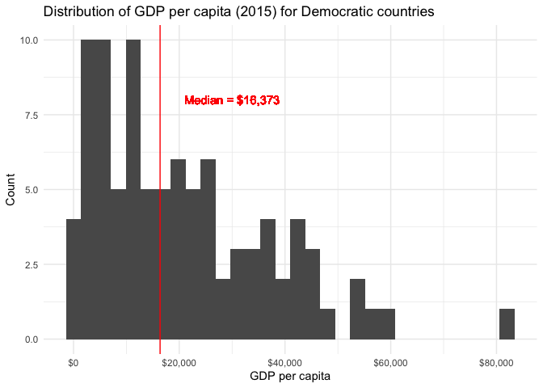
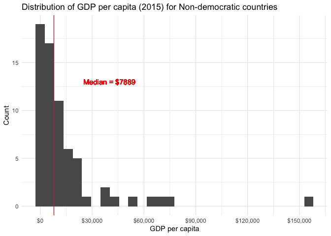

mda\_2\_salihin
================
Mohamed Salihin Subhan
19/10/2021

Load packages

``` r
library(tidyverse)
```

    ## ── Attaching packages ─────────────────────────────────────── tidyverse 1.3.1 ──

    ## ✓ ggplot2 3.3.5     ✓ purrr   0.3.4
    ## ✓ tibble  3.1.5     ✓ dplyr   1.0.7
    ## ✓ tidyr   1.1.4     ✓ stringr 1.4.0
    ## ✓ readr   2.0.2     ✓ forcats 0.5.1

    ## ── Conflicts ────────────────────────────────────────── tidyverse_conflicts() ──
    ## x dplyr::filter() masks stats::filter()
    ## x dplyr::lag()    masks stats::lag()

``` r
library(dplyr)
library(vdemdata)
```

# Task 1: Process and summarize your data

## 1.1)

The 4 research questions from Milestone 1:

1.  Does level of democracy lead to higher levels of economic
    development?
2.  Does freedom of expression vary depending on regime type?
3.  What explains why some countries have high levels of economic
    development despite having low levels of democracy?
4.  Does education level influence both economic development and level
    of democracy?

## 1.2)

For each of your four research questions, choose one task from options
1-4 (summarizing), and one other task from 4-8 (graphing).

You should have 2 tasks done for each research question (8 total). Make
sure it makes sense to do them! (e.g. don’t use a numerical variables
for a task that needs a categorical variable.). Comment on why each task
helps (or doesn’t!) answer the corresponding research question.

### Summarizing

**Task 1** – Compute the range, mean, and two other summary statistics
of one numerical variable across the groups of one categorical variable
from your data.

I have computed the range, mean, median, and standard deviation of GDP
per capita in 2015 (e\_migdppc) across regime type (e\_boix\_regime,
democracy or non-democracy):

GDP per capita for democracies - Range: $694 - $82,713 - Mean: $20,559 -
Median: $16,373 - Standard Deviation: $16,479.92

GDP per capita for non-democracies - Range: $576 - $15,6029 - Mean:
$14,936 - Median: $7889 - Standard Deviation: $24,065.82

``` r
# Creating subset of vdem dataset for year 2015

vdem_2015 <- vdem %>%
  filter(year == 2015) %>%
  filter(!is.na(e_boix_regime))

# Calculating, range, mean, median, and sd of GDP per capita in 2015 for democracies
summary(vdem_2015$e_migdppc[vdem_2015$e_boix_regime == 1])
```

    ##    Min. 1st Qu.  Median    Mean 3rd Qu.    Max.    NA's 
    ##     694    7047   16373   20559   30954   82713       7

``` r
sd(vdem_2015$e_migdppc[vdem_2015$e_boix_regime == 1], na.rm=T)
```

    ## [1] 16479.92

``` r
# Calculating, range, mean, median, and sd of GDP per capita in 2015 for non-democracies
summary(vdem_2015$e_migdppc[vdem_2015$e_boix_regime == 0])
```

    ##    Min. 1st Qu.  Median    Mean 3rd Qu.    Max.    NA's 
    ##     576    2169    7889   14936   16856  156029       5

``` r
sd(vdem_2015$e_migdppc[vdem_2015$e_boix_regime == 0], na.rm=T)
```

    ## [1] 24065.82

### Graphing

**Task 5** – Create a graph out of summarized variables that has at
least two geom layers.

I have created a histogram of GDP per capita (in 2015) for democracies,
adding the mean to the graph as an additional geom layer.

I have also created a similar histogram of GDP per capita (in 2015) for
non-democracies.

``` r
# Calculating and creating objects for means for GDP per capita (2015) for Democracies and Non-democracies
GDP_dem_median <- median(vdem_2015$e_migdppc[vdem_2015$e_boix_regime == 1], na.rm=T)

GDP_nondem_median <- median(vdem_2015$e_migdppc[vdem_2015$e_boix_regime == 0], na.rm=T)

# Generating a histogram of GDP per capita (in 2015) for Democracies with median geom layer
vdem_2015 %>% 
  filter(e_boix_regime == 1) %>%
  ggplot(aes(e_migdppc)) +
  geom_histogram() +
  geom_vline(aes(xintercept = GDP_dem_median), colour="red") +
  geom_text(x=30000, y=8, label="Median = $16,373", colour="red") +
  theme_minimal() +
  labs(title = "Distribution of GDP per capita (2015) for Democratic countries", x = "GDP per capita", y = "Count") +
  scale_x_continuous(labels = scales::dollar_format(), 
                     breaks = seq(0, 80000, by = 20000))
```

    ## `stat_bin()` using `bins = 30`. Pick better value with `binwidth`.

    ## Warning: Removed 7 rows containing non-finite values (stat_bin).

<!-- -->

``` r
# Generating a histogram of GDP per capita (in 2015) for Non-democracies with median geom layer
vdem_2015 %>% 
  filter(e_boix_regime == 0) %>%
  ggplot(aes(e_migdppc)) +
  geom_histogram() +
  geom_vline(aes(xintercept = GDP_nondem_median), colour="red") +
  geom_text(x=40000, y=13, label="Median = $7889", colour="red") +
  theme_minimal() +
  labs(title = "Distribution of GDP per capita (2015) for Non-democratic countries", x = "GDP per capita", y = "Count") +
  scale_x_continuous(labels = scales::dollar_format(), 
                     breaks = seq(0, 200000, by = 30000))
```

    ## `stat_bin()` using `bins = 30`. Pick better value with `binwidth`.

    ## Warning: Removed 5 rows containing non-finite values (stat_bin).

<!-- -->

## 1.3)

Based on the operations that you’ve completed, how much closer are you
to answering your research questions? Think about what aspects of your
research questions remain unclear. Can your research questions be
refined, now that you’ve investigated your data a bit more? Which
research questions are yielding interesting results?

Answer: I am definitely closer towards answering my research questions.
It seems that there is definitely a difference in overall levels of
development based on regime type. While there are indeed richer
non-democratic countries, and the richest (in terms of GDP per capita)
is a non-democratic country, the spread of the GDP per capita is smaller
among democracies. This indicates another variable that might be
influencing the level of economic development specific to
non-democracies.

# Task 2: Tidy your data

## 2.1)

Can you identify if your data is tidy or untidy? Go through all your
columns, or if you have &gt;8 variables, just pick 8, and explain
whether the data is untidy or tidy.

The columns I have chosen are:

1.  Country – (country\_name)
2.  Region – (e\_regionpol\_6C)
3.  Regime type – democracy, non-democracy (e\_boix\_regime)
4.  Democratic transition – democratic breakdown, no change, democratic
    transition (e\_democracy\_trans)
5.  Status – free, partly free, or not free (e\_fh\_status)
6.  GDP per capita – (e\_migdppc)
7.  Average years of education – (e\_peaveduc)
8.  Regime score – higher means more democratic (v2x\_polyarchy)

As you can see from my exploration below, the data is tidy. Each row
represents an observation for a unique country, and each column is a
(one) variable instead of a value or a combination of variables.

``` r
# Subsetting the vdem dataset using select() to choose only 8 columns from 2015
vdem_subset <- vdem %>%
  filter(year == 2015) %>%
  filter(!is.na(e_boix_regime)) %>%
  select(country_name, e_regionpol_6C, e_boix_regime, e_democracy_trans, e_fh_status, e_migdppc, e_peaveduc, v2x_polyarchy)

vdem_subset_tidy <- as.tibble(vdem_subset)
```

    ## Warning: `as.tibble()` was deprecated in tibble 2.0.0.
    ## Please use `as_tibble()` instead.
    ## The signature and semantics have changed, see `?as_tibble`.

``` r
# Converting regime type to character variable
vdem_subset_tidy$e_boix_regime <- ifelse(vdem_subset_tidy$e_boix_regime == 1, "democracy", "nondemocracy")

# Removing NAs
vdem_subset_tidy <- na.omit(vdem_subset_tidy)

head(vdem_subset_tidy)
```

    ## # A tibble: 6 × 8
    ##   country_name e_regionpol_6C e_boix_regime e_democracy_trans e_fh_status
    ##   <chr>                 <dbl> <chr>                     <dbl>       <dbl>
    ## 1 Mexico                    2 democracy                     0           2
    ## 2 Sweden                    5 democracy                     0           1
    ## 3 Switzerland               5 democracy                     0           1
    ## 4 Ghana                     4 democracy                     0           1
    ## 5 South Africa              4 democracy                     0           1
    ## 6 Japan                     6 democracy                     0           1
    ## # … with 3 more variables: e_migdppc <dbl>, e_peaveduc <dbl>,
    ## #   v2x_polyarchy <dbl>

``` r
# Checking if the data is tidy
dim(vdem_subset_tidy)[1] ## tells us how many rows!
```

    ## [1] 134

``` r
length(unique(vdem_subset_tidy$country_name)) ## tells us how many unique countries!
```

    ## [1] 134

``` r
# Are the above the same? Yes!
identical(dim(vdem_subset_tidy)[1], length(unique(vdem_subset_tidy$country_name)))
```

    ## [1] TRUE

## 2.2)

Now, if your data is tidy, untidy it! Then, tidy it back to it’s
original state.

If your data is untidy, then tidy it! Then, untidy it back to it’s
original state.

Be sure to explain your reasoning for this task. Show us the “before”
and “after”.

This is how the tidy data looks like “before”:

``` r
head(vdem_subset_tidy)
```

    ## # A tibble: 6 × 8
    ##   country_name e_regionpol_6C e_boix_regime e_democracy_trans e_fh_status
    ##   <chr>                 <dbl> <chr>                     <dbl>       <dbl>
    ## 1 Mexico                    2 democracy                     0           2
    ## 2 Sweden                    5 democracy                     0           1
    ## 3 Switzerland               5 democracy                     0           1
    ## 4 Ghana                     4 democracy                     0           1
    ## 5 South Africa              4 democracy                     0           1
    ## 6 Japan                     6 democracy                     0           1
    ## # … with 3 more variables: e_migdppc <dbl>, e_peaveduc <dbl>,
    ## #   v2x_polyarchy <dbl>

Now I will “untidy” the dataset:

``` r
vdem_subset_untidy <- vdem_subset_tidy %>%
  pivot_wider(id_cols = c(country_name, e_regionpol_6C, e_democracy_trans, e_fh_status),
              names_from = e_boix_regime,
              values_from = c(e_migdppc, e_peaveduc, v2x_polyarchy),
              names_sep = "%"
              )

print(vdem_subset_untidy)
```

    ## # A tibble: 134 × 10
    ##    country_name  e_regionpol_6C e_democracy_trans e_fh_status `e_migdppc%democr…
    ##    <chr>                  <dbl>             <dbl>       <dbl>              <dbl>
    ##  1 Mexico                     2                 0           2              16096
    ##  2 Sweden                     5                 0           1              43746
    ##  3 Switzerland                5                 0           1              59307
    ##  4 Ghana                      4                 0           1               3809
    ##  5 South Africa               4                 0           1              12246
    ##  6 Japan                      6                 0           1              37031
    ##  7 Burma/Myanmar              6                 0           3                 NA
    ##  8 Russia                     1                 0           3                 NA
    ##  9 Egypt                      3                 0           3                 NA
    ## 10 Colombia                   2                 0           2              13218
    ## # … with 124 more rows, and 5 more variables: e_migdppc%nondemocracy <dbl>,
    ## #   e_peaveduc%democracy <dbl>, e_peaveduc%nondemocracy <dbl>,
    ## #   v2x_polyarchy%democracy <dbl>, v2x_polyarchy%nondemocracy <dbl>

And now I shall tidy it again:

``` r
vdem_subset_tidy_again <- vdem_subset_untidy %>% 
  pivot_longer(cols = 'e_migdppc%democracy':'v2x_polyarchy%nondemocracy', 
               names_to  = c(".value", "e_boix_regime"),
               names_sep = "%") %>%
  na.omit() %>%
  relocate(e_boix_regime, .after = e_regionpol_6C)


print(vdem_subset_tidy_again)
```

    ## # A tibble: 134 × 8
    ##    country_name  e_regionpol_6C e_boix_regime e_democracy_trans e_fh_status
    ##    <chr>                  <dbl> <chr>                     <dbl>       <dbl>
    ##  1 Mexico                     2 democracy                     0           2
    ##  2 Sweden                     5 democracy                     0           1
    ##  3 Switzerland                5 democracy                     0           1
    ##  4 Ghana                      4 democracy                     0           1
    ##  5 South Africa               4 democracy                     0           1
    ##  6 Japan                      6 democracy                     0           1
    ##  7 Burma/Myanmar              6 nondemocracy                  0           3
    ##  8 Russia                     1 nondemocracy                  0           3
    ##  9 Egypt                      3 nondemocracy                  0           3
    ## 10 Colombia                   2 democracy                     0           2
    ## # … with 124 more rows, and 3 more variables: e_migdppc <dbl>,
    ## #   e_peaveduc <dbl>, v2x_polyarchy <dbl>

## 2.3)

Based on your interest, and your analyses, pick 2 of the 4 research
questions to continue your analysis in milestone 3, and explain your
decision.

Try to choose a version of your data that you think will be appropriate
to answer these 2 questions in milestone 3. Use between 4 and 8
functions that we’ve covered so far (i.e. by filtering, cleaning,
tidy’ing, dropping irrelvant columns, etc.).

When you are done, knit an md file. This is what we will mark! Make sure
to open it and check that everything has knitted correctly before
submitting your tagged release.

### Answer:

I choose RQ \#1 and \#3:

1.  Does level of democracy lead to higher levels of economic
    development?
2.  What explains why some countries have high levels of economic
    development despite having low levels of democracy?

My reasoning is that I am most interested in studying RQ \#1 because it
is a classic question in political science literature and is of great
interest to me. Secondly, RQ \#3 naturally follows from RQ \#1, in that
countries with high levels of economic development and low levels of
democracy constitute “deviant” cases which need to be explored further.
